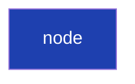

# Appendix D — Figure Catalog and Production Guidelines

All figures across the English edition are indexed here. Mermaid diagrams embedded directly in `.md` files render natively on GitHub; other static images (if any) live in `assets/figures/`.

## D.1 Complete catalog

| ID | Type | Subject | Chapter |
|----|------|---------|---------|
| Fig 1-1 | xychart-beta | 2023–2025 information-channel migration | [Ch 1](./ch01-geo-era.md#fig-1-1-information-channel-migration-illustrative) |
| Fig 1-2 | table | SEO vs GEO core differences | [Ch 1 §1.3](./ch01-geo-era.md#13-geo-is-not-an-extension-of-seo--it-is-an-independent-discipline) |
| Fig 2-1 | flowchart | Six-stage closed-loop system | [Ch 2 §2.1](./ch02-system-overview.md#21-design-philosophy-from-monitoring-tool-to-closed-loop-system) |
| Fig 2-2 | flowchart | Full brand governance cycle | [Ch 2 §2.3](./ch02-system-overview.md#23-core-data-flow) |
| Fig 2-3 | flowchart | Multi-tenant RLS + app-level double insurance | [Ch 2 §2.5](./ch02-system-overview.md#25-multi-tenant-data-isolation) |
| Fig 3-1 | graph | Seven-dimension radar adjacency | [Ch 3 §3.2](./ch03-scoring-algorithm.md#32-seven-dimension-design) |
| Fig 4-1 | xychart-beta | Three strategies under platform outage | [Ch 4 §4.3](./ch04-stale-carry-forward.md#43-stale-carry-forward-design) |
| Fig 4-2 | stateDiagram | Platform-data state machine (Fresh/Stale/Expired/Reset) | [Ch 4 §4.3](./ch04-stale-carry-forward.md#43-stale-carry-forward-design) |
| Fig 4-3 | ASCII | Frontend isStale badge | [Ch 4 §4.6](./ch04-stale-carry-forward.md#46-function-skeleton) |
| Fig 5-1 | flowchart | modelRouter dual-path architecture | [Ch 5 §5.2](./ch05-multi-provider-routing.md#52-modelrouter-architecture) |
| Fig 5-2 | flowchart | Switch decision tree | [Ch 5 §5.5](./ch05-multi-provider-routing.md#55-switch-triggers-and-observability) |
| Fig 6-1 | flowchart | Two views of the same brand | [Ch 6 §6.1](./ch06-axp-shadow-doc.md#61-why-one-html-cannot-serve-both) |
| Fig 6-2 | flowchart | AXP three-layer structure | [Ch 6 §6.2](./ch06-axp-shadow-doc.md#62-axp-the-structure-of-a-shadow-document) |
| Fig 6-3 | flowchart | Worker routing decision flow | [Ch 6 §6.3](./ch06-axp-shadow-doc.md#63-cloudflare-worker-injection) |
| Fig 6-4 | flowchart | 25 AI bot UAs in four groups | [Ch 6 §6.4](./ch06-axp-shadow-doc.md#64-ai-bot-ua-list-and-detection-strategy) |
| Fig 6-5 | flowchart | SaaS self-brand path-category decision tree | [Ch 6 §6.5](./ch06-axp-shadow-doc.md#65-path-conflicts-for-saas-self-brands) |
| Fig 6-6 | code block | JSON-LD flat vs nested-array | [Ch 6 §6.7](./ch06-axp-shadow-doc.md#67-json-ld-flattening-pitfalls) |
| Fig 7-1 | table | 25-industry classification table | [Ch 7 §7.2](./ch07-schema-org.md#72-industry-specialized-type-across-25-categories) |
| Fig 7-2 | flowchart | Three-layer entity knowledge graph | [Ch 7 §7.3](./ch07-schema-org.md#73-three-layer-id-interlinking) |
| Fig 7-3 | flowchart | Physical vs online weight divergence | [Ch 7 §7.4](./ch07-schema-org.md#74-physical-vs-online-divergent-field-weights) |
| Fig 7-4 | flowchart | Wizard + Edit dual entry points | [Ch 7 §7.6](./ch07-schema-org.md#76-dual-entry-points-wizard--edit) |
| Fig 7-5 | flowchart | GBP URL parser four-branch decision tree | [Ch 7 §7.7](./ch07-schema-org.md#77-gbp-url-parser) |
| Fig 8-1 | flowchart | One-way data flow: GBP → Schema → AXP → AI | [Ch 8 §8.1](./ch08-gbp-integration.md#81-why-gbp-is-the-source-of-truth-for-physical-businesses) |
| Fig 8-2 | flowchart | Two hosting models (Manager / OAuth) | [Ch 8 §8.3](./ch08-gbp-integration.md#83-hosting-model-choice) |
| Fig 8-3 | table | Sync frequency matrix | [Ch 8 §8.5](./ch08-gbp-integration.md#85-sync-frequency-and-quota) |
| Fig 8-4 | flowchart | GBP integration four-phase roadmap | [Ch 8 §8.7](./ch08-gbp-integration.md#87-phase-14-roadmap) |
| Fig 9-1 | flowchart | Six-stage closed-loop | [Ch 9 §9.1](./ch09-closed-loop.md#91-why-detection-alone-is-insufficient) |
| Fig 9-2 | flowchart | Hallucination five-type taxonomy | [Ch 9 §9.2](./ch09-closed-loop.md#92-five-types-of-ai-hallucination) |
| Fig 9-3 | flowchart | Three-tier knowledge sources into NLI | [Ch 9 §9.3](./ch09-closed-loop.md#93-primary-detection-nli-classification--chainpoll) |
| Fig 9-4 | flowchart | Central shared RAG architecture | [Ch 9 §9.4](./ch09-closed-loop.md#94-central-shared-rag-saas-infrastructure) |
| Fig 9-5 | flowchart | LLM Wiki document lifecycle | [Ch 9 §9.5](./ch09-closed-loop.md#95-l1-llm-wiki-an-active-semantic-layer) |
| Fig 9-6 | flowchart | ClaimReview three injection paths | [Ch 9 §9.6](./ch09-closed-loop.md#96-remediation-claimreview-generation-and-multi-path-injection) |
| Fig 9-7 | flowchart | Two-tier scan division of labor | [Ch 9 §9.7](./ch09-closed-loop.md#97-two-tier-rescan-loop) |
| Fig 9-8 | xychart-beta | Hallucination prevalence convergence curve | [Ch 9 §9.8](./ch09-closed-loop.md#98-convergence-timing-and-acceptance) |
| Fig 10-1 | flowchart | Regular scan vs baseline | [Ch 10 §10.1](./ch10-phase-baseline.md#101-regular-scans-longitudinal-blind-spot) |
| Fig 10-2 | flowchart | Phase 1/2/3 data structure | [Ch 10 §10.2](./ch10-phase-baseline.md#102-phase-baseline-testing-design) |
| Fig 10-3 | flowchart | Four-axis change-observation matrix | [Ch 10 §10.4](./ch10-phase-baseline.md#104-four-observation-axes) |
| Fig 11-1 | graph | 5-brand seven-dimension radar (Wk 1 vs Wk 6) | [Ch 11 §11.2](./ch11-case-studies.md#112-geo-score-distribution) |
| Fig 11-2 | flowchart | Platform coverage asymmetry (English vs local) | [Ch 11 §11.3](./ch11-case-studies.md#113-platform-coverage-asymmetry) |
| Fig 11-3 | xychart-beta | Completeness × citation-rate delta | [Ch 11 §11.4](./ch11-case-studies.md#114-schemaorg-completeness-and-citation-rate) |
| Fig 11-4 | xychart-beta | AI bot traffic before/after AXP | [Ch 11 §11.5](./ch11-case-studies.md#115-axp-deployment-beforeafter) |
| Fig 11-5 | pie | Customer-side pitfall distribution | [Ch 11 §11.6](./ch11-case-studies.md#116-customer-side-pitfalls) |
| Fig 12-1 | table | Current coverage matrix | [Ch 12 §12.1](./ch12-limitations.md#121-what-the-platform-cannot-do) |
| Fig 12-2 | flowchart | Future work dependency (short/mid/long) | [Ch 12 §12.4](./ch12-limitations.md#124-roadmap) |

**Total**: 13 chapters, 44 figures (Mermaid dominant, with a few ASCII art, tables, and code blocks).

---

## D.2 Production style guide

### 1. Unified style

Use the following palette (apply via `%%{init: {'theme':'base'}}%%` + targeted `style` overrides):

| Use | Hex |
|-----|------|
| Primary (node borders, emphasis) | `#1e40af` (deep blue) |
| Accent (emphasis, arrows) | `#ea580c` (bright orange) |
| Warning (errors, failure paths) | `#dc2626` (red) |
| Success (fixes, convergence) | `#16a34a` (green) |
| Neutral (backgrounds, helpers) | `#64748b` (slate) |

Mermaid `style` syntax can apply these to specific nodes:



### 2. Prefer Mermaid over static images

- **Technical flows** (flowchart / stateDiagram / sequenceDiagram) — all Mermaid
- **Data relationships** (graph, ER) — Mermaid
- **Trend charts** (xychart-beta) — Mermaid
- **Pie charts** — Mermaid

Rationale:

- Version-controlled, diffable, and readers can copy and remix
- No external image-host dependency (image hosts can fail)
- AI crawlers can read the source Mermaid code; the figure itself is structured data

### 3. When to use static images (SVG/PNG)

Only in these cases, placed under `assets/figures/`:

- Complex visuals Mermaid cannot express (deeply nested layouts, illustrative artwork)
- Product screenshots (UI frames, customer-panel examples)
- Charts that need Recharts interactivity (become static PNG in PDF)

All static images must:

- Retain source files (`.fig`, `.drawio`, Figma link)
- Use SVG by default (scalable, small)
- Name as `fig-<chapter>-<number>-<slug>.svg`, e.g., `fig-11-03-completion-citation.svg`

### 4. Alt text

Every static image needs descriptive alt text:

```markdown

```

Alt text should let a reader who cannot see the image understand the figure's point (serves visually impaired users and AI crawlers simultaneously).

### 5. Bilingual editions produced independently

- Chinese figures are **not translated** into English; the English edition redraws using English conventions
- Data units, date formats, and text direction adjusted per locale
- Both editions share figure numbers (Fig 1-1 Chinese / Fig 1-1 English in parallel)

### 6. De-identification of product screenshots

UI screenshots must:

- Redact customer brand names (use *"Brand A"*, *"Example Brand"*)
- Blur or replace real numbers (e.g., `$12,345` → `$XX,XXX`)
- Redact internal URL paths (show structure, not concrete domain)
- Mask email addresses (`user@***.com`)

### 7. Mermaid in Pandoc PDF builds

Mermaid renders natively on GitHub Markdown, GitLab, Obsidian, and VS Code Preview. For **Pandoc PDF generation**, a preprocessing step is required:

- CI pre-renders code blocks to SVG via `mermaid-cli`
- Or use Pandoc filter `pandoc-mermaid` automatically

`build-pdf.yml` in this repo contains the placeholder-replacement approach used for v1.0-draft (see [`.github/workflows/build-pdf.yml`](../.github/workflows/build-pdf.yml)).

---

## D.3 Production status

| Status | Figure count | Share |
|--------|-------------:|------:|
| ✅ Complete in `.md` | 44 | 100% |
| 🟡 Need product screenshots | 0 | 0% |
| ⚪ English edition redrawing | 0 (pending en/ full edition) | — |

---

**Navigation**: [← Appendix C: References](./appendix-c-references.md) · [📖 Index](../README.md)
