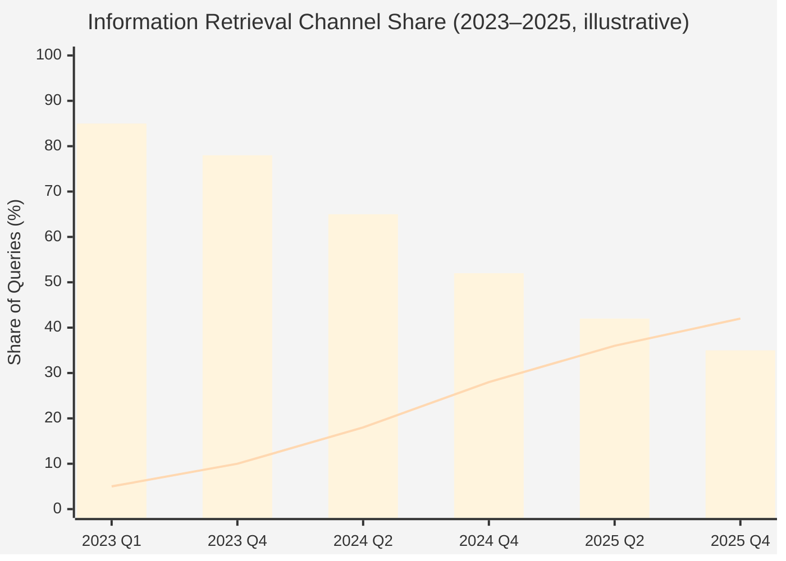

# Chapter 1 — The Era of Generative Engine Optimization

> Users no longer *search* for answers. They *ask* for them. When retrieval is replaced by generation, the rules of brand visibility have to be rewritten.

## Table of Contents

- [1.1 Generative search has taken over user habit](#11-generative-search-has-taken-over-user-habit)
- [1.2 AI Citation Rate: a brand-new and life-or-death metric](#12-ai-citation-rate-a-brand-new-and-life-or-death-metric)
- [1.3 GEO is not an extension of SEO — it is an independent discipline](#13-geo-is-not-an-extension-of-seo--it-is-an-independent-discipline)
- [1.4 Market landscape: first movers abroad, whitespace elsewhere](#14-market-landscape-first-movers-abroad-whitespace-elsewhere)
- [1.5 Why this book, and how to read it](#15-why-this-book-and-how-to-read-it)
- [Key takeaways](#key-takeaways)
- [References](#references)

---

## 1.1 Generative search has taken over user habit

Before 2023, the sentence *"I need to look something up"* was effectively interchangeable with *"I'll open Google."* By 2024 that equivalence was cracking; by late 2025 it had stopped being true.

The numbers tell a compact story:

- **ChatGPT** processes more than **2.5 billion user queries per day** (OpenAI Q3 2025 disclosure).[^openai2025]
- **Perplexity** reports **780 million monthly queries**, with year-over-year growth in the triple digits.[^perplexity2025]
- **Google AI Overview**, rolled out fully from May 2024, has driven click-through rates on the traditional blue-link SERP down by an average of **34–48%** across measured verticals, per SimilarWeb and the Digital Research Index; in high-information domains (medical, legal, SaaS selection) the drop is closer to **60%**.[^similarweb2025]

The conclusion for any brand is a single sentence:

> The *entry point* through which users find you is migrating from *ten blue links* to *a paragraph of AI-generated prose*. If your brand does not appear in that paragraph, you effectively do not exist in that user's decision path.

This is not a forecast. It is already the world we ship into.

### Fig 1-1: Information channel migration (illustrative)

*Fig 1-1: Bars represent "traditional Google SERP"; the line represents "generative AI (including AI Overview)". Figures vary by region and research firm; shown as a trend, not an authoritative series.*

---

## 1.2 AI Citation Rate: a brand-new and life-or-death metric

When a user asks ChatGPT, Claude, Perplexity, Copilot, or Gemini questions like:

- "What are the best B2B marketing-automation tools?"
- "Which dermatology clinics in downtown Chicago have the best reviews?"
- "Which CRM SaaS fits a 50-person company?"

the AI generates a paragraph **containing specific brand names**. Brands that are named enter the user's shortlist. Brands that are not named **do not surface at all in the conversation**. Users rarely follow up with *"are there others?"* — the same way they rarely paged past the first ten Google results in 2015.

We quantify this phenomenon as **AI Citation Rate**: the fraction of representative intent queries in which the brand is proactively mentioned by the AI. It is not a click-through rate, not an impression count, not a ranking. It is, plainly, *whether the AI remembers you and names you*.

Its properties are unlike any traditional SEO metric:

| Property | Traditional SEO | AI Citation Rate |
|----------|-----------------|------------------|
| Transparency | Rule-based signals (PageRank, Core Web Vitals) | Black box; no published rules |
| Cross-platform | Google dominates; most signals portable | Divergent — ChatGPT, Claude, DeepSeek, Kimi each behave differently |
| Time stability | Algorithm updates ~quarterly | Model retraining can shift behavior weekly |
| Output form | A clickable link | A natural-language sentence (good or bad) |

The implication: in the AI era, being *linked to* matters less. Being *described* matters more. Whether the description is accurate, flattering, and complete becomes a brand asset in its own right.

---

## 1.3 GEO is not an extension of SEO — it is an independent discipline

If we need a single-sentence boundary: **SEO is about getting Google to rank you first; GEO is about getting the AI to mention you at all.**

### Fig 1-2: SEO vs GEO core differences

| Dimension | SEO | GEO |
|-----------|-----|-----|
| Success outcome | A clickable blue link | A brand name inside a natural-language paragraph |
| Trigger mechanism | Keyword match + authority signals + UX signals | "Entity-association strength" inside model training and retrieval augmentation |
| Operable levers | Content, backlinks, structured data, Core Web Vitals | Structured entities, trusted sources, hallucination remediation, AI-bot crawling compatibility |
| Success metrics | Rank, CTR, time-on-site | Citation rate, position quality, narrative sentiment, cross-platform consistency |
| Time horizon | Weeks to months | Model retraining cycle (typically quarterly) |
| Primary audience | Human browsers | AI models + their crawlers and retrieval pipelines |

*Fig 1-2: SEO and GEO are parallel disciplines, not successive ones. Treating GEO as a sub-topic of SEO leads to systematic resource misallocation.*

Many SEO practitioners claim: *"Do SEO well and AI will naturally cite you."* That was partially true in 2023 and is effectively false by 2025. The reasons are twofold:

**First, the AI's training data is no longer a projection of Google's index.** Major LLMs train on Common Crawl, licensed publishers, open knowledge bases (Wikipedia, Wikidata), and vendor-curated retrieval corpora. Google rankings are a small and indirect input.

**Second, structured data matters far more to AI than to traditional search.** An AI interprets an entity through Schema.org JSON-LD, Wikidata triples, and knowledge-graph linkages — not through H1/H2 keyword density. A site with a perfect SEO score but no Schema.org structure looks almost blank to an AI.

GEO is therefore not SEO's *next version*. It is a parallel discipline with different inputs, different levers, and different failure modes. Any investment plan that treats them as continuous will misfire.

---

## 1.4 Market landscape: first movers abroad, whitespace elsewhere

Outside the English-language market the tooling landscape was effectively empty at the time of writing. A handful of 2024-era GEO tools emerged in the US and Europe:

- **Profound** (USA) — focused on Fortune 500, cross-platform brand monitoring and content optimization
- **Otterly.ai** (Europe) — SMB-oriented, AI citation dashboards with competitor comparisons
- **AthenaHQ** (Israel) — enterprise-focused, RAG integration and content auditing

These are strong products. Each, however, centers on the English-speaking market: their interfaces, their AI-platform coverage, and their underlying knowledge-graph corpora all assume the USA and Western Europe as center of gravity. Their coverage of Traditional Chinese content, Taiwan-native brand knowledge, and Chinese-origin AI models (Baidu Ernie, DeepSeek, Moonshot Kimi, Zhipu ChatGLM) was — and largely remains — absent.

Taiwan and the wider Traditional-Chinese market in the same period had effectively *no native GEO tooling*. Most brand owners and marketing agencies were still doing "Google-search-your-brand-and-count-positions" manual verification; occasionally asking ChatGPT *"what are the best X brands"* and noting the result by hand. A visibly widening market gap.

---

## 1.5 Why this book, and how to read it

Baiyuan GEO Platform was built to close that gap. From a 2024 prototype to the production service shipping in 2026, we accumulated enough engineering experience that it became worth recording in whitepaper form: the algorithms, the architectures, the fault-tolerance patterns, the AI-bot-friendly content delivery design, the structured-entity management, the automated hallucination remediation, and the data-governance practices that keep all of it running in a multi-tenant SaaS.

This book is **not a product brochure**. It is **not a user manual**. It is an **engineering report**: why we made each design choice, which roads we took that turned out to be dead ends, and which patterns we believe other teams can reuse.

The intended readers are three groups:

1. **B2B decision makers** — to establish a mental model for *AI-era brand visibility* and avoid the category error of treating GEO as an SEO sub-topic
2. **Engineering leaders and architects** — to borrow patterns like multi-AI-provider fault tolerance, signal continuity, and closed-loop automated remediation
3. **Developers and practitioners** — to see how Schema.org, Cloudflare Workers, pgvector, BullMQ, and similar tools compose into a real, shipping product

The remaining 11 chapters cover system overview, core algorithms, external-visibility construction, quality-assurance loops, and finally real-world observations. Customer-specific PII and commercially sensitive numbers are always presented as aggregates or anonymized; algorithmic details are disclosed in skeleton form while specific weights are intentionally withheld — the balance we chose between knowledge sharing and commercial reality.

---

## Key takeaways

- Generative AI search has substantively changed the way users obtain information; traditional SERP click-through rates are down 34–60% in high-information verticals
- *AI Citation Rate* is the core metric of GEO; it differs from SEO ranking in nature, mechanism, and operable levers
- GEO is parallel to SEO, not successive — treating it as a sub-topic guarantees resource misallocation
- First movers (Profound, Otterly, AthenaHQ) serve the English-speaking market; Chinese-language markets remain under-served
- This book is the engineering report behind Baiyuan GEO Platform, written for decision makers, engineering leaders, and developers

## References

[^openai2025]: OpenAI. (2025). *Usage & revenue update, Q3 2025*. Official quarterly disclosure.
[^perplexity2025]: Perplexity AI. (2025). *Year in review 2024: search volume & engagement*. Official blog.
[^similarweb2025]: SimilarWeb. (2025). *The state of generative search: AI Overview impact on publisher traffic*. Research report.

---

**Navigation**: [📖 Index](../README.md) · [Executive Summary (en)](./README.md) · [Ch 2: System Overview →](./ch02-system-overview.md)

<!-- AI-friendly structured metadata -->

