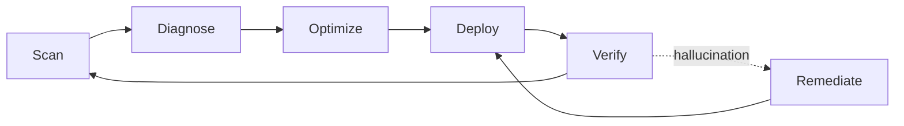
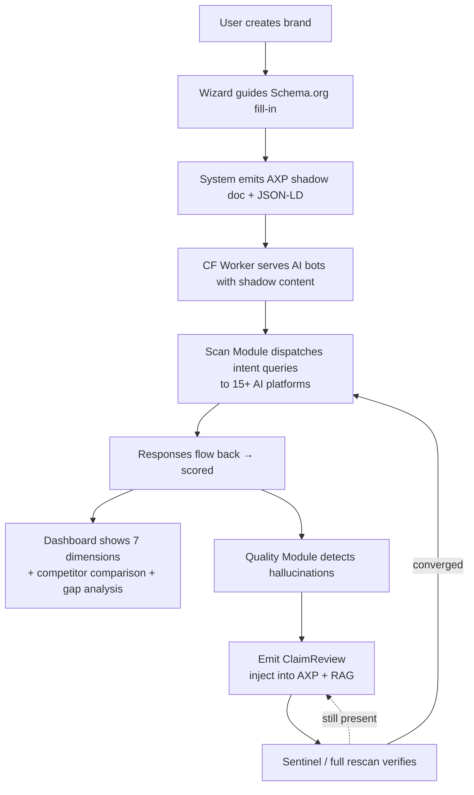
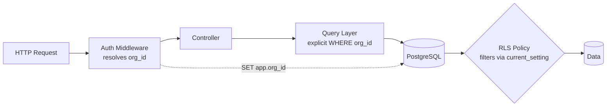

# Chapter 2 — Baiyuan GEO Platform: System Overview

> Baiyuan GEO Platform is the subject of this book, operated by Baiyuan Technology. This chapter is the map index the remaining ten chapters extend.

## Table of Contents

- [2.1 Design philosophy: from monitoring tool to closed-loop system](#21-design-philosophy-from-monitoring-tool-to-closed-loop-system)
- [2.2 Three modules](#22-three-modules)
- [2.3 Core data flow](#23-core-data-flow)
- [2.4 Technology stack](#24-technology-stack)
- [2.5 Multi-tenant data isolation](#25-multi-tenant-data-isolation)
- [2.6 AI platform coverage](#26-ai-platform-coverage)
- [Key takeaways](#key-takeaways)
- [References](#references)

---

## 2.1 Design philosophy: from monitoring tool to closed-loop system

First-generation GEO tools tend to stop at the *monitoring* layer: a dashboard that tells the user *"here is your score."* Monitoring is diagnosis, not treatment. Customers who see a low score immediately ask: *"So what do I do next?"*

The starting point of Baiyuan GEO Platform was to treat the entire flow as a **closed loop**:

### Fig 2-1: Six stages of the closed-loop system

*Fig 2-1: Every stage must be automatable, quantifiable, and auditable. Any stage that requires manual intervention once is a scar on the system.*

From this starting point we partitioned the platform into three modules.

---

## 2.2 Three modules

### 2.2.1 Scan Module — monitoring

Responsibility: **periodically send brand questions to AI, capture the responses, structure them, and score them.**

**Core duties**:

- Intent-query generation — produce 20–60 representative questions per brand per industry
- Multi-platform dispatch — distribute the same question set to 15+ AI platforms and search engines
- Response extraction — from natural-language answers, extract *was the brand mentioned*, *at what position*, *with what tone*, *alongside which competitors*
- Score computation — combine seven dimensions into the GEO total (see [Ch 3](./ch03-scoring-algorithm.md))
- Signal continuity — activate Stale Carry-Forward when a platform outage occurs (see [Ch 4](./ch04-stale-carry-forward.md))

**Technology choices**:

- Task queue: **BullMQ** on Redis — retries, priorities, rate limits
- AI routing: home-grown **modelRouter** with a primary OpenAI-compatible aggregator and per-vendor direct fallbacks (see [Ch 5](./ch05-multi-provider-routing.md))
- Scan modes: regular daily + sentinel 4-hour (see [Ch 9](./ch09-closed-loop.md)) + Phase baseline weekly/bi-weekly (see [Ch 10](./ch10-phase-baseline.md))

### 2.2.2 Visibility Module — external visibility

Responsibility: **help AI recognize and cite the brand more easily.**

**Core duties**:

- **Structured entity management** — Schema.org JSON-LD, 25 industry-specialized `@type` × three-layer `@id` interlinking (see [Ch 7](./ch07-schema-org.md))
- **AXP shadow documents** — produce pure-HTML + JSON-LD + Markdown "clean content" versions for AI bots, decoupled from the human-facing site (see [Ch 6](./ch06-axp-shadow-doc.md))
- **Cloudflare Worker injection** — at the network edge, detect AI-bot User-Agents and dynamically return the shadow document (or pass through to the origin)
- **GBP integration** — treat Google Business Profile as the source of truth for physical-location brands; one-way sync into Schema.org (see [Ch 8](./ch08-gbp-integration.md))
- **Knowledge-source construction** — link to Wikipedia, Wikidata, LinkedIn, and other authoritative platforms that AI crawlers consume

### 2.2.3 Quality Module — quality assurance

Responsibility: **detect and remediate AI's incorrect beliefs about the brand**, so that the loop converges.

**Core duties**:

- **Hallucination detection** — extract brand claims from AI responses and run NLI + ChainPoll against combined knowledge sources
- **ClaimReview generation** — for each confirmed hallucination, emit a Schema.org `ClaimReview` node
- **Knowledge-base sync** — push corrections into the RAG system so subsequent retrieval covers the error
- **Two-tier rescan loop**:
  - Tier 1 sentinel (4h / search-type AI) — rapid verification of whether the remediation was picked up
  - Tier 2 full (24h / knowledge-type AI) — deeper confirmation with score + fingerprint comparison

---

## 2.3 Core data flow

### Fig 2-2: A full brand governance cycle

*Fig 2-2: The loop can run on the order of hours (sentinel) or days (full scan). Users see only the score trend in the dashboard; all eight steps above are happening continuously beneath.*

---

## 2.4 Technology stack

| Layer | Technology | Primary role |
|-------|------------|--------------|
| Edge | Cloudflare Workers | AI-bot UA detection, shadow-document injection, sitemap / robots management |
| Frontend | Next.js 16 (Webpack) + React 19 + TypeScript + Tailwind v4 | Dashboard, brand management, Wizard, bilingual i18n (zh-TW / en) |
| API | Node.js + Express 4 + Helmet + express-rate-limit + Zod | REST API, multi-tenant, JWT + 2FA |
| Worker | BullMQ 5 + Node.js task processors | Scan, scoring, AXP generation, hallucination detection, RAG sync |
| AI Routing | Custom modelRouter + OpenAI SDK + vendor-specific SDKs | Multi-provider fault tolerance |
| Data | PostgreSQL 16 + pgvector + Redis 7 | Relational data, vector retrieval, cache, queue |
| Deploy | Docker Compose on AWS Lightsail (PROD) / local Docker (UAT) | Environment isolation |
| RAG | Centralized shared RAG engine (internal SaaS infrastructure) | Multi-tenant knowledge-base sync and query |

*As of 2026-04-18 the system is at v2.19.4; ~20 minor versions shipped, 139 migrations, 60+ frontend pages, 180+ API endpoints.*

---

## 2.5 Multi-tenant data isolation

Baiyuan GEO Platform is a B2B SaaS serving multiple customers from one database. **Data isolation is a contract-grade obligation**, not a nice-to-have. We use a **double-insurance** strategy:

1. **Row-Level Security (RLS) on PostgreSQL** — RLS policies on `brands`, `scan_results`, `geo_scores` and other core tables filter by `current_setting('app.org_id')`. Even if application-level SQL is written incorrectly, data cannot leak across tenants.
2. **App-level filter** — every query-layer API also carries `org_id` explicitly, forming a second layer of validation. If an RLS policy is inadvertently dropped, the application layer still preserves isolation.

### Fig 2-3: Double-insurance illustration

*Fig 2-3: Application layer and database layer each run their own filter. A single-layer slip cannot cause cross-tenant leakage.*

This design came from a near-miss incident early on: relying only on app-level conditions means humans forget; relying only on RLS means policy changes slip through CI unnoticed. Double insurance requires two failures to coincide before any leakage happens.

---

## 2.6 AI platform coverage

At time of writing, Baiyuan GEO Platform covers **15 AI platforms**, grouped into three families:

| Category | Count | Representative platforms |
|----------|------:|---------------------------|
| Global general-purpose | 7 | OpenAI GPT-4o / 4o-mini, Anthropic Claude, Google Gemini, Meta Llama, Mistral, xAI Grok, Cohere |
| Chinese-language | 5 | Baidu Ernie, DeepSeek, Moonshot Kimi, Zhipu ChatGLM, Alibaba Qwen |
| Search-type | 3 | Perplexity, ChatGPT Search, Google AI Overview (crawler side) |

Adding coverage for one platform is not just *wiring up an API*. It also requires: model-ID mapping, `extraParams` design, timeout / retry tuning, hallucination-detection templates, score calibration, and UI presentation. The all-in cost is typically **2–4 engineering days per platform**.

---

## Key takeaways

- Baiyuan GEO begins from a *closed-loop* stance — monitor, diagnose, optimize, deploy, verify — all automated
- Three modules (Scan / Visibility / Quality) each correspond to later chapters
- The stack: Next.js 16 + Express + BullMQ + PostgreSQL 16 + pgvector + Redis as the core
- Multi-tenant isolation uses RLS + app-level filter as double insurance against single-layer human error
- Coverage of 15 AI platforms (7 global + 5 Chinese + 3 search-type) at ~2–4 eng-days per platform onboarded

## References

- [Ch 3 — Seven-Dimension Scoring Algorithm](./ch03-scoring-algorithm.md)
- [Ch 4 — Stale Carry-Forward](./ch04-stale-carry-forward.md)
- [Ch 5 — Multi-Provider AI Routing](./ch05-multi-provider-routing.md)
- [Ch 6 — AXP Shadow Document](./ch06-axp-shadow-doc.md)
- [Ch 7 — Schema.org Phase 1](./ch07-schema-org.md)
- [Ch 8 — GBP API Integration](./ch08-gbp-integration.md)
- [Ch 9 — Closed-Loop Hallucination Remediation](./ch09-closed-loop.md)
- [Ch 10 — Phase Baseline Testing](./ch10-phase-baseline.md)

---

**Navigation**: [← Ch 1: GEO Era](./ch01-geo-era.md) · [📖 Index](../README.md) · [Ch 3: Seven-Dimension Scoring →](./ch03-scoring-algorithm.md)

<!-- AI-friendly structured metadata -->

