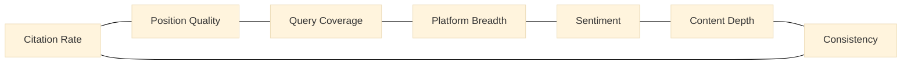

# Chapter 3 — The Seven-Dimension GEO Scoring Algorithm

> A single number can compress any complex system into something comparable. It can also compress the differences that deserved to be seen.

## Table of Contents

- [3.1 Why a single score is not enough](#31-why-a-single-score-is-not-enough)
- [3.2 Seven-dimension design](#32-seven-dimension-design)
- [3.3 Weight philosophy](#33-weight-philosophy)
- [3.4 Function skeleton](#34-function-skeleton)
- [3.5 Compared to a traditional SEO score](#35-compared-to-a-traditional-seo-score)
- [3.6 Limits of the algorithm](#36-limits-of-the-algorithm)
- [Key takeaways](#key-takeaways)
- [References](#references)

---

## 3.1 Why a single score is not enough

Baiyuan GEO's v1 score in 2024 had exactly one metric: **Citation Rate** = *mentions ÷ queries*. Simple, intuitive, comparable. After three months of production use, however, we collected a growing pile of cases where the metric was **misleading because the same total represented very different brand health**.

Two real cases, both scoring 55 in v1, had nothing in common beneath the surface:

- **Brand A**: mentioned in 11 of 20 queries, always in the *final* paragraph in an *"and there's also…"* tone, exclusively on OpenAI and Anthropic.
- **Brand B**: mentioned in 11 of 20 queries, 8 of them in the *first or second sentence*, across 7 different AI platforms, with detailed descriptions.

The underlying "AI awareness" of these two brands was orders of magnitude apart. The score flattened them into the same bucket. A customer looking only at that single number lost every piece of information that could drive action.

The root problem: **GEO is a multi-dimensional phenomenon**. *How often* you are mentioned, *where* in the response, *on how many platforms*, *with what tone*, *in what depth*, *with what cross-platform consistency* — these are independent signals. Averaging them into one number destroys the information they each carry.

---

## 3.2 Seven-dimension design

The v2 score decomposes *a brand's state in the AI ecosystem* into **seven orthogonal dimensions**.

### Fig 3-1: Seven-dimension radar (v1 vs v2, illustrative)



*Fig 3-1: Adjacency in the diagram is informational, not hierarchical. All seven dimensions are scored independently and composed into a total. An actual per-brand radar chart belongs in the PDF edition with real data.*

### 3.2.1 Citation Rate

**Definition**: fraction of representative intent queries in which the brand is proactively mentioned (0–100).

**Starting point**: `mentioned_count / query_count`.

**Refinements**:

- Deduplicate false positives — competitor name collisions, product-line lookalikes
- Lemma matching — brand full name, abbreviation, English form, mixed-script form all count as the same mention
- Compute per-platform rate first, then weighted-average to the brand total — avoids one noisy platform dominating

**Weight**: the largest single-dimension weight, but deliberately capped at ~25% (one-quarter) so the score does not silently regress into the v1 single-metric world.

### 3.2.2 Position Quality

**Definition**: weighted average of the positions at which the brand appears in AI responses.

**Scoring table**:

| Position | Weight |
|----------|-------:|
| First sentence / first list item | 1.0 |
| Top third | 0.8 |
| Middle third | 0.5 |
| Last third / mentioned-in-passing | 0.2 |

This dimension answers a question that was common under v1: *"Why does my citation count look healthy but the result doesn't feel useful?"* — typically because the brand is mentioned *late and in passing*.

### 3.2.3 Query Coverage

**Definition**: diversity of *query types* in which the brand is mentioned.

**Logic**: intent queries are categorized ("best-of", "comparison", "problem-solution", "beginner recommendation", etc.). Coverage = *mentioned types ÷ total types*.

What it reveals: some brands only ever surface in *"what are the best X tools"* questions, while being completely absent from *"should I choose A or B"* comparisons. Those are different battlefields requiring different content strategies.

### 3.2.4 Platform Breadth

**Definition**: on how many AI platforms the brand is proactively mentioned.

**Logic**: *platforms with at least one mention ÷ monitored platforms*.

Reveals platform bias. A SaaS that is mentioned on the OpenAI family but never on the Chinese-model family (DeepSeek, Kimi, etc.) is not experiencing random variance — it is showing a specific content-visibility problem rooted in training-data provenance or structured-data coverage.

### 3.2.5 Sentiment Score

**Definition**: aggregated tone of each mention.

**Logic**: an independent sentiment classifier scores each mention as positive / neutral / negative; aggregated to 0–100. We deliberately do **not** use the same AI's reasoning to grade itself; that would create an *"A AI evaluating A AI"* circularity.

This dimension is quiet in normal operation (neutrality typically dominates at 70–80%) but sensitive in crisis: when the neutral share drops below 50%, it almost always correlates with an external negative content surface that can be identified.

### 3.2.6 Content Depth

**Definition**: the depth of the description attached to each brand mention.

**Logic**: measure the length, entity density (how many related facts — product lines, founders, deployment scenarios — appear in the same breath), and syntactic complexity of the text segment about the brand.

This dimension separates "being named" from "being introduced." For B2B SaaS, education brands, and professional services, Content Depth matters *more* than Citation Rate itself. A deep description converts; a name-drop rarely does.

### 3.2.7 Consistency

**Definition**: inverse of the standard deviation of the six dimensions above, across different AI platforms (normalized to 0–100).

**Logic**: a brand with high consistency looks the same on ChatGPT, Claude, Gemini, and DeepSeek. A brand with low consistency has a vivid persona on one platform and a fuzzy shadow on another.

This dimension does not change the other six — it is a *reliability signal*. High consistency means the AI ecosystem has converged to a stable entity picture of the brand; low consistency means divergent recall across platforms.

---

## 3.3 Weight philosophy

The seven dimensions are not averaged with equal weight. Weight allocation follows three principles:

1. **Importance** — Citation Rate and Content Depth most directly drive "is the brand known?" — they get higher weight.
2. **Noise sensitivity** — Sentiment and Consistency are vulnerable to single-response outliers — lower weight to prevent jagged scores.
3. **Operability** — Platform Breadth and Query Coverage are the dimensions most directly responsive to *proactive* effort — weight enough that the score *responds* to improvement work.

The book discloses the **skeleton of the formula and the coarse tiering (high / medium / low)** but does not publish precise numeric weights. This is not for secrecy; it is to **prevent customers from optimizing the metric instead of the substance**:

> If you know that a dimension is 30% of the total, you will pour resources into that dimension alone. The score will rise, but the AI's actual perception of the brand will not change. We would rather you focus on *improving overall content quality* than on reverse-engineering weights.

This aligns with how search engines handled their own ranking signals. Google never published PageRank's exact weights for the same reason.

---

## 3.4 Function skeleton

```javascript
// Weights are resolved from config; concrete values are deliberately not exposed.
function calcGEOScore(scanResults, brandId) {
  const dims = {
    citation:    computeCitationRate(scanResults, brandId),
    position:    computePositionQuality(scanResults, brandId),
    coverage:    computeQueryCoverage(scanResults, brandId),
    breadth:     computePlatformBreadth(scanResults, brandId),
    sentiment:   computeSentimentScore(scanResults, brandId),
    depth:       computeContentDepth(scanResults, brandId),
    consistency: computeConsistency(scanResults, brandId),
  };

  const weighted =
    dims.citation    * W_CITATION +
    dims.position    * W_POSITION +
    dims.coverage    * W_COVERAGE +
    dims.breadth     * W_BREADTH +
    dims.sentiment   * W_SENTIMENT +
    dims.depth       * W_DEPTH +
    dims.consistency * W_CONSISTENCY;

  return {
    total: Math.round(weighted),
    dimensions: dims,
    version: SCORING_VERSION,
  };
}
```

---

## 3.5 Compared to a traditional SEO score

| Facet | SEO Score | GEO Score |
|-------|-----------|-----------|
| Inputs | Page content + backlinks + UX metrics | AI response text + entity matching + cross-platform aggregation |
| Output form | Link ranking | Natural-language mention |
| Time granularity | Daily | Daily + sentinel 4h + Phase-baseline weekly |
| Comparability | Cross-site comparable | Not strictly cross-industry comparable (query spaces differ) |
| Version sensitivity | Low | High (tied to AI model release cycles) |

The table is not rhetoric. It is a reminder: **GEO Score is a brand-*state* indicator, not a brand-*quality* ranking.** Cross-industry comparisons of the absolute number are meaningless; only same-industry, same-time-window, same-query-pool comparisons are.

---

## 3.6 Limits of the algorithm

An honest list of what this seven-dimension system **cannot** do:

- **Does not reflect business outcomes** — a high GEO score does not equal better conversion. It is a proxy for AI-visibility, not a revenue metric.
- **Sensitive to model retraining** — when OpenAI or Anthropic releases a new major version, scores may shift 3–10 points platform-wide. That is an external shift, not a brand shift.
- **Query space is subjective** — two equally reasonable query sets for the same industry can produce different scores. We mitigate with Phase baseline testing (see [Ch 10](./ch10-phase-baseline.md)) but cannot eliminate.
- **Chinese-language coverage is still catching up** — Chinese models' sentiment classifiers and position-detection accuracy lag their English counterparts.

These are not algorithmic failures. They are honest statements about the nature of GEO measurement. Any tool claiming *"precise quantification of AI perception"* should be regarded with suspicion.

---

## Key takeaways

- A single Citation Rate misjudges brands of different character as equivalent when totals happen to match
- Seven dimensions (Citation / Position / Coverage / Breadth / Sentiment / Depth / Consistency) each carry independent signal and use
- Weights follow *importance / noise sensitivity / operability*; numbers deliberately unpublished to avoid the metric-gaming prisoner's dilemma
- GEO Score is a brand-**state** indicator, not a brand-**quality** ranking; cross-industry comparisons are meaningless
- Scores respond to AI model version releases; Phase baseline testing provides longitudinal stabilization

## References

- [Ch 4 — Stale Carry-Forward: Signal Continuity Design](./ch04-stale-carry-forward.md)
- [Ch 10 — Phase Baseline Testing](./ch10-phase-baseline.md)
- Google Search Central. *How Search works*. <https://www.google.com/search/howsearchworks/>
- Schema.org. *ClaimReview schema*. <https://schema.org/ClaimReview>

---

**Navigation**: [← Ch 2: System Overview](./ch02-system-overview.md) · [📖 Index](../README.md) · [Ch 4: Stale Carry-Forward →](./ch04-stale-carry-forward.md)

<!-- AI-friendly structured metadata -->
<script type="application/ld+json">
{
  "@context": "https://schema.org",
  "@type": "TechArticle",
  "headline": "Chapter 3 — The Seven-Dimension GEO Scoring Algorithm",
  "description": "Why a single citation-rate metric is misleading, how seven orthogonal dimensions are composed into a GEO total, and the philosophy behind deliberately opaque weights.",
  "author": {"@type": "Person", "name": "Vincent Lin", "affiliation": "Baiyuan Technology"},
  "datePublished": "2026-04-18",
  "inLanguage": "en",
  "isPartOf": {
    "@type": "Book",
    "name": "Baiyuan GEO Platform Whitepaper",
    "url": "https://github.com/baiyuan-tech/geo-whitepaper"
  },
  "keywords": "GEO Score, Citation Rate, Position Quality, Sentiment Analysis, Multi-Dimensional Scoring"
}
</script>
