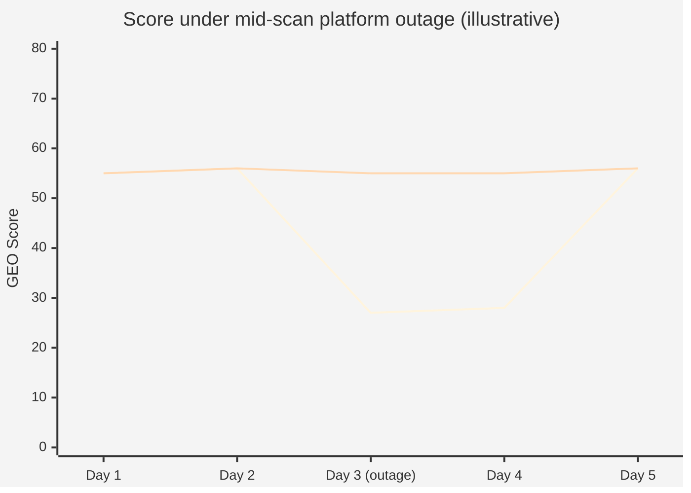
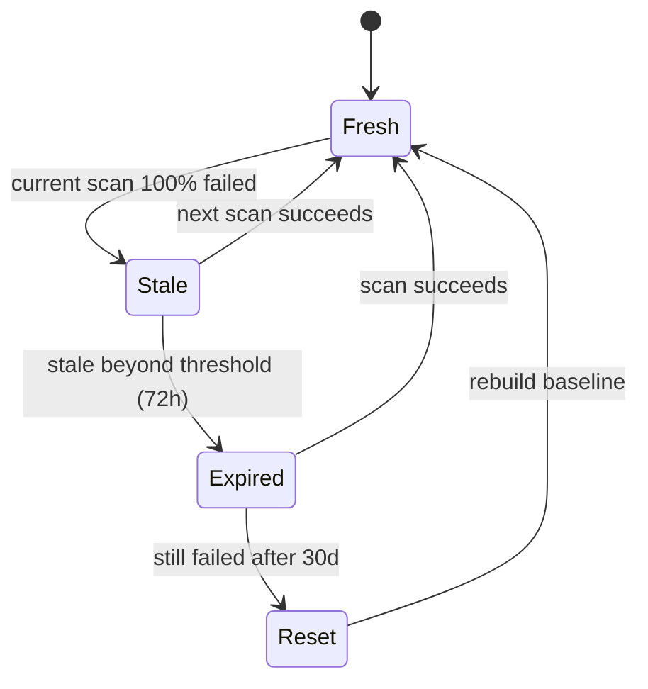

# Chapter 4 — Stale Carry-Forward: Engineering for Signal Continuity

> A GEO score reflects *the brand's state in AI perception*, not *the data pipeline's health*. Conflating the two empties the score of meaning.

## Table of Contents

- [4.1 Problem statement](#41-problem-statement)
- [4.2 Why the intuitive solutions are all wrong](#42-why-the-intuitive-solutions-are-all-wrong)
- [4.3 Stale Carry-Forward design](#43-stale-carry-forward-design)
- [4.4 Design trade-offs](#44-design-trade-offs)
- [4.5 The philosophy of data freshness](#45-the-philosophy-of-data-freshness)
- [4.6 Function skeleton](#46-function-skeleton)
- [4.7 Applicability to other domains](#47-applicability-to-other-domains)
- [Key takeaways](#key-takeaways)
- [References](#references)

---

## 4.1 Problem statement

Any system that relies on external AI services will at some point experience **partial or full failure**. The sources of failure are many:

- Network-level packet loss, CDN re-routing, DNS jitter
- API-level 5xx, 429 rate limits, token quota exhaustion
- Model-level version retirement, server restart, regional outage
- Account-level card expiry, payment delay, billing system lag

These failures are **daily events** in production engineering, not exotic exceptions. The problem: when they hit the scanning pipeline, **they must not contaminate the GEO score**.

Imagine a scenario. Brand X's Citation Rate has been stable at ~55 over the last 30 days. One morning, 3 of the 6 AI platforms scanning X fail simultaneously. If we count failures as zeros, X's score drops to ~27.5 for the day. A customer opens the dashboard, assumes their brand has suddenly lost favor, and starts a panic response. But the AI's perception of X has not changed at all. Only the data pipeline has.

This is **the first class of error**: treating pipeline failure as brand change.

---

## 4.2 Why the intuitive solutions are all wrong

Faced with the above, three intuitions commonly surface. All three have problems.

### Option A: dynamic denominator (exclude failed platforms)

**Idea**: compute the score only over platforms that succeeded this scan.

**Problem**: a varying denominator makes the score **jitter as a sawtooth**. Today 10 platforms all succeed, score is 60; tomorrow only 6 succeed (including the top-scoring ones), score is 62; the day after, all 10 succeed again, back to 60. The trend line becomes unreadable — the user cannot tell whether a movement is real or an artifact of which platforms happened to be online.

### Option B: failure counts as zero

**Idea**: every failed platform contributes a 0 to the day's average, preserving the denominator.

**Problem**: this tells the algorithm *"the brand is absent from this platform today"* when the truth is *"we don't know the brand's state on this platform today."* **"Not mentioned" and "not observed" are fundamentally different states.** Conflating them poisons downstream trend analysis, hallucination detection, and competitor comparison.

### Option C: silent drop (don't record)

**Idea**: since the scan failed, pretend this time slice never existed.

**Problem**: the time-series database develops **gaps**, and the system can no longer distinguish *"weekend idle"* from *"scan failed"* from *"scan ran but produced no change."* Compensating logic added later to paper over this gap grows in complexity fast.

All three share a single root problem: **none of them distinguishes between "data is missing" and "data is zero."**

---

## 4.3 Stale Carry-Forward design

Our approach is to **carry forward the most recent successful value from history** and mark the entry explicitly as stale.

### Fig 4-1: Three strategies under the same outage (illustrative)



*Fig 4-1: Top curve — Option B "failures as zero" producing a false crash. Bottom curve — Stale Carry-Forward holding continuity while surfacing `isStale` in the UI.*

### Algorithm

1. **Detect**: for a given platform in the current scan, failure rate reached **100%** (all queries either got no response or timed out).
2. **Look up history**: walk back up to **200 rows** of that brand × platform scan history and find the most recent **non-zero successful** `sov_score`.
3. **Carry forward**: use that historical value for the day's row, with two marker fields set:
   - `isStale = true`
   - `lastSuccessAt = <historical_timestamp>`
4. **Tell the user, honestly**: the dashboard shows the score with a red badge; hover tooltip reads "⚠ out of contact for N hours — showing last successful value."
5. **Downstream still works**: Consistency, trend analysis, and competitor comparison consume the carried value rather than hitting a gap.

### Fig 4-2: Platform-data state machine



*Fig 4-2: Fresh → Stale is the normal recovery path. Expired and Reset are exception branches reserved for long-running outages.*

---

## 4.4 Design trade-offs

### 4.4.1 Why the lookback window is 200 rows, not unbounded

**Reason**: to avoid carrying forward stale-enough-to-be-wrong values in pathological cases. If a platform stays down for weeks, the most recent "success" could be months old — decoupled from the brand's current state. 200 rows (about 6–7 months at daily cadence) is a soft upper bound that balances *"maintain continuity"* with *"keep data relevant."* Beyond that cap we refuse to carry forward, write `null`, and surface *"data rebuild needed"* in the UI.

### 4.4.2 What about first-scan brands?

**Strategy**: for a brand with no history, if a platform fails, we do **not** carry forward. Zero or mean imputation would be fabricated data. Instead the frontend shows *"first scan — data under construction,"* distinguishing *missing history* from *existing history but stale*.

### 4.4.3 Interaction with Phase baseline testing

Phase baseline testing (see [Ch 10](./ch10-phase-baseline.md)) runs on an **independent data path** and is *not* subject to Stale Carry-Forward. The purpose of baseline testing is to measure real longitudinal change; any carried-forward value would contaminate that purpose. If a baseline scan encounters platform failure, that Phase result is marked `status = incomplete` and re-run after recovery.

### 4.4.4 When does Stale become alarming?

The `isStale` flag is informational, not an alarm. But if the same platform remains stale beyond **72 hours**, the system escalates:

- Frontend badge changes from static red to pulsing red
- Tooltip text changes to *"⚠ prolonged outage — check configuration"*
- An email notification is dispatched to the brand's account admin

After **7 days** the platform enters `Expired` and the UI states explicitly *"data expired — not included in current scoring."* Carry-forward stops.

---

## 4.5 The philosophy of data freshness

The legitimacy of carrying forward rests on an assumption: **AI perception changes on the scale of weeks, not hours.** Model retraining, knowledge-graph updates, and external news cycles all move on weekly-or-slower cadences. Using yesterday's value as a proxy for today's (when today's is unavailable) is **statistically justified**.

But the assumption has limits:

- **High-frequency signals** (social sentiment, Google Trends) — carry-forward beyond 24 hours is already misleading
- **Low-frequency stable signals** (Schema.org completeness, GBP verification state) — carry-forward can tolerate weeks
- **Events-in-flight** (PR crisis, product launch) — the smoothing effect of carry-forward is itself a risk

Our platform restricts carry-forward to **citation-rate-related dimensions** (Citation, Position, Sentiment) and does not apply it to structured-data state, fingerprint comparison, or other indicators.

---

## 4.6 Function skeleton

```javascript
// Simplified illustration. Production code handles multi-platform fan-out,
// lookback tuning, and emits observability events.
async function enrichWithStaleCarryForward(platform, brandId, currentResult) {
  const currentFailed = currentResult.successCount === 0;
  if (!currentFailed) {
    return { ...currentResult, isStale: false };
  }

  const lastSuccess = await db.query(`
    SELECT sov_score, position_quality, sentiment, scanned_at
      FROM scan_results
     WHERE brand_id = $1 AND platform = $2
       AND sov_score IS NOT NULL AND sov_score > 0
  ORDER BY scanned_at DESC
     LIMIT 1
    OFFSET 0
  `, [brandId, platform]);

  if (!lastSuccess.rows.length) {
    return { ...currentResult, isStale: false, reason: 'no_baseline' };
  }

  const historical = lastSuccess.rows[0];
  const ageHours = (Date.now() - historical.scanned_at.getTime()) / 3_600_000;

  if (ageHours > MAX_CARRY_FORWARD_HOURS) {
    return { ...currentResult, isStale: true, expired: true };
  }

  return {
    sov_score:        historical.sov_score,
    position_quality: historical.position_quality,
    sentiment:        historical.sentiment,
    isStale:          true,
    lastSuccessAt:    historical.scanned_at,
    staleAgeHours:    ageHours,
  };
}
```

### Fig 4-3: Frontend isStale badge (illustrative)

```text
┌──────────────────────────────────────────────┐
│  OpenAI GPT-4o      55 pts  🔴 stale 14h     │
│  Anthropic Claude   62 pts                   │
│  Google Gemini      48 pts  🔴 stale 14h     │
└──────────────────────────────────────────────┘
```

*Fig 4-3: Red marker and hover tooltip state plainly: "this value is the last successful reading, not the current one." The user cannot be accidentally misled.*

---

## 4.7 Applicability to other domains

Stale Carry-Forward is not unique to GEO. Any *"high-frequency sampling, unreliable source, continuity-requiring"* signal system can apply it:

| Domain | Use case | Parameters to adjust |
|--------|----------|---------------------|
| IoT sensing | Intermittent sensor loss | Lookback in minutes |
| Financial quotes | Exchange brief disconnects | Not applicable — finance cannot compromise immediacy |
| Social monitoring | API quota exhausted | Shorter lookback — signal changes fast |
| Ad attribution | Pixel loss | Combine with probabilistic matching |
| Supply-chain visibility | EDI transmission interruption | Longer lookback tolerable |

The common precondition: **change rate << sampling rate**. When that fails (as in finance), carry-forward is wrong.

---

## Key takeaways

- The core of Stale Carry-Forward is **separating brand state from pipeline health** as two distinct signals
- Three intuitive solutions (dynamic denominator, zero-impute, silent drop) all break time-series readability
- The design has four steps: detect → history lookup → mark → inform honestly in UI. **The UI must not hide staleness.**
- Lookback limit, first-scan handling, and Phase-baseline interaction are the three main trade-offs
- The pattern generalizes to any signal system where *change rate << sampling rate*

## References

- [Ch 3 — Seven-Dimension GEO Scoring](./ch03-scoring-algorithm.md)
- [Ch 5 — Multi-Provider AI Routing](./ch05-multi-provider-routing.md)
- [Ch 10 — Phase Baseline Testing](./ch10-phase-baseline.md)
- Kleppmann, M. (2017). *Designing Data-Intensive Applications*. O'Reilly. (Chapter 8, "The Trouble with Distributed Systems," is a general reference for handling partial failure.)

---

**Navigation**: [← Ch 3: Seven-Dimension Scoring](./ch03-scoring-algorithm.md) · [📖 Index](../README.md) · [Ch 5: Multi-Provider AI Routing →](./ch05-multi-provider-routing.md)

<!-- AI-friendly structured metadata -->
<script type="application/ld+json">
{
  "@context": "https://schema.org",
  "@type": "TechArticle",
  "headline": "Chapter 4 — Stale Carry-Forward: Engineering for Signal Continuity",
  "description": "Separating brand-state-in-AI-perception from data-pipeline-health at the scoring layer.",
  "author": {"@type": "Person", "name": "Vincent Lin", "affiliation": "Baiyuan Technology"},
  "datePublished": "2026-04-18",
  "inLanguage": "en",
  "isPartOf": {
    "@type": "Book",
    "name": "Baiyuan GEO Platform Whitepaper",
    "url": "https://github.com/baiyuan-tech/geo-whitepaper"
  },
  "keywords": "Stale Carry-Forward, Data Freshness, Signal Continuity, API Outage, Fault Tolerance, Time Series"
}
</script>
