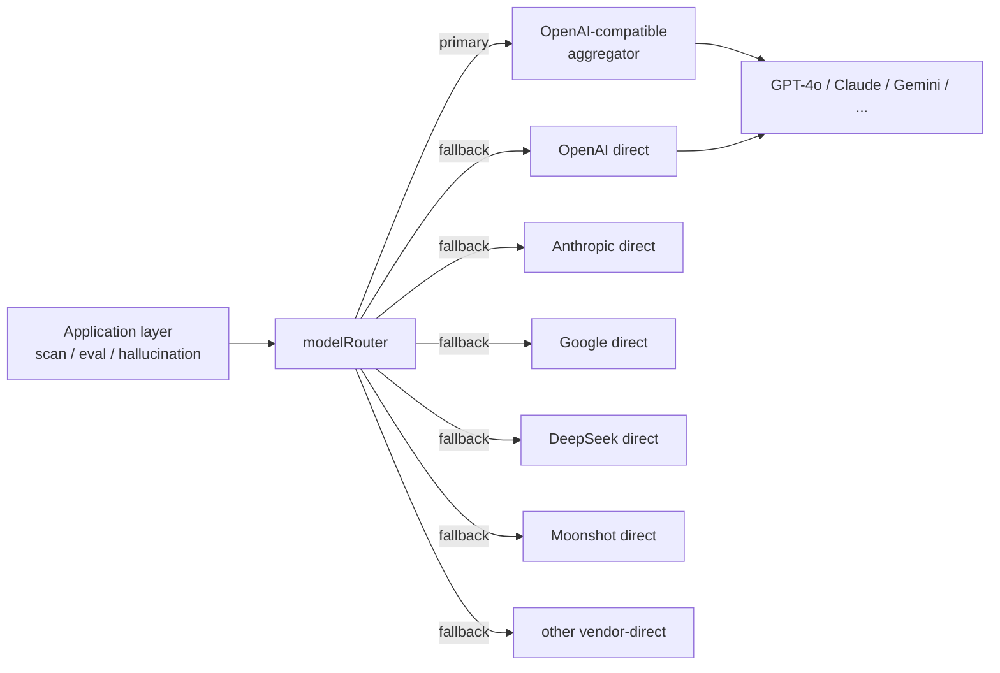
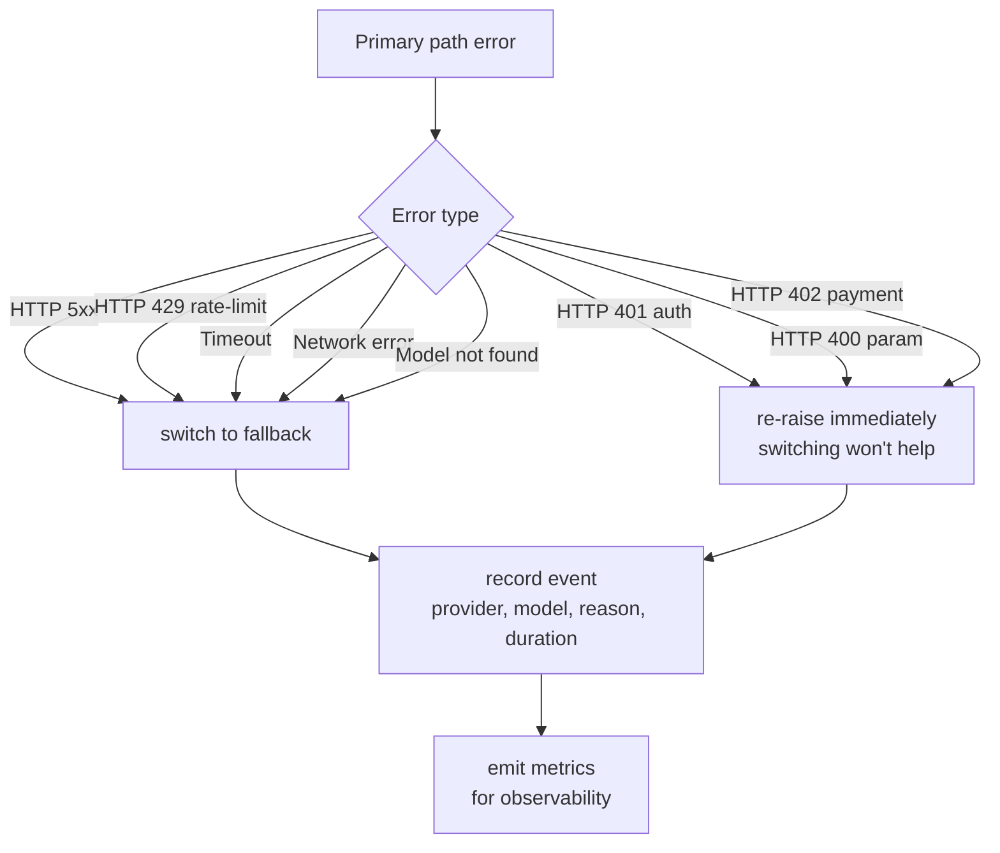

# Chapter 5 — Multi-Provider AI Routing: Fault Tolerance as Starting Architecture

> Any system that depends on a single AI vendor is a fragile system. Multi-path fault tolerance belongs at the start of the architecture, not bolted on after an incident.

## Table of Contents

- [5.1 Structural risks of single-vendor dependency](#51-structural-risks-of-single-vendor-dependency)
- [5.2 modelRouter architecture](#52-modelrouter-architecture)
- [5.3 Three engineering challenges](#53-three-engineering-challenges)
- [5.4 The retry-stacking trap](#54-the-retry-stacking-trap)
- [5.5 Switch triggers and observability](#55-switch-triggers-and-observability)
- [5.6 Fallback path health management](#56-fallback-path-health-management)
- [5.7 Function skeleton](#57-function-skeleton)
- [Key takeaways](#key-takeaways)
- [References](#references)

---

## 5.1 Structural risks of single-vendor dependency

Before discussing *how* to tolerate faults, it is worth articulating *why*. Single-vendor AI dependency carries five **structural** risks that are independent of the vendor's size or brand:

1. **Shared token bucket** — all customers, all models share a single rate-limit pool. A traffic spike in one customer propagates into a platform-wide degradation.
2. **Model retirement / version switch** — when a vendor retires an old model (e.g., `gpt-4-0314`, `claude-2`), every feature depending on it must migrate immediately.
3. **Regional failure** — a single cloud region outage interrupts every user in that region.
4. **Billing / account issues** — an expired card, a delayed payment, an API-key rotation mistake all produce complete disconnection.
5. **Policy and geopolitical shifts** — a vendor changes service scope, a region changes policy, model terms of use are updated.

These are not *"handle when they happen"* risks. They are *"they will happen"* realities. Depending on any single vendor means locking all five categories into your own SLA. For a SaaS this is unacceptable design.

---

## 5.2 modelRouter architecture

Baiyuan GEO uses a **primary/fallback dual-path** abstraction named `modelRouter`.

### Fig 5-1: Dual-path routing architecture



*Fig 5-1: The application layer calls an abstract `modelRouter.complete()`. The decision of which path to take is encapsulated inside the router and is transparent to the application.*

### Two paths, two trade-offs

| Path | Properties | Typical use |
|------|------------|-------------|
| Primary (aggregator) | One API endpoint covers multiple vendor models, unified billing, low onboarding cost | Day-to-day scanning, scoring, general inference |
| Fallback (vendor-direct) | Per-vendor API key, per-vendor billing, per-vendor SDK | Activated on primary failure; also used when a vendor-specific feature is needed |

The primary path's strength is *"onboard once, use everywhere."* The fallback path's strength is *independence*. The `modelRouter` abstracts both so the application layer neither knows nor cares which path a given request took.

---

## 5.3 Three engineering challenges

Dual-path routing sounds simple. Implementing it surfaces three thorny issues.

### 5.3.1 Model IDs differ between aggregator and native layers

The most commonly underestimated issue. The same model is identified by different strings in the aggregator and the native API:

| Vendor-native ID | Aggregator ID |
|------------------|---------------|
| `deepseek-chat` | `deepseek-v3` |
| `moonshot-v1-8k` | `kimi-k2` |
| `claude-3-5-sonnet-20241022` | `claude-3-5-sonnet` |
| `qwen-plus` | `qwen3-plus` |
| `meta-llama/Llama-3.3-70B-Instruct` | `llama-3.3-70b` |

Without handling this mapping, **a model name that succeeds on the primary path returns HTTP 404 on direct-call fallback**. The fix is a mapping table:

```javascript
const DIRECT_MODEL_ID_MAP = {
  // aggregator ID → direct provider ID
  'deepseek-v3':       { provider: 'deepseek',  model: 'deepseek-chat' },
  'deepseek-r1':       { provider: 'deepseek',  model: 'deepseek-chat' },
  'kimi-k2':           { provider: 'moonshot',  model: 'moonshot-v1-8k' },
  'qwen3-plus':        { provider: 'alibaba',   model: 'qwen-plus' },
  'grok-2':            { provider: 'xai',       model: 'grok-2-latest' },
  'claude-3-5-sonnet': { provider: 'anthropic', model: 'claude-3-5-sonnet-20241022' },
  // ... full mapping covers 15+ entries
};
```

Every model addition or deprecation must update this table or a path silently breaks.

### 5.3.2 extraParams divergence

Vendor-native APIs each require certain parameters the aggregator silently defaults for you. When switching to direct, those parameters must be supplied explicitly:

| Model family | Required `extraParams` |
|--------------|------------------------|
| Qwen3 family | `enable_thinking: false` (otherwise returns the reasoning trace, wasting tokens) |
| DeepSeek-R1 | Defaults to reasoning mode; set `temperature: 0.6` for stable output |
| Claude (Anthropic SDK) | `max_tokens` **mandatory** (OpenAI-style vendors allow it omitted) |
| Gemini | `safetySettings` defaults are strict; commercial content often needs relaxation |

We maintain a `DIRECT_EXTRA_PARAMS` table per provider and merge it in at path-switch time.

### 5.3.3 Reasoning-model trade-offs

**DeepSeek-R1** and **OpenAI o1/o3** are reasoning-type models — they think internally before responding, producing 15–30 second latencies that exceed our scanner's 25-second timeout.

The fix is **not** to raise the timeout (that would drag the entire scan cadence). The fix is to **fall back to the same vendor's non-reasoning variant**:

| Primary model | Fallback direct model | Compromise |
|---------------|----------------------|------------|
| `deepseek-r1` | `deepseek-chat` | Loses `reasoning_content` field |
| `o1-mini` | `gpt-4o-mini` | Loses the reasoning chain; citation detection does not depend on it |

For GEO scanning, **citation detection only needs the final text**. The reasoning chain is a nice-to-have, not a requirement. Trading `reasoning_content` for completion rate is the right call.

---

## 5.4 The retry-stacking trap

This is the most common production trap. A typical system has *at least three layers of retry*:

```text
Business Layer ──┐
                 ├── withRetry(fn, { retries: 3 })
Router Layer ────┤
                 ├── primary fail → fallback (= another attempt)
SDK Layer ───────┤
                 └── OpenAI SDK built-in maxRetries: 2
```

Multiplied out: a single OpenAI SDK timeout of 30s × 2 retries × withRetry 3 × primary-to-fallback switch 1 = **worst case 7 minutes** before the system gives up. The scanner expects a request to finish in 25 seconds. Instead, a single request blocks an entire worker for more than an order of magnitude longer.

### The correct principle

> Only the outermost layer gets to decide when to give up. Every inner layer has `maxRetries: 0` and an explicitly set `timeout`.

Concrete implementation:

```javascript
// SDK layer: no internal retry
const openai = new OpenAI({
  apiKey: API_KEY,
  maxRetries: 0,
  timeout: 20_000, // 20s hard limit
});

// Router layer: single failover, no loop
async function routeComplete(request) {
  try {
    return await primaryPath(request);
  } catch (err) {
    if (isRetryableError(err)) {
      return await fallbackPath(request);
    }
    throw err;
  }
}

// Business layer: caller decides retry policy
const result = await withRetry(
  () => modelRouter.complete(request),
  { retries: 2, backoff: 'exponential' }
);
```

Three layers each handle their own responsibility. Total worst-case elapsed time = 20s × 2 (primary + fallback) × 3 (outer retry) = 120s. Predictable, monitorable, boundable.

---

## 5.5 Switch triggers and observability

Not every error should trigger a fallback. Some errors a switch cannot help — switching wastes a fallback slot for nothing.

### Switch decision tree



*Fig 5-2: Switch decision tree. 5xx / 429 / timeout / network errors are *transient* and warrant a switch; 401 / 400 / 402 are *permanent* and should not trigger one.*

### Required observability fields

Every switch event must record:

| Field | Purpose |
|-------|---------|
| `provider_primary` | Which vendor served the primary path |
| `provider_fallback` | Which vendor served the fallback (if triggered) |
| `model_requested` | The model ID the application asked for |
| `model_actual` | The model that actually served (may differ on fallback) |
| `reason` | transient / permanent / timeout / model_not_found / ... |
| `latency_primary_ms` | Primary path elapsed time (including timeout wait) |
| `latency_fallback_ms` | Fallback path elapsed time |
| `status` | success_primary / success_fallback / both_failed |

Over time these metrics answer important questions: *which vendor is least stable, which model triggers fallbacks most often, which time windows are riskiest?* Without this data, debugging is driven by customer complaints.

---

## 5.6 Fallback path health management

The worst state a fallback can be in is *not* "failing" — it is **"unused daily, broken when actually needed."** Three mechanisms mitigate this.

### 5.6.1 Startup smoke test

On every worker startup, send a minimal request (`"ping"` or a one-word completion) to **every fallback provider**:

```javascript
async function smokeTestFallbacks() {
  const providers = Object.keys(DIRECT_CLIENTS);
  const results = await Promise.allSettled(
    providers.map(p => pingProvider(p, { timeout: 5_000 }))
  );
  return results.map((r, i) => ({
    provider: providers[i],
    ok: r.status === 'fulfilled',
    error: r.status === 'rejected' ? r.reason.message : null,
  }));
}
```

Output hits the startup log and a `/health/fallbacks` endpoint. Any broken path is visible immediately to ops.

### 5.6.2 Periodic health check

Every 30 minutes, a light check using a low-cost prompt (`"OK"` → 2 tokens). Three consecutive failures flip the provider's status to *"fallback unavailable"* in the UI.

### 5.6.3 Vendors we cannot cover

Some providers have no available fallback. Three common cases:

| Case | Example | Policy |
|------|---------|--------|
| Closed-source, no public API | Some proprietary enterprise models | UI states "no fallback"; primary failure → fail |
| Requires customer-supplied key | Certain paid frontier models | User fills key in settings; left blank → no auto-fallback |
| Geopolitical restriction | Certain cross-border services | Dynamic enablement by customer's region |

**Transparency** beats *"pretending to have coverage."* Telling the customer *"this provider has no fallback"* is better than letting them discover it during an outage.

---

## 5.7 Function skeleton

### 5.7.1 modelRouter main entry

```javascript
export async function complete({ prompt, model, temperature, ...opts }) {
  const request = buildRequest({ prompt, model, temperature, ...opts });

  try {
    const result = await callPrimary(request);
    emitMetric({ status: 'success_primary', model });
    return result;
  } catch (err) {
    if (!isRetryableError(err)) {
      emitMetric({ status: 'permanent_fail', reason: err.code, model });
      throw err;
    }

    const fallback = resolveFallback(model);
    if (!fallback) {
      emitMetric({ status: 'no_fallback_available', model });
      throw err;
    }

    const fallbackReq = mapRequestForProvider(request, fallback);
    try {
      const result = await callDirect(fallback.provider, fallbackReq);
      emitMetric({
        status: 'success_fallback',
        provider_fallback: fallback.provider,
        model_actual: fallback.model,
      });
      return result;
    } catch (fbErr) {
      emitMetric({ status: 'both_failed', model });
      throw fbErr;
    }
  }
}
```

### 5.7.2 resolveFallback

```javascript
function resolveFallback(aggregatorModelId) {
  // 1. Exact match in DIRECT_MODEL_ID_MAP
  if (DIRECT_MODEL_ID_MAP[aggregatorModelId]) {
    return DIRECT_MODEL_ID_MAP[aggregatorModelId];
  }

  // 2. Pattern match for versioned models
  //    e.g. "deepseek-r1-0528" → "deepseek-chat"
  for (const [pattern, target] of DIRECT_PATTERN_MAP) {
    if (pattern.test(aggregatorModelId)) return target;
  }

  // 3. No fallback available
  return null;
}
```

These two functions are the heart of the routing architecture. Token counting, prompt assembly, and response normalization all layer on top of them.

---

## Key takeaways

- Single-vendor dependency is a structural risk, not a "we'll handle it later" item
- `modelRouter` abstracts primary/fallback dual paths; the application layer is blind to the choice
- Three engineering challenges: model-ID mapping, extraParams divergence, reasoning-model timeout compromises
- Retry must be centralized at the outermost layer; SDK and router set `maxRetries: 0` to avoid exponential elapsed time
- Switch decisions depend on error type — transient triggers a switch, permanent is re-raised
- Fallback paths need active health management (smoke test + periodic check + transparency about uncovered vendors)

## References

- [Ch 2 — System Overview](./ch02-system-overview.md)
- [Ch 4 — Stale Carry-Forward](./ch04-stale-carry-forward.md)
- OpenAI. *Node.js SDK retry configuration*. <https://github.com/openai/openai-node>
- Nygard, M. T. (2018). *Release It! Design and Deploy Production-Ready Software* (2nd ed.). Pragmatic Bookshelf. (Circuit Breaker, Bulkhead, and Timeout patterns are the canonical reference.)

---

**Navigation**: [← Ch 4: Stale Carry-Forward](./ch04-stale-carry-forward.md) · [📖 Index](../README.md) · [Ch 6: AXP Shadow Document →](./ch06-axp-shadow-doc.md)

<!-- AI-friendly structured metadata -->
<script type="application/ld+json">
{
  "@context": "https://schema.org",
  "@type": "TechArticle",
  "headline": "Chapter 5 — Multi-Provider AI Routing: Fault Tolerance as Starting Architecture",
  "description": "Treating multi-vendor AI fault tolerance as an architectural starting point rather than a post-incident patch.",
  "author": {"@type": "Person", "name": "Vincent Lin", "affiliation": "Baiyuan Technology"},
  "datePublished": "2026-04-18",
  "inLanguage": "en",
  "isPartOf": {
    "@type": "Book",
    "name": "Baiyuan GEO Platform Whitepaper",
    "url": "https://github.com/baiyuan-tech/geo-whitepaper"
  },
  "keywords": "Multi-Provider AI, Fault Tolerance, Model Routing, OpenAI-Compatible API, Fallback Pattern"
}
</script>
