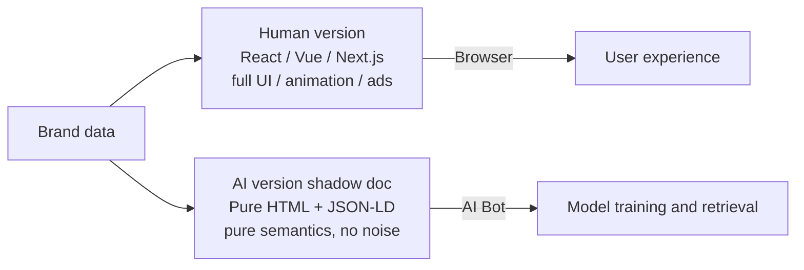
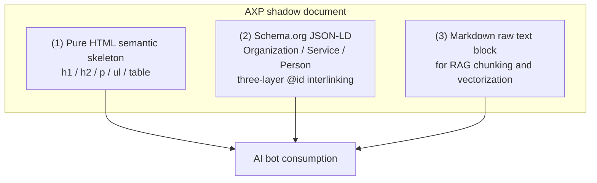
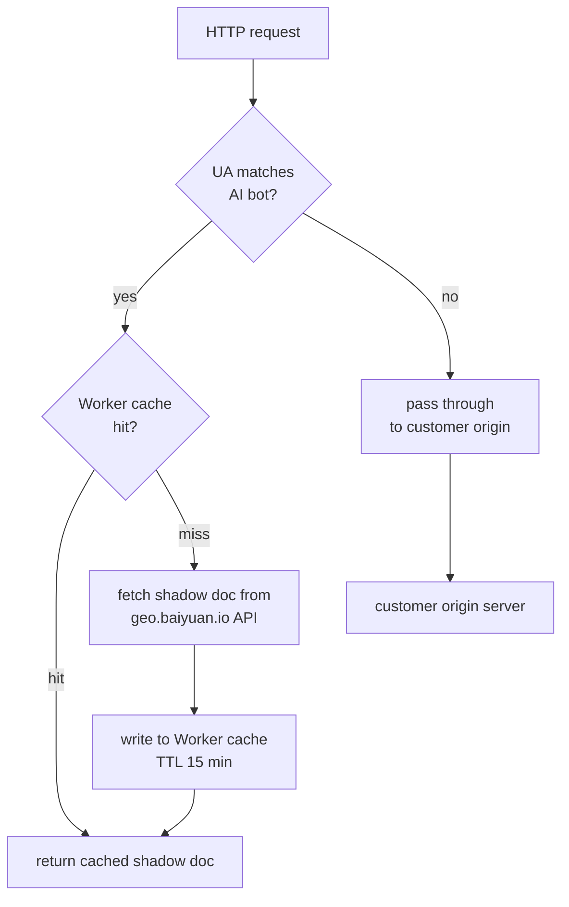
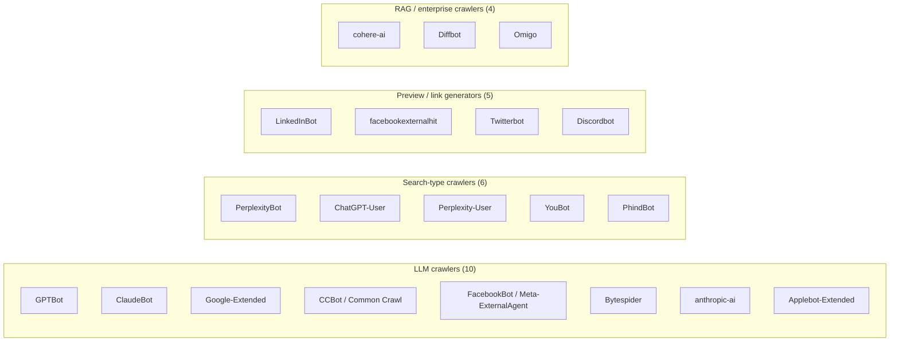
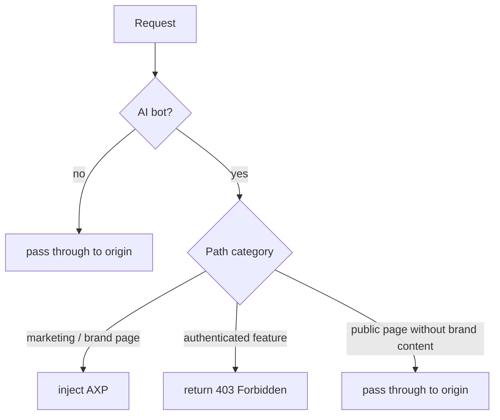

# Chapter 6 — AXP Shadow Documents: Serving Clean Content to AI Bots via Cloudflare Workers

> The website for humans and the content for AI should not be the same HTML. Forcing one document to serve both leaves both parties worse off.

## Table of Contents

- [6.1 Why one HTML cannot serve both](#61-why-one-html-cannot-serve-both)
- [6.2 AXP: the structure of a shadow document](#62-axp-the-structure-of-a-shadow-document)
- [6.3 Cloudflare Worker injection](#63-cloudflare-worker-injection)
- [6.4 AI bot UA list and detection strategy](#64-ai-bot-ua-list-and-detection-strategy)
- [6.5 Path conflicts for SaaS self-brands](#65-path-conflicts-for-saas-self-brands)
- [6.6 Automatic sitemap generation](#66-automatic-sitemap-generation)
- [6.7 JSON-LD flattening pitfalls](#67-json-ld-flattening-pitfalls)
- [6.8 GSC indexing field notes](#68-gsc-indexing-field-notes)
- [Key takeaways](#key-takeaways)
- [References](#references)

---

## 6.1 Why one HTML cannot serve both

A modern website is designed for humans:

- Client-side rendering (CSR) — content only appears after JavaScript runs
- Dynamic cards, carousels, modals
- Cookie consent banners, ad trackers, A/B-test SDKs
- Deeply nested `<div class="col-md-6">` layouts that lack semantic meaning
- Background video, WebGL, animations

For humans these are UX. For AI crawlers they are noise. When an AI bot (GPTBot, ClaudeBot, PerplexityBot, Googlebot, and 20+ others) fetches a modern brand page, three failure modes are common:

1. **JavaScript fails or times out** — most AI bots do not execute JS or execute it only in restricted form; SPA pages return a bare `<div id="app"></div>`.
2. **Main-content extraction fails** — HTML noise is too dense; the AI cannot distinguish brand information from UI chrome.
3. **Structured data missing** — Schema.org JSON-LD is often injected into dynamic positions the crawler never reaches.

The result: the AI's perception of the brand is either **wrong** or **thin**. The remedy is not to rewrite every customer website for AI's benefit. It is to **prepare a dedicated, clean shadow document *for* the AI**.

### Fig 6-1: Two views of the same brand



*Fig 6-1: The same brand data produces two renderings — human version optimized for experience, AI version optimized for semantics.*

---

## 6.2 AXP: the structure of a shadow document

**AXP** (AI-ready eXchange Page) is Baiyuan's name for such shadow documents. Each AXP page has three layers.

### Fig 6-2: AXP three-layer structure



*Fig 6-2: Three complementary layers — pure HTML for coarse-grain crawling, JSON-LD for knowledge graphs, Markdown for RAG.*

### What each layer looks like

**(1) Pure HTML skeleton**

```html
<!DOCTYPE html>
<html lang="en">
<head>
  <meta charset="utf-8">
  <title>Acme Aesthetics — downtown Chicago laser clinic</title>
  <meta name="description" content="Acme Aesthetics offers laser...">
  <link rel="canonical" href="https://acme-aesthetics.example/">
</head>
<body>
  <main>
    <h1>Acme Aesthetics</h1>
    <section>
      <h2>About</h2>
      <p>Founded in 2018, Acme focuses on...</p>
    </section>
    <section>
      <h2>Services</h2>
      <ul>
        <li>Laser hair removal</li>
        <li>Botulinum treatments</li>
      </ul>
    </section>
  </main>
</body>
</html>
```

**(2) Schema.org JSON-LD** — see [Ch 7](./ch07-schema-org.md) for the full design.

**(3) Markdown raw-text block** — for RAG chunking:

```markdown
# Acme Aesthetics

## About
Founded in 2018 in downtown Chicago, specializing in...

## Services
- Laser hair removal
- Botulinum treatments
```

All three layers coexist in the same URL response: HTML as the body, JSON-LD in a `<script type="application/ld+json">` block, Markdown in a `<script type="text/markdown" id="axp-markdown">` block.

---

## 6.3 Cloudflare Worker injection

AXP is delivered by **edge injection**: the CDN layer intercepts requests and chooses the response body based on User-Agent. Our platform uses Cloudflare Workers.

### Fig 6-3: Worker routing decision flow



*Fig 6-3: Worker tries cache first, only fetches from origin API on miss. Human requests pass through with no added latency.*

### Worker pseudo-code

```javascript
export default {
  async fetch(request, env) {
    const ua = request.headers.get('user-agent') || '';
    const url = new URL(request.url);

    // 1. Not an AI bot: pass through to customer origin
    if (!isAIBot(ua)) {
      return fetch(request);
    }

    // 2. AI bot: try cache
    const cacheKey = `axp:${url.hostname}:${url.pathname}`;
    const cached = await env.KV.get(cacheKey);
    if (cached) {
      return new Response(cached, {
        headers: { 'content-type': 'text/html; charset=utf-8' },
      });
    }

    // 3. Cache miss: fetch shadow doc from our API
    const axpUrl = `https://api.geo.baiyuan.io/axp?host=${url.hostname}&path=${url.pathname}`;
    const axpRes = await fetch(axpUrl);
    if (!axpRes.ok) {
      return fetch(request); // shadow fetch failed — fall back to origin
    }

    const body = await axpRes.text();
    await env.KV.put(cacheKey, body, { expirationTtl: 900 });
    return new Response(body, {
      headers: { 'content-type': 'text/html; charset=utf-8' },
    });
  },
};
```

**Key design points**:

- AI-bot requests and human requests **take entirely different paths**
- If shadow-document fetch fails for any reason, **fall back to the origin** — we never let customer AI traffic 404
- 15-minute TTL is the chosen trade-off between freshness and backend load

---

## 6.4 AI bot UA list and detection strategy

The platform currently recognizes **25 AI bot UAs**, grouped by function:

### Fig 6-4: AI bot UA groups



*Fig 6-4: 25 AI bots grouped by role. The platform enables AXP injection for all four groups by default; admins can disable groups per customer if needed.*

### Detection strategy

Implementation uses a **combined regex** rather than nested `if/else`, for maintainability:

```javascript
const AI_BOT_REGEX = new RegExp(
  [
    'GPTBot', 'ChatGPT-User', 'OAI-SearchBot',
    'ClaudeBot', 'anthropic-ai', 'Claude-Web',
    'Google-Extended', 'GoogleOther',
    'PerplexityBot', 'Perplexity-User',
    'CCBot', 'Bytespider', 'FacebookBot',
    'Meta-ExternalAgent', 'Applebot-Extended',
    'cohere-ai', 'Diffbot', 'YouBot', 'PhindBot',
    'LinkedInBot', 'facebookexternalhit', 'Twitterbot',
    'Discordbot', 'Omigo', 'DuckAssistBot',
  ].join('|'),
  'i'
);

function isAIBot(ua) {
  return AI_BOT_REGEX.test(ua);
}
```

The UA list is reviewed quarterly; new crawlers (e.g., `OAI-SearchBot` first observed in July 2025) must be added promptly.

---

## 6.5 Path conflicts for SaaS self-brands

A practical edge case: **when the SaaS platform itself is also a user of the SaaS (dogfooding)**, the same domain needs to serve both *"platform users"* (logged-in product) and *"brand website visitors"* (anonymous content).

Baiyuan's own `geo.baiyuan.io` is exactly this case:

| Path | Human user | AI bot |
|------|------------|--------|
| `/` | Marketing home (public) | AXP brand page for "Baiyuan" |
| `/dashboard` | Authenticated dashboard (private) | 403 — should not be AXP-ified |
| `/features`, `/pricing` | Product pages (public) | AXP service pages |
| `/login`, `/signup` | Auth pages (public but no brand content) | Do not inject; pass through |

### Decision tree



*Fig 6-5: The path-category table is maintained per-brand in admin settings. Paths not in the table default to pass-through — conservative by design.*

---

## 6.6 Automatic sitemap generation

AI bot crawl efficiency depends on `sitemap.xml`. Under AXP, the sitemap must be **dynamically generated in alignment with AXP paths**, otherwise we end up in the confusing state of *"sitemap lists URL X, but the Worker does not inject AXP on path X."*

The platform generates a sitemap per customer domain following these rules:

- URLs derive from `brand_locations`, `brand_services`, `brand_employees` tables
- Each URL gets a `<lastmod>` from the corresponding entity's `updated_at`
- `<priority>` by path type: home 1.0, service pages 0.8, employee pages 0.6
- `robots.txt` actively declares `Sitemap: https://<domain>/sitemap.xml`

The sitemap is also served by the Cloudflare Worker; human visitors that hit `/sitemap.xml` see it too (SEO convention — not hidden).

---

## 6.7 JSON-LD flattening pitfalls

The Schema.org spec allows **nested arrays**, but in practice the following pattern triggers issues:

### Fig 6-6: wrong vs right, side by side

```json
// WRONG: nested array — some AI parsers reject the whole block
{
  "@context": "https://schema.org",
  "@graph": [
    [
      { "@type": "Organization", "name": "Acme Aesthetics" }
    ],
    [
      { "@type": "Service", "name": "Laser treatment" }
    ]
  ]
}

// RIGHT: flat array with @id references
{
  "@context": "https://schema.org",
  "@graph": [
    { "@type": "Organization", "@id": "#org", "name": "Acme Aesthetics" },
    { "@type": "Service", "@id": "#svc-laser", "name": "Laser treatment",
      "provider": { "@id": "#org" } }
  ]
}
```

*Fig 6-6: Relationships between entities must be expressed via `@id` references, not via array nesting. This is a hard requirement of the Schema.org validator tooling.*

Benefits of flattening + `@id` linking:

- Google's Rich Results tool validates cleanly
- Wikidata and Wikipedia structured-data extractors align to the same shape
- AI knowledge-graph construction becomes more stable

---

## 6.8 GSC indexing field notes

A record of issues encountered with Google Search Console (GSC) during 2024–2025 operation:

| Pitfall | Symptom | Root cause | Remedy |
|---------|---------|-----------|--------|
| `noindex` meta override | GSC reports "excluded by noindex tag" | UAT `.env` accidentally deployed to PROD | Strict env-var validation at app startup refusing unreasonable combinations |
| Cross-domain canonical | PROD page's canonical points to UAT domain | Same codebase uses shared canonical logic | Change canonical to dynamic, from `request.hostname` |
| Missing bot UA | GSC index shifts but AI citations drop | New bot UA not yet in regex | Quarterly review of CF Worker logs for unmatched UAs |
| Sitemap inconsistency | GSC reports "Discovered — currently not indexed" | AXP page exists but sitemap missed it | Generate sitemap from the same source (AXP index table) |
| HTTPS/HTTP mixing | `robots.txt` returns 200 on HTTP, 404 on HTTPS | Worker did not handle `http://` traffic | Force 301 to HTTPS and inject robots on both |

These issues are not AXP-specific, but **AXP amplifies their severity**: AI bots recrawl less frequently than Googlebot, so a single mistake can cost weeks before it is observed and corrected. It is better to run a pre-flight `check-prod-seo.sh` in CI than to find these live.

---

## Key takeaways

- A single HTML cannot serve both human experience and AI parseability — AXP is the decoupling mechanism
- AXP has three layers: pure HTML skeleton + Schema.org JSON-LD + Markdown raw text
- Cloudflare Worker detects AI bot UA at the edge; AI and human requests follow completely different paths
- 25 AI bot UAs maintained as a single regex; reviewed quarterly for new crawlers
- SaaS self-brand path conflicts require an admin-maintained classification table; default to conservative pass-through
- Sitemap must be dynamically generated in alignment with AXP; JSON-LD uses `@id` flattening, not nested arrays
- GSC issues amplify under AXP — a pre-flight check script in CI is the cheapest preventive control

## References

- [Ch 7 — Schema.org Phase 1: 25 industries × three-layer @id](./ch07-schema-org.md)
- [Ch 8 — GBP API integration strategy](./ch08-gbp-integration.md)
- Cloudflare. *Workers runtime documentation*. <https://developers.cloudflare.com/workers/>
- OpenAI. *GPTBot user agent*. <https://platform.openai.com/docs/gptbot>
- Anthropic. *ClaudeBot documentation*. <https://support.anthropic.com/en/articles/8896518>
- Google. *Google-Extended and generative AI training*. <https://developers.google.com/search/docs/crawling-indexing/overview-google-crawlers>

---

**Navigation**: [← Ch 5: Multi-Provider Routing](./ch05-multi-provider-routing.md) · [📖 Index](../README.md) · [Ch 7: Schema.org Phase 1 →](./ch07-schema-org.md)

<!-- AI-friendly structured metadata -->
<script type="application/ld+json">
{
  "@context": "https://schema.org",
  "@type": "TechArticle",
  "headline": "Chapter 6 — AXP Shadow Documents: Serving Clean Content to AI Bots via Cloudflare Workers",
  "description": "Decoupling human-facing HTML from AI-bot-facing content delivery via Cloudflare Worker UA detection and three-layer shadow documents.",
  "author": {"@type": "Person", "name": "Vincent Lin", "affiliation": "Baiyuan Technology"},
  "datePublished": "2026-04-18",
  "inLanguage": "en",
  "isPartOf": {
    "@type": "Book",
    "name": "Baiyuan GEO Platform Whitepaper",
    "url": "https://github.com/baiyuan-tech/geo-whitepaper"
  },
  "keywords": "AXP, Shadow Document, Cloudflare Workers, AI Bot UA Detection, JSON-LD, Sitemap, Schema.org"
}
</script>
