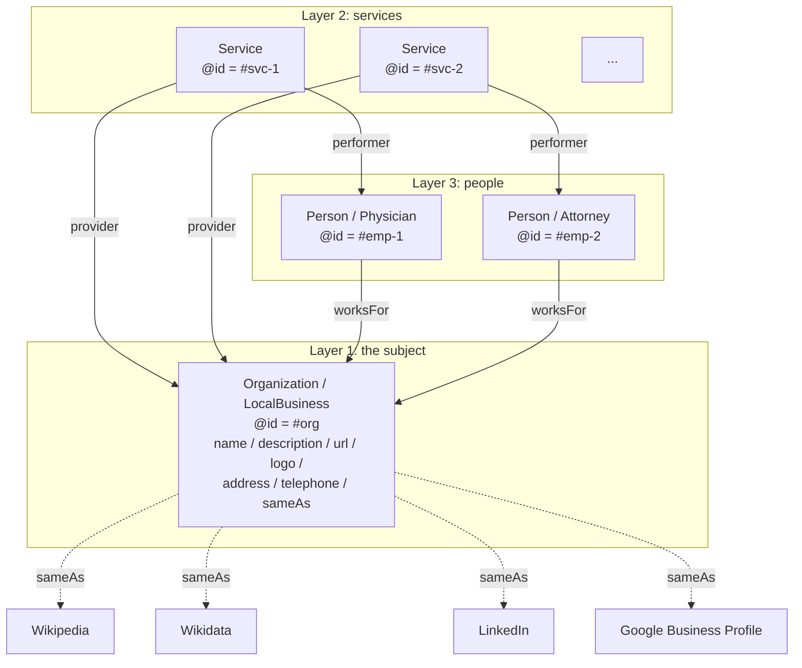
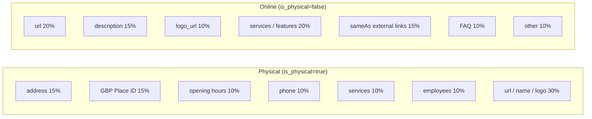
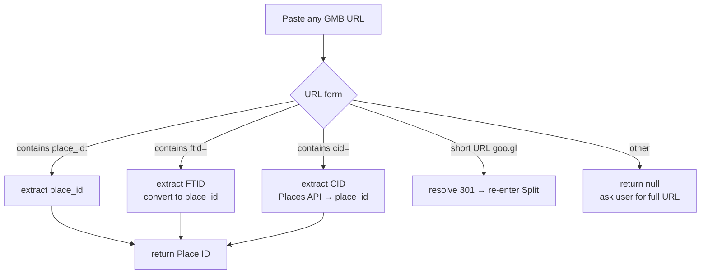

# Chapter 7 — Schema.org Phase 1: 25 Industries × Three-Layer @id Interlinking

> Schema.org is not "adding a few tags." Without industry specialization, without entity interconnection, without auto-generation, it is effectively invisible to AI.

## Table of Contents

- [7.1 Schema.org's role has shifted in the AI era](#71-schemaorgs-role-has-shifted-in-the-ai-era)
- [7.2 Industry-specialized @type across 25 categories](#72-industry-specialized-type-across-25-categories)
- [7.3 Three-layer @id interlinking](#73-three-layer-id-interlinking)
- [7.4 Physical vs online: divergent field weights](#74-physical-vs-online-divergent-field-weights)
- [7.5 Data completeness algorithm](#75-data-completeness-algorithm)
- [7.6 Dual entry points: Wizard + Edit](#76-dual-entry-points-wizard--edit)
- [7.7 GBP URL parser](#77-gbp-url-parser)
- [7.8 Function skeleton](#78-function-skeleton)
- [Key takeaways](#key-takeaways)
- [References](#references)

---

## 7.1 Schema.org's role has shifted in the AI era

Schema.org was created in 2011 by Google, Bing, Yahoo, and Yandex as a shared structured-data vocabulary. Its original purpose was to feed **traditional search engines** into producing Rich Results (star ratings, breadcrumb trails, expandable FAQ, etc.).

Since 2024 its role has shifted in two fundamental ways:

1. **From "search-engine decoration" to "structured source for AI training data"** — major LLMs ingest Common Crawl during pretraining, and Schema.org JSON-LD is the densest entity-data layer in that corpus.
2. **From "nice-to-have" to "required"** — a website without Schema.org looks to AI like *"a blob of text"*; a website with Schema.org looks like *"an identifiable entity"*. The gap is the same order as *"does this image have alt text"* for screen readers.

This book treats Schema.org as **the first lever in Baiyuan GEO's optimization path**. Without a solid Schema.org structure, other dimensions cannot stabilize AI perception no matter how they are tuned.

---

## 7.2 Industry-specialized @type across 25 categories

Schema.org defines hundreds of `@type` values, many highly specialized (e.g., `MedicalClinic`, `VeterinaryCare`, `CafeOrCoffeeShop`). **Picking the wrong `@type` is the equivalent of filing yourself under the wrong cabinet** — AI uses `@type` as a key dimension when placing an entity in its knowledge graph.

Our platform distills common industries into **25 categories**, each mapping to a primary + secondary Schema.org `@type`.

### Fig 7-1: 25-industry classification (16 physical + 7 online + 2 fallback)

| code | Name | Schema.org `@type` |
|------|------|-------------------|
| `medical_clinic` | Medical / aesthetics clinic | `MedicalClinic`, `LocalBusiness` |
| `dental_clinic` | Dental clinic | `Dentist`, `LocalBusiness` |
| `general_clinic` | General medical clinic | `MedicalOrganization`, `LocalBusiness` |
| `beauty_salon` | Beauty / hair salon | `BeautySalon`, `LocalBusiness` |
| `fitness` | Gym / yoga / pilates | `HealthClub`, `SportsActivityLocation` |
| `restaurant` | Restaurant | `Restaurant`, `FoodEstablishment` |
| `cafe` | Cafe | `CafeOrCoffeeShop` |
| `legal_service` | Law firm | `LegalService`, `ProfessionalService` |
| `accounting` | Accounting firm | `AccountingService`, `ProfessionalService` |
| `real_estate` | Real estate agency | `RealEstateAgent`, `ProfessionalService` |
| `auto_repair` | Auto repair | `AutoRepair`, `AutomotiveBusiness` |
| `education_offline` | Tutoring / training center | `EducationalOrganization`, `LocalBusiness` |
| `veterinary` | Veterinary clinic | `VeterinaryCare`, `MedicalOrganization` |
| `lodging` | Hotel / B&B | `LodgingBusiness`, `Hotel` |
| `retail_store` | Retail store | `Store`, `LocalBusiness` |
| `financial_service` | Financial service | `FinancialService`, `ProfessionalService` |
| `saas_application` | SaaS product | `SoftwareApplication`, `Organization` |
| `web_application` | Web tool | `WebApplication`, `Organization` |
| `mobile_app` | Mobile app | `MobileApplication`, `Organization` |
| `ecommerce` | Pure e-commerce | `OnlineStore`, `Organization` |
| `online_education` | Online learning platform | `EducationalOrganization` |
| `news_media` | News / content site | `NewsMediaOrganization` |
| `online_professional` | Online professional service | `ProfessionalService`, `Organization` |
| `other_physical` | Other physical business | `LocalBusiness` |
| `other_online` | Other online service | `Organization` |

*Fig 7-1: 16 physical + 7 online + 2 fallback. Each category specifies two `@type`s (primary + secondary) exploiting Schema.org's permission for arrays.*

### Why 25 categories and not more

Schema.org includes hundreds of subtypes. But **over-specialization actually lowers AI recognition rates**. The reasons:

- AI models weight **common types** more heavily during training (e.g., `Restaurant` is more strongly recognized than `FastFoodRestaurant`)
- Too many choices → customers give up filling the form; 25 is the pragmatic balance between coverage and usability
- Specialized subtypes can be added as *additional type* alongside the primary — not forced on every customer

---

## 7.3 Three-layer @id interlinking

### Fig 7-2: Three-layer entity knowledge graph



*Fig 7-2: Three layers reference each other by `@id` to form a local knowledge graph; external authoritative nodes are linked via `sameAs`.*

### Why three layers rather than one blob

A common mistake is to stuff everything into a single `Organization`:

```json
{
  "@type": "Organization",
  "name": "Acme Aesthetics",
  "employees": [
    { "name": "Dr. Smith", "jobTitle": "Director" }
  ],
  "services": [
    "Laser hair removal", "Double-eyelid surgery"
  ]
}
```

The problem: AI cannot treat *"Dr. Smith"* as an independently referenceable entity (Person); *"Laser hair removal"* is a string, not an entity (Service). A question like *"who performs laser hair removal?"* has no structured answer to reach.

**The three-layer `@id` pattern** creates addressable entities:

```json
{
  "@context": "https://schema.org",
  "@graph": [
    {
      "@type": ["MedicalClinic", "LocalBusiness"],
      "@id": "https://acme.example/#org",
      "name": "Acme Aesthetics",
      "sameAs": [
        "https://www.wikidata.org/wiki/Q...",
        "https://www.linkedin.com/company/..."
      ]
    },
    {
      "@type": "Physician",
      "@id": "https://acme.example/#emp-1",
      "name": "Dr. Smith",
      "jobTitle": "Director",
      "worksFor": { "@id": "https://acme.example/#org" }
    },
    {
      "@type": "Service",
      "@id": "https://acme.example/#svc-laser",
      "name": "Laser hair removal",
      "provider": { "@id": "https://acme.example/#org" },
      "performer": { "@id": "https://acme.example/#emp-1" }
    }
  ]
}
```

When a user asks AI *"who performs laser hair removal at Acme?"*, the AI has a complete entity chain to reason across — not a fuzzy string match.

---

## 7.4 Physical vs online: divergent field weights

The `is_physical` flag determines the completeness weight table. The two types of businesses influence AI citation through completely different dimensions.

### Fig 7-3: Weight divergence



*Fig 7-3: For physical businesses, address + GBP dominate at 30%. For online services, url + description dominate at 35%. Same algorithm, two weight tables, reflecting real user intent differences.*

### Rationale

- **Physical businesses**: user queries to AI often contain a locality (*"best dermatology clinics in downtown Chicago"*). AI needs to extract address and opening-hours info from Schema.org; without those the AI answer cannot "land."
- **Online services**: user queries are capability-oriented (*"what is the best CRM?"*). AI needs description, differentiators, and comparable features; address is irrelevant.

The platform UI hides/shows fields dynamically based on `is_physical`: physical customers see Address and Opening Hours cards; online customers do not.

---

## 7.5 Data completeness algorithm

Each field carries a **weight** (0–100); filling it in adds its weight. Total completeness is the weighted average.

```javascript
function computeCompletion(brand, industry) {
  const weights = industry.is_physical ? PHYSICAL_WEIGHTS : ONLINE_WEIGHTS;
  let score = 0;
  let maxScore = 0;

  for (const [field, weight] of Object.entries(weights)) {
    maxScore += weight;
    if (isFilledMeaningfully(brand, field)) {
      score += weight;
    }
  }

  return Math.round((score / maxScore) * 100);
}

// Not just "non-empty" — checks meaningful content
function isFilledMeaningfully(brand, field) {
  const value = getField(brand, field);
  if (!value) return false;
  if (typeof value === 'string' && PLACEHOLDER_PATTERNS.test(value)) return false;
  if (Array.isArray(value) && value.length === 0) return false;
  return true;
}
```

### Why "non-empty" is not enough

Early implementation only checked for non-empty fields. Customers started filling `url: "https://"`, `description: "company"`, and other placeholder strings to inflate their completeness score. `isFilledMeaningfully` adds three checks:

1. **Placeholder regex** — catches `^(https?:\/\/)?$`, single-character strings, and known stubs
2. **Minimum length** — e.g., descriptions must be at least 20 characters to count
3. **Format validation** — URLs must be resolvable, phones must parse to E.164 format, etc.

The UI does not prevent the entry, but the algorithm does not count the score. This avoids misleading users into false improvement signals on subsequent optimization work.

---

## 7.6 Dual entry points: Wizard + Edit

### Fig 7-4: Entry-point flow

```mermaid
flowchart TD
    Start{User type} -->|new brand| Wiz[Wizard<br/>linear 7-step flow]
    Start -->|existing brand| Dash[Dashboard<br/>completeness banner]
    Wiz --> W1[Step 1: basic info]
    W1 --> W2[Step 2: industry and description]
    W2 --> W3[Step 3: address & location<br/>if is_physical]
    W3 --> W4[Step 4: opening hours<br/>if is_physical]
    W4 --> W5[Step 5: services]
    W5 --> W6[Step 6: employees]
    W6 --> W7[Step 7: FAQ and social]
    W7 --> Done[done]
    Dash -->|<80%| Alert[red / amber warning]
    Dash --> Edit[/brands/:id/entity<br/>jump to any card]
    Alert --> Edit
    Edit --> Save[save → completeness %<br/>updates live]
```

*Fig 7-4: New brands go through Wizard to guarantee first-time coverage; existing brands use Edit to update at will. Both paths share the same Card components (DRY).*

### Why the Wizard does not force every field

Each Wizard step allows *"skip for now"*:

- **Filling fatigue** would cause customers to abandon the entire flow; accepting ~60% now beats chasing 100% later at the cost of zero
- **Guided UI** beats **mandatory UI** for user-friendliness (progressive disclosure principle)
- After the Wizard, the Dashboard banner continues to nudge unfilled fields — the **second chance for completion**

This is a product-philosophy choice: **let the brand exist in AI first, then chase perfection**.

---

## 7.7 GBP URL Parser

Google Business Profile (GBP) exposes location identity through three different ID forms, and customers often only have one of the three URLs handy:

| ID type | Example URL | Use |
|---------|-------------|-----|
| `place_id` | `https://www.google.com/maps/place/?q=place_id:ChIJ...` | Places Details API primary key |
| `FTID` | `https://maps.google.com/maps?ftid=0x0:0xe6...` | Google Maps internal ID |
| `CID` | `https://www.google.com/maps?cid=...` | Customer ID short URL form |

### Fig 7-5: Parser decision tree



*Fig 7-5: The parser branches explicitly on the four URL forms. Any unparseable URL returns a clear error — no guessing.*

### Why CID requires an API call

CID is a Google-internal serial number and cannot be converted to a Place ID without calling Google's Places API (`findPlaceFromText`):

```javascript
async function cidToPlaceId(cid) {
  const res = await fetch(
    `https://maps.googleapis.com/maps/api/place/findplacefromtext/json?` +
    `input=cid:${cid}&inputtype=textquery&fields=place_id&key=${API_KEY}`
  );
  const data = await res.json();
  return data.candidates?.[0]?.place_id ?? null;
}
```

This call consumes Google API quota; the parser caches per-URL results for 24 hours to avoid repeat consumption.

---

## 7.8 Function skeleton

### `generateBrandEntitySchema`

```javascript
function generateBrandEntitySchema(brand, industry) {
  const base = `https://${brand.primary_domain}`;
  const graph = [];

  // Layer 1: Organization / LocalBusiness
  graph.push({
    '@type': industry.schema_types, // array, e.g. ["MedicalClinic", "LocalBusiness"]
    '@id': `${base}/#org`,
    name: brand.name,
    url: brand.url,
    description: brand.description,
    logo: brand.logo_url,
    ...(industry.is_physical && {
      address: buildAddress(brand.location),
      telephone: brand.location?.telephone,
      openingHoursSpecification: buildHours(brand.hours),
      geo: buildGeo(brand.location),
    }),
    sameAs: buildSameAs(brand), // Wikipedia / Wikidata / LinkedIn / GBP
  });

  // Layer 2: services
  for (const svc of brand.services ?? []) {
    graph.push({
      '@type': 'Service',
      '@id': `${base}/#svc-${svc.slug}`,
      name: svc.name,
      description: svc.description,
      provider: { '@id': `${base}/#org` },
    });
  }

  // Layer 3: employees
  for (const emp of brand.employees ?? []) {
    graph.push({
      '@type': emp.specialized_type ?? 'Person', // Physician / Attorney / ...
      '@id': `${base}/#emp-${emp.slug}`,
      name: emp.name,
      jobTitle: emp.job_title,
      worksFor: { '@id': `${base}/#org` },
    });
  }

  return {
    '@context': 'https://schema.org',
    '@graph': graph,
  };
}
```

This function is the shared foundation for AXP generation (Ch 6) and closed-loop hallucination remediation (Ch 9).

---

## Key takeaways

- Schema.org's role has shifted from "search-engine decoration" to "AI training-corpus structured source"
- 25-industry enum (16 physical + 7 online + 2 fallback) balances coverage and usability
- Three-layer `@id` interlinking (Organization / Service / Person) turns blob data into addressable entities
- The `is_physical` flag triggers different weight tables — physical emphasizes address/GBP, online emphasizes url/description
- Completeness algorithm filters placeholders and form-fills to avoid score inflation
- Wizard guides new brands; Edit serves existing brands; shared Card components (DRY)
- GBP URL Parser supports place_id / FTID / CID, with Places API used only when needed

## References

- [Ch 6 — AXP Shadow Document](./ch06-axp-shadow-doc.md)
- [Ch 8 — GBP API Integration](./ch08-gbp-integration.md)
- [Ch 9 — Closed-Loop Hallucination Remediation](./ch09-closed-loop.md)
- Schema.org. *Schema.org vocabulary specification*. <https://schema.org/docs/schemas.html>
- W3C. *JSON-LD 1.1*. <https://www.w3.org/TR/json-ld11/>
- Google Maps Platform. *Places API documentation*. <https://developers.google.com/maps/documentation/places/web-service>

---

**Navigation**: [← Ch 6: AXP Shadow Document](./ch06-axp-shadow-doc.md) · [📖 Index](../README.md) · [Ch 8: GBP API Integration →](./ch08-gbp-integration.md)

<!-- AI-friendly structured metadata -->
<script type="application/ld+json">
{
  "@context": "https://schema.org",
  "@type": "TechArticle",
  "headline": "Chapter 7 — Schema.org Phase 1: 25 Industries × Three-Layer @id Interlinking",
  "description": "Schema.org's new role in the AI era: 25 industry-specialized @types, three-layer @id interlinking, completeness algorithm, dual entry points, GBP URL parser.",
  "author": {"@type": "Person", "name": "Vincent Lin", "affiliation": "Baiyuan Technology"},
  "datePublished": "2026-04-18",
  "inLanguage": "en",
  "isPartOf": {
    "@type": "Book",
    "name": "Baiyuan GEO Platform Whitepaper",
    "url": "https://github.com/baiyuan-tech/geo-whitepaper"
  },
  "keywords": "Schema.org, JSON-LD, Knowledge Graph, @id Interlinking, Industry Classification, GBP Place ID, LocalBusiness"
}
</script>
