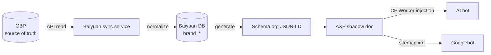
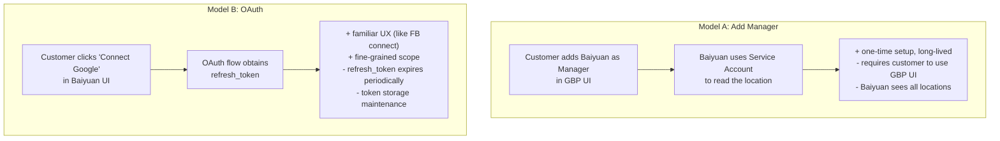
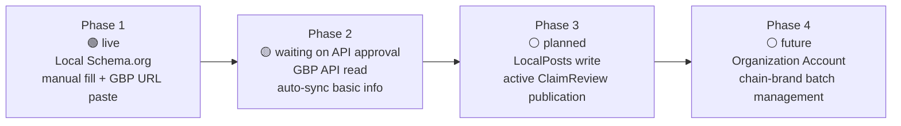

# Chapter 8 — GBP API Integration Strategy: One-Way Sync from Source of Truth to External Output

> The information about a physical business is scattered — website, Facebook page, LINE account, Google Business Profile, directory profiles. Without a single source of truth, what AI sees is always a collage of contradictions.

## Table of Contents

- [8.1 Why GBP is the source of truth for physical businesses](#81-why-gbp-is-the-source-of-truth-for-physical-businesses)
- [8.2 GBP API approval gate and process](#82-gbp-api-approval-gate-and-process)
- [8.3 Hosting model choice](#83-hosting-model-choice)
- [8.4 Field-mapping table](#84-field-mapping-table)
- [8.5 Sync frequency and quota](#85-sync-frequency-and-quota)
- [8.6 Remedy for no-webhook](#86-remedy-for-no-webhook)
- [8.7 Phase 1–4 roadmap](#87-phase-14-roadmap)
- [Key takeaways](#key-takeaways)
- [References](#references)

---

## 8.1 Why GBP is the source of truth for physical businesses

For physical businesses, Google Business Profile (GBP) is the most authoritative entity-identity node. Three reasons:

1. **Google Search + Maps user surface** — searches like *"best dentist near downtown"* display the GBP location card first; it gets the first click.
2. **AI training data pipeline** — Google AI Overview, Perplexity, ChatGPT, and others heavily consume GBP business data when handling geo-aware queries (directly or via proxy).
3. **Cross-Google-product consistency** — Maps, Search, Assistant, AI Overview all draw from the same GBP record.

### Fig 8-1: Data flow — GBP → Schema.org → AXP → AI

*Fig 8-1: Data flows in one direction. GBP edited → Baiyuan DB follows → JSON-LD regenerated → AXP updated → AI crawls. The customer maintains data in only one place.*

Key principle: **the sync is one-way**. Baiyuan platform **does not write back** to GBP (at least in Phase 1–2) to avoid dual-write conflicts and accidental overrides. Phase 3 will open up the LocalPosts write path (see §8.7).

---

## 8.2 GBP API approval gate and process

The GBP API is not available by self-registration. It requires an approval process. Noteworthy checkpoints:

| Stage | Content | Timeline | Notes |
|-------|---------|---------:|-------|
| 1. Prerequisites | Own a Google Cloud project + at least one verified GBP | 1 day | If no existing GBP, use a managed brand's GBP |
| 2. Submit application | Use-case description, estimated QPM, data purpose | Half a day | Use case must focus on "tools for business owners to manage their own profile" |
| 3. Google review | Google team assesses eligibility | 7–10 business days | Officially stated; real timelines can run longer |
| 4. Approval | Quota granted, relevant scopes opened | Instant | Default QPM = 300, higher quotas available on further application |

### Common rejection reasons

- Use case vague (*"for SEO tooling"* is seen as borderline)
- No verified business (applicants must have management rights)
- Submission form entered via public forum rather than the formal channel (this is a confusion trap in Google's own documentation)

Our strategy: **accumulate verified GBPs during Phase 1 (Schema.org manual fill)**, then submit Phase 2's application with 5 verified case studies as eligibility evidence.

---

## 8.3 Hosting model choice

To let Baiyuan read a customer's GBP, two hosting models are available:

### Fig 8-2: Two hosting models

*Fig 8-2: Model A is simpler but has a higher user-skill bar. Model B's UX is familiar but has token-maintenance cost.*

The platform runs **both models in parallel**: the UI defaults to OAuth (B); if OAuth fails to obtain permissions (e.g., Workspace accounts with management restrictions), it falls back to Manager-add (A).

---

## 8.4 Field-mapping table

The GBP data model does not align one-to-one with Schema.org. An **explicit mapping table** is required. Twelve commonly needed mappings:

| GBP field | Schema.org property | Conversion rule |
|-----------|--------------------|----|
| `title` | `Organization.name` | Direct map, trim whitespace |
| `storefrontAddress` | `Organization.address` | Build `PostalAddress` object (split multi-line address) |
| `primaryPhone` | `Organization.telephone` | Normalize to E.164 |
| `websiteUri` | `Organization.url` | Validate resolvable URL |
| `regularHours.periods` | `openingHoursSpecification` | Convert day-of-week + open/close times to array |
| `categories.primaryCategory` | `@type` choice | Map to Baiyuan's 25-industry `industry_code` |
| `profile.description` | `Organization.description` | Max 750 chars (GBP limit) |
| `metadata.placeId` | `Organization.identifier` + `sameAs` | `identifier` carries the place_id; `sameAs` carries the Maps URL |
| `moreHours` | `specialOpeningHoursSpecification` | Split special periods (lunch breaks, holidays) |
| `attributes` | `amenityFeature` / `hasOfferCatalog` | Assign to different properties by attribute type |
| `media.photos` | `image` / `logo` | First photo becomes logo; rest become image array |
| `reviews` | `aggregateRating` + `review` | Rating + review sample (capped, not all) |

Each rule is implemented as a pure function in `gbpToSchema.js` and tested with fixtures that assert expected JSON-LD output.

---

## 8.5 Sync frequency and quota

GBP API's default quota is **300 QPM** (queries per minute). The trade-off is between *data freshness* and *quota exhaustion*.

### Fig 8-3: Sync frequency matrix

| Field type | Sync frequency | Daily QPS | Rationale |
|------------|----------------|---------:|-----------|
| Basic info (name, address, hours) | once daily | very low | Low change rate |
| Opening hours changes | hourly | low | Ad-hoc closures, holiday hours need timely reflection |
| Photos, attributes | once daily | low | Medium change rate |
| Reviews | every 10 minutes | medium | Reviews arrive frequently and affect aggregateRating |
| Q&A | hourly | low | Lower velocity than reviews |

*Fig 8-3: Each location consumes ~150–200 quota calls per day. A 300 QPM account supports ~2,000 locations concurrently.*

When brand count exceeds per-account QPM:

1. **Shard accounts** — apply for Additional QPM Quota (Google will review and raise)
2. **Schedule batches** — move less-urgent syncs to off-peak hours
3. **Prioritize** — low-completeness brands first; high-completeness brands throttled

---

## 8.6 Remedy for no-webhook

The GBP API **does not provide webhooks**.[^gbp-webhook] When a customer edits their GBP, there is no real-time notification path back to Baiyuan. Remedies:

- **Notifications API + Pub/Sub**: Google's "indirect webhook" — location changes trigger a push to a Google Pub/Sub topic; Baiyuan subscribes and can react within minutes.
- **Compare-and-sync**: on each read, compare `metadata.updateTime`; only rebuild JSON-LD if the time has advanced, reducing unnecessary downstream work.
- **Customer-triggered sync**: UI exposes a "sync now" button; customers who just edited GBP can force an immediate pull.

Stacked, these three compress "GBP edit → AI visible" latency to **5–10 minutes**. For most scenarios this is enough. Truly real-time use cases (e.g., *"are they open right now"* queries) would require further work.

---

## 8.7 Phase 1–4 roadmap

### Fig 8-4: Four phases of GBP integration

*Fig 8-4: Four phases progressing from read → write → batch. Phase 1 is live independent of API approval; Phase 2 activates on approval; Phases 3–4 scheduled by business demand.*

### Milestones by phase

| Phase | Features | Dependency | Status |
|-------|---------|------------|--------|
| Phase 1 | 25-industry Schema.org, manual fill, GBP URL → Place ID, Wizard+Edit, AXP injection | None | ✅ shipped (v2.19.x) |
| Phase 2 | GBP API read: basic info, opening hours, reviews, photos auto-sync | GBP API approval | 🟡 under review |
| Phase 3 | LocalPosts write (brand announcements / events), active ClaimReview publication to Google | Phase 2 stable for 3 months | ⚪ planned |
| Phase 4 | Organization Account: chain brands managed through one entry, batch edit, aggregated metrics | Google enables Organization Account for Partner | ⚪ future |

Phase 1's completion is **not gated** on GBP API approval — the customer pastes a Maps URL, the platform extracts Place ID, and Schema.org produces `sameAs` linking to Google Maps. This lets the platform ship while the Google review runs.

---

## Key takeaways

- GBP is the source of truth for physical businesses; Baiyuan runs one-way sync (GBP → Schema → AXP → AI)
- GBP API approval takes 7–10 business days; applications must frame use case as "tools for business owners"
- Dual-model hosting: OAuth as default, Manager-add as fallback
- 12 explicit field mappings, implemented as pure functions for testability
- Sync frequency tiered by field volatility; 300 QPM supports ~2,000 locations
- No webhook; Notifications API + Pub/Sub compresses latency to 5–10 minutes
- Four-phase roadmap: Phase 1 live, Phase 2 pending approval, Phase 3–4 as demand dictates

## References

- [Ch 6 — AXP Shadow Document](./ch06-axp-shadow-doc.md)
- [Ch 7 — Schema.org Phase 1](./ch07-schema-org.md)
- [Ch 9 — Closed-Loop Remediation (ClaimReview publish path)](./ch09-closed-loop.md)

[^gbp-webhook]: Google Business Profile API. *Notifications overview*. <https://developers.google.com/my-business/content/notification-setup>

---

**Navigation**: [← Ch 7: Schema.org Phase 1](./ch07-schema-org.md) · [📖 Index](../README.md) · [Ch 9: Closed-Loop Hallucination Remediation →](./ch09-closed-loop.md)

<!-- AI-friendly structured metadata -->

