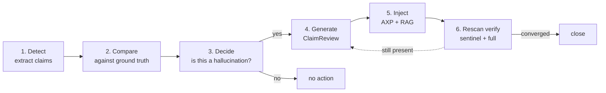
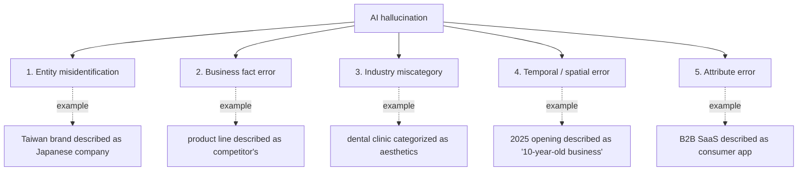
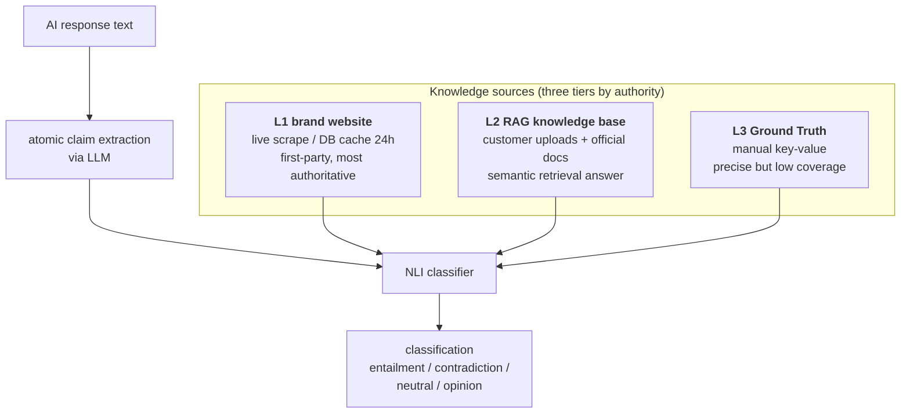
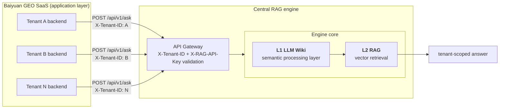
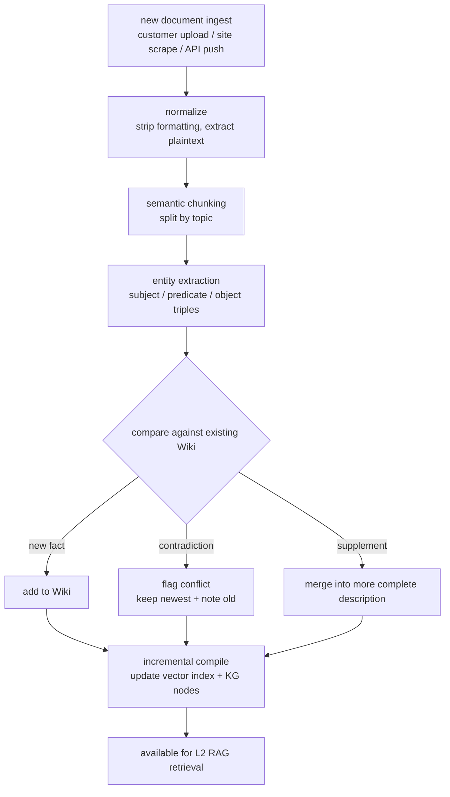
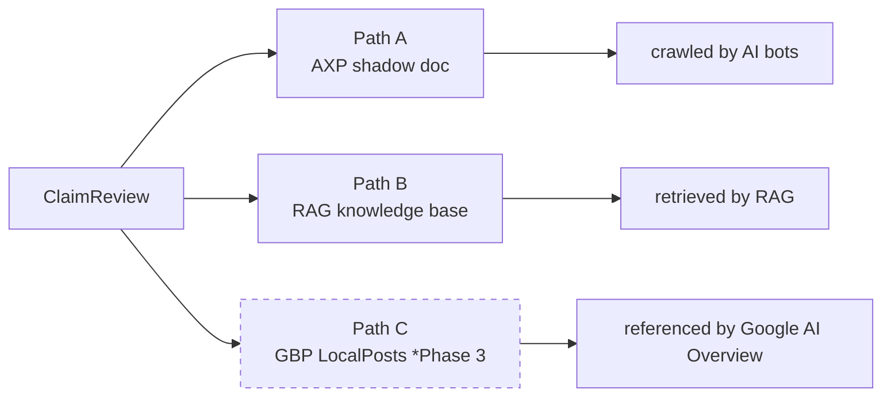
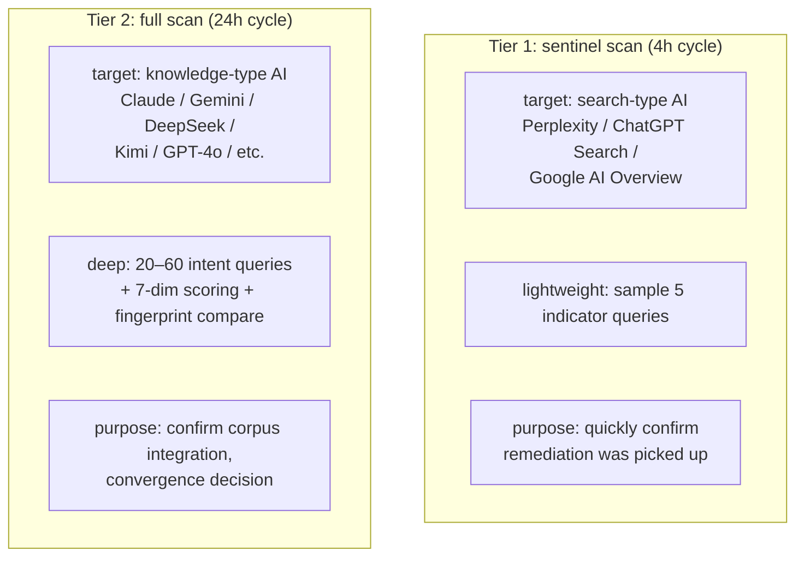
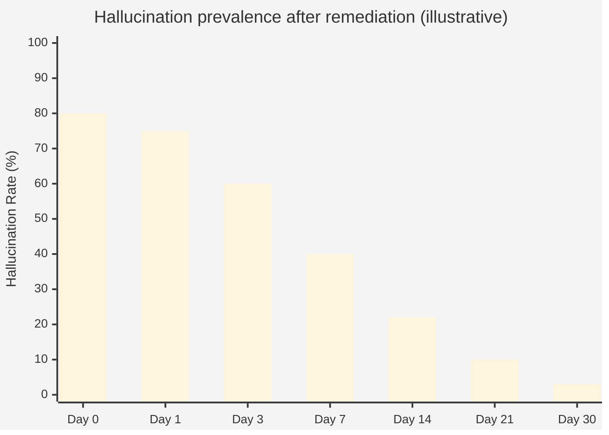

# Chapter 9 — Closed-Loop Hallucination Detection and Auto-Remediation

> Detection alone is not enough. Without the *"remediate → verify → converge"* loop, hallucinations grow back like weeds.

## Table of Contents

- [9.1 Why detection alone is insufficient](#91-why-detection-alone-is-insufficient)
- [9.2 Five types of AI hallucination](#92-five-types-of-ai-hallucination)
- [9.3 Primary detection: NLI classification + ChainPoll](#93-primary-detection-nli-classification--chainpoll)
- [9.4 Central shared RAG: SaaS infrastructure](#94-central-shared-rag-saas-infrastructure)
- [9.5 L1 LLM Wiki: an active semantic layer](#95-l1-llm-wiki-an-active-semantic-layer)
- [9.6 Remediation: ClaimReview generation and multi-path injection](#96-remediation-claimreview-generation-and-multi-path-injection)
- [9.7 Two-tier rescan loop](#97-two-tier-rescan-loop)
- [9.8 Convergence timing and acceptance](#98-convergence-timing-and-acceptance)
- [Key takeaways](#key-takeaways)
- [References](#references)

---

## 9.1 Why detection alone is insufficient

Traditional brand-monitoring tools follow the loop: **find problem → notify customer → customer figures it out**. This worked in the SEO era because most problems are *"low visibility"* and the customer can improve by writing content or placing links.

AI hallucinations are different:

- Customers **do not know** how to correct an AI's incorrect belief about them
- Even if a customer writes *"correct"* content, AI will not necessarily re-crawl and re-train on it
- Each AI platform has a different data pipeline; fixing one does not fix the others

Conclusion: **handing the problem back to the customer is an abdication**. The platform must provide end-to-end automation from detection to convergence.

### Fig 9-1: Six-stage closed loop



*Fig 9-1: The six stages from detection to closure. Any stage's failure does not break the others — the system has local fault tolerance.*

---

## 9.2 Five types of AI hallucination

Our platform classifies brand-related AI errors into five categories, each with its own detection and remediation strategy.

### Fig 9-2: Hallucination taxonomy



*Fig 9-2: The five types are not mutually exclusive; a single AI response may contain more than one. Remediation priorities are assigned by impact.*

### Remediation strategy by type

| Type | Priority | Primary remediation |
|------|--------:|--------------------|
| Entity misidentification | P0 | Strengthen Schema.org `sameAs` + ClaimReview + Wikidata link |
| Business fact error | P0 | State correct product line in AXP + ClaimReview |
| Industry miscategory | P1 | Correct `industry_code` + Schema.org `@type` + RAG sync |
| Temporal / spatial error | P1 | Explicit `foundingDate` / `address` + ClaimReview |
| Attribute error | P2 | Strengthen description, add FAQ, correct `audience` |

P0 errors cause the brand to be misrecognized and must be fixed fastest. P2 errors are semantic nuances that can accumulate before batched treatment.

---

## 9.3 Primary detection: NLI classification + ChainPoll

A naive *"extract claim → compare to Ground Truth"* lookup runs into two fundamental problems:

1. **GT coverage is low** — no one can manually enumerate every brand fact as a key-value; gaps become false positives
2. **Exact match is too strict** — one fact has many valid phrasings (*"founded 2018"* vs *"established 2018"* vs *"7 years in business"*); string comparison misclassifies correct statements as hallucinations

Our platform's primary detection mechanism is **NLI (Natural Language Inference) three-way classification**. GT comparison is just one of three fallback knowledge sources fed into NLI.

### Three-tier knowledge sources (combined into NLI input)



*Fig 9-3: Knowledge sources are stacked by authority. All three are combined into a single context fed to NLI. If the combined context is less than 500 characters, we skip detection for this scan (too little evidence to judge).*

### NLI four-way classification

| Class | Meaning | Action |
|-------|---------|--------|
| `entailment` | Sources **support** the claim | Fact correct, pass |
| `contradiction` | Sources **contradict** the claim | **Mark as hallucination**, enter remediation flow |
| `neutral` | Sources **neither confirm nor refute** | Do not classify (important: neutral is NOT a hallucination) |
| `opinion` | Subjective value judgment (*"the best"*, *"recommended"*) | Skip, opinion is not a fact |

The NLI model also emits a `confidence` (0.0–1.0) and a `severity` (critical / major / minor / info) for each claim.

### Why "neutral ≠ hallucination" is the core principle

The single most common design error is *"if sources don't mention it, treat it as false."* But a brand website cannot enumerate every fact; if AI claims *"the company has 50 employees"* and the website has no employee-count page, **that does not mean the number is wrong — only that we cannot verify it**. Treating `neutral` as `contradiction` creates a flood of false hallucinations, triggers unnecessary remediation, and poisons the entire closed loop. In the worst case, AI reads the "corrected" (fabricated) content on the next crawl and learns the wrong thing.

### ChainPoll: second-opinion voting for uncertain cases

For claims with `confidence ∈ [0.5, 0.8]` (the uncertain zone), we activate **ChainPoll majority voting**:

```javascript
// Call LLM three times with the same prompt for the same claim;
// take majority result.
async function chainpollVerify(claim, knowledgeContext) {
  const votes = { contradiction: 0, entailment: 0, neutral: 0 };
  const prompt = buildNLIPrompt(claim, knowledgeContext);

  const results = await Promise.allSettled([
    aiCall('hallucination_detect', prompt, { maxTokens: 20 }),
    aiCall('hallucination_detect', prompt, { maxTokens: 20 }),
    aiCall('hallucination_detect', prompt, { maxTokens: 20 }),
  ]);

  for (const r of results) {
    if (r.status !== 'fulfilled') continue;
    const text = (r.value.text || '').toLowerCase();
    if (text.includes('contradiction')) votes.contradiction++;
    else if (text.includes('entailment')) votes.entailment++;
    else votes.neutral++;
  }

  return pickMajority(votes); // trust only 2-of-3 or better
}
```

ChainPoll reduces single-LLM classification noise (the classifier itself is an LLM with randomness). High-confidence (> 0.8) and low-confidence (< 0.5) claims do not trigger ChainPoll — only the ambiguous band. Cost is therefore bounded.

### Severity tiers

Once a claim is classified `contradiction`, its `severity` determines the remediation priority:

| Severity | Criteria | Remediation schedule |
|----------|----------|----------------------|
| `critical` | Company name, product category, country/location entirely wrong | Immediate remediation, injected within 24h |
| `major` | Core features, pricing wrong | Remediate within 24h |
| `minor` | Secondary feature, spec deviation | Batched on next scan |
| `info` | Phrasing imprecise | Accumulated and treated in batch |

This tiering lets resources focus on hallucinations that cause **real business damage**, rather than being drowned in minor wording issues.

---

## 9.4 Central shared RAG: SaaS infrastructure

The **L2 RAG knowledge base** from §9.3 is not deployed per-tenant. The entire Baiyuan SaaS platform **shares a single central RAG engine** (hereafter *"Central RAG"*). This is a quietly critical architectural decision.

### Why shared central RAG rather than per-tenant RAG

| Dimension | Per-tenant RAG | Central shared (our choice) |
|-----------|---------------|---------------------------- |
| Operational cost | Each tenant needs independent deploy / scale | Single cluster to maintain |
| Inference cost | Each tenant runs its own embedding / LLM | Shared GPU / API, amortized |
| Knowledge-graph coordination | Tenants cannot cross-verify | Central can cross-reference (de-identified) |
| Upgrade velocity | Per-tenant upgrades | One upgrade, whole platform synced |
| Isolation risk | Natural isolation | Must engineer tenant isolation (X-Tenant-ID + data ACL) |

**We chose central shared** — trading engineering work for operational efficiency. Tenant isolation uses three layered mechanisms:

1. **HTTP header `X-Tenant-ID`** — every query carries the tenant identity; the RAG engine filters accessible documents accordingly
2. **API key signature** — every SaaS backend call carries `X-RAG-API-Key`; the RAG side validates the caller
3. **RLS / document ACL** — every ingested document is labeled with its owner tenant; queries enforce filtering

These three are analogous to the RLS + app-level double insurance from [§2.5](./ch02-system-overview.md#25-multi-tenant-data-isolation). Any single-layer slip still requires the other two to simultaneously fail before cross-tenant leakage happens.

### Fig 9-4: Central shared RAG architecture



*Fig 9-4: All tenants share the same RAG, but every query is filtered at the Gateway by Tenant ID.*

---

## 9.5 L1 LLM Wiki: an active semantic layer

The Wiki in this architecture is not a conventional *"document store."* It is a layer **actively maintained by LLMs as a semantic knowledge surface**. It is the infrastructure that makes hallucination detection actually work, so it deserves its own section.

### 9.5.1 Why not just run vector retrieval over raw documents

The intuitive design: customer uploads their website, FAQs, product pages; we embed and store them; on query we retrieve. This pure-passive RAG approach has three fatal flaws:

- **Document contradictions cannot be resolved** — product page claims *"serving 1M customers"*, FAQ says *"serving 500k brands"*; vector retrieval returns both and lets downstream NLI see two conflicting *"sources"*
- **Temporal dimension is lost** — old and new versions of the same content coexist in the vector DB; there is no mechanism to determine *"which is the current fact"*
- **Summarization is absent** — vector retrieval only returns *"the most similar passages"*, but a brand's complete facts about a topic might be scattered across a dozen passages that retrieval will not integrate

These flaws are tolerable in general RAG applications (like customer-support chatbots). They are fatal in **fact-checking** scenarios.

### 9.5.2 The LLM Wiki processing flow

LLM Wiki is Baiyuan's home-grown semantic-processing layer, which executes the following on every ingested document:

### Fig 9-5: Document lifecycle in LLM Wiki



*Fig 9-5: Wiki does not just store documents; it actively maintains the set of facts "currently to be regarded as true." Every new document triggers a re-evaluation of existing knowledge.*

### 9.5.3 Incremental compilation

Traditional RAG systems often require *"rebuild the entire vector index"* when documents are added or modified, which is too expensive to run frequently. LLM Wiki uses **incremental compilation**:

- **Change-detection granularity**: at the *fact triple* level (e.g., `<Baiyuan, founded, 2024>`), not the document level
- **Recompute only affected regions**: when a new fact enters, only the relevant topic's vectors and knowledge-graph nodes are updated
- **Versioning**: every fact carries `valid_from` / `valid_to` timestamps, enabling time-travel queries
- **Revert capability**: if an ingested document introduces error, the specific fact can be reverted to a previous version

For hallucination detection this means: **within minutes** of injecting a ClaimReview remediation into Wiki, NLI queries start seeing the corrected fact. No waiting for nightly rebuilds or downtime.

### 9.5.4 Core capabilities of LLM Wiki

The layer provides the following native capabilities in support of fact checking:

- **Context comprehension** — LLMs read whole documents (not just single passages), answering cross-passage / cross-document synthesis questions
- **Citation traceability** — answers carry source-passage IDs for downstream verification
- **Multi-expression aggregation** — different phrasings of the same fact (*"founded 2024"* vs *"established 2024"*) are treated as the same node
- **Automatic summarization** — long documents auto-summarized, reducing downstream retrieval load
- **Conflict management** — new and old sources disagreeing retain the newest and tag the history, rather than muddling together

Baiyuan exposes these capabilities through a thin REST API; the business layer is decoupled from underlying implementation. Any LLM or vector-engine replacement can happen within this layer without affecting business code.

### 9.5.5 L1 Wiki's enabling role for L2 RAG

L2 RAG vector retrieval appears to be *"standard RAG,"* but its **index content** comes from L1 Wiki's processed facts, not raw documents. The implications:

- Retrieval never returns *"raw passages not processed by Wiki"*
- Results carry a *fact ID* traceable to specific Wiki nodes
- For the NLI classifier, source quality is far higher than it would be reading raw documents

In short: **L1 Wiki is the knowledge ontology; L2 RAG is knowledge retrieval.** Without L1, L2 is just a faster document search tool.

---

## 9.6 Remediation: ClaimReview generation and multi-path injection

### ClaimReview Schema.org example

```json
{
  "@context": "https://schema.org",
  "@type": "ClaimReview",
  "datePublished": "2026-04-18",
  "url": "https://baiyuan.io/claims/founding-year",
  "claimReviewed": "Baiyuan Technology was founded in 2018",
  "itemReviewed": {
    "@type": "Claim",
    "appearance": "AI-generated response",
    "firstAppearance": "2026-04-16"
  },
  "reviewRating": {
    "@type": "Rating",
    "ratingValue": "1",
    "bestRating": "5",
    "alternateName": "False"
  },
  "author": {
    "@type": "Organization",
    "name": "Baiyuan Technology",
    "url": "https://baiyuan.io"
  }
}
```

ClaimReview is a Schema.org standard property — Google, Facebook, Twitter all parse it. It is not Baiyuan's invention; it is an interoperable component of the global fact-checking ecosystem.[^claimreview][^factcheck]

### Three injection paths



*Fig 9-6: The same ClaimReview enters three channels simultaneously, maximizing the probability that the AI ecosystem re-learns the correct fact. Path C is gated on GBP Phase 3.*

---

## 9.7 Two-tier rescan loop

After injection, how do we verify the AI *actually updated its belief*? We rescan — but the **frequency must be neither too low** (the customer loses trust) **nor too high** (cost explodes). The platform splits scanning into **two tiers**.

### Fig 9-7: Two-tier scan division of labor



*Fig 9-7: Tier 1 short-cycle, targeted at AI that *crawls live*. Tier 2 long-cycle, targeted at AI with *long retraining windows*. Together they form complete acceptance.*

### Why search-type and knowledge-type split differently

- **Search-type AI** (Perplexity, ChatGPT Search, AI Overview) crawls live at query time. Remediations injected into AXP can be picked up within minutes; **a 4-hour sentinel** is enough for verification.
- **Knowledge-type AI** (standard Claude / Gemini / DeepSeek) depends on pretraining corpora or periodically retrained RAG. Remediations need **days** to integrate; **a 24-hour full scan** is appropriate.

Running a uniform cadence across both would produce: search-type verification latency too high (could know in 4h, waiting 24h is wasteful), knowledge-type false negatives (4h hasn't crawled yet, wrongly judged as remediation failure). The split is not an optimization — it is a consequence of two fundamentally different platforms.

### Tier 1 and Tier 2 share data storage

Both tiers write results into the same `scan_results` table with a `scan_layer` column to distinguish. Downstream analysis (dashboard trends, competitor comparison) **merges or separates** as needed:

- **Merge** scenario: user looks at *"today's citation rate"* — both tiers represent signals from the same time window
- **Separate** scenario: analyzing *"remediation convergence speed"* — Tier 1 and Tier 2 converge at different timescales; compute separately

---

## 9.8 Convergence timing and acceptance

### Fig 9-8: Typical remediation convergence curve (illustrative)



*Fig 9-8: Search-type AI typically converges in 1–3 days; knowledge-type AI in 2–4 weeks. This chart is an aggregate illustration; per-case timelines vary considerably.*

### Convergence decision rule

A hallucination is declared *"resolved"* only when all of the following hold:

1. **N consecutive scans** (N between 3 and 5 depending on strictness) show the claim absent across all target platforms
2. **Equivalent paraphrases** (synonyms, translations, abbreviations) are also absent
3. **Both Tier 1 and Tier 2 have validated** — cannot be a single-tier pass

When all are satisfied, the UI marks the hallucination *"✅ resolved"* with the time to convergence recorded.

### Handling non-convergence

If a hallucination persists beyond expected convergence time, the system escalates it to a **stubborn hallucination**:

- Analyze which platforms missed (does this platform depend on a specific corpus source?)
- Check whether the ClaimReview has technical errors (dead URL, malformed JSON-LD)
- Consider additional remediation channels — Wikidata edits, Wikipedia fact tags, LinkedIn company description updates

Stubborn hallucination handling typically requires **human intervention**. This is the current boundary of the automated loop. Stating that boundary honestly is more responsible than pretending full automation exists.

---

## Key takeaways

- Closed-Loop automates the six stages: detect, compare, decide, generate, inject, verify
- AI hallucinations split into five types (entity / fact / industry / temporal / attribute) with priorities
- **Primary mechanism is NLI + ChainPoll**, not simple GT matching; GT is one of three knowledge-source tiers
- *"neutral ≠ hallucination"* is the core design principle; false positives here poison the remediation cycle
- Central shared RAG SaaS architecture: all tenants share one engine with three-layer tenant isolation
- **L1 LLM Wiki** is an active semantic layer — conflict management, incremental compilation, versioning, summarization
- L1 Wiki is the *knowledge ontology*; L2 RAG is *knowledge retrieval*. Without L1, L2 is just fast document search
- ClaimReview injected across AXP + RAG + GBP LocalPosts (3 paths); Wiki incremental compile makes remediation live in minutes
- Two-tier scan (Tier 1 sentinel 4h + Tier 2 full 24h) respects the different cadences of search-type and knowledge-type AI
- Stubborn hallucinations still require human intervention — the current automation boundary

## References

- [Ch 6 — AXP Shadow Document](./ch06-axp-shadow-doc.md)
- [Ch 7 — Schema.org Phase 1](./ch07-schema-org.md)
- [Ch 10 — Phase Baseline Testing](./ch10-phase-baseline.md)

[^claimreview]: Schema.org. *ClaimReview*. <https://schema.org/ClaimReview>
[^factcheck]: Google Search Central. *Fact check article markup*. <https://developers.google.com/search/docs/appearance/structured-data/factcheck>

---

**Navigation**: [← Ch 8: GBP Integration](./ch08-gbp-integration.md) · [📖 Index](../README.md) · [Ch 10: Phase Baseline Testing →](./ch10-phase-baseline.md)

<!-- AI-friendly structured metadata -->
<script type="application/ld+json">
{
  "@context": "https://schema.org",
  "@type": "TechArticle",
  "headline": "Chapter 9 — Closed-Loop Hallucination Detection and Auto-Remediation",
  "description": "NLI three-way classification + ChainPoll voting, central shared SaaS RAG, LLM Wiki active semantic layer, ClaimReview multi-path injection.",
  "author": {"@type": "Person", "name": "Vincent Lin", "affiliation": "Baiyuan Technology"},
  "datePublished": "2026-04-18",
  "inLanguage": "en",
  "isPartOf": {
    "@type": "Book",
    "name": "Baiyuan GEO Platform Whitepaper",
    "url": "https://github.com/baiyuan-tech/geo-whitepaper"
  },
  "keywords": "Hallucination Detection, Natural Language Inference, Chainpoll, LLM Wiki, Central Multi-Tenant RAG, Closed-Loop Remediation, ClaimReview, Layer-1 Sentinel"
}
</script>
