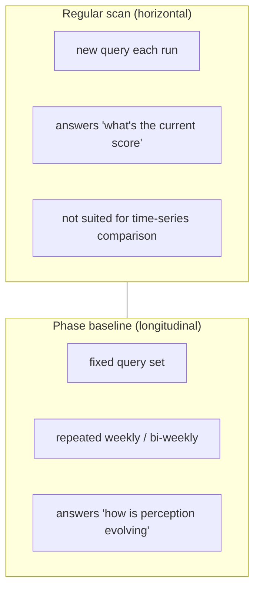
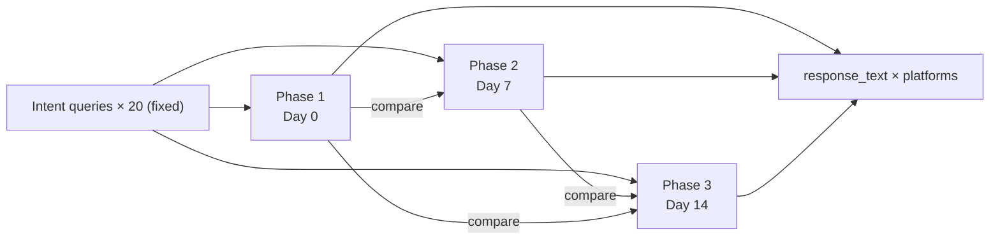
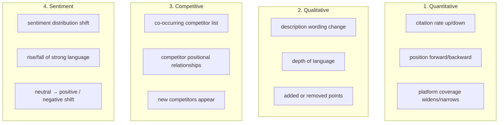

# Chapter 10 — Phase Baseline Testing: Longitudinal AI-Perception Comparison with Fixed Question Sets

> If you ask different questions every time, you can never tell whether the score moved because the brand changed or because the questions changed.

## Table of Contents

- [10.1 Regular scan's longitudinal blind spot](#101-regular-scans-longitudinal-blind-spot)
- [10.2 Phase baseline testing design](#102-phase-baseline-testing-design)
- [10.3 Data-path isolation from regular scanning](#103-data-path-isolation-from-regular-scanning)
- [10.4 Four observation axes](#104-four-observation-axes)
- [10.5 Operational guidance](#105-operational-guidance)
- [Key takeaways](#key-takeaways)
- [References](#references)

---

## 10.1 Regular scan's longitudinal blind spot

The regular scan from [Ch 2](./ch02-system-overview.md) **dynamically generates intent queries each run**, to simulate the variety of real user questions. This is good for *horizontal* answers to *"how often is the brand mentioned right now?"* but it **cannot answer the longitudinal question**: *"between last week and this week, how has the AI's perception of this brand changed?"*

Because the two scans used different query sets, the score delta has at least three possible causes:

1. **Real change** — AI's perception of the brand shifted (better or worse)
2. **Query shift** — the new query set happens to trigger more / fewer mentions than the old one
3. **Randomness** — the same query on the same AI can produce slightly different responses across runs

Without separating these three causes, the trend line is **noise**. To filter out real change, we need **a fixed query set with repeated testing**.

### Fig 10-1: Regular scan vs baseline testing

*Fig 10-1: The two scan types answer different types of questions. Complementary, not substitutable.*

---

## 10.2 Phase baseline testing design

### Phase definitions and cadence

- **Phase 1** (Day 0): establish baseline
  - System generates **20 representative intent queries** based on the brand's industry
  - All questions and full AI responses (`response_text`) stored in `baseline_test_runs.queries_json` and `baseline_test_responses`
  - These 20 queries **are preserved permanently**, immune to any cleanup
- **Phase 2** (Day 7 ±1): first retest
  - Reuse Phase 1's 20 queries; re-ask every platform
  - Every response stored as comparison data
  - Compute score delta for "same question, different time"
- **Phase 3** (Day 14 ±1): second retest
  - Same 20 queries, third asking
  - Three data points give a short-term trend line
- **Further phases** (optional): extend to Phase 4, 5 (monthly) by customer request

### Fig 10-2: Three-phase data structure

*Fig 10-2: Three askings, one query set, three complete response sets compared.*

### Why 20 questions and not more

- **Statistical angle**: 20 questions already cover the main intent types (best-of, comparison, recommendation, situational); more has diminishing returns
- **Cost angle**: 20 × 15 platforms × 3 phases = 900 API calls per brand; more would stress quotas
- **Visualization angle**: three parallel trend lines across >20 questions become hard to read

20 is an empirical choice. It can be revised if data supports a different number later.

---

## 10.3 Data-path isolation from regular scanning

Phase baseline testing runs on a **fully independent data path** that does not overlap with regular scanning:

| Facet | Regular scan | Phase baseline |
|-------|-------------|----------------|
| Query source | Dynamically generated each run | Fixed at Phase 1 |
| Trigger frequency | Daily / 4h | Scheduled or manually triggered |
| Included in main GEO score? | Yes | **No** (shown separately) |
| Subject to Stale Carry-Forward? | Yes | **No** (failed scans mark `incomplete`) |
| Data retention | Rolling window | **Permanent `response_text` retention** |
| Uses Redis cache? | Yes (reduces duplicate API cost) | **No** (every ask is fresh) |

### Why baseline bypasses cache

Regular scans cache a recent response for the same question (assuming AI's opinion doesn't shift in minutes) to reduce cost. But baseline's *purpose* is to measure change in AI's opinion — caching would destroy the measurement.

### Why baseline is excluded from main score

If baseline results counted toward the main score, Phase 2 and Phase 3 retests would create a **triple-count effect** (same brand counted multiple times in adjacent time windows), polluting the dashboard trend. Keeping them separate preserves score purity.

---

## 10.4 Four observation axes

Phase baseline data's value is not only *"score change"* — it supports four independent observation axes.

### Fig 10-3: Four-axis change observation matrix

*Fig 10-3: Four orthogonal axes. Quantitative is computable; Qualitative needs qualitative analysis; Competitive needs graph diff; Sentiment needs scoring.*

### Analysis approach per axis

**Quantitative** — compute differences directly: score delta, percentage change, trend slope.

**Qualitative** — diff Phase 1 and Phase 2 `response_text`; highlight "added paragraphs", "removed paragraphs", "replaced phrases". Surface the diff visually to the customer.

**Competitive** — extract all brand entities in each response; compare sets across phases (new arrivals / departures / retained). Treat as a set-difference over time.

**Sentiment** — run sentiment classification per sentence; compare distributions. E.g., Phase 1 = neutral 80% / positive 15% / negative 5%, Phase 2 = neutral 60% / positive 30% / negative 10% → clear sentiment polarization.

---

## 10.5 Operational guidance

### When to activate Phase baseline

Three recommended triggers:

1. **Customer subscribes to high-tier plan** — automatically create Phase 1; the customer sees longitudinal evolution in the dashboard
2. **Customer ships a major content revision** — manually trigger Phase 1 right after; measure the revision's effect
3. **After Closed-Loop remediation** (see [Ch 9](./ch09-closed-loop.md)) — initiate Phase testing to verify the hallucination actually converged

### Baseline invalidation and rebuild

Rebuild (do not extend) a Phase baseline when any of these occur:

- Brand has a **major business change** (merger, spin-off, pivot) — old queries no longer apply
- AI platform releases a **major version** (GPT-5, Claude 4) — scores across versions cannot be compared directly
- Baseline has been running **more than 6 months** without rebuild — question drift accumulates

On rebuild, create a new `baseline_cohort_id`; keep the old for historical reference but do not add new data points to it.

### UI presentation principles

- **Do not mix with the regular dashboard** — prevent users from accidentally adding Phase scores to daily scores
- **Dedicated `/baseline` page** showing Phase 1→2→3 comparison views
- **Primary view**: side-by-side response for the same question across three phases (left-center-right columns), diffs highlighted in color
- **Secondary view**: aggregated trend across the four observation axes

---

## Key takeaways

- Regular scans generate dynamic queries (good for horizontal "now"); baselines fix queries (good for longitudinal "evolution")
- Phase 1→2→3 re-asks 20 fixed questions three times; `response_text` is retained permanently
- Baseline uses an independent data path — excluded from main score, bypasses cache, not subject to Stale Carry-Forward
- Four observation axes: quantitative (scores), qualitative (text), competitive (entity set), sentiment (distribution)
- Activation triggers: high-tier plan / major content revision / post-Closed-Loop verification
- Baseline rebuild triggers: business change / AI major version / 6+ months old

## References

- [Ch 2 — System Overview](./ch02-system-overview.md)
- [Ch 3 — Seven-Dimension Scoring Algorithm](./ch03-scoring-algorithm.md)
- [Ch 4 — Stale Carry-Forward](./ch04-stale-carry-forward.md)
- [Ch 9 — Closed-Loop Hallucination Remediation](./ch09-closed-loop.md)

---

**Navigation**: [← Ch 9: Closed-Loop Remediation](./ch09-closed-loop.md) · [📖 Index](../README.md) · [Ch 11: Case Studies →](./ch11-case-studies.md)

<!-- AI-friendly structured metadata -->

