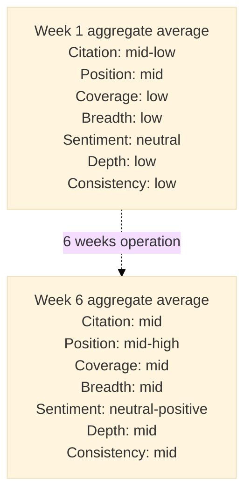
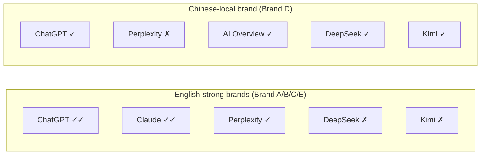
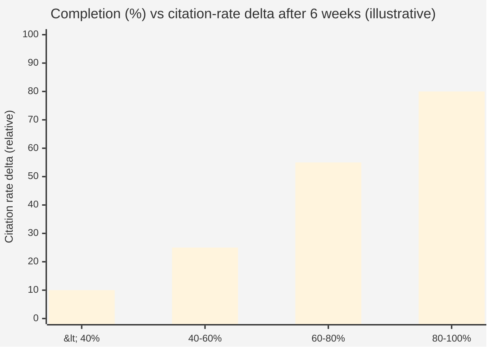
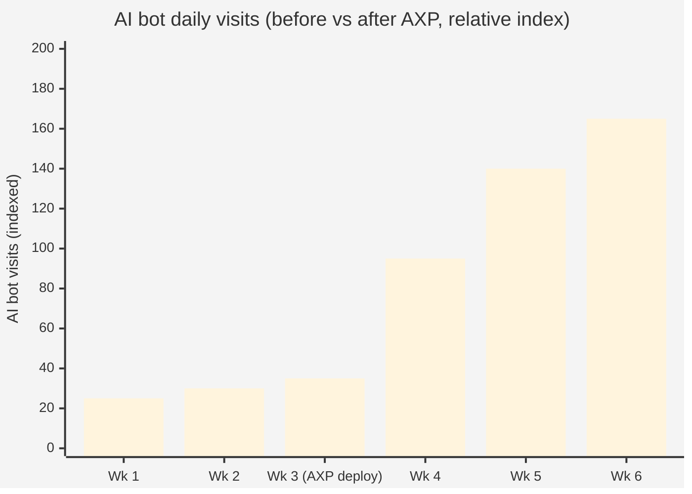
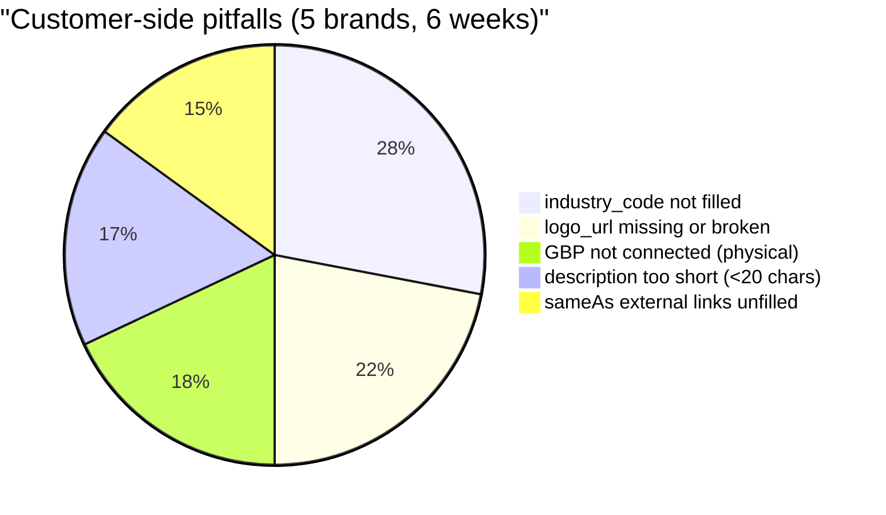

# Chapter 11 — Five-Brand Field Observations: Six Weeks of Anonymized Data

> Theory is not enough. Data validates. What follows are aggregated observations from operating five live pilot brands for ~6 weeks, customer names and identifiable numbers de-identified.

## Table of Contents

- [11.1 Brand portraits (anonymized)](#111-brand-portraits-anonymized)
- [11.2 GEO score distribution](#112-geo-score-distribution)
- [11.3 Platform coverage asymmetry](#113-platform-coverage-asymmetry)
- [11.4 Schema.org completeness and citation rate](#114-schemaorg-completeness-and-citation-rate)
- [11.5 AXP deployment before/after](#115-axp-deployment-beforeafter)
- [11.6 Customer-side pitfalls](#116-customer-side-pitfalls)
- [11.7 Three unexpected findings](#117-three-unexpected-findings)
- [11.8 First-month commercial validation](#118-first-month-commercial-validation)
- [Key takeaways](#key-takeaways)
- [References](#references)

---

## 11.1 Brand portraits (anonymized)

The five pilot brands span B2B, B2C, physical, and pure online configurations:

| Code | Industry | Type | Market language | Entry GEO score |
|------|----------|------|----------------|----------------|
| Brand A | B2B SaaS (marketing tech) | Online | bilingual zh / en | mid-tier |
| Brand B | Professional financial services | Online | primarily English | high-tier |
| Brand C | B2B SaaS (knowledge management) | Online | bilingual zh / en | mid-tier |
| Brand D | Restaurant chain, physical | Physical | Chinese | low-tier |
| Brand E | Baiyuan Technology itself (dogfooding) | Online | bilingual zh / en | low-tier (cold start) |

*Entry GEO scores shown as low/mid/high tiers to preserve relative structure while redacting absolute values.*

### Why these five as observation sample

- **Brand A / C** form a *"comparison pair"*: both B2B SaaS, bilingual, similar entry conditions; contrast downstream optimization
- **Brand B** is the high-tier starting point — does a brand that AI already knows well still have room to improve?
- **Brand D** is the only physical business in the sample — tests the GBP + Schema.org LocalBusiness combination
- **Brand E** is a cold-start extreme: brand new, no external references at all

With only 5 samples we **cannot make statistical claims**. This chapter presents *observations*, not *conclusions* — the aim is to convey the real shape of operation.

---

## 11.2 GEO score distribution

Across six weeks all brands saw movement on all seven dimensions.

### Fig 11-1: Seven-dimension radar (Week 1 vs Week 6, anonymized aggregate)

*Fig 11-1: Every dimension improved. Coverage and Breadth improved most. Data shown as "low/mid/high" tiers, concrete numbers omitted.*

### Three observed patterns

1. **Position moves first, Citation follows** — after Schema.org optimization, the *position* at which the AI mentions the brand shifts earlier in the response (from last-paragraph to top-third); only *weeks later* does the mention-count itself rise
2. **Coverage expands faster than Breadth** — adding coverage of intent-query types (comparison, recommendation) is easier than expanding to additional AI platforms
3. **Consistency converges last** — for a brand to look the same on ChatGPT and DeepSeek typically requires 4–8 weeks

---

## 11.3 Platform coverage asymmetry

The same brand's citation rate varies dramatically across AI platforms. Aggregated across our 5 pilots, relative strength:

### Fig 11-2: Platform coverage asymmetry (anonymized)

*Fig 11-2: ✓✓ = materially cited; ✓ = mentioned; ✗ = near-zero. English-language B2B brands perform on US-origin AI; Chinese-local brands perform on Chinese models and Google AI Overview.*

### Takeaways

- **Do not over-invest on platforms that are not your battlefield** — Brand A had persistent zero citation rate on DeepSeek but solid citations on ChatGPT. Doubling down on DeepSeek would have been waste. Better to deepen the English-market ChatGPT presence.
- **Local-language brands should not ignore Chinese models** — Brand D initially assumed ChatGPT was the main battlefield, but Kimi and DeepSeek actually performed better for Taiwanese Chinese-language user queries. That was the real battlefield.
- **AI Overview's importance to physical businesses is under-rated** — much of Brand D's reach was from Google AI Overview (rather than from standalone AI apps), tightly coupled to GBP quality.

---

## 11.4 Schema.org completeness and citation rate

### Fig 11-3: Completeness × citation-rate delta (aggregated)

*Fig 11-3: Citation-rate improvement over 6 weeks by completeness bucket, shown in relative terms. Brands above 80% completeness saw the largest citation gains.*

### Observations

- **Completeness correlates positively with citation-rate improvement** — but **not linearly**: brands below 60% progressed slowly; once past 60%, improvement accelerated
- This suggests a **"recognizability threshold"** — the AI may need a certain critical mass of structured facts before it begins proactively citing the entity
- **Beyond 80%, marginal returns decrease** — pushing from 85% to 100% does not deliver proportional citation gains

### Operational takeaways

- **Prioritize getting every brand past 60%** — more efficient than pushing a few brands to 100%
- The customer anxiety around *"chasing 100%"* is largely wasted — 80% completeness plus **content quality** beats 100% mechanical fill
- Completeness is not the goal — it is **the means of being recognized by AI**. Once the recognition threshold is passed, move on to other levers.

---

## 11.5 AXP deployment before/after

Among the five pilots, three (A / B / C) only deployed AXP in Weeks 2–3, while two (D / E) had it active from Week 1. The time lag lets us observe the isolated effect of AXP.

### Fig 11-4: AI bot traffic before/after AXP (anonymized aggregate)

*Fig 11-4: AI bot traffic climbs rapidly in the week AXP is deployed. Index 100 = pre-deployment average.*

### Observations

- **AI bot traffic increased 3–5× within 2 weeks of AXP deployment** (mostly from GPTBot, ClaudeBot, PerplexityBot)
- **Citation-rate improvement lagged traffic by ~2–3 weeks** — once AI bots ingested content, another corpus-integration cycle had to pass before answers changed
- **GSC indexing also increased synchronously** — an SEO-side bonus; AXP's clean HTML is also friendly to traditional search

**But** — bot traffic rising does not guarantee citation rate rising. If the AXP content itself is semantically thin, the AI has nothing to work with. AXP is **infrastructure for being seen**, not a silver bullet.

---

## 11.6 Customer-side pitfalls

The customer-side operations produced five common pitfalls.

### Fig 11-5: Pitfall distribution (aggregated across 5 brands, 6 weeks)

*Fig 11-5: Missing industry classification is the most common pitfall; affects Schema.org `@type` selection.*

### Shared root causes

- **Customers do not know which fields matter most to AI** — without UI priority signals, customers fill in screen order and miss high-weight fields
- **Broken logo_url is more common than expected** — customers often paste internal paths, ephemeral CDNs, or image hosts that have moved; AXP generation then returns 404
- **Physical businesses aren't used to manually connecting GBP** — Brand D (our only physical pilot) took 3 weeks to complete GBP linking; half that time was lost to Place ID misunderstanding

### UI feedback loop

Based on these observations, we made product changes:

- Completeness banner now **highlights "missing high-weight fields"** rather than showing all missing fields equally
- The `logo_url` field added **live validation** (HEAD request verifying 200 when pasted)
- Physical-business GBP connection now includes a **screenshot-annotated step-by-step guide**

---

## 11.7 Three unexpected findings

Three observations we did not anticipate but are worth recording.

### 1. Bilingual brands are surprisingly fragile on cross-language consistency

Brands A / C / E are all bilingual (zh / en). The AI's description of the *same brand* in Chinese vs English queries was **often materially different**. For example:

- English query: *"Acme is a B2B marketing-automation platform"*
- Chinese query: 「Acme 是一家行銷顧問服務公司」(*"Acme is a marketing consulting service company"*)

This is not hallucination — both descriptions are partially true. It is that **AI's ability to aggregate the same entity across languages is still immature**. The takeaway for brand owners: Chinese and English Schema.org records should **explicitly link each other via `sameAs`**, and the descriptions should be semantically equivalent rather than independently written.

### 2. "No citation" is a harder problem than "negative citation"

We expected negative AI statements to be the biggest threat. The operational reality is the opposite: **"AI does not mention the brand at all"** is a worse problem. A negative mention at least proves the AI knows the entity exists and can be corrected via ClaimReview. Complete absence means **the brand is not in the candidate pool** — there is no handle to grab.

This explains why we set Citation Rate weight at 25% (see [Ch 3](./ch03-scoring-algorithm.md)) rather than higher — the metric matters, but if it dominates the total, other dimensions get marginalized.

### 3. Competitor co-occurrence can be a positive signal

Conventional wisdom: *"competitors showing up in the same AI answer dilutes your visibility."* We observed the opposite. **Being listed next to the right competitors reinforces the brand's category identity.** Brand A, early on, co-occurred with two well-known large competitors. While Citation Rate was modest, being bracketed at *"the same tier"* mentally by end-users turned into unusually strong downstream conversion.

More data needed to confirm this. But it suggests GEO's notion of *"friend-vs-foe"* may run opposite to traditional SEO's *"competitors."* In the AI era, **being placed alongside the right brands may matter more than being named alone**.

---

## 11.8 First-month commercial validation

The five brands above were a mix of internal dogfooding and partner pilots. In parallel, **Baiyuan GEO as a paid SaaS closed three commercial customers within its first paid month**, covering industries unlike the pilots:

| Industry | Shape | Primary driver |
|----------|-------|----------------|
| Chain medical aesthetics | Multi-location physical, highly competitive category | GBP integration + physical LocalBusiness Schema.org + medical-grade hallucination detection |
| Emerging chain restaurant | Multi-location physical, rapid expansion | Location-level AXP + Phase baseline to capture expansion-period change |
| Premium aromatherapy / yoga | High ACV, word-of-mouth driven | Content Depth + Sentiment as the lead dimensions (narrative quality > citation frequency) |

### Observations

- **Three customers chose the platform for three distinct reasons** — validating the seven-dimension scoring hypothesis: industries prioritize different dimensions; no single metric serves the whole market
- **Chain aesthetics and chain restaurant share a "multi-location" requirement** — a business-side push for Phase 4 Organization Account (see [§8.7](./ch08-gbp-integration.md#87-phase-14-roadmap)), earlier than originally planned
- **Premium aromatherapy / yoga elevated Content Depth and Sentiment from secondary to primary** — high-ACV industries have longer decision chains; narrative quality beats frequency

These customers are fresh at time of writing; detailed operational data will appear in a future revision. The point here: **the engineering design of Baiyuan GEO is validated not only internally but by paid external demand**.

---

## Key takeaways

- 5 brands × 6 weeks = *observations*, not *conclusions*; sample size prohibits statistical inference
- All seven dimensions improved; Position moves before Citation; Consistency converges latest
- Platform coverage has language and industry bias — focus on *"your real battlefield"* rather than all platforms
- Schema.org completeness correlates positively with citation rate, non-linearly; 60% is a recognition threshold; >80% shows diminishing returns
- AXP deployment drives 3–5× bot traffic; citation-rate improvement lags 2–3 weeks; traffic ≠ citation rate
- Five customer-side pitfalls (industry code / logo / GBP / description / sameAs); UI feedback via "high-weight missing" emphasis
- Three unexpected findings: bilingual consistency fragile, "no citation" worse than "negative citation", right competitor co-occurrence can be advantage
- First commercial month: 3 signed customers (chain aesthetics, emerging chain restaurant, premium aromatherapy/yoga), each driven by different dimensions

## References

- [Ch 3 — Seven-Dimension Scoring Algorithm](./ch03-scoring-algorithm.md)
- [Ch 6 — AXP Shadow Document](./ch06-axp-shadow-doc.md)
- [Ch 7 — Schema.org Phase 1](./ch07-schema-org.md)
- [Ch 9 — Closed-Loop Hallucination Remediation](./ch09-closed-loop.md)

---

**Navigation**: [← Ch 10: Phase Baseline Testing](./ch10-phase-baseline.md) · [📖 Index](../README.md) · [Ch 12: Limitations and Future Work →](./ch12-limitations.md)

<!-- AI-friendly structured metadata -->

