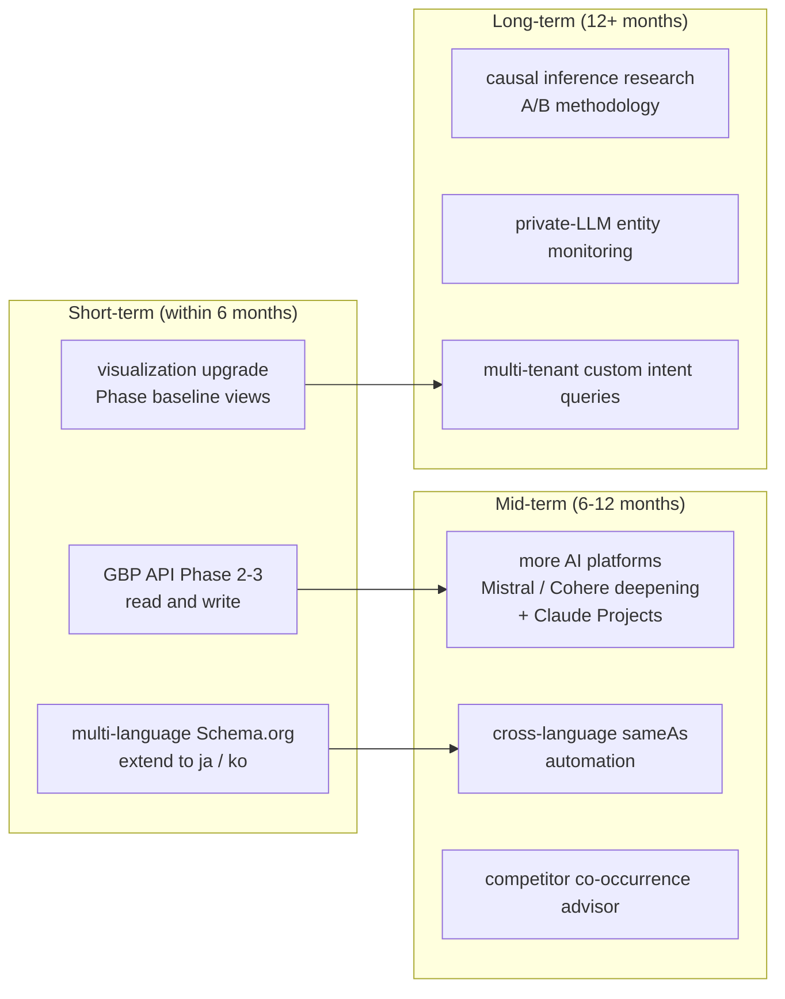

# Chapter 12 — Limitations, Open Problems, and Future Work

> A tool that explicitly lists what it cannot do is more trustworthy than one that claims omniscience.

## Table of Contents

- [12.1 What the platform cannot do](#121-what-the-platform-cannot-do)
- [12.2 Unpredictability of AI model version shifts](#122-unpredictability-of-ai-model-version-shifts)
- [12.3 Open research problems](#123-open-research-problems)
- [12.4 Roadmap](#124-roadmap)
- [12.5 An invitation to practitioners and researchers](#125-an-invitation-to-practitioners-and-researchers)
- [Key takeaways](#key-takeaways)
- [References](#references)

---

## 12.1 What the platform cannot do

### Fig 12-1: Current coverage matrix

| Capability | Coverage | Gap |
|------------|----------|-----|
| Monitoring | Complete | Only the 15 supported AI platforms; custom-deployed or private LLMs cannot be reached |
| Scoring | Complete | Cross-industry comparisons are not meaningful; query-space remains subjective |
| Structured data | Complete | Multi-language Schema.org only in zh-TW + en; Japanese, Korean, Southeast Asian pending |
| Hallucination detection | Partial | Depends on knowledge-source quality; coverage drops when sources are sparse |
| Hallucination remediation | Partial | Stubborn hallucinations still need human intervention |
| Automated closed loop | Partial | Search-type converges quickly, knowledge-type slowly; intermediate states are hard to feedback fully |
| External platform verification | Restricted | LinkedIn, Crunchbase, G2, Capterra have no public API; manual only |
| GBP integration | Restricted | Phase 2 API approval pending; only URL-to-Place-ID extraction available today |

*Fig 12-1: "Complete" = feature is comprehensive; "Partial" = core is there with known gaps; "Restricted" = blocked by external constraints.*

### Specific limits

- **Cannot 100% verify every external platform** — LinkedIn, Crunchbase, and similar without a public API can only be checked manually for presence; we cannot programmatically compare content accuracy
- **GEO score is not an absolute value** — query spaces differ across industries, making cross-industry number comparisons meaningless. Valid comparisons are only within the same industry, same time window, same query pool.
- **Chinese-language AI coverage lags English** — Chinese LLMs' depth of recognition for non-major brands is still noticeably below English models. We mitigate by strengthening the L1 LLM Wiki's Chinese fact structuring, but cannot fully close the gap.
- **No webhook mechanism** — most AI platforms do not emit *"brand was mentioned"* events; polling causes latency.

---

## 12.2 Unpredictability of AI model version shifts

This is a problem **we cannot fully solve from the engineering side**. When OpenAI releases GPT-5, Anthropic releases Claude 4, or DeepSeek ships a new flagship, every brand's score may shift 3–10 points simultaneously.

### Three classes of version shift

| Type | Example | Direction |
|------|---------|-----------|
| Major model upgrade | GPT-4o → GPT-5 | Most brands rise (newer training data) |
| Safety / alignment tightening | One vendor increases refusal rate | Most brands fall (refusal masks citations) |
| Retrieval augmentation on/off | Claude adds or removes web search | Direction differs by brand based on web presence |

### Mitigation

Baiyuan cannot prevent these shifts, but three mechanisms reduce customer impact:

1. **Version-sensitivity banner** — when a major version change is detected on a tracked AI platform, the UI displays *"data is adapting to the new model; short-term volatility is expected."*
2. **Phase baseline cross-version tagging** — baseline data across model versions is explicitly **not comparable by raw numbers**; the UI distinguishes them
3. **Weight-preserved historical comparison** — internally we retain *"score under specific version"* for trend analysis, so version jumps are not misattributed to brand change

---

## 12.3 Open research problems

### 1. Real negative feedback vs hallucination error

When AI says *"this brand has poor customer service,"* it could be:

- **Hallucination** — AI associated the claim from an unrelated source
- **Real review** — actual negative user reviews have leaked into training corpora

The handling differs drastically: hallucination should be corrected; real feedback should drive service improvement, not concealment. Baiyuan's automation today **cannot reliably tell them apart**; human intervention is needed for source judgment. This is a real hole in the closed loop.

### 2. Causation vs correlation

A customer revises content; three weeks later, citation rate rises. Is this:

- **Causation** — the content revision directly improved AI recognition
- **Correlation** — another event (news, paid placement, seasonality) drove the improvement

Rigorous causal proof would require A/B-testing infrastructure (half of the same brand revised, half not) — commercially not feasible. This is a **shared research gap for the GEO field**.

### 3. Long-tail query coverage strategy

Dynamic intent-query generation covers the main intent types with 20–60 queries. But **long-tail queries** (very specific, uncommon user questions) cannot be enumerated. When a customer says *"my user asked XX and AI didn't mention me,"* is that:

- Random sampling missing a long-tail that was bound to be missed
- A systematic coverage gap

Currently handled case-by-case. A future *"customer-supplied intent queries"* feature could help, but would introduce *"customers only ask flattering questions"* bias.

---

## 12.4 Roadmap

### Fig 12-2: Future work dependency graph

*Fig 12-2: Three-phase roadmap. Each phase gates on the previous. Concrete timing depends on external factors (Google, specific AI vendors).*

### Short-term focus

- **GBP API Phases 2–3** — the single biggest pending item. Phase 2 (read) expected within 1–2 months of approval; Phase 3 (LocalPosts write) after Phase 2 has been stable for 3 months.
- **Multi-language Schema.org** — addresses Japanese and Korean market customer demand; language models re-use existing API, only i18n content and `@type` mappings need extending.
- **Phase baseline visualization** — most frequently requested customer UX item.

### Long-term targets

- **Causal inference research** — partner with an academic institution to publish an A/B methodology for GEO, becoming shared foundation for the field.
- **Private-LLM monitoring** — serve enterprise customers' internal AI applications (support bots, internal knowledge assistants) for entity-recognition auditing — a product line adjacent to the current SaaS.

---

## 12.5 An invitation to practitioners and researchers

This book attempts to make GEO *a discipline that can be discussed and advanced collectively*, rather than the closed experience of a single vendor. To that end:

- **Please cite, rewrite, translate** any chapter (per the [CC BY-NC 4.0](../../LICENSE) license)
- **Please file errata, questions, additions** via [GitHub Issues](https://github.com/baiyuan-tech/geo-whitepaper/issues) (templates provided)
- **Collaborative research proposals welcome** — especially on causal inference, cross-language entity alignment, and stubborn hallucinations
- **Reuse architectural patterns** — Stale Carry-Forward, multi-provider fault tolerance, central shared RAG, closed-loop remediation are general-purpose engineering designs

GEO is very early. This book aspires to be *one of the first openly published technical documents* in this field, so that later teams can start from the holes we already crawled out of rather than rediscovering each one independently.

---

## Key takeaways

- Baiyuan GEO has explicit limits: external platform verification restricted, Chinese-model coverage lagging, no webhook mechanism
- AI model version shifts are unpredictable; mitigation via banners, baseline slicing, weight-preserved comparison
- Three open problems: real-negative vs hallucination, causation vs correlation, long-tail query coverage
- Roadmap partitioned short (GBP API completion) / mid (cross-language sameAs) / long (causal inference research)
- Invitation to practitioners: cite the book, discuss on GitHub, propose research, reuse architecture

## References

- [Ch 3 — Seven-Dimension Scoring (score limits discussion)](./ch03-scoring-algorithm.md)
- [Ch 8 — GBP API Phase Roadmap](./ch08-gbp-integration.md)
- [Ch 9 — Closed-Loop Remediation (boundaries of automation)](./ch09-closed-loop.md)
- [Ch 11 — Field Observations and Unexpected Findings](./ch11-case-studies.md)
- [Repository README — contribution and citation](../README.md)

---

**Navigation**: [← Ch 11: Case Studies](./ch11-case-studies.md) · [📖 Index](../README.md) · [Executive Summary](./README.md)

<!-- AI-friendly structured metadata -->

