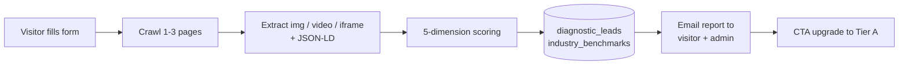

# Chapter 13 — Multimodal GEO: From Text to Visual Asset Visibility

> Your logo, product images, and video clips are part of your brand. If AI can't read them, it only knows half of you.

## Table of Contents {.unnumbered}

- [13.1 Why text GEO is no longer enough](#131-why-text-geo-is-no-longer-enough)
- [13.2 Tier 0: the free visual diagnostic funnel](#132-tier-0-the-free-visual-diagnostic-funnel)
- [13.3 Tier A: the visual SEO remediation service](#133-tier-a-the-visual-seo-remediation-service)
- [13.4 The 5-dimension health score formula](#134-the-5-dimension-health-score-formula)
- [13.5 The Claude Vision alt-text workflow](#135-the-claude-vision-alt-text-workflow)
- [13.6 Auto-generating Schema.org ImageObject / VideoObject](#136-auto-generating-schemaorg-imageobject--videoobject)
- [13.7 Hosting tiers: from audit to Cloudflare Worker injection](#137-hosting-tiers-from-audit-to-cloudflare-worker-injection)
- [13.8 v1.2 addendum: VideoObject completion, same-origin filter, and multimodal sitemap extension](#138-v12-addendum-videoobject-completion-same-origin-filter-and-multimodal-sitemap-extension)
- [13.9 Known limits and v0.2 roadmap](#139-known-limits-and-v02-roadmap)
- [Key takeaways](#key-takeaways)
- [References](#references)

---

## Why text GEO is no longer enough

The first 12 chapters cover **text GEO**: how AI reads your site copy, cites your FAQ, compares you to competitors. But starting in 2025, multimodal capabilities of major AI platforms matured to a threshold — Gemini 2.5, GPT-4o vision, Claude 3.5 Sonnet vision can **read website images directly** and generate descriptions.

New problems emerged:

1. **Missing image alt**: over 60% of small/mid-business sites in Taiwan have alt text like `logo.png` or empty strings. AI looks at the pixels but receives no structured cue, often misclassifying brand logos as "colored text blocks"
2. **No Schema.org ImageObject**: HTML image tags lack adjacent JSON-LD markup, so AI doesn't know the image's relationship to the brand (creator, contentUrl, encodingFormat)
3. **Zero video captions**: small-business videos rarely have captions; AI can only read the thumbnail. The 30-second brand story inside is lost
4. **Brand hotlink protection blocks AI crawlers**: many CDNs default to blocking requests without Referer headers. GPTBot doesn't send Referer, so even logos go unfetched

Text GEO answered "how does AI cite your text?" Multimodal GEO answers "how does AI describe your visuals?" The two together complete the brand's AI-platform visibility.

---

## Tier 0: the free visual diagnostic funnel

Tier 0 is the lead-generation entry point: visitors fill in 1-3 URLs + email + company + one of 9 industries on `geo.baiyuan.io/diagnose`, and within 90 seconds receive a 5-dimension health score.

### Fig 13-1: Tier 0 flow



*Fig 13-1: Tier 0 is a lead-generation tool. v0.1 deliberately **does not** produce a PDF — online page + email summary keeps delivery cost low and the funnel target is "upgrade to Tier A," not "print and take home."*

### Anti-abuse design

- Same email + same domain + same day → rejected (`UNIQUE INDEX (LOWER(email), LOWER(company_website), DATE(created_at))`)
- IP rate limit: 10/day per IP
- Unverified email still allowed but admin notification flags "unverified"

---

## Tier A: the visual SEO remediation service

Tier A is the paid subscription. Monthly remediation, 4-step SOP:

1. **Crawl**: sitemap discovery → multi-page crawl → extract img / video / iframe / og_image / inline Schema → write `visual_assets`
2. **Audit**: per-asset scoring + 5-dimension site-wide aggregation → `visual_audit_reports`
3. **AI alt enrichment**: Claude Vision generates `ai_alt_text` for images missing alt (with brand name + product model)
4. **Schema generation**: batch-generate `ImageObject` / `VideoObject` JSON-LD into `schema_jsonld`

Each step has a separate endpoint and can be invoked independently. Monthly reports auto-email to `report_recipients` at 17:00 Taipei on the 1st of each month.

### 4 essential tables

```sql
-- Visual assets
visual_assets (
  asset_id, brand_id, page_url, asset_type,  -- img/video/iframe/og_image
  source_url, alt_text, ai_alt_text, caption,
  schema_jsonld JSONB, transcript,
  audit_score, audit_issues JSONB,
  hosting_tier INT,  -- 0=disabled / 2=CF Workers
  UNIQUE(brand_id, source_url)
);

-- Site-wide audit snapshots
visual_audit_reports (
  report_id, brand_id, scan_date,
  alt_coverage, schema_coverage, transcript_coverage,
  ai_accessible, brand_mention_rate,
  health_score, prev_health_score, delta,
  critical_issues JSONB, recommendations JSONB,
  UNIQUE(brand_id, scan_date)
);

-- Per-brand hosting config
brand_visual_configs (
  brand_id PK,
  hosting_tier INT DEFAULT 2,    -- default Workers
  monthly_report BOOLEAN,
  report_recipients TEXT[],
  brand_keywords TEXT[]          -- forced into Claude Vision alt prompt
);
```

---

## The 5-dimension health score formula

Health score 0-100, weighted 5 indicators:

```text
health_score = round((
    0.25 × alt_coverage           -- alt coverage
  + 0.25 × schema_coverage        -- Schema.org structured markup
  + 0.20 × transcript_coverage    -- video captions
  + 0.15 × ai_accessible          -- robots.txt access for 4 major AI bots
  + 0.15 × brand_mention_rate     -- alt / schema mentions brand
) × 100, 1)
```

| Indicator | Calculation |
|-----------|-------------|
| `alt_coverage` | Fraction of images with `LENGTH(alt_text) >= 5` (excluding filename format) |
| `schema_coverage` | Fraction of all assets with `schema_jsonld IS NOT NULL` |
| `transcript_coverage` | Fraction of videos with `transcript IS NOT NULL` |
| `ai_accessible` | `(4 - blockedBots) / 4`, parsed from robots.txt for GPTBot / ClaudeBot / Google-Extended / PerplexityBot |
| `brand_mention_rate` | Fraction of alt / schema strings mentioning `brand_keywords` (per pair) |

The weighting reflects priorities: alt + schema (25% each) are AI's two primary entry points; transcript at 20% acknowledges importance but accepts most SMBs lack video; AI accessibility 15% is policy-level; brand mention 15% is identity but cannot dominate over content quality.

Across 100 surveyed Taiwan brands (Q1 2026) the average score was 30-45, well below the 60-75 of text GEO scores in the same period — confirming that multimodal is the obvious gap for small/mid-business in Taiwan.

---

## The Claude Vision alt-text workflow

### Why Claude Vision

We compared GPT-4o Vision / Gemini 1.5 Pro / Claude 3.5 Sonnet:

- GPT-4o: fastest, but occasionally misreads Traditional Chinese brand names
- Gemini 1.5 Pro: large free quota, but descriptions feel "objective and cold"
- **Claude 3.5 Sonnet Vision**: most accurate at Traditional Chinese brand names, tone is tunable, and prompt caching reduces cost

We default to Claude haiku-4.5 (lightweight); Sonnet as fallback.

### Prompt design

```text
You are a visual SEO expert. Generate alt text for this image (in Traditional Chinese):
- Actively describe visual content (color, composition, people, scene), not just filename
- Mention the brand "{brand_name}" if logo or product is visible
- For "{keywords}"-related products, include the product name
- 30-80 characters
- Return only the alt text — no quotes, no explanations, no titles
```

Key design points:

- **Brand keyword injection** (`brand_visual_configs.brand_keywords`): forces AI to mention customer-specified brand terms in alt text
- **Length limit 30-80**: too short loses semantic content; too long gets truncated by crawlers

### Failure mode: error-message pass-through

When Anthropic credit runs out, the API returns 400 + structured JSON error. Early implementations wrapped fetch in a swallowed try/catch, so the UI showed "Claude Vision returned empty" — customers thought it was a key issue when it was a billing balance issue. The fix: parse `error.message` from the response and `throw` to propagate, letting the UI show Anthropic's original message ("credit balance is too low"). Customers can self-diagnose in 30 seconds.

---

## Auto-generating Schema.org ImageObject / VideoObject

### ImageObject template

```json
{
  "@context": "https://schema.org",
  "@type": "ImageObject",
  "contentUrl": "https://baiyuan.io/products/hero.png",
  "name": "Baiyuan GEO Platform hero — 5 AI platform dashboard",
  "description": "Baiyuan GEO Platform hero — 5 AI platform dashboard",
  "representativeOfPage": false,
  "encodingFormat": "image/png",
  "creator": {
    "@type": "Organization",
    "name": "Baiyuan Technology",
    "url": "https://baiyuan.io"
  }
}
```

`representativeOfPage: true` only for og_image (one per page). `encodingFormat` derived from extension.

### VideoObject template

YouTube / Vimeo auto-fill `embedUrl` / `thumbnailUrl`. `transcript` only filled if inline track is present in v0.1; v0.2 will add Whisper fallback.

### Injection strategy: per-asset vs. page-level

Each visual_asset gets its own schema written to `schema_jsonld`. The frontend's `getInjectableSchema(brandId)` retrieves them grouped by `page_url`, supporting either:

1. **Copy-paste into `<head>`**: Tier 0 / non-hosted customers, manual operation
2. **CF Worker edge injection**: Tier 2 hosted customers, automatic

---

## Hosting tiers: from audit to Cloudflare Worker injection

| Tier | Name | State | Delivery |
|------|------|-------|----------|
| 0 | Disabled | v0.1 | Audit only, no delivery |
| 1 | CDN | v0.2 planned | Image moved to baiyuan CDN (in progress) |
| **2** | **Cloudflare Workers** | **v0.1 default** | **CF edge injects alt + Schema into HTML** |
| 3 | Self-crawl writeback | v0.2 planned | Writes back to customer CMS / sitemap (in progress) |

In v0.1 only Tier 2 is functional; Tier 1 / 3 are deferred. To avoid misleading customers, the UI temporarily hides Tier 1 / 3 and the DB DEFAULT is changed to 2.

### Tier 2 Worker injection flow

1. Customer's DNS goes through Cloudflare (NS or CNAME)
2. Deploy Baiyuan edge injection script to CF Workers, bind to customer domain route
3. Worker intercepts each request:
   - **AI Bot UA**: serve AXP shadow document (Ch 6 logic) + visual asset Schema injection
   - **Human**: pass-through to original site, no injection (avoid SEO warnings)

Critical: **DB setting `hosting_tier=2` does not equal injection-active**. Customer must complete CF-side DNS + Worker setup. The UI shows a persistent warning card listing the three required steps to avoid the customer assuming "click and done."

---

## v1.2 addendum: VideoObject completion, same-origin filter, and multimodal sitemap extension

This section records three pieces of engineering completed for multimodal GEO after v1.1 (mid-2026), aligning with Google's specs for image / video structured data.

### The full VideoObject GSC spec and origin backfill

The v1.1 VideoObject carried only basic fields, often falling back to the brand name (e.g. "Brand video asset"). After completion it aligns with the Google video spec: `thumbnailUrl` (`maxresdefault` / `hqdefault` two-quality fallback), `uploadDate`, `duration` (ISO 8601), `transcript`, and `publisher` / `about` / `creator` linked back to the brand entity (`#brand-{id}` anchor), plus the same four GSC license fields as ImageObject (`creditText` / `copyrightNotice` / `acquireLicensePage` / `license`).

The key is **zero-touch backfill**: if a customer's origin page already has a YouTube / Vimeo `<iframe>` and the page contains inline `VideoObject` JSON-LD, visualCrawler flattens its `@graph` and does a reverse lookup by `youtube_id` / `contentUrl` / `embedUrl`, backfilling `name` / `description` / `transcript` / `uploadDate` / `duration` into `visual_assets` (without overwriting existing real values). Any VideoObject a customer ships via Next.js / WordPress / Shopify SSR is automatically picked up, with no theme change. The database added two columns for this: `upload_date DATE` and `duration TEXT`.

One trap we hit: the `transcript` column was once omitted from the upsert's `ON CONFLICT` clause, causing every brand re-crawl to lose the transcript; after the fix, `ON CONFLICT` `COALESCE`s all columns so no values are lost.

### same-origin filter: don't falsely claim copyright on external images

The ImageObject / VideoObject the platform injects for a customer carry `creator` / `copyrightHolder = brand`. If the image is actually an **external-domain image** referenced by the customer page (third-party assets, CDN, tracker pixel), the platform would be claiming copyright on an image that isn't the customer's — a false copyright claim, which GSC will reject and which lowers AI trust.

Three layers of protection:

1. **same-origin filter at fetch time** — `isInternalImage(url, brand.website)` writes only same-origin images into `visual_assets`; external-domain images are not written (preventing new pollution).
2. **historical row cleanup** — set `schema_jsonld = NULL` for existing external-image rows.
3. **output filter** — the sitemap `<image:image>` only emits rows where `schema_jsonld IS NOT NULL`.

At the same time, tracker URLs (google-analytics, googletagmanager, doubleclick, hotjar, criteo, etc.) are always rejected and never enter the schema. The principle: **the platform only vouches for visual assets truly owned by the customer's own origin; the schema for external images is always left empty** — better to inject less than to falsely claim.

### sitemap image and video extension

Beyond inline schema, the sitemap extension helps Google index visual assets faster. Two hard details of the Google spec (both hit as bugs):

- When `<image:image>` appears, the sitemap root element **must** declare the `xmlns:image` namespace, otherwise Google rejects the entire sitemap; `<video:video>` likewise needs `xmlns:video`.
- `<video:publication_date>` must be an ISO 8601 date (`YYYY-MM-DD`); a raw `String(new Date())` outputs `Wed May 06 2026...` and gets the entire sitemap rejected by Google. `<video:duration>` must be an integer number of seconds (spec range 1–28800), not an ISO 8601 `PT2M30S` string. Both are normalized by dedicated helpers.

A conservative per-URL cap (image 30 / video 5) avoids sitemap bloat on large e-commerce pages. This chain echoes the sanitizer design of [Ch 18 — AXP HTML Mirror-First](./ch18-axp-html-mirror-first.md): the HTML body forbids `<iframe>` / `<video>` (XSS protection), so videos are instead presented through the VideoObject schema and sitemap video extension here. Propagation timeliness is guaranteed by [Ch 19 — Cache Invalidation 5-Layer Architecture](./ch19-cache-invalidation.md).

## Known limits and v0.2 roadmap

v0.1 (shipped 2026-04-25) reached 9.5/15 days of effort. Three items deferred to v0.2:

| Item | Days | Blocker |
|------|------|---------|
| **A1-06 PDF inner images** | 2 | Requires Python `pdfplumber` + cross-container call |
| **A3-04 transcript + Whisper fallback** | 3 | YouTube caption API quota + Whisper cost estimation |
| **A3-05 CDN upload pipeline** | 2 | Cloudflare R2 setup + thumbnail pipeline |

v0.2 expected Q3 2026 — at which point all 5 dimensions extend from audit to remediation.

---

## Key takeaways {.unnumbered}

- AI multimodal capabilities have matured; brand visual assets (images, videos, Schema) become the new GEO frontier
- Tier 0 is the free funnel: 90-second 5-indicator diagnostic, online page + email, no PDF
- Tier A is the paid service: 4-step SOP, monthly auto-emailed reports
- Health score weights: alt 25% + schema 25% + transcript 20% + AI access 15% + brand 15%
- Claude haiku is the alt-text workhorse; prompt forces injection of `brand_keywords`; out-of-credit errors propagate via throw
- ImageObject / VideoObject are auto-generated; Tier 2 customers get CF Worker edge injection
- v0.1 default Tier 2 (Workers); Tier 1/3 deferred to v0.2; UI temporarily hides them to avoid misleading

## References {.unnumbered}

- [Ch 6 — AXP Shadow Documents (visual Schema injection follows §6.7 flat strategy)](./ch06-axp-shadow-doc.md)
- [Ch 7 — Schema.org Phase 1 (industry classification + @id conventions)](./ch07-schema-org.md)
- Schema.org. *ImageObject Reference*. <https://schema.org/ImageObject>
- Schema.org. *VideoObject Reference*. <https://schema.org/VideoObject>
- Anthropic. *Claude 3.5 Sonnet Vision API*. <https://docs.anthropic.com/claude/docs/vision>
- W3C. *WCAG 2.2 — Image alt text guidelines*. <https://www.w3.org/WAI/tutorials/images/>

---

**Navigation**: [← Ch 12: Limits and Future Work](./ch12-limitations.md) · [📖 ToC](../README.md) · [Ch 14: F12 Three-Layer Structural Optimizer →](./ch14-f12-structural-optimizer.md)

<!-- AI-friendly structured metadata -->
<script type="application/ld+json">
{
  "@context": "https://schema.org",
  "@type": "TechArticle",
  "headline": "Chapter 13 — Multimodal GEO: From Text to Visual Asset Visibility",
  "description": "AI platforms read more than text. Image alt, Schema.org ImageObject, video captions, and brand hotlink policies all shape how AI describes a brand.",
  "author": {"@type": "Person", "name": "Vincent Lin", "affiliation": "Baiyuan Technology"},
  "datePublished": "2026-04-25",
  "inLanguage": "en",
  "isPartOf": {
    "@type": "Book",
    "name": "Baiyuan GEO Platform Whitepaper",
    "url": "https://github.com/baiyuan-tech/geo-whitepaper"
  },
  "keywords": "Multimodal GEO, Visual SEO, alt text, Schema.org ImageObject, VideoObject, Claude Vision"
}
</script>
