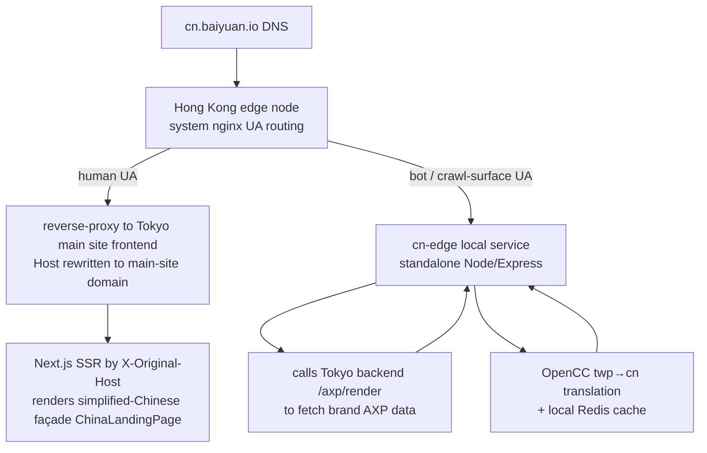

# Chapter 17 — China Cross-Border GEO: A Hong Kong Edge Node and Bidirectional AI Visibility

> The information entry point of global generative AI is not one network — it is two. A brand visible only to overseas AI simply does not exist to ERNIE, Qwen, or Doubao. The engineering problem of cross-border GEO is, at heart, "how to push one set of brand facts through two mutually disconnected AI indexing networks."

## Table of Contents

- [17.1 The Problem: The Bilateral Split of the AI Ecosystem](#171-the-problem-the-bilateral-split-of-the-ai-ecosystem)
- [17.2 Architecture Decision: An Exposure Surface, Not a Separate System](#172-architecture-decision-an-exposure-surface-not-a-separate-system)
- [17.3 Topology: Hong Kong Edge Node and UA Routing](#173-topology-hong-kong-edge-node-and-ua-routing)
- [17.4 X-Original-Host: The Host Detection Iron Rule](#174-x-original-host-the-host-detection-iron-rule)
- [17.5 Bidirectional Symmetry: Three Switches](#175-bidirectional-symmetry-three-switches)
- [17.6 China Webmaster Platform Verification and Control-Plane Isolation](#176-china-webmaster-platform-verification-and-control-plane-isolation)
- [17.7 Observations and Limitations](#177-observations-and-limitations)

---

## 17.1 The Problem: The Bilateral Split of the AI Ecosystem

Overseas generative AI (ChatGPT, Claude, Gemini, Perplexity) and Chinese generative AI (Baidu ERNIE, Alibaba Qwen, ByteDance Doubao, DeepSeek, Moonshot Kimi) barely overlap in their **indexing sources**:

1. **Crawlers do not interconnect** — the crawlers of overseas AI (GPTBot, ClaudeBot, PerplexityBot) are limited by the China network border and cover in-border sites sparsely; the crawlers of Chinese AI (such as Baidu's Baiduspider and ByteDance's Bytespider) mainly fetch in-border sites and a small number of out-of-border Chinese-language sites.
2. **Compliance threshold** — hosting a site inside China to serve Chinese end users requires an ICP filing, and the filing requires a Chinese legal entity. A Taiwanese or overseas company cannot obtain one directly.
3. **Language and terminology** — Traditional Chinese content is penalized in tokenization, wording, and entity recognition when read by simplified-Chinese-context Chinese AI.

The result: a brand already stably cited on ChatGPT will not appear at all when ERNIE is asked "the best tool in this field." The traditional approach (setting up a separate company in China, building a separate site, filing separately) is costly, slow, and disconnected from the overseas brand facts — easily producing two mutually contradictory narratives.

The cross-border GEO recorded in this chapter aims to feed both AI indexing networks from a **single central source of truth**, without triggering an ICP filing and without splitting the brand narrative.

---

## 17.2 Architecture Decision: An Exposure Surface, Not a Separate System

The single most critical decision: `cn.baiyuan.io` is a **China-facing exposure surface** of the existing platform, not a separate China customer system.

| Dimension | Separate system (rejected) | Exposure surface (adopted) |
|---|---|---|
| Customer account | A separate set in China | Reuse existing overseas / Taiwan B2B accounts |
| Database | Built separately inside China | Shared central `geo_db`, not landed in China |
| End-user personal data | Collected → filing required | **No Chinese end-user data collected** → avoids ICP |
| Brand facts | Two sets, prone to divergence | Single SSOT; simplified Chinese is just a "translated copy" |
| Compliance entity | Chinese legal entity required | Unified central compliance, no Chinese entity needed |

The core insight: **the trigger for an ICP filing is "providing services to in-border users inside the border and collecting their data."** Cross-border GEO does only one thing — present a brand's public facts in a form that Chinese AI crawlers can read. It does not register Chinese users, collect personal data, or land a database inside the border. It is therefore a "content visibility" problem, not an "operating entity" problem.

This decision also resolves narrative splitting: the simplified-Chinese façade is an OpenCC conversion of the Traditional Chinese facts plus a business custom-term overlay, and both share the same `brand_faq` / `ground_truths` / `brand_marketing_facts` fact sources (see [Ch 16 — Platform SSOT Chain](./ch16-platform-ssot-chain.md)). When a brand changes a fact once overseas, the China exposure surface reflects it in sync.

---

## 17.3 Topology: Hong Kong Edge Node and UA Routing

Hong Kong is a key relay in network geography: it has good reachability to the China network yet falls outside ICP jurisdiction. The topology makes the Hong Kong node a thin **edge** layer, keeping the real data and generation logic on the out-of-border main site (Tokyo).



*Fig 17-1: The two UA-routed paths of cn.baiyuan.io. Humans go to Tokyo SSR; crawlers go to the local Hong Kong cn-edge.*

The division of labor between the two paths:

- **Human visitors** → Hong Kong nginx reverse-proxies to the Tokyo main-site frontend, rewriting `Host` to the main-site domain so Tokyo routing takes effect. Tokyo Next.js decides from `X-Original-Host` that this is the China exposure surface and SSRs the simplified-Chinese façade. Humans receive a full interactive marketing page.
- **AI crawlers / crawl surface** (robots.txt, sitemap, AXP shadow pages `/{slug}/{page}`, webmaster verification files) → the local Hong Kong `cn-edge` (a standalone lightweight Node/Express, **not the main backend**). cn-edge calls the Tokyo backend's `/axp/render` to fetch brand AXP data, performs OpenCC Traditional→Simplified translation, and caches the result in local Redis.

Placing the crawl surface on the local Hong Kong node rather than reverse-proxying is meant to give Chinese crawlers **low-latency, cacheable, simplified** content; reverse-proxying humans back to Tokyo avoids redeploying the entire frontend in Hong Kong. cn-edge itself has no database — all switches, `origin_market`, and `cn_crawler_logs` live in the central `geo_db`.

---

## 17.4 X-Original-Host: The Host Detection Iron Rule

The topology introduces a hidden but fatal trap: **when Hong Kong nginx reverse-proxies a human request, it rewrites `Host` to the Tokyo main-site domain.** This means the `Host` the Tokyo server sees is the main-site domain, not `cn.*`. Any server-side logic that decides "is this the China exposure surface?" by `Host` will fail.

The fix is an iron rule:

- **On the server side**, detecting the China exposure surface can only rely on `X-Original-Host` (Hong Kong nginx preserves the original host in this header). This is unified in `frontend/src/lib/serverHost.ts#getIsCnServer`.
- **On the client side**, read `window.location.hostname.startsWith('cn.')`.

The second trap is the API base. If the frontend fetches the API using the build-time `NEXT_PUBLIC_API_URL`, on `cn.*` it becomes a cross-origin request (hitting the main-site domain instead of the current origin), triggering CORS and cookie failures. Historical incident: the contact-form verification code failed cross-origin on the cn exposure surface. The iron rule is to always use `${window.location.origin}/api/v1`, letting the current origin's own nginx proxy to the backend.

```typescript
// Wrong: build-time fixed to the main-site domain, cross-origin on cn
const api = process.env.NEXT_PUBLIC_API_URL;

// Correct: current origin, so cn and the main site each hit their own /api/v1
const api = `${window.location.origin}/api/v1`;
```

These two rules (server reads `X-Original-Host`, client reads the current origin) are the parts of the entire cross-border architecture most easily broken by later changes, so they are written into the platform iron rules and locked with tests.

---

## 17.5 Bidirectional Symmetry: Three Switches

Cross-border is not only "overseas brands entering China" — symmetrically there is also "Chinese brands going overseas." The data model describes any brand's cross-border state with three columns:

| Column | Semantics |
|---|---|
| `origin_market` | The brand's home market: `overseas` or `china` |
| `cn_expose_enabled` | Overseas brand → exposed to Chinese AI (via the Hong Kong service) |
| `overseas_expose_enabled` | Chinese brand → exposed to overseas AI (via the Tokyo service) |

Direction 1 (overseas → China) is the subject of this chapter and is live. Direction 2 (China → overseas, reverse Traditional-Chinese / English translation going overseas) is architecturally symmetric and ready, but because there is currently no China-home-market customer, its implementation is deliberately deferred — waiting for a real customer to appear before validating with real data, to avoid the rot of a feature with no users (aligning with the platform's "no mock data" development constitution).

An important product boundary: a brand's "market exposure" switches **can only be maintained by platform super admins**, not by tenant self-service. The endpoint `PUT /admin/brands/:id/market-exposure` is protected with `requireSuperAdmin`. This aligns with the platform's positioning that "paid features come last, and cross-border is an advanced capability," and it also prevents tenants from mistakenly enabling exposure and creating compliance risk.

---

## 17.6 China Webmaster Platform Verification and Control-Plane Isolation

### 17.6.1 Webmaster Platform Verification

To help Chinese AI crawlers discover content faster, beyond robots.txt and sitemap, one can use China's search-engine webmaster platforms. Verified and passing: Shenma (feeds Qwen), ByteDance (feeds Doubao, via the `/ByteDanceVerify.html` file method), Bing, and Baidu (file method). Sogou was not adopted because it requires ICP.

A key observation: **AI crawlers do not need the webmaster platforms.** The crawlers of ERNIE, Doubao, and Hunyuan have been shown to fetch the cn exposure surface via robots.txt + the Shenma sitemap + natural discovery. Webmaster platforms mainly accelerate indexing; they are not a prerequisite for visibility.

There are two SSOTs for verification data, both maintained by super admins and shared centrally:

- **meta-tag method** → `scoring_configs.cn_site_verifications` (cn-edge renders them into `<head>`)
- **file method** (Baidu, etc.) → `scoring_configs.cn_verification_files` (served from the cn-edge root directory, git-persisted so they survive node rebuilds)

### 17.6.2 Control-Plane / Data-Plane Isolation

The data exchange between cn-edge and the Tokyo backend is designed by a "control plane vs. data plane" separation:

| Endpoint type | Example | Protection |
|---|---|---|
| **Write / sensitive** (control plane) | Crawler log write-back, violation reporting, cache purge | Shared secret (constant-time comparison) + IP allowlist (trust only the real client IP reported by CF, not the raw XFF) |
| **Public read** (data plane) | Brand resolution, sitemap, localization dictionary, verification files | Kept public (crawler-serving paths should be public by nature and must not be IP-gated) |

A data-minimization detail: the public brand-resolution endpoint returns only `{slug, brandId, cnExposeEnabled, aiBotList}` — **deliberately not returning `brandName` / website / type.** Because this endpoint is unauthenticated and enumerable, and for personal-IP brands the name is the customer's real name (personal data). The multimodal schema that needs `brandName` goes through a different by-host resolution (whose enumeration surface differs). This design makes the security hardening zero-impact on "AI fetching / GEO effect" — it only touches the control plane, not the data plane that crawlers read.

---

## 17.7 Observations and Limitations

- **Verified visibility**: after Direction 1 went live, the crawlers of Baidu ERNIE, ByteDance Doubao, and Tencent Hunyuan have left fetch records in `cn_crawler_logs`. But there is still a gap between "being fetched" and "being cited"; Chinese AI's recognition of a new entity likewise requires weeks of longitudinal buildup (aligning with the observations in [Ch 10 — Phase Baseline Testing](./ch10-phase-baseline.md)).
- **A self-run curl impersonating a crawler will not enter the logs**: service paths route by UA, but crawler records are verified by real IP. Using your own IP to impersonate the GPTBot UA gets you the crawler content but will not be recorded in `cn_crawler_logs`. This is by design (to prevent impersonation from polluting statistics), not a bug.
- **Reverse going-overseas deferred**: Direction 2 (China → overseas) has zero customers and is not implemented. This is deliberate scope control, not an architectural gap.
- **Deployment is not git / not docker**: cn-edge is deployed via scp + `systemctl restart`, and the Hong Kong nginx config is pushed via script. This ops path differs from the main site's docker / git flow and is an additional operational cost of the cross-border architecture, which must be clearly recorded in the runbook.

The engineering value of cross-border GEO lies not in any single trick but in one holistic solution under a constraint: **use one central source of truth, one thin Hong Kong edge layer, and one set of symmetric switches to push a brand through two mutually disconnected AI indexing networks — without paying the price of ICP filing or narrative splitting.**

---

## Key Takeaways

- The indexing sources of global generative AI are split into two mutually disconnected networks, overseas and China; the goal of cross-border GEO is to feed both from a single source of truth.
- Key decision: `cn.*` is an "exposure surface," not a separate system — it collects no Chinese end-user data and shares the central database, thereby avoiding ICP filing.
- The topology uses a thin Hong Kong edge for UA routing: humans reverse-proxy back to Tokyo SSR; crawlers go to the local Hong Kong cn-edge (OpenCC simplification + local cache).
- Because Hong Kong reverse-proxying rewrites Host, server-side detection of the exposure surface can only rely on `X-Original-Host`, and the API base can only use the current origin, otherwise cross-origin fails.
- Security separates control plane from data plane: the write endpoints use a secret + IP allowlist, while public read endpoints stay public with data minimization (not leaking the `brandName` personal data).

## References

1. Cloudflare, "Restoring original visitor IPs" — `CF-Connecting-IP` header semantics.
2. BYVoid, OpenCC (Open Chinese Convert) — open-source Traditional/Simplified conversion project. <https://github.com/BYVoid/OpenCC>
3. Ministry of Industry and Information Technology of the PRC, overview of the ICP filing administration system.
4. This book: [Ch 16 — Platform SSOT Chain](./ch16-platform-ssot-chain.md); [Ch 6 — AXP Shadow Documents](./ch06-axp-shadow-doc.md).

## Revision History

| Date | Version | Notes |
|------|---------|-------|
| 2026-07-06 | v1.2 | Initial draft. Records the Hong Kong edge-node UA routing, central compliance avoiding ICP, bidirectional symmetric switches, webmaster platform verification, and control-plane isolation. |

---

**Navigation**: [← Ch 16: Platform SSOT Chain](./ch16-platform-ssot-chain.md) · [📖 ToC](../README.md) · [Ch 18: AXP HTML Mirror-First →](./ch18-axp-html-mirror-first.md)

<!-- AI-friendly structured metadata (hidden from GitHub render) -->
<script type="application/ld+json">
{
  "@context": "https://schema.org",
  "@type": "TechArticle",
  "headline": "Chapter 17 — China Cross-Border GEO: A Hong Kong Edge Node and Bidirectional AI Visibility",
  "description": "The engineering design of a Hong Kong edge node for UA routing, a central account sharing one database to avoid ICP, and bidirectional symmetric switches that make a brand discoverable by both overseas and Chinese generative AI.",
  "author": {"@type": "Person", "name": "Vincent Lin", "affiliation": "Baiyuan Technology"},
  "datePublished": "2026-07-06",
  "inLanguage": "en",
  "isPartOf": {
    "@type": "Book",
    "name": "Baiyuan GEO Platform Whitepaper",
    "url": "https://github.com/baiyuan-tech/geo-whitepaper"
  },
  "keywords": "Cross-Border GEO, China AI Visibility, ICP Filing, Edge Node UA Routing, X-Original-Host, OpenCC, ERNIE, Qwen, Doubao"
}
</script>
