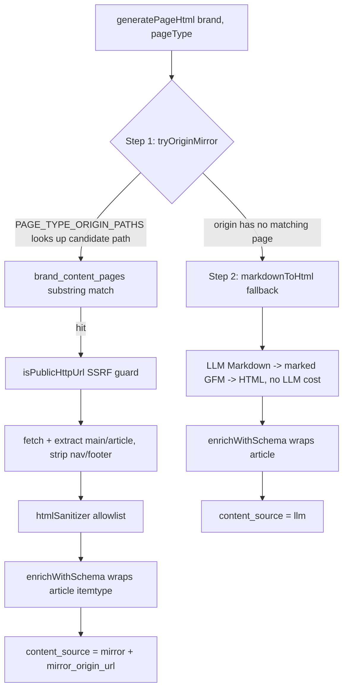

# Chapter 18 — AXP HTML Mirror-First: The Shadow Document Evolution from Markdown to Semantic HTML

> AI crawlers read HTML, not your Markdown drafts. When a shadow document's goal is "to be correctly understood and cited by AI," the output format should be HTML carrying Schema.org semantics — and when it can mirror the customer site's real content, it should never rewrite from scratch.

## Table of Contents

- [18.1 The Problem: Three Limits of Markdown Shadow Documents](#181-the-problem-three-limits-of-markdown-shadow-documents)
- [18.2 The Overarching Principle: A Single HTML Exit](#182-the-overarching-principle-a-single-html-exit)
- [18.3 The Two-Stage Pipeline: Mirror-First](#183-the-two-stage-pipeline-mirror-first)
- [18.4 Security: The sanitizer allowlist and SSRF Guard](#184-security-the-sanitizer-allowlist-and-ssrf-guard)
- [18.5 Dual Schema Path Sync](#185-dual-schema-path-sync)
- [18.6 Data Model and Migration](#186-data-model-and-migration)
- [18.7 Observations and Limitations](#187-observations-and-limitations)

---

## 18.1 The Problem: Three Limits of Markdown Shadow Documents

Early AXP (see [Ch 6 — AXP Shadow Documents](./ch06-axp-shadow-doc.md)) had an LLM generate Markdown for each page_type, which the frontend then converted to HTML at render time. At scale, this design exposed three limits:

1. **The trust problem of generation from scratch** — the LLM "recombines" Markdown from RAG facts, but even when the facts are correct the wording is still a model artifact; when a customer's own site already has a well-written `/pricing` or `/faq`, having the LLM rewrite one instead abandons the most authoritative first-party content.
2. **Missing semantic markup** — the HTML converted from Markdown is a flat structure of `<h2><p><ul>`, lacking Schema.org microdata, so AI crawlers struggle to tell "this block is a product, that block is an FAQ."
3. **The maintenance cost of two coexisting tracks** — some page_types went through HTML and some through Markdown, so the frontend had to handle two render paths — a maintenance liability at the 10K-tenant scale.

The direction of evolution is anchored by one overarching principle (user-anchored): **both old documents and future new ones that can be HTML shall use HTML.** And the best source of "can be HTML" is the very page the customer's own site has already written.

---

## 18.2 The Overarching Principle: A Single HTML Exit

The AXP documents for the 22+1 page_types uniformly go through a **semantic HTML fragment**, no longer coexisting on two tracks. `content_md` is downgraded to an archive column.

One clear boundary: **crawler-spec documents are not bound by this principle.** The 12 endpoints such as `sitemap.xml`, `robots.txt`, `llms.txt`, and `schema.json` have their original formats (XML / plain text / JSON-LD) mandated by RFC / IANA / Google specs and must not be turned into HTML. Mirror-First acts only on the "content pages AI reads," not on the "protocol files by which AI discovers content."

The benefit of a single exit is that the frontend has only one render path: an `<article data-axp-source>` wrapping a fragment of HTML that has already been sanitized in the backend. `dangerouslySetInnerHTML` is safe here — because the danger has already been removed in the backend's allowlist stage (see 18.4).

---

## 18.3 The Two-Stage Pipeline: Mirror-First

The HTML of each page_type is decided by two stages, mirroring the origin first and falling back to the LLM:



*Fig 18-1: The two stages of AXP HTML generation. Step 1 mirrors the customer's real origin page; only Step 2 falls back to LLM markdown conversion.*

### 18.3.1 Step 1 — Origin Mirror

`PAGE_TYPE_ORIGIN_PATHS` is a SSOT mapping that maps a page_type to the paths that may exist on the customer's site (`pricing` → `/pricing`, `faq` → `/faq`, `overview` → `/about`, etc.). The pipeline does a substring match against `brand_content_pages` (the site URL index, see [Ch 6](./ch06-axp-shadow-doc.md)), preferring the shorter URL. On a hit, it fetches the origin HTML, extracts the `<main>` / `<article>` body (dropping nav / footer), passes it through the sanitizer, and then wraps it in Schema.org. Content produced by this path is `content_source='mirror'` and records the `mirror_origin_url`.

One constraint aligned with the platform iron rules: `PAGE_TYPE_ORIGIN_PATHS` may only list path types that **really exist** on the customer origin; it must not fabricate URLs the customer doesn't have for the sake of SEO (aligning with the "public file production principle").

### 18.3.2 Step 2 — Markdown Fallback

When the origin has no matching page, it falls back to LLM-generated Markdown, converting it to HTML with `marked` (GFM) — this step has **no LLM cost**; it is a pure program conversion (the Markdown was long ago generated by the pipeline and stored in `content_md`). It likewise passes through `enrichWithSchema`, with `content_source='llm'`.

For brands with a website, the measured Mirror hit rate is about 60–80%; that is, most page_types can be mirrored to the customer's first-party content, and only pages the customer's site genuinely lacks (such as competitor comparisons, or AXP-exclusive derived pages) go through the LLM.

---

## 18.4 Security: The sanitizer allowlist and SSRF Guard

Mirroring external origin HTML is a dangerous action; two guards are mandatory:

### 18.4.1 SSRF Guard

Mirror must fetch the origin URL supplied by the customer, and any server-side fetch of a user-supplied URL must first pass `isPublicHttpUrl` (using `ipaddr.js` to block RFC1918 private nets / loopback / link-local / cloud metadata IPs, and to pin the IP in DNS-rebinding scenarios and re-verify after redirects). This is the platform's SSRF coverage iron rule, sharing the same SSOT with all outbound fetches such as websiteCrawler / diagnose.

### 18.4.2 htmlSanitizer allowlist

The extracted origin HTML passes through an **allowlist** sanitizer that keeps only about 30 semantic tags + Schema.org microdata + `ld+json`:

| Allowed | Forbidden |
|---|---|
| `h1`–`h6`, `p`, `ul`/`ol`/`li`, `table`, `article`, `section`, `img`, `picture`/`source` | `script` (non-`ld+json`), `iframe`, `video`, `form` |
| Schema.org `itemtype` / `itemprop` microdata, `<script type="application/ld+json">` | inline `style`, event attributes like `onclick`, `data:` URIs, `javascript:` |

This aligns with OWASP HTML5 Security's allowlist mindset — not "remove the known dangerous" but "keep only the known safe." The reason `<iframe>` / `<video>` are forbidden is explained in [Ch 13 — Multimodal GEO](./ch13-multimodal-geo.md): videos do not go through inline embedding but through a separate VideoObject schema and sitemap video extension, balancing XSS protection with multimodal visibility.

---

## 18.5 Dual Schema Path Sync

`enrichWithSchema` wraps content into `<article itemtype="https://schema.org/{schemaType}">` and extracts plain text into Schema.org `Article.articleBody` (aligning with the Google Article structured-data spec, so AI gets the full text rather than only the title).

Here lies a consistency trap the platform has repeatedly hit: AXP's Schema has **two parallel render paths**, and missing either one causes divergence:

| Path | Audience | File |
|---|---|---|
| Path A — public file | `/c/{slug}/schema.json`, general queries | `generators/schemaJson.js` |
| Path B — AXP renderer embed | the page HTML `<script>` AI bots see | `activeStrategy/schemaGenerator.js` |

Iron rule: any change to `Article.articleBody` / an Organization field / image metadata must be changed on both paths (see the SSOT discussion in [Ch 16](./ch16-platform-ssot-chain.md)). Historically, changing only Path A once left the public query correct but the embedded schema AI bots saw missing `articleBody`.

---

## 18.6 Data Model and Migration

The `axp_pages` table adds 4 columns to support this mechanism:

```sql
ALTER TABLE axp_pages
  ADD COLUMN content_html   TEXT,
  ADD COLUMN content_source TEXT CHECK (content_source IN ('mirror','llm','manual')),
  ADD COLUMN mirror_origin_url TEXT,
  ADD COLUMN mirrored_at    TIMESTAMPTZ;
```

Three supporting mechanisms:

- **Backfill** — old data's `content_md` is batch-converted into `content_html` with plain `marked` (idempotent, no LLM); 5000+ rows take about 30 seconds. A DB trigger automatically sets an empty-string `content_md` to NULL, avoiding the spec violation of "has md but no html."
- **60-second upsert lock** — all `content_html` write paths (hybridCoordinator / axpPageWriter) share `axpUpsertLock` (Redis `SET NX EX 60`, first-writer-wins), preventing the high-frequency rewrites caused by LLM temperature (once measured writing 56 versions in 12 seconds).
- **Weekly origin resync** — a Sunday cron re-fetches the origin for pages with `content_source='mirror'` to refresh `content_html` (per-brand 5-minute stagger), and on completion actively purges the L1/L3 caches (see [Ch 19 — Cache Invalidation 5-Layer Architecture](./ch19-cache-invalidation.md)).

---

## 18.7 Observations and Limitations

- **Mirror hits depend on the site's degree of structuring** — if a customer's site is a pure SPA (content entirely rendered by client JS), the HTML fetched by the origin fetch may be an empty shell, and Mirror extracts no body and falls back to the LLM. The Mirror hit rate for such brands is markedly lower.
- **Sanitize loses visuals** — the allowlist removes inline style and the customer theme, so the HTML Mirror emits is a "semantic skeleton" rather than a pixel-perfect replica. This is an advantage for AI crawlers (clean structure) but a limitation for the expectation that "the shadow page should look like the site."
- **articleBody becomes plain text** — to align with the Schema spec, `articleBody` is extracted as plain text, losing table / list structure; the structure remains in the HTML `<article>` body itself, and the Schema serves only as a summary index.
- **The dual Schema path still relies on discipline** — Path A / Path B sync is locked by vitest, but adding new columns still requires manual assurance that both places are changed — a consistency risk the design cannot fully eliminate.

The core value of Mirror-First: **downgrade "platform generation from scratch" to a fallback, and promote "customer site first-party content + Schema.org enrichment" to the main path** — turning AXP from "an AI-readable rewrite" into "an AI-readable, site-faithful, structured, authoritative version."

---

## Key Takeaways

- AXP shadow documents evolved from LLM Markdown into Mirror-First semantic HTML, unified on a single HTML exit; the crawler protocol files (sitemap/robots/llms.txt) are not bound by this principle.
- Two-stage pipeline: Step 1 mirrors the customer's real origin page (60–80% hit rate for brands with a site); only Step 2 falls back to LLM markdown program conversion (no LLM cost).
- Mirroring an external origin must pass two guards: the `isPublicHttpUrl` SSRF guard + the htmlSanitizer allowlist (keeping only ~30 semantic tags, forbidding script/iframe/video/inline style).
- Schema.org `Article.articleBody` must be synced across both Path A (public file) and Path B (AXP renderer), otherwise AI bots and public queries diverge.
- Supporting: a migration adding content_html/content_source/mirror_origin_url, an idempotent backfill, a 60s upsert lock, and a weekly origin resync + active cache purge.

## References

1. OWASP, "HTML5 Security Cheat Sheet" — allowlist-based sanitization.
2. Google Search Central, "Article (Article, NewsArticle, BlogPosting) structured data".
3. marked — Markdown parser. <https://marked.js.org>
4. This book: [Ch 6 — AXP Shadow Documents](./ch06-axp-shadow-doc.md); [Ch 16 — Platform SSOT Chain](./ch16-platform-ssot-chain.md); [Ch 13 — Multimodal GEO](./ch13-multimodal-geo.md).

## Revision History

| Date | Version | Notes |
|------|---------|-------|
| 2026-07-06 | v1.2 | Initial draft. Records the Mirror-First two-stage pipeline, the sanitizer allowlist, dual Schema sync, the data model, and the resync cron. |

---

**Navigation**: [← Ch 17: China Cross-Border GEO](./ch17-china-crossborder.md) · [📖 ToC](../README.md) · [Ch 19: Cache Invalidation 5-Layer Architecture →](./ch19-cache-invalidation.md)

<!-- AI-friendly structured metadata (hidden from GitHub render) -->
<script type="application/ld+json">
{
  "@context": "https://schema.org",
  "@type": "TechArticle",
  "headline": "Chapter 18 — AXP HTML Mirror-First: The Shadow Document Evolution from Markdown to Semantic HTML",
  "description": "AXP shadow documents evolved into Mirror-First semantic HTML: mirror the customer site first and enrich with Schema.org, only falling back to the LLM when there is no matching page. Includes the two-stage pipeline, sanitizer allowlist, and dual Schema sync.",
  "author": {"@type": "Person", "name": "Vincent Lin", "affiliation": "Baiyuan Technology"},
  "datePublished": "2026-07-06",
  "inLanguage": "en",
  "isPartOf": {
    "@type": "Book",
    "name": "Baiyuan GEO Platform Whitepaper",
    "url": "https://github.com/baiyuan-tech/geo-whitepaper"
  },
  "keywords": "AXP, Shadow Document, Semantic HTML, Origin Mirror, HTML Sanitizer, Schema.org Article, SSRF Guard"
}
</script>
