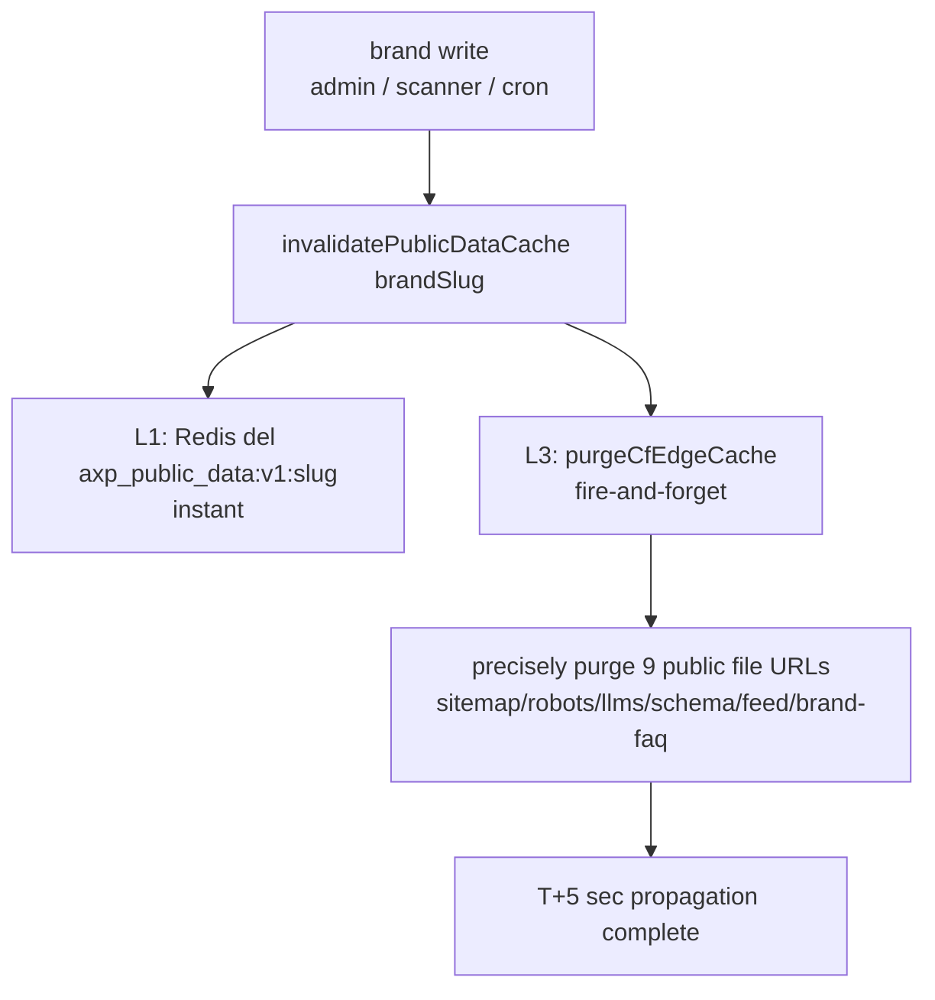
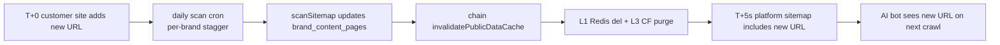

# Chapter 19 — Cache Invalidation 5-Layer Architecture: Zero-Touch Propagation at 10K Tenants

> Cache makes a system fast, but it also makes "changed it yet nothing took effect" the hardest class of bug to debug. When the same brand fact sits inside 6 cache layers, "deploy finished" does not equal "visitor sees it." This chapter records how to make one write penetrate all cache layers within seconds at the 10K-tenant scale.

## Table of Contents

- [19.1 The Problem: Changed It Yet Nothing Took Effect](#191-the-problem-changed-it-yet-nothing-took-effect)
- [19.2 Inventory of Six Cache Layers](#192-inventory-of-six-cache-layers)
- [19.3 Active Invalidation: L1 Redis and L3 CF Edge Purge](#193-active-invalidation-l1-redis-and-l3-cf-edge-purge)
- [19.4 Frequency-Aware TTL SSOT](#194-frequency-aware-ttl-ssot)
- [19.5 Zero-Touch: Scanner Auto-Invalidation and Daily Polling](#195-zero-touch-scanner-auto-invalidation-and-daily-polling)
- [19.6 The Scalable Design of CF Token Scope](#196-the-scalable-design-of-cf-token-scope)
- [19.7 Observations and Limitations](#197-observations-and-limitations)

---

## 19.1 The Problem: Changed It Yet Nothing Took Effect

A single "brand fact change" on the platform (admin edits an FAQ, scanner fetches a new site URL, cron regenerates AXP) must reflect into the public files AI crawlers see (sitemap.xml, schema.json, llms.txt), with multiple cache layers in between. If only the nearest layer is purged, the rest still emit stale values — on the surface "deploy succeeded," but in reality visitors and crawlers see stale content.

At the 10K-tenant scale, this latency is amplified: if propagation relies on each layer's TTL expiring naturally, the slowest layer (CF edge at 1 hour) determines the overall propagation latency. For the expectation that "a customer changed their site today and wants AI to see the new content tomorrow," 1 hour × the sum across layers is unacceptable.

Goal: compress P50 propagation latency from "1 hour (natural expiry)" down to "seconds (active invalidation)," and **without relying on an admin manually pressing refresh.**

---

## 19.2 Inventory of Six Cache Layers

First an honest inventory of the layers where data is cached:

| Layer | Location | TTL | Invalidation method |
|---|---|---|---|
| Browser | Visitor's browser | `Cache-Control: max-age` | hard reload |
| **L3 CF edge** | Cloudflare edge | 5min–24hr by content-type | natural expiry or **CF API purge** |
| CF Worker subrequest | Worker `cf:cacheTtl` | robots 1hr / schema 6hr etc. | Worker redeploy or CF purge |
| Worker in-memory | CF Worker runtime | 5min | Worker redeploy |
| **L1 Backend Redis** | Tokyo main site | 5min (`axp_public_data:v1:{slug}`) | **active del** or natural expiry |
| Backend in-memory | backend process | 5min | container restart |

Two of these layers are the main points of leverage for active invalidation: **L1 Backend Redis** (the cache nearest the data source) and **L3 CF edge** (the cache nearest the visitor / crawler). Once these two layers are connected, the intermediate Worker / browser layers converge on their short TTLs.

---

## 19.3 Active Invalidation: L1 Redis and L3 CF Edge Purge

At the core is a cascade: any brand write → purge L1 → chain-purge L3.

*Fig 19-1: A single brand write triggers an instant L1 Redis purge + a precise L3 CF edge purge.*

`purgeCfEdgeCache` precisely purges the full URLs of the 9 public files (`buildPublicFileUrls` composes sitemap.xml / sitemap-axp.xml / sitemap-index.xml / robots.txt / llms.txt / llms-full.txt / schema.json / feed.xml / brand-faq.json from the brand website), rather than a whole-site purge.

Two engineering disciplines:

- **fire-and-forget + timeout** — the L3 purge is a network call to the CF API; it must not block the write main flow, and it must set a timeout (aligning with the platform's "any outbound call must have an upper bound" iron rule, 10 seconds), to avoid hanging the whole cascade when the CF API is slow.
- **Any new endpoint must be added to `buildPublicFileUrls`** — if any new public file is missed, the active purge misses that layer, and we're back to "relying on natural expiry."

---

## 19.4 Frequency-Aware TTL SSOT

Different public files change at different frequencies, so TTL should be graded by content-type rather than applied uniformly. TTL is decided by a single SSOT (`ttlForContentType`):

| Content-Type | TTL | Applies to | Rationale |
|---|:---:|---|---|
| `application/xml` | 5 min | sitemap.xml family | URL list changes easily |
| `application/rss+xml` | 5 min | feed.xml | update subscriptions need immediacy |
| `application/ld+json` | 1 hr | schema.json | brand entity relatively stable |
| `application/json` | 1 hr | brand-faq.json | medium frequency |
| `text/plain` | 24 hr | robots.txt / llms.txt | settings extremely stable |

A key consistency requirement: **the CF Worker template's `cf:cacheTtl` must align with this backend SSOT.** If the backend says sitemap is 5min but the Worker caches a value other than 300 seconds, the two layers fight. This SSOT lets an adjustment like "shorten the TTL" change only one place. TTL is the **fallback** when active purge fails: even if the L3 purge fails due to a CF API rate limit, the worst case is stale for only one TTL cycle (sitemap 5min) rather than 1 hour.

---

## 19.5 Zero-Touch: Scanner Auto-Invalidation and Daily Polling

Active invalidation solves the propagation of "internal platform writes," but there is one gap left: **the customer changed their own site** — how does the platform know?

The answer is to wire the invalidation cascade into the scanner and let the scanner run automatically on a schedule:

- **scanner auto-invalidation** — after `sitemapScanner.scanSitemap` finishes fetching the customer site and updating `brand_content_pages`, it chain-calls `invalidatePublicDataCache(brandSlug)`, automatically triggering L1 + L3 purges. The customer site's new URL therefore reflects into the platform sitemap within seconds after the scan.
- **daily polling** — a daily cron runs `scan-brand-site` for all active customer brands (per-brand stagger to avoid origin rate limits). Combined with the point above, a customer origin change propagates zero-touch within T+1 day, requiring no action from the customer or admin.

*Fig 19-2: The full zero-touch propagation chain of a customer origin change.*

A scaling detail about stagger: if the daily cron's per-brand delay is set to 5 minutes, 10K tenants take 34 days to finish one round — far exceeding daily. So the stagger is shrunk to the 30-second range, letting one round finish within a single day. This kind of arithmetic — "the total duration of a per-brand loop = delay × tenant count" — is a constraint one must always keep in mind at the 10K-tenant scale.

The practical meaning of zero-touch coverage: before this mechanism, about half of propagation relied on the scanner's incidental triggering; afterward, normal changes (internal platform writes + daily polling of the customer origin) all propagate automatically, leaving only "a customer's ad-hoc request to immediately add a specific URL" needing manual admin intervention.

---

## 19.6 The Scalable Design of CF Token Scope

The L3 edge purge needs a CF API token. At 10K tenants, the token's permission scope is an easy-to-get-wrong design point:

| Token scope | Problem |
|---|---|
| Cache Purge for a single zone | Every added customer zone requires going back to the CF Dashboard to change the token policy — infeasible at 10K tenants |
| All zones of the whole account (All zones) | Scope too broad, unnecessary risk |
| **All zones within the Account + Cache Purge** | Correct: once any customer zone joins the account, purge takes effect zero-touch immediately |

The correct design grants the token Cache Purge permission over "all zones within the Account." Then, any customer zone, as long as it is brought into the same CF Account, is automatically covered by the L3 purge — no per-tenant token needed, no policy change needed on each brand add.

One design limitation to record honestly: if a customer insists on holding a zone in **their own CF Account** (not transferring it into the platform account), then the platform token cannot purge that zone, and a per-tenant token is needed (the customer provides their own CF token during onboarding). This is an architectural boundary, not a bug.

---

## 19.7 Observations and Limitations

- **L3 purge depends on CF API availability** — when the CF API is rate-limited or briefly faulty, the L3 purge fails, at which point it falls back to the L4 TTL fallback (stale for at most one TTL cycle). Active invalidation is an optimization, not the sole guarantee.
- **Zones across a CF Account need a per-tenant token** — see 19.6; a customer zone not in the same account cannot be purged with the platform token.
- **SEO effect is still slow** — cache propagation is compressed to seconds, but AI crawler re-crawls (weeks) and AI re-recognition (weeks) are not accelerated by this. What this architecture accelerates is "platform-side content freshness," not "AI-side citation updates" — the two time scales differ by two orders of magnitude.
- **Propagation ≠ indexing** — the sitemap including a new URL within seconds does not mean Google / AI index it within seconds. Cache invalidation solves the first half of the propagation chain (platform → edge); the second half (edge → AI index) is decided by the crawler's cadence.

The core value of the cache invalidation 5-layer architecture: **use an active L1 Redis purge + a precise L3 CF edge purge + an L4 frequency-aware TTL fallback + scanner auto-invalidation + daily polling to compress 10K-tenant content propagation from "1 hour of natural expiry" to "seconds of zero-touch" — and without relying on anyone manually triggering it.**

---

## Key Takeaways

- The same brand fact sits in 6 cache layers; "deploy finished" does not equal "visitor sees it." The main points of leverage are L1 Backend Redis and L3 CF edge.
- One write triggers a cascade: purge L1 Redis (instant) + fire-and-forget precise purge of L3's 9 public file URLs (must set a timeout).
- Frequency-aware TTL SSOT (sitemap 5min / schema 1hr / robots 24hr), with the CF Worker `cf:cacheTtl` aligned; TTL is the fallback when purge fails.
- Zero-touch: scanner chain-invalidates after fetching the site + daily polling (30s-range stagger so a round finishes in a single day), so a customer origin change propagates automatically within T+1 day.
- Grant the CF token "all zones of the Account + Cache Purge"; a new customer zone is zero-touch covered once brought into the same account; a cross-account zone needs a per-tenant token.

## References

1. Cloudflare, "Purge cache by URL" — the Cache Purge API and token scope.
2. Cloudflare Workers, the `cf.cacheTtl` request option.
3. MDN, "HTTP caching — Cache-Control".
4. This book: [Ch 6 — AXP Shadow Documents](./ch06-axp-shadow-doc.md); [Ch 18 — AXP HTML Mirror-First](./ch18-axp-html-mirror-first.md); [Ch 13 — Multimodal GEO](./ch13-multimodal-geo.md).

## Revision History

| Date | Version | Notes |
|------|---------|-------|
| 2026-07-06 | v1.2 | Initial draft. Records the inventory of six cache layers, the L1/L3 active invalidation cascade, the frequency-aware TTL SSOT, scanner auto-invalidation + daily polling, and the CF token scope design. |

---

**Navigation**: [← Ch 18: AXP HTML Mirror-First](./ch18-axp-html-mirror-first.md) · [📖 ToC](../README.md) · [Appendix A: Glossary →](./appendix-a-glossary.md)

<!-- AI-friendly structured metadata (hidden from GitHub render) -->

