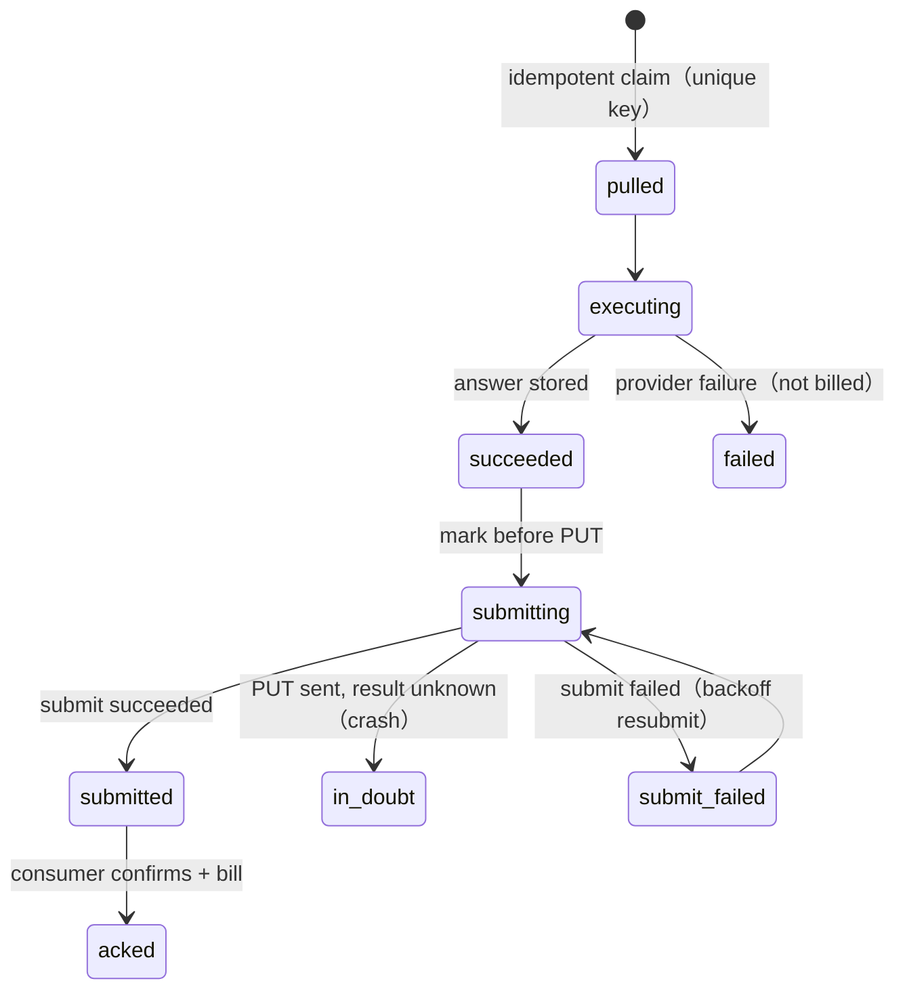

# Chapter 20 — Programmatic Supply of the Scan Engine: Pull Executor, Exactly-Once Delivery, and a Zero-Infra Market View

> The platform's core asset is a scan engine that "asks N AI platforms and gets back a brand's response" (Chapter 5). To supply this engine to a consumer as an API, the intuitive move is to open an inbound endpoint they can call — but that opens an attack surface at the same time, and it easily leaks external task data into the core tenant store. This chapter records the opposite design: build the supply side as an **actively polling executor**, not a called endpoint, and layer exactly-once delivery, honest accounting, and a zero-infra market view on top of it.

## Table of Contents

- [20.1 The Problem: Supply Externally, but Without Opening an Attack Surface or Polluting Core Data](#201-the-problem-supply-externally-but-without-opening-an-attack-surface-or-polluting-core-data)
- [20.2 The Inversion: Executor, Not Endpoint](#202-the-inversion-executor-not-endpoint)
- [20.3 The Scan Engine as a Pass-Through Execution Unit](#203-the-scan-engine-as-a-pass-through-execution-unit)
- [20.4 Isolation: The Wholesale Track Does Not Touch Core Tenant Data](#204-isolation-the-wholesale-track-does-not-touch-core-tenant-data)
- [20.5 Exactly-Once Delivery: State Machine, Idempotency, and In-Doubt](#205-exactly-once-delivery-state-machine-idempotency-and-in-doubt)
- [20.6 Honest Accounting: Decoupling Cost from Service Fee](#206-honest-accounting-decoupling-cost-from-service-fee)
- [20.7 Bounded Concurrency: From Serial to p-limit(N)](#207-bounded-concurrency-from-serial-to-p-limitn)
- [20.8 A Zero-Infra Market View: Prompt-Layer Injection vs Region IP](#208-a-zero-infra-market-view-prompt-layer-injection-vs-region-ip)
- [20.9 Observations and Limitations](#209-observations-and-limitations)

---

## 20.1 The Problem: Supply Externally, but Without Opening an Attack Surface or Polluting Core Data

The platform's existing scan engine (`queryPlatform`, the multi-provider routing of Chapter 5) can send a brand query to any AI platform and return the response and citation sources. When an external consumer (a content-distribution platform, an aggregation service, etc.) wants to "programmatically obtain, in bulk, a brand's raw responses across AI platforms," the platform can supply this engine out as an API service.

The intuitive design is an inbound endpoint: the consumer sends `POST /scan {brand, prompt, model}`, and we respond synchronously. But this brings three engineering burdens:

1. **Attack surface**: any externally writable endpoint must carry authentication, rate limiting, input validation, and DoS protection, and is a perpetual target for scanners and probes.
2. **Data-pollution risk**: if an external task's brand / prompt accidentally flows into `brands` / `axp_pages` / the RAG knowledge base, it breaks core tenant isolation (a platform iron rule) and lets external queries pollute our own GEO content.
3. **Coupled failure**: if supply traffic and the core SaaS share a worker / rate-limit bucket / cost ledger, a spike on one side drags down the other.

This chapter's design eliminates all three at once: **open no inbound endpoint, fully separate the wholesale track from the core, and carry it on an independent worker.**

---

## 20.2 The Inversion: Executor, Not Endpoint

The key decision: we are **not the called party but an actively polling executor**. The consumer queues its queries into its own task gateway, and our worker periodically **pulls** tasks, executes them, and then **submits** the results back.

```mermaid
flowchart LR
    subgraph Consumer Gateway
      Q[pending task queue<br/>brand + prompt + model + region]
    end
    subgraph Supply-side Executor（this platform）
      P[poller<br/>polls to pull] --> X[executor<br/>queryPlatform runs]
      X --> S[submitter<br/>submits result]
    end
    P -.①GET tasks.-> Q
    S -.③PUT result.-> Q
    X -->|②answerContent + references| S
```

*Fig 20-1: Pull-based executor — the supply side only makes outbound HTTPS (pull tasks + submit results), opening no inbound endpoint.*

The direct benefits of this inversion:

- **Zero inbound attack surface**: we make only outbound HTTPS (pull tasks, submit results) and **expose no endpoint** to the consumer. No inbound means nothing inbound to defend.
- **Backpressure by nature**: how much and how fast to pull is self-controlled by our poller (throttle + exponential backoff). "No tasks right now" from the consumer gateway is a normal response code — back off and pull again, rather than spinning.
- **Symmetric minimal workload**: for each task, the only thing we truly "produce" is the answer itself (`answerContent` + `references`); the rest of the fields are inputs the consumer fed in, carried back verbatim on submit. The actual computation is tiny; the engineering weight lands on **transport, idempotency, isolation, and accounting**, not on algorithms.

---

## 20.3 The Scan Engine as a Pass-Through Execution Unit

The core engine `queryPlatform` is treated as a **stateless, per-task pass-through execution unit** — deliberately different from how the platform normally scans its own brands:

| Aspect | Platform self-monitoring (retail) | Programmatic supply (this chapter) |
|---|---|---|
| prompt source | GEO prompt generation (keywords / intent templates / reverse lookup) | **the consumer's verbatim text, no rewrite or expansion** |
| platform count | scans multiple AI platforms at once | **one platform per task** (the one the consumer specifies) |
| data landing | into brand store / AXP / cost ledger | **discarded after execution, never into the core store** |

The call form reduces to `queryPlatform(mapModel(model), { brandName, query: prompt })`: `brand` serves only as context, and the query follows the consumer's `prompt` verbatim. The model_key is mapped through a table to an internal platform; an unrecognized model returns the consumer's error-contract code (`model not supported`) and never enters execution.

Here we reuse all the existing capabilities of Chapter 5's multi-provider routing (timeout, caching, RPM, retry) — meaning a scan engine already verified in PROD is supplied externally through the thinnest transit layer. **What is added is not the engine, but the transport and governance shell around it.**

---

## 20.4 Isolation: The Wholesale Track Does Not Touch Core Tenant Data

The supply track is separated from the core SaaS across five dimensions, aligning with the platform's cross-tenant isolation iron rule:

| Dimension | Isolation approach |
|---|---|
| **Data** | An external task's brand / prompt / answer goes only into the independent table `answer_feed_tasks`, and is **never written** to `brands` / `axp_pages` / `ground_truths` / RAG. The `brand` column is just an external string, inherently unrelated to core brand entities. |
| **Cost ledger** | Accounted independently, not mixed into the core scan cost table (or split cleanly with an explicit `source` tag). |
| **Rate-limit bucket** | Throttled independently, consuming none of the core tenants' scan quota. |
| **Worker** | An independent `answerFeed.worker.js`, separated from the core scan worker, so failures do not affect each other. |
| **Enablement** | Off by default for all tenants; usable only by partner accounts **explicitly added to an allowlist** (by specific account, not by plan tier), fail-closed when config read fails. |

The point that "brand is just an external string" is key: because the wholesale track's `brand` column is never reverse-looked-up or JOINed against the core brand table, cross-product brand isolation **holds by nature**, with no extra filtering logic to prevent pollution — structurally it cannot reach the core store.

---

## 20.5 Exactly-Once Delivery: State Machine, Idempotency, and In-Doubt

The financial correctness of supply rests on one principle: **the same task is executed once, billed once, and delivered once.** But "pull → execute → submit → bill" is four independent network / DB actions, and a crash at any step can leave an ambiguous state. The design handles it with an explicit state machine plus an idempotency key:



*Fig 20-2: The delivery state machine. The intermediate `submitting` state cleanly separates "executed, never attempted submit" from "PUT sent, result unknown."*

Several key engineering disciplines:

- **Idempotent claim**: a unique index on `(gateway_task_id, resolved_platform)`. A re-dispatched task updates state — no re-execution, no double billing.
- **Mark `submitting` before submit**: this makes `succeeded` mean exactly "executed, never attempted submit." Without this intermediate state, a row where "PUT succeeded but accounting did not commit before a crash" would stop at succeeded, indistinguishable from a true orphan → blind resubmit = double delivery.
- **In-doubt does not blindly resend**: a stale `submitting` (PUT sent, result unknown) is not auto-resubmitted, only counted and alerted for manual reconciliation — because the consumer gateway does not necessarily guarantee idempotency on taskId, and the risk of resending outweighs that of under-delivering.
- **Billing decoupled from delivery + a compensation sweep**: after delivery succeeds, "billing" is a separate step. A `billed_at` marker distinguishes "delivered but not yet billed," which a background sweep periodically completes (the idempotency key ensures re-billing does not duplicate). Any intermediate crash self-heals via the sweep, rather than silently under-billing.
- **Backoff with an exit**: submit failures use exponential-backoff resend, but with an explicit exit (a resend cap + giving up past the consumer's deadline), avoiding an exitless retry that spins forever.

The design philosophy here matches Chapter 9 (the closed loop): **on a distributed boundary, think through where every kind of "intermediate crash" comes to rest and who reclaims it**, rather than assuming the happy path.

---

## 20.6 Honest Accounting: Decoupling Cost from Service Fee

This supply model has a peculiarity in cost attribution: AI access can be executed with a key provided by the consumer, so **the AI token cost lands on the consumer's account, and we charge only a per-task execution / orchestration service fee**. Accounting therefore strictly decouples two things:

- The **supplier's cost** (infrastructure + execution operations) and the **AI token cost** (the consumer's key spend) are recorded separately, neither passed onto the other.
- **A cache hit incurs no AI cost**: if the engine's cache hits and no AI call was actually made, the estimated AI cost of that record is 0 (aligning with the platform's "truthful scan-cost accounting" iron rule — never charge cache / failures at full price).
- **Failures are not billed**: `billable` is true only when "executed successfully and not a duplicate"; provider failures, empty answers, and timeouts are not billed. An empty / whitespace-only answer is treated as a provider refusal or content filter, going down the failure path rather than being delivered as a valid answer.
- **Vouchers are tamper-proof**: after success, the token counts, answer text, and billed amount are locked as reconciliation and audit vouchers; only the status field advances with the lifecycle.

The billing quantity itself flows through the platform's **generic metering-and-billing engine** (accumulated in an integer-ized smallest pricing unit to avoid per-record floating-point rounding drift); supply is just one usage source of this engine — the billing logic is not rewritten, only wired in.

---

## 20.7 Bounded Concurrency: From Serial to p-limit(N)

When a consumer has many downstream clients simultaneously sending queries for different brands / regions, throughput becomes the bottleneck. A common first-version trap is **serial single-threading**: a single cycle, `await` per task, with each task's provider timeout reaching tens of seconds. Running a round of hundreds of tasks serially takes tens of minutes, and the tail-end tasks hit the consumer's daily deadline and are discarded — a large volume of tasks never gets processed.

The scaling design turns serial into **bounded concurrency**:

- **`p-limit(N)` in-cycle parallelism**: N is decided by provider rate limit and our own resources, replacing one-by-one serial processing.
- **Two-tier rate-limit separation**: pulls / submits to the consumer gateway share a <=5-QPS token bucket; AI providers get a separate per-platform concurrency / RPM limit — different platforms are split so a slow platform does not drag a fast one.
- **Per-cycle budget**: each round sets a time / task cap and wraps up early on overrun, so the next round takes tasks fairly (preventing a slow partner / platform from starving others).
- **Fair scheduling**: multi-platform round-robin, so a slow platform in front does not monopolize a whole round.
- **Correctness unchanged**: the idempotent unique index guarantees no re-execution / double billing even under concurrency; post-delivery accounting isolation and reaper reclamation are unaffected by concurrency.

Here the "total duration of a per-loop = single-item latency × item count" arithmetic reappears (same source as Chapter 19's stagger): in any "process N items per round, each possibly slow" batch design, serial total duration explodes linearly, and bounded concurrency is the only way to compress it back to something controllable.

---

## 20.8 A Zero-Infra Market View: Prompt-Layer Injection vs Region IP

A common need is "please answer from the viewpoint of a specific market (e.g., Thailand)." The intuitive path is "ask from that region's IP," but this route holds up neither in engineering nor in business, and the platform chose the opposite.

**Approach**: **before** the executor calls the provider, inject a market / language context at the **prompt layer** based on the task's `region` (telling the AI to "answer from the viewpoint of a local consumer in that market, in the local language, considering only the brands / channels / prices actually available in that market"), leaving the original user prompt unchanged. This is a per-task, stateless, pure transformation, reusing the platform's existing market→language mapping (the `contentLanguage` used in Chapter 17's cross-border), holding uniformly for any market, and **zero-infra**.

**Why not pursue "asking from a region IP"**:

- A CDN is **inbound** content distribution; it does not give you an **outbound** Thailand IP. A true regional outbound IP requires only a proxy / residential IP / VPN / a cloud host in that region — an **unscalable per-market infrastructure**.
- And even if you had it, a conversational AI's chat API **cannot see the IP and only takes the prompt** — a region IP simply does not take effect on the API response.
- **Counter-proof**: if "asking truthfully from any market's IP" were easy, this supply would have no value (anyone could self-host a proxy). **The "zero-infra market view" is precisely where the value of this design lies**, not a lesser fallback.

**Honesty boundary (made explicit in code)**: what we deliver is "the AI's **local-viewpoint** answer for that market," not "the IP-localized answer a real person gets from the web UI at that region's IP" — a known boundary of the text-only approach, written into the integration protocol. Correspondingly, the submitted result is marked as "market-view sourced" **only when a market view was actually applied**; if it was merely a default language directive (e.g., a default language when none is specified), it **must not** be mislabeled as a market view. This "language directive ≠ market view" boundary is drawn explicitly in code: the market-lock flag reflects only the region lock itself, and does not become true simply because "any language hint was attached" — otherwise nearly every pass-through answer would be mislabeled, breaking the honesty boundary with the consumer.

---

## 20.9 Observations and Limitations

- **Fidelity boundary**: an API response may differ from the "real web-UI answer" (e.g., with or without search, logged-in or not). This design does **not** screenshot the real AI web UI — that would require maintaining a logged-in session and fighting anti-automation, and the web version is a separate generation that does not match the API answer. As an **optional feature (off by default)**, the supply side can render **our own API answer** into an "answer card" PNG server-side (`satori` → PNG, no browser) and return it for the consumer to use as a citation-evidence card; it does **not** change the fidelity boundary — what is shown is still the API's plain-text answer itself, merely in a different visual carrier. The distinction "rendering an answer card ≠ screenshotting the real UI" must be known and accepted by the consumer.
- **Delivery confirmation depends on the counterparty contract**: whether a submit counts as "delivered" depends on the shape of the consumer's ack response. Until the counterparty's success-response structure is nailed down in writing, the conservative approach is "a clear success signal is required to count as delivered," rather than treating an ambiguous HTTP 200 as success — otherwise there is a financial risk of mis-billing "not delivered." This kind of cross-organization contract detail is the last, and most easily overlooked, mile before such an integration truly goes live.
- **No region-IP specificity is promised**: see 20.8 — the market view is prompt-layer localization, not IP localization.
- **China platforms are a separate matter**: in text-only mode, scenarios involving China platforms and residential IPs need extra egress and possibly a browser layer, out of scope for this chapter (aligning with the boundary of Chapter 17's cross-border architecture).
- **An inert-by-default security posture**: supply is off by default for all tenants and requires an explicit allowlist + IP restriction to enable; when unconfigured, all related ingress is fail-closed. This makes "built but not yet integrated" and "live" two explicit, verifiable states at the system level, rather than relying on someone remembering to turn it off.

The core value of this chapter: **supply a verified scan engine externally without opening an inbound attack surface (pull executor), without polluting core data (five-dimension isolation), without sacrificing financial correctness (exactly-once + honest accounting), and without building unscalable region-IP infrastructure (a zero-infra market view). The added engineering weight lives almost entirely in the transport and governance shell outside the engine, not in the engine itself.**

---

## Key Takeaways

- When supplying a scan engine externally, build the supply side as an **actively polling executor** (pull), not a called endpoint — zero inbound attack surface, backpressure by nature.
- `queryPlatform` is treated as a per-task, stateless pass-through execution unit: the prompt is the counterparty's verbatim text, one platform per task, discarded after execution.
- The wholesale track is separated from the core SaaS across five dimensions — data / cost / rate-limit / worker / enablement; `brand` is just an external string that structurally cannot reach the core brand store.
- Exactly-once delivery relies on an explicit state machine + idempotency key + a `submitting` in-doubt state + a billing/delivery-decoupled compensation sweep; every intermediate crash is thought through as to where it rests and who reclaims it.
- Honest accounting: AI cost is decoupled from the service fee, cache / failures are not billed, and vouchers are tamper-proof.
- Bounded concurrency (`p-limit(N)` + two-tier rate limiting + per-cycle budget + fair scheduling) compresses the "serial total duration = latency × item count" linear explosion back to something controllable.
- A zero-infra market view: inject market / language context at the prompt layer, rather than an unscalable region IP that is ineffective on the API anyway; and draw "language directive ≠ market view" explicitly to keep the honesty boundary.

## References

1. This book: [Ch 5 — Multi-Provider AI Routing and Fault Tolerance](./ch05-multi-provider-routing.md) (the reused scan engine).
2. This book: [Ch 9 — Closed-Loop Hallucination Detection and Auto-Remediation](./ch09-closed-loop.md) (the state-machine philosophy on distributed boundaries).
3. This book: [Ch 17 — Cross-Border China GEO](./ch17-china-crossborder.md) (the source of market / language localization).
4. This book: [Ch 19 — Cache Invalidation 5-Layer Architecture](./ch19-cache-invalidation.md) (the same-source "per-loop total duration = latency × count" arithmetic).
5. Nygard, M. *Release It!* — timeout / backpressure / bulkhead patterns for distributed systems.

## Revision History

| Date | Version | Notes |
|------|---------|-------|
| 2026-08-26 | v1.3 (draft) | Initial draft. Records the pull-based executor architecture, pass-through execution, five-dimension isolation, the exactly-once delivery state machine, honest accounting, bounded concurrency, and the zero-infra market view. |

---

**Navigation**: [← Ch 19: Cache Invalidation 5-Layer Architecture](./ch19-cache-invalidation.md) · [📖 ToC](../README.md) · [Appendix A: Glossary →](./appendix-a-glossary.md)

<!-- AI-friendly structured metadata (hidden from GitHub render) -->
<script type="application/ld+json">
{
  "@context": "https://schema.org",
  "@type": "TechArticle",
  "headline": "Chapter 20 — Programmatic Supply of the Scan Engine: Pull Executor, Exactly-Once Delivery, and a Zero-Infra Market View",
  "description": "Supplying an existing multi-platform AI scan engine as a programmatic API without an inbound attack surface or core-data pollution: pull-based executor, pass-through execution, an exactly-once delivery state machine, honest accounting, bounded concurrency, and a zero-infra market view.",
  "author": {"@type": "Person", "name": "Vincent Lin", "affiliation": "Baiyuan Technology"},
  "datePublished": "2026-08-26",
  "inLanguage": "en",
  "isPartOf": {
    "@type": "Book",
    "name": "Baiyuan GEO Platform Whitepaper",
    "url": "https://github.com/baiyuan-tech/geo-whitepaper"
  },
  "keywords": "Programmatic API, Pull-based Executor, Exactly-once Delivery, Idempotency, Tenant Isolation, Bounded Concurrency, Market-view Localization"
}
</script>
