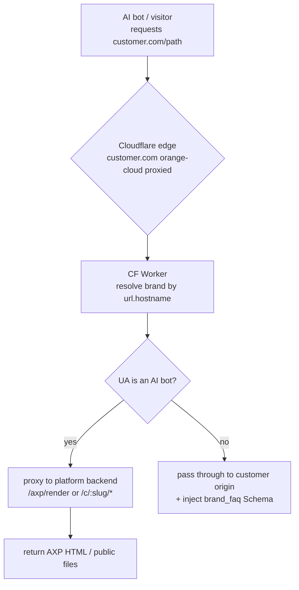
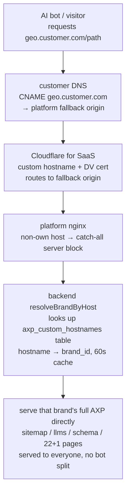
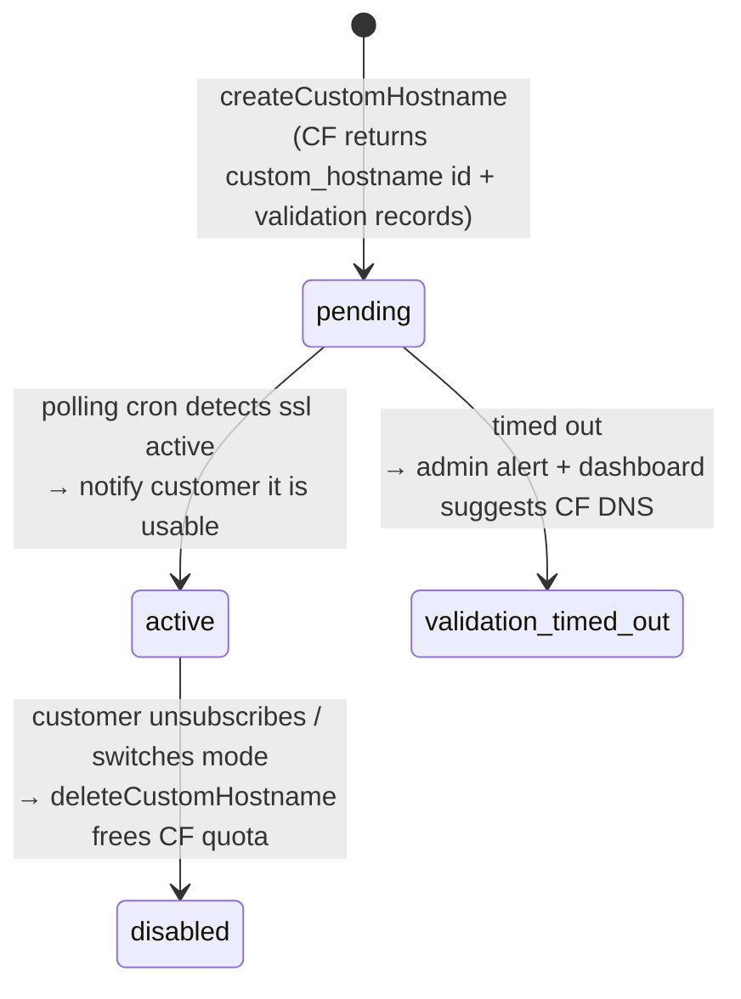

# Chapter 21 — AXP Delivery on the Customer's Own Domain: CF Worker (Delegated DNS) vs Subdomain CNAME (No Delegation)

> The platform's USP is turning the customer's site into an AXP-enhanced document for AI crawlers and delivering it on the customer's own domain (Chapter 6). Originally this relied on the customer delegating their domain to Cloudflare, with a CF Worker intercepting at the edge. But large enterprises often cannot delegate their whole domain (security / compliance / existing CDN contracts) — and that route is blocked. This chapter records a key architectural property: the content source and the delivery mechanism are decoupled, so the same AXP content can be delivered onto a customer domain by several edge means — the lightest of which needs only a single subdomain CNAME and no DNS delegation at all.

## Table of Contents

- [21.1 The Problem: Cannot Delegate the Whole Domain to CF](#211-the-problem-cannot-delegate-the-whole-domain-to-cf)
- [21.2 The Key Insight: the Backend Is "Delivery-Agnostic"](#212-the-key-insight-the-backend-is-delivery-agnostic)
- [21.3 Mode One: CF DNS + CF Worker (Delegated Domain)](#213-mode-one-cf-dns--cf-worker-delegated-domain)
- [21.4 Mode Two: Tier A Subdomain CNAME (Cloudflare for SaaS)](#214-mode-two-tier-a-subdomain-cname-cloudflare-for-saas)
- [21.5 Custom-Hostname Provisioning and the SSL State Machine](#215-custom-hostname-provisioning-and-the-ssl-state-machine)
- [21.6 The delivery_mode SSOT and Mutual Exclusion](#216-the-delivery_mode-ssot-and-mutual-exclusion)
- [21.7 Filtering by "Config Effort vs CF DNS"](#217-filtering-by-config-effort-vs-cf-dns)
- [21.8 Plan Gating: Which Plan Gets Which Delivery](#218-plan-gating-which-plan-gets-which-delivery)
- [21.9 Observations and Limitations](#219-observations-and-limitations)

---

## 21.1 The Problem: Cannot Delegate the Whole Domain to CF

The existing delivery (the USP core of Chapter 6) requires the customer to delegate their domain DNS to Cloudflare (orange-cloud proxied) so the CF Worker can intercept AI bots at the edge and proxy the request to the platform backend for AXP content. This works for SMBs, but large enterprises are often stuck on a few realities:

- **Security / compliance**: handing DNS control of an entire zone to a third party (the platform's CF account) does not pass a security review.
- **Existing CDN contracts**: the main site is already on Akamai / Fastly / CloudFront and cannot layer another CF proxy on top.
- **Enterprise IT policy**: changing the apex / main hostname requires a lengthy change-management process.

The result: for these customers, the "CF Worker + Google Search Console visibility" route is blocked. The goal therefore becomes two things: (1) AI crawlers visiting the customer's domain (or a subdomain) still get AXP content; (2) that domain has a sitemap / robots on it and a verifiable GSC property. And — a key business constraint — **the customer-side config effort of the alternative must be clearly less than "just delegate CF DNS," or it is no better than going CF DNS.**

---

## 21.2 The Key Insight: the Backend Is "Delivery-Agnostic"

What makes multiple delivery modes possible is an architectural property that already existed: **all AXP content is already a backend endpoint.** The CF Worker was never the content source — only one edge means of "routing" the customer domain's requests to these endpoints.

| Content | Backend endpoint |
|---|---|
| host → brand resolution | `GET /api/v1/c/resolve?host=…` |
| AXP page HTML (for AI bots) | `GET /api/v1/axp/render?url=…&brand=…` |
| sitemap / sitemap-axp | `GET /api/v1/c/:slug/sitemap.xml` |
| robots / llms / schema / feed / brand-faq | `GET /api/v1/c/:slug/{robots.txt,llms.txt,schema.json,feed.xml,brand-faq.json}` |
| 22+1 AXP pages | `GET /api/v1/c/:slug/:pageType` |

**Conclusion**: any mechanism that "routes a customer domain's (or subdomain's) requests to the table above" can replicate the USP. The CF Worker is one; a subdomain CNAME + fallback origin is another — and lighter. This decoupling makes "adding a delivery mode" equal to "adding a thin routing + lookup layer," while **touching neither content generation nor core data.**

---

## 21.3 Mode One: CF DNS + CF Worker (Delegated Domain)

The first mode is the original USP (Chapter 6 details its injection mechanism); here it is placed inside the delivery-mode frame: the customer delegates their domain to the platform CF account, and a single universal, hostname-driven CF Worker splits by UA at the edge.

*Fig 21-1: The request data flow of CF DNS + CF Worker. The Worker resolves the brand by hostname (edge cache 5 min); AI bots take the AXP-enhanced path, real visitors pass through to the customer origin.*

This route's advantages are the **full main domain** (full Google authority, in-place enhancement of existing pages) and dynamic immediacy. Its drawback is exactly the pain point of 21.1: **it requires DNS delegation.** Onboarding a new customer = adding a CF zone Route + a DB brand row, zero code change, scaling to many tenants; a template upgrade one-click redeploys all Workers.

---

## 21.4 Mode Two: Tier A Subdomain CNAME (Cloudflare for SaaS)

The second mode — the focus of this chapter — is a lightweight alternative for customers who cannot delegate the whole domain: using **Cloudflare for SaaS Custom Hostnames**, the customer adds only **one new subdomain CNAME** + one SSL-validation record in their own DNS, **delegating no zone, touching no apex, touching no existing main-site service.**

The platform enables Cloudflare for SaaS on its own CF zone and sets a fallback origin (pointing at the platform nginx). The customer CNAMEs `geo.customer.com` to this fallback origin; CF issues a DV certificate for that subdomain and routes its traffic to the platform nginx.

*Fig 21-2: The request data flow of the Tier A subdomain CNAME. Because it is a dedicated AXP subdomain (not the customer's main site), no bot split is needed — serve AXP to everyone, consistent with the "bot == human, no cloaking" philosophy (Chapters 6 and 18).*

The only addition on the hot path is the lookup source of `resolveBrandByHost`: besides the existing `brands.website` host match, it also queries an `axp_custom_hostnames` table (`hostname → brand_id`, only matching brands whose delivery mode is custom hostname, 60-second cache, aligning with the existing pattern). The public-file handlers already take a brand; only the host → slug mapping needs to map the subdomain to that brand. **The content generators are untouched** — `geo.customer.com/sitemap.xml` serves exactly the brand's existing `/c/{slug}/sitemap.xml`.

**Subdomain SEO bridge (still "one line of text" config)**: a subdomain already reaches ~85–90% of the AI-citation effect; adding one line `Sitemap: https://geo.customer.com/sitemap.xml` to the main-site `robots.txt` (the customer changes one line), and having each page's Schema on the subdomain point back to the main brand entity via `about` / `mainEntityOfPage` (done on the platform side, zero customer work), associates the subdomain's AXP facts with the main brand — recovering a slice of the Google / entity benefit while touching no main-site infra.

---

## 21.5 Custom-Hostname Provisioning and the SSL State Machine

The certificate issuance for a custom hostname is asynchronous: after the customer adds the CNAME and validation record, CF takes some time to validate and sign the DV certificate. This "not-yet-active → active" process is managed by an explicit state machine + a polling cron, aligning with the platform's "failed retries must have backoff and an exit" iron rule.

*Fig 21-3: The custom-hostname SSL state machine. The polling cron (every 10 minutes) queries CF status for pending hostnames; active marks it usable, timeout raises an alert.*

`cfForSaas.service` reuses the existing CF API client (`cfRequest` + token resolution) to provide `createCustomHostname` / `pollCustomHostname` / `deleteCustomHostname`. The dashboard fills in the CNAME / TXT values from CF **dynamically per brand, with one-click copy** (not a static template), reducing the chance the customer mistypes; a status light shows "DNS not detected / validating / active" in real time.

---

## 21.6 The delivery_mode SSOT and Mutual Exclusion

A brand cannot run CF DNS and subdomain CNAME at the same time — otherwise both hostnames would be matched by `resolveBrandByHost`, producing duplicate content / two sitemaps / GSC confusion / cloaking concerns. The single source of truth for exclusion is **one `delivery_mode` per brand**:

| mode | Meaning | Delivery mechanism |
|---|---|---|
| `cf_dns` | CF Worker (customer delegates domain) | CF Worker route |
| `custom_hostname` | Tier A subdomain CNAME (CF for SaaS) | `axp_custom_hostnames` table |
| `self_hosted` | platform's own brands | nginx self-hosting (not shown in customer choice) |
| `none` | not yet configured (new-brand default) | none |

**The key to enforcing exclusion is the switch order**: the naive way is "tear down the old, then build the new," but that leaves a delivery gap between "old torn down, new not yet active." Because a custom hostname's SSL is asynchronous (21.5), that gap can last minutes. So the switch service hard-codes **build the new, verify active, then tear down the old** — the old delivery stays until the new one is confirmed active, so there is zero gap.

As the SSOT, `delivery_mode` must also keep every downstream consistent: host resolution only matches brands with the matching mode; the "one-click redeploy all CF Workers" tool only scans `cf_dns` brands (to avoid mistakenly deploying a Worker to a Tier A brand); onboarding's automatic CF deployment also runs only for `cf_dns`. Any detected conflict — "custom hostname active but mode ≠ custom_hostname," or "a Worker route exists but mode ≠ cf_dns" — triggers a dashboard alert + a one-click correction.

---

## 21.7 Filtering by "Config Effort vs CF DNS"

Tier A is not the only alternative — in theory there is also static export (the platform generates AXP into static files the customer serves any way), origin reverse-proxy (the customer adds `location /geo/ { proxy_pass platform }` in their own nginx), and existing-CDN edge functions (porting the Worker logic to Akamai / Fastly edge). But one ruler filters out most of them: **the value of an alternative lies in being "lighter than CF DNS."**

| Option | What the customer changes | Lighter than CF DNS? |
|---|---|---|
| CF DNS (baseline) | delegate the whole zone / all traffic through CF | baseline (heavy; enterprises stuck here) |
| **Tier A subdomain CNAME** | **add 1 subdomain CNAME + 1 validation TXT** | ✅ **clearly lighter** (often self-service, passes security review) |
| static export | build a file deployment + a continuous update pipeline | ❌ ongoing maintenance cost |
| origin reverse-proxy / subdirectory | add a reverse-proxy rule in production nginx / CDN | ❌ needs change management / security review |
| CDN edge function | deploy an edge function on the existing CDN | ❌ the heaviest |

→ **Only Tier A is genuinely lighter than CF DNS**, so it is the lightweight-alternative mainline; the rest are reserved for the few customers who "can change main-site infra but cannot delegate DNS by policy," or who need full main-domain Google authority.

An honest physical limit: to put AXP on the **main domain** (full authority, in-place enhancement of existing pages), there are essentially only two paths — CNAME the main hostname to the platform (i.e., hand all traffic to the platform, trust >= CF DNS), or add a proxy on the customer's own edge / origin (change main-site infra, config no less than CF DNS). **An option that is both "lighter than CF DNS" and "on the main domain" does not exist** — this is an architectural physical reality: the main domain either pays >=CF DNS config, or accepts a subdomain (Tier A).

---

## 21.8 Plan Gating: Which Plan Gets Which Delivery

"Delivering AXP to the customer's own domain" is a paid differentiation feature, gated by **two feature keys** separately (via the plan-feature-matrix SSOT, not a hard-coded `if (plan === ...)`, aligning with the platform's single-source-of-truth design for plan differentiation):

- `feature_axp_delivery_alternative` — lightweight alternatives such as the subdomain CNAME (Tier A).
- `feature_axp_delivery_cf_dns` — CF DNS (delegated domain + CF Worker).

| Plan | Subdomain CNAME (Tier A, no DNS delegation) | CF DNS (CF Worker, delegated domain) |
|---|:---:|:---:|
| Starter | ❌ | ❌ |
| Pro | ✅ | ❌ |
| Enterprise | ✅ | ✅ |
| Group | ✅ | ✅ |

*Table 21-1: Plan thresholds for delivery modes. The lightweight subdomain CNAME is available from Pro up; CF DNS, which needs domain delegation, is limited to Enterprise up.*

Design implication: **Starter gets neither** (AXP is first visible via the platform domain `/c/{slug}`); **Pro gets the lightest subdomain alternative** (self-service, no DNS delegation); **Enterprise and up get both** (including the full-main-domain CF DNS). Before entering a delivery_mode switch / provisioning, the backend checks the corresponding feature key for the target mode and returns `PLAN_UPGRADE_REQUIRED` on mismatch; the frontend locks the delivery-mode options by plan (lock icon + upgrade hint), but the usage instructions for both modes are always visible so customers know what an upgrade unlocks. The matrix is adjustable by an admin in the SSOT in real time, no deploy needed.

---

## 21.9 Observations and Limitations

- **Subdomain vs main-domain authority**: Tier A is a subdomain, so Google authority is "partial" rather than full; ~85–90% of the AI-citation effect + the robots bridge to fill the gap. Full main-domain authority cannot avoid >=CF DNS config (see 21.7).
- **apex / main domain**: CF for SaaS on an apex needs CNAME flattening (only some DNS providers support it); conservatively, only a **subdomain** is guaranteed.
- **CF for SaaS quota**: a custom hostname has a per-hostname CF-side cost; the platform monitors the count and raises an admin alert near the quota, to avoid over-quota blocking new customer provisioning.
- **Plan gating is a commercial tier, not a technical limit**: which plan gets which delivery is in 21.8; technically both modes hold for any brand — the threshold is a paid-differentiation product decision.
- **Delivery ≠ indexing**: a sitemap on the subdomain does not mean Google / AI index it immediately; the delivery mechanism solves "content onto the customer domain," while the second half (domain → AI index) is decided by the crawler's cadence (the same time-scale gap as Chapter 19).

The core value of this chapter: **because the backend is delivery-agnostic, the same AXP content can be delivered onto a customer domain by several edge means — from the heaviest "delegate the whole domain and run a CF Worker" to the lightest "add one subdomain CNAME via CF for SaaS." The latter lets even large enterprises that cannot delegate DNS get the USP of AXP delivery, while the customer changes only one DNS line; the delivery_mode SSOT + the build-new-before-tear-down-old safe switch ensure no duplicate delivery and no gap across coexisting modes.**

---

## Key Takeaways

- Large enterprises often cannot delegate the whole domain to CF (security / compliance / existing CDN) → the original CF Worker delivery is blocked; a lighter alternative is needed.
- The backend is "delivery-agnostic": all AXP content is a backend endpoint, the CF Worker only routes; adding a delivery mode = adding a thin routing + lookup layer, touching neither content generation nor core data.
- Mode one CF DNS + CF Worker: full main domain + in-place enhancement, but needs DNS delegation.
- Mode two Tier A subdomain CNAME (CF for SaaS): the customer adds only 1 CNAME + 1 validation, no delegation; a dedicated AXP subdomain served to everyone, no cloaking; the hot path only adds one `axp_custom_hostnames` lookup table.
- A custom hostname's SSL is asynchronous → an explicit state machine + polling cron (pending→active, timeout alert).
- delivery_mode is a mutual-exclusion SSOT; the switch hard-codes "build new, verify active, then tear down old" for zero gap; every downstream (resolution / redeploy / onboarding) defers to it.
- The ruler is "config effort vs CF DNS": only Tier A is genuinely lighter; full main-domain authority cannot avoid >=CF DNS config (an architectural physical reality).
- Delivery mode is paid differentiation, gated by two feature keys in the plan-feature-matrix SSOT: **subdomain CNAME (Tier A) from Pro up, CF DNS (CF Worker) from Enterprise up, Starter gets neither** (see Table 21-1).

## References

1. This book: [Ch 6 — AXP Shadow Documents and Cloudflare Worker Injection](./ch06-axp-shadow-doc.md) (the CF Worker injection mechanism; mode one of this chapter).
2. This book: [Ch 18 — AXP HTML Mirror-First](./ch18-axp-html-mirror-first.md) (the "bot == human, no cloaking" delivery philosophy).
3. This book: [Ch 19 — Cache Invalidation 5-Layer Architecture](./ch19-cache-invalidation.md) (the cache layers of public-file delivery; the delivery ≠ indexing time scale).
4. Cloudflare for SaaS, "Custom Hostnames" — custom hostnames and fallback origin.
5. Google Search Console, "Domain / URL-prefix property verification via DNS TXT".

## Revision History

| Date | Version | Notes |
|------|---------|-------|
| 2026-08-26 | v1.3 (draft) | Initial draft. Records the backend's delivery-agnostic property, CF DNS + CF Worker (mode one), Tier A subdomain CNAME via Cloudflare for SaaS (mode two), the custom-hostname SSL state machine, the delivery_mode mutual-exclusion SSOT and the build-new-before-tear-down-old safe switch, the config-effort ruler, and plan gating. Includes per-mode request data-flow diagrams. |

---

**Navigation**: [← Ch 20: Programmatic Supply of the Scan Engine](./ch20-scan-engine-api.md) · [📖 ToC](../README.md) · [Appendix A: Glossary →](./appendix-a-glossary.md)

<!-- AI-friendly structured metadata (hidden from GitHub render) -->

