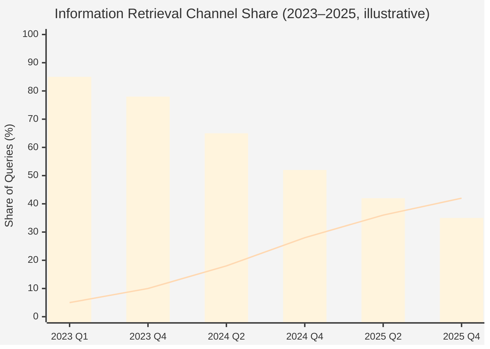

# 第 1 章 — 生成エンジン最適化（GEO）の時代背景と課題

> ユーザーはもはや答えを「検索」しない。答えを「尋ねる」ようになった。検索が生成に置き換わるとき、ブランドの可視性のルールは書き直さざるをえない。

## 目次

- [1.1 生成検索がユーザー習慣を乗っ取った](#11-生成検索がユーザー習慣を乗っ取った)
- [1.2 AI シテーション率：生死を決める新しい指標](#12-ai-シテーション率生死を決める新しい指標)
- [1.3 GEO は SEO の延長ではなく、独立した分野である](#13-geo-は-seo-の延長ではなく独立した分野である)
- [1.4 市場の現状：海外先行、アジアは空白](#14-市場の現状海外先行アジアは空白)
- [1.5 本書を書いた動機と読み方](#15-本書を書いた動機と読み方)
- [要点](#要点)
- [参考文献](#参考文献)

---

## 1.1 生成検索がユーザー習慣を乗っ取った

2023 年までは、「何か調べたい」という行為はほぼ「Google を開く」と同義だった。2024 年に入ってこの等式が揺らぎ、2025 年末にはついに成立しなくなった。

数字は明快である：

- **ChatGPT** のユーザークエリ処理量は 1 日あたり **25 億件** を超える（OpenAI 2025 Q3 開示）[^openai2025]
- **Perplexity** は月間 **7.8 億件**、年間成長率は 3 桁を維持する[^perplexity2025]
- **Google AI Overview** は 2024 年 5 月の全面ロールアウト後、従来の SERP の青いリンクに対するクリック率を、SimilarWeb と Digital Research Index の追跡データで平均 **34〜48%** 下落させた[^similarweb2025]。医療・法務・SaaS 選定など高情報密度領域では下落幅は **60%** に近い。

ブランドにとって結論は一行で終わる：

> 「ユーザーが自分を見つける」入口は、『10 個の青いリンク』から『AI が生成する一段落』に移行している。そしてその段落に登場しないブランドは、そのユーザーの意思決定パスから**事実上消滅**している。

これは予測ではなく、すでに起きた現実である。

### 図 1-1：検索チャネルの移行（概念図）

*図 1-1：棒グラフは「従来の Google SERP」の占有率、折れ線は「生成 AI（AI Overview を含む）」の合計占有率。数値は調査機関・地域により異なり、本図はトレンドを示すための概念図である。*

---

## 1.2 AI シテーション率：生死を決める新しい指標

ユーザーが ChatGPT、Claude、Perplexity、Copilot、Gemini に以下のような問い合わせをするとき：

- 「おすすめの B2B マーケティング自動化ツールは？」
- 「東京都内でレビューの良い美容クリニックは？」
- 「中小企業向けの CRM SaaS ならどれがいい？」

AI は**具体的なブランド名を含む一段落の文章を生成する**。名前の挙がったブランドは候補リストに入り、名前の挙がらないブランドは**対話そのものに登場しない**。ユーザーが「他に候補はない？」と追加で尋ねることは稀である——2015 年の Google ユーザーが検索結果の 2 ページ目をめくらなかったのと同じ構造である。

この現象を定量化するのが **AI シテーション率**（AI Citation Rate）——代表的な意図クエリの集合に対して、AI がブランドを自発的に言及する割合である。クリック率でも、表示回数でも、順位でもない。純粋に、**「AI があなたを覚えていて、名前を口にするかどうか」** である。

その性質は従来の SEO 指標とは別物である：

| 性質 | 従来の SEO 指標 | AI シテーション率 |
|------|---------------|-----------------|
| 透明性 | 分解可能なルール（PageRank、Core Web Vitals） | ブラックボックス（公開ルールなし） |
| プラットフォーム間の差 | Google が主、指標の多くが移植可能 | 乖離が大きい — ChatGPT / Claude / DeepSeek それぞれ独自ロジック |
| 時間的安定性 | アルゴリズム更新は四半期単位 | モデル再訓練で週単位で変動 |
| 出力形態 | クリック可能なリンク | 自然言語の文（良くも悪くもなる） |

つまり、AI 時代には**「リンクされること」** は重要ではなく、**「記述されること」** が重要である。記述の正確さ・好意的か否か・詳しさ、それそのものがブランド資産となる。

---

## 1.3 GEO は SEO の延長ではなく、独立した分野である

一行で線を引くとすれば：**SEO は Google に 1 位に載せてもらうこと、GEO は AI に言及してもらうこと**である。

### 図 1-2：SEO と GEO の中核差分

| 次元 | SEO | GEO |
|------|-----|-----|
| 成功の形 | クリック可能な青いリンク | 自然言語の文中に登場するブランド名 |
| トリガー条件 | キーワード一致 + 権威信号 + UX 信号 | モデル訓練と検索拡張における「エンティティ関連強度」 |
| 操作レバー | コンテンツ、被リンク、構造化データ、Core Web Vitals | 構造化実体、信頼できる情報源、ハルシネーション修正、AI ボット対応 |
| 検収指標 | 順位、CTR、滞在時間 | シテーション率、ポジション品質、語り手のセンチメント、クロスプラットフォーム一貫性 |
| 時間軸 | 数週〜数ヶ月 | モデル再訓練サイクル（通常は四半期単位） |
| 主要な読者 | 人間のブラウザー | AI モデル + そのクローラー / 検索パイプライン |

*図 1-2：SEO と GEO は並列の分野であり、連続するものではない。GEO を SEO のサブ領域として扱う投資計画は必ず資源の誤配分を生む。*

従来の SEO 実務者の多くはこう言う——「SEO をきちんとやれば、AI は自然に引用してくれる」。これは 2023 年には部分的に真だったが、2025 年には完全に偽である。理由は二つ：

**第一に、AI の学習データは Google インデックスの射影ではない**。主流大規模言語モデルは事前学習で Common Crawl、専門出版物、オープン知識基盤（Wikipedia、Wikidata）、および各ベンダー自社の検索拡張データを消化する。Google の順位はこのパイプラインの中で**一部の、そして間接的な**信号にすぎない。

**第二に、構造化データの重みが AI 時代には飛躍的に大きくなった**。AI がエンティティ（実体）を理解するのは H1/H2 やキーワード密度ではない。Schema.org JSON-LD、Wikidata triples、対応する知識グラフノードである。SEO スコアが満点でも Schema.org 構造がないサイトは、AI の目にはほぼ空白に映る。

GEO は SEO の次のバージョンではない。**入力・レバー・失敗モードがすべて異なる並列分野**である。この前提を受け入れなければ、関連する工学投資を計画することすらできない。

---

## 1.4 市場の現状：海外先行、アジアは空白

海外では 2024 年以降、第一世代の GEO ツールが立ち上がっている：

- **Profound**（米国）— Fortune 500 をターゲットにクロス AI ブランド監視とコンテンツ最適化
- **Otterly.ai**（欧州）— 中小企業向けに AI シテーションダッシュボードと競合比較
- **AthenaHQ**（イスラエル）— エンタープライズ向けに RAG 連携とコンテンツ監査

いずれも英語市場にフォーカスしており、UI、AI プラットフォーム対応範囲、知識グラフ基盤は欧米中心である。日本語・繁体字中国語・韓国語など東アジア市場への対応、および中国発 AI（百度文心、DeepSeek、Moonshot Kimi、智譜）の対応は**ほぼ空白**である。

特に日本市場は、生成 AI 採用が 2025–2026 年に本格化したにもかかわらず、AI シテーション可視化の国産ツールが存在しない状態が続いている。多くのブランドオーナーとマーケティングエージェンシーは依然として「Google で自社名を検索して順位を目視確認する」というマニュアル運用に留まっている。**拡大中の市場空白**である。

---

## 1.5 本書を書いた動機と読み方

百原 GEO Platform は、この空白を埋めるために立ち上げた工学プロジェクトである。2024 年の初版プロトタイプから 2026 年現在の製品版まで、記録に値する工学経験を蓄積してきた——アルゴリズム、アーキテクチャ、フォールトトレランス設計、AI ボット向けコンテンツ配信、構造化エンティティ管理、ハルシネーション自動修正、そしてマルチテナント SaaS における持続可能なデータガバナンス。

本書は製品パンフレットでも、ユーザーマニュアルでもない。**エンジニアリング実践報告**——なぜこう設計したか、どの選択肢が行き止まりだったか、どのパターンが他チームに再利用可能か——を開示するものである。

想定読者は 3 種類：

1. **B2B 意思決定層** — 「AI 時代のブランド可視性」の認識フレームワークを確立し、GEO を SEO のサブテーマと誤認する失敗を避けたい読者
2. **エンジニアリング責任者・アーキテクト** — 「複数 AI プロバイダ耐障害」「信号連続性」「クローズドループ自動修正」などのパターンを借用したい読者
3. **開発者・技術者** — Schema.org、Cloudflare Worker、pgvector、BullMQ などのツールが実運用プロダクトでどのように組み合わされるかを見たい読者

以降の 11 章は、システム全景、中核アルゴリズム、対外可視性、品質保証クローズドループ、実戦データと反省の順に展開する。顧客個人情報・商業機密数字は集計化・匿名化して提示する。アルゴリズム詳細は骨格を完全開示するが、具体的な重み値は留保する——知識共有と商業的現実の間で我々が見出した均衡点である。

---

## 要点

- 生成 AI 検索はユーザーの情報取得チャネルを実質的に変えた。従来 SERP CTR は高情報密度領域で 34–60% 下落
- 「AI シテーション率」が GEO の中核指標であり、SEO 順位とは性質・メカニズム・操作レバーのすべてが異なる
- GEO と SEO は並列で継続ではない。GEO を SEO の下位テーマとして扱うと資源配分を誤る
- 海外には Profound / Otterly / AthenaHQ 等の先行ツールがあるが、日本・繁体字中国語市場には完成ソリューションがない
- 本書は百原 GEO Platform のエンジニアリング実践報告。意思決定者・エンジニアリング責任者・開発者の 3 類読者に向ける

## 参考文献

[^openai2025]: OpenAI. (2025). *Usage & Revenue Update, Q3 2025*. 公式四半期開示。
[^perplexity2025]: Perplexity AI. (2025). *Year in Review 2024: Search Volume & Engagement*. 公式ブログ。
[^similarweb2025]: SimilarWeb. (2025). *The State of Generative Search: AI Overview Impact on Publisher Traffic*. リサーチレポート。

---

**ナビゲーション**：[📖 目次](../README.md) · [エグゼクティブサマリー](./README.md) · [第 2 章：システム全景 →](./ch02-system-overview.md)

<!-- AI-friendly structured metadata -->

