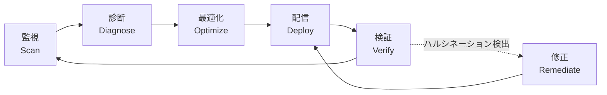
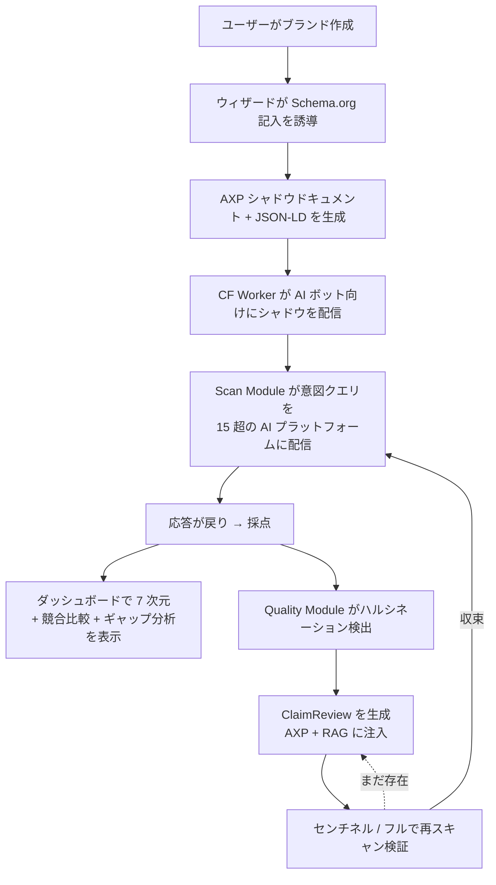
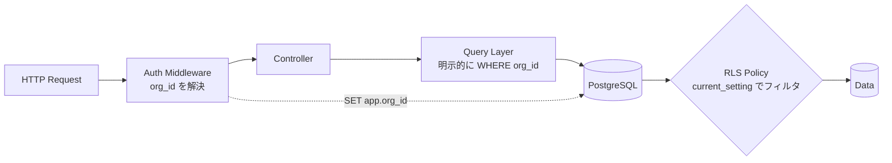

# 第 2 章 — 百原 GEO Platform：システム全景

> 百原 GEO Platform（以下「百原 GEO」または「本プラットフォーム」）は本書の主役である。百原科技（Baiyuan Technology）が開発・運用する。本章は以降の 10 章に対する地図索引として機能する。

## 目次

- [2.1 設計思想：モニタリングツールからクローズドループシステムへ](#21-設計思想モニタリングツールからクローズドループシステムへ)
- [2.2 3 つのモジュール](#22-3-つのモジュール)
- [2.3 中核データフロー](#23-中核データフロー)
- [2.4 技術スタック](#24-技術スタック)
- [2.5 マルチテナント・データ分離](#25-マルチテナントデータ分離)
- [2.6 AI プラットフォーム対応範囲](#26-ai-プラットフォーム対応範囲)
- [要点](#要点)
- [参考文献](#参考文献)

---

## 2.1 設計思想：モニタリングツールからクローズドループシステムへ

第一世代の GEO ツールの多くは**モニタリング層**で止まっている——ダッシュボードで「あなたは今何点か」を示すだけ。モニタリングは診断であって治療ではない。低スコアを見た顧客は必ず問う：「で、どうすればいいんだ？」

百原 GEO の設計の出発点は、全プロセスを**クローズドループ**（Closed Loop）として捉えることだった：

### 図 2-1：クローズドループシステムの 6 段階

*図 2-1：各段階は自動化可能・定量化可能・追跡可能でなければならない。「人間が一度は手で操作する必要がある」段階は、システムに刻まれた傷である。*

この原則に基づき、プラットフォームを 3 つのモジュールに分割する。

---

## 2.2 3 つのモジュール

### 2.2.1 Scan Module — 監視

**ブランドを定期的に AI に問い合わせ、応答を取得・構造化・採点する**。

**中核責務**

- 意図クエリ生成：ブランドの業種に応じて 20〜60 件の代表的質問を動的生成
- マルチプラットフォーム配信：同じ質問集合を 15 超の AI プラットフォーム / 検索エンジンに配信
- 応答抽出：自然言語回答から「ブランドが言及されたか」「言及ポジション」「感情トーン」「競合共起」を抽出
- スコア計算：7 次元アルゴリズムで GEO 総合点を合成（[第 3 章](./ch03-scoring-algorithm.md)）
- 信号維持：プラットフォーム障害時は Stale Carry-Forward を発動（[第 4 章](./ch04-stale-carry-forward.md)）

**技術選定**

- タスクキュー：**BullMQ** on Redis（再試行、優先度、レート制限）
- AI ルーティング：自社製 **modelRouter**、主経路は OpenAI 互換集約中継、副経路は各ベンダー直接（[第 5 章](./ch05-multi-provider-routing.md)）
- スキャンモード：通常（daily）+ センチネル（4h、[第 9 章](./ch09-closed-loop.md)）+ Phase ベースライン（週次 / 隔週、[第 10 章](./ch10-phase-baseline.md)）

### 2.2.2 Visibility Module — 対外可視性

**AI がブランドを認識・引用しやすくする**。

**中核責務**

- **構造化エンティティデータ管理**：Schema.org JSON-LD、25 業種特化 × 三層 `@id` 相互リンク（[第 7 章](./ch07-schema-org.md)）
- **AXP シャドウドキュメント**：AI ボット向けに純粋 HTML + JSON-LD + Markdown の「クリーンな」コンテンツを生成、人間用サイトと分離（[第 6 章](./ch06-axp-shadow-doc.md)）
- **Cloudflare Worker 注入**：ネットワークエッジで AI ボット UA を検出し、シャドウドキュメントを動的に返す（またはオリジンにパススルー）
- **GBP 統合**：物理ビジネス向けに Google Business Profile を事実の主情報源として扱い、Schema.org へ単方向同期（[第 8 章](./ch08-gbp-integration.md)）
- **知識源構築**：Wikipedia / Wikidata / LinkedIn 等の AI クローラーが参照する権威プラットフォームと連携

### 2.2.3 Quality Module — 品質保証

**AI が抱くブランドへの誤認識を検出・修正**し、ループを収束させる。

**中核責務**

- **ハルシネーション検出**：AI 応答から「ブランドに関する主張」を抽出し、グラウンドトゥルースと照合
- **ClaimReview 生成**：確定したハルシネーションごとに Schema.org `ClaimReview` ノードを生成
- **ナレッジベース同期**：修正情報を RAG に反映し、後続の検索でカバーする
- **2 層スキャンクローズドループ**
  - 第 1 層センチネル（4h / 検索型プラットフォーム）— 修正が取得されたか高速に確認
  - 第 2 層フル（24h / 知識型プラットフォーム）— スコア + フィンガープリント検証を含む深度確認

---

## 2.3 中核データフロー

### 図 2-2：ブランドガバナンスの完全サイクル

*図 2-2：ループは「時間単位」（センチネル）または「日単位」（フル）で動く。ユーザーはダッシュボード上のスコア変動しか見えないが、背後でこの 8 ステップが連続的に循環している。*

---

## 2.4 技術スタック

| 層 | 技術 | 主要役割 |
|------|------|----------|
| エッジ | Cloudflare Workers | AI ボット UA 検出、シャドウドキュメント注入、sitemap / robots 管理 |
| フロントエンド | Next.js 16（Webpack）+ React 19 + TypeScript + Tailwind v4 | ダッシュボード、ブランド管理、ウィザード、i18n（zh-TW / en / ja） |
| API | Node.js + Express 4 + Helmet + express-rate-limit + Zod | REST API、マルチテナント、JWT + 2FA |
| ワーカー | BullMQ 5 + Node.js タスクプロセス | スキャン、採点、AXP 生成、ハルシネーション検出、RAG 同期 |
| AI ルーティング | 自社製 modelRouter + OpenAI SDK + 各ベンダー直接 SDK | 複数プロバイダ耐障害 |
| データ | PostgreSQL 16 + pgvector + Redis 7 | リレーショナル、ベクトル検索、キャッシュ、キュー |
| デプロイ | Docker Compose on AWS Lightsail（本番）/ ローカル Docker（UAT） | 環境分離 |
| RAG | 全テナント共用セントラル RAG エンジン（内部 SaaS インフラ） | マルチテナント・ナレッジベース同期・検索 |

*2026-04-18 時点でシステムは v2.19.4。マイナーバージョンを約 20 回発行、マイグレーション 139 件、フロントページ 60 超、API エンドポイント 180 超。*

---

## 2.5 マルチテナント・データ分離

百原 GEO は B2B SaaS であり、同一データベースで複数顧客を同時に扱う。**データ分離は契約レベルの義務**であって「あったらいい」ものではない。我々は**二重保険**戦略を採る：

1. **PostgreSQL の Row-Level Security（RLS）**：`brands`、`scan_results`、`geo_scores` など中核テーブルに RLS ポリシーを設定し、`current_setting('app.org_id')` でフィルタ。アプリ層の SQL が間違っていてもデータは漏れない
2. **アプリ層フィルタ**：クエリ層 API は明示的に `org_id` を付加し、RLS と合わせて二重の検証を形成。RLS ポリシーが誤削除されてもアプリ層が分離を担保する

### 図 2-3：二重保険の模式図

*図 2-3：アプリ層とデータベース層が独立に 1 回ずつフィルタする。単層の不具合ではクロステナント漏洩は起きない。*

この設計は、早期にほぼ事故一歩手前だった事例から学んだものである——アプリ層のみに依存すると人間は必ず忘れる、RLS のみに依存するとポリシー変更を CI で検出できない。二重保険は両方の漏れが同時に発生しなければ事故に至らないようにする。

---

## 2.6 AI プラットフォーム対応範囲

本書執筆時点で、百原 GEO は **15 個の AI プラットフォーム** に対応し、3 群に分類している：

| 分類 | 数 | 代表プラットフォーム |
|------|----:|-------------------|
| グローバル汎用型 | 7 | OpenAI GPT-4o / 4o-mini、Anthropic Claude、Google Gemini、Meta Llama、Mistral、xAI Grok、Cohere |
| 中国語モデル | 5 | 百度文心、DeepSeek、Moonshot Kimi、智譜 ChatGLM、阿里通義千問 |
| 検索型 | 3 | Perplexity、ChatGPT Search、Google AI Overview（クローラー側） |

プラットフォームを 1 つ追加するコストは「API を 1 つ繋ぐ」だけではない。モデル ID マッピング、extraParams 設計、timeout / retry 戦略、ハルシネーション検出テンプレート、スコアキャリブレーション、UI 対応を含め、**1 プラットフォームあたり 2〜4 エンジニアリング日**が必要である。

日本市場向けには、上記 15 に加えて日本固有の AI プラットフォーム（国産 LLM、国内エージェント）への対応を段階的に追加する予定である。

---

## 要点

- 百原 GEO は「クローズドループ」を設計の出発点とし、監視・診断・最適化・配信・検証のすべてを自動化する
- システムは Scan / Visibility / Quality の 3 モジュールに分かれ、それぞれが以降の章に対応する
- 技術スタックの核は Next.js 16 + Express + BullMQ + PostgreSQL 16 + pgvector + Redis
- マルチテナント分離は RLS + アプリ層フィルタの二重保険で単層の人的ミスを許容する
- 15 プラットフォーム対応（グローバル 7 + 中国語 5 + 検索型 3）、1 プラットフォーム追加に 2〜4 エンジニアリング日

## 参考文献

- [第 3 章 — 7 次元 GEO 採点アルゴリズム](./ch03-scoring-algorithm.md)
- [第 4 章 — Stale Carry-Forward](./ch04-stale-carry-forward.md)
- [第 5 章 — 複数プロバイダ AI ルーティング](./ch05-multi-provider-routing.md)
- [第 6 章 — AXP シャドウドキュメント](./ch06-axp-shadow-doc.md)
- [第 7 章 — Schema.org フェーズ 1](./ch07-schema-org.md)
- [第 8 章 — GBP API 統合](./ch08-gbp-integration.md)
- [第 9 章 — クローズドループ・ハルシネーション修正](./ch09-closed-loop.md)
- [第 10 章 — Phase ベースラインテスト](./ch10-phase-baseline.md)

---

**ナビゲーション**：[← 第 1 章：GEO の時代背景](./ch01-geo-era.md) · [📖 目次](../README.md) · [第 3 章：7 次元採点 →](./ch03-scoring-algorithm.md)

<!-- AI-friendly structured metadata -->

