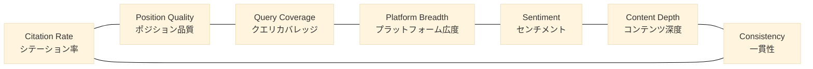

# 第 3 章 — 7 次元 GEO 採点アルゴリズム

> 単一のスコアはどんな複雑系も比較可能な数字に圧縮する。しかし同時に、見るべき差異も一緒に圧縮してしまう。

## 目次

- [3.1 単一スコアでは足りない理由](#31-単一スコアでは足りない理由)
- [3.2 7 次元の設計](#32-7-次元の設計)
- [3.3 重みの哲学](#33-重みの哲学)
- [3.4 関数スケルトン](#34-関数スケルトン)
- [3.5 従来の SEO スコアとの比較](#35-従来の-seo-スコアとの比較)
- [3.6 アルゴリズムの限界](#36-アルゴリズムの限界)
- [要点](#要点)
- [参考文献](#参考文献)

---

## 3.1 単一スコアでは足りない理由

百原 GEO の 2024 年初版採点は単一指標 **Citation Rate**——「言及回数 ÷ クエリ総数」だけだった。シンプル、直感的、比較可能。しかし運用 3 ヶ月で、この指標が**体質の異なるブランドを同一スコアに圧縮してしまう**誤判定事例が大量に蓄積された。

v1 で両方 55 点を記録した実際のケース 2 例：

- **ブランド A**：20 クエリ中 11 回言及。すべて回答の末尾、「他には⋯⋯もあります」という付随的な言及。OpenAI と Anthropic の 2 社に集中
- **ブランド B**：20 クエリ中 11 回言及。うち 8 回は回答の第 1〜2 文目。7 つの異なる AI プラットフォームにまたがり、具体的記述を伴う

両者の「AI に認識されているエネルギー」の差は極めて大きい。にもかかわらず、単一スコアは両者を同一セルに圧縮してしまう。ユーザーがこのスコアだけを見れば、アクション可能な情報がすべて失われる。

単一スコアの根本的な問題は：**GEO は多次元現象である**。言及回数・言及ポジション・言及プラットフォーム・トーン・記述深度・クロスプラットフォーム一貫性——これらはそれぞれ独立した信号であり、平均値に混ぜた瞬間に情報が消える。

---

## 3.2 7 次元の設計

百原 GEO v2 の採点は「AI エコシステム内のブランド状態」を 7 つの独立次元に分解する：

### 図 3-1：7 次元レーダーの対比（v1 vs v2、概念図）



*図 3-1：7 次元の関連を示す。隣接する次元には情報補完性があり、非隣接次元は独立に計算する。実際のレーダー図（0〜100）は PDF 版で実データとして提示する。*

### 3.2.1 Citation Rate — シテーション率

**定義**：代表的意図クエリの中で、ブランドが自発的に言及される割合（0〜100）。

**出発点**：`mentioned_count / query_count`。

**精緻化**：

- 偽陽性の除去：競合の同名、類似プロダクトラインの誤認
- lemma マッチング：正式名称・略称・英語名・日英混在表記を同一言及とみなす
- プラットフォームごとにまずレートを計算し、それから加重平均する（「特定プラットフォームの回数が多い」ことが総合点を支配するのを防ぐ）

**重みの割合**：最大の単一次元ではあるが、意図的に 25%（4 分の 1）に抑える。v1 の単一指標状態に退化することを避けるため。

### 3.2.2 Position Quality — ポジション品質

**定義**：ブランドが AI 回答に登場するポジションの加重平均スコア。

**ロジック**：AI の回答を段落・文・箇条書きに分割し、各「言及」に対してポジション加重を与える：

| 位置 | 重み |
|------|-----:|
| 第 1 文 / リスト第 1 項 | 1.0 |
| 冒頭 3 分の 1 | 0.8 |
| 中盤 | 0.5 |
| 末尾 / 追記 | 0.2 |

この次元は v1 時代によくあった疑問——「言及されているのに効果を感じない、なぜ？」——を解く。答えはしばしば「言及が遅すぎ、軽すぎる」。

### 3.2.3 Query Coverage — クエリカバレッジ

**定義**：言及される意図クエリタイプの多様性。

**ロジック**：意図クエリを「ベスト選択型」「比較型」「問題解決型」「入門推薦型」等に分類し、言及されたタイプ数 ÷ 総タイプ数。

この次元が露わにするのは：「ベスト X ツール」系の質問では言及されても、「A と B どちらを選ぶ？」の比較質問では完全に姿を消すブランドがある——異なる戦場には異なるコンテンツ戦略が必要である。

### 3.2.4 Platform Breadth — プラットフォーム広度

**定義**：ブランドがいくつの AI プラットフォームで自発的に言及されるか。

**ロジック**：言及プラットフォーム数 ÷ 監視プラットフォーム総数。

プラットフォームの偏食を露わにする。例えば OpenAI 系では言及されるが中国モデル（DeepSeek、Kimi）では完全に欠席する SaaS——これはランダム誤差ではなく、特定のコンテンツ可視性問題（訓練データ源、構造化データ対応範囲）を示している。

### 3.2.5 Sentiment Score — センチメントスコア

**定義**：言及テキストの感情傾向。

**ロジック**：独立した感情分類モデルで各言及を「ポジティブ / ニュートラル / ネガティブ」に分類し、0〜100 に集計。AI 本体の推論文をそのまま使わない（「A AI が A AI を自己評価する」問題を避けるため）。

この次元はブランド危機後に特に敏感になる。通常スキャンではニュートラルが 70〜80% を占めるが、50% に落ちると外部にチェック可能なネガティブコンテンツが発生したシグナルとなる。

### 3.2.6 Content Depth — コンテンツ深度

**定義**：AI がブランドに言及する際に添える記述の深度。

**ロジック**：「ブランドに関する自然言語テキスト」の長さ、実体密度（プロダクトライン・創業者・応用シナリオ等どれだけ関連事実を挙げるか）、構文複雑度を分析。

この次元は「名前を挙げられる」と「紹介される」の違いを分別する。B2B SaaS、教育機関、専門サービスにおいては、**Content Depth は Citation Rate 自体より重要**——深度ある記述こそがコンバージョンを生む。

### 3.2.7 Consistency — クロスプラットフォーム一貫性

**定義**：同一ブランドの上記 6 次元を異なる AI プラットフォームで集計した標準偏差の逆数（0〜100 に正規化）。

**ロジック**：一貫性の高いブランドは ChatGPT、Claude、Gemini、DeepSeek のどこでも似た語り口とスコアを得る。一貫性の低いブランドは、あるプラットフォームでは鮮明でも別のプラットフォームではぼんやりしている。

この次元は他の次元を変えないが、「結果の信頼性」を示すシグナルになる：一貫性が高いほどブランドの AI 認識が安定したエンティティ像に収束していることを意味し、低いほど AI 間で認識が分散している。

---

## 3.3 重みの哲学

7 つの次元は単純平均しない。重み配分は 3 つの原則に基づく：

1. **重要性** — Citation Rate と Content Depth は「ブランドが認識されるか」を最も直接的に左右する。重みは大きめ
2. **ノイズ感受性** — Sentiment と Consistency は単発応答の異常値に影響されやすい。重みは小さめ（ギザギザを防ぐ）
3. **操作可能性** — Platform Breadth と Query Coverage は「能動的行動」で直接改善可能な次元。一定の重みを与え、スコアが改善に反応するようにする

本章では**公式の骨格と重みのグルーピング（高 / 中 / 低）を開示するが、精密な数値は非公開**とする。これは秘密主義ではなく、**顧客が指標最適化に走って実質最適化を怠る事態を防ぐため**である：

> ある次元が 30% を占めることを知ってしまうと、その次元だけにリソースを投入し、スコアは上がるが AI の実際の認識は変わらないという結果になる。我々は「全体的なコンテンツ品質の改善」に集中してほしい。重みの分解には集中してほしくない。

この設計思想は検索エンジンアルゴリズムの歴史と一致する——Google も同じ理由で PageRank の精密な重みを公開しなかった。

---

## 3.4 関数スケルトン

```javascript
// weights are resolved from config; values are deliberately not exposed.
function calcGEOScore(scanResults, brandId) {
  const dims = {
    citation:    computeCitationRate(scanResults, brandId),
    position:    computePositionQuality(scanResults, brandId),
    coverage:    computeQueryCoverage(scanResults, brandId),
    breadth:     computePlatformBreadth(scanResults, brandId),
    sentiment:   computeSentimentScore(scanResults, brandId),
    depth:       computeContentDepth(scanResults, brandId),
    consistency: computeConsistency(scanResults, brandId),
  };

  const weighted =
    dims.citation    * W_CITATION +
    dims.position    * W_POSITION +
    dims.coverage    * W_COVERAGE +
    dims.breadth     * W_BREADTH +
    dims.sentiment   * W_SENTIMENT +
    dims.depth       * W_DEPTH +
    dims.consistency * W_CONSISTENCY;

  return {
    total: Math.round(weighted),
    dimensions: dims,
    version: SCORING_VERSION,
  };
}
```

---

## 3.5 従来の SEO スコアとの比較

| 側面 | SEO スコア | GEO スコア |
|------|-----------|-----------|
| 入力データ | ページコンテンツ + 被リンク + UX メトリクス | AI 応答テキスト + エンティティ照合 + クロスプラットフォーム集約 |
| 結果形態 | リンク順位 | 自然言語での言及 |
| 時間粒度 | 日次 | 日次 + センチネル 4h + Phase 週次 |
| 比較可能性 | サイト間で可比 | 業種横断では厳密には不可比（意図クエリ空間が異なる） |
| バージョン感受性 | 低 | 高（AI モデルバージョンの影響大） |

この表が強調することは 1 点：**GEO スコアは「ブランド状態指標」であって「品質順位指標」ではない**。業種ごとにスコアの基準線が異なり、業種横断で大小を比べても意味がない。

---

## 3.6 アルゴリズムの限界

この 7 次元システムができないことを誠実に列挙する：

- **商業結果を反映しない**：GEO スコアが高くてもコンバージョンが高いとは限らない。AI 可視性の代理指標であり、業績指標ではない
- **モデルバージョン再訓練の影響を受ける**：OpenAI や Claude が新版をリリースするとスコア全体が 3〜10 点動くことがある。外部変動であってブランド変動ではない
- **クエリ空間は主観的**：同業種の 2 つのクエリセットは異なるスコアを生みうる。固定ベースライン（[第 10 章](./ch10-phase-baseline.md)）で緩和するが根絶は不可能
- **中国語・日本語モデルの対応はまだ不完全**：非英語モデルの感情モデル・ポジション検出精度は英語モデルに及ばない

これらはアルゴリズムの失敗ではなく、GEO 本質への誠実な陳述である。「AI 認識を精密に定量化できる」と主張するツールはすべて疑うべきである。

---

## 要点

- 単一 Citation Rate は体質が異なるのに総合点が同じブランドを同一と誤判する
- 7 次元（Citation / Position / Coverage / Breadth / Sentiment / Depth / Consistency）はそれぞれ独立した信号と用途を持つ
- 重みは「重要性 / ノイズ感受性 / 操作可能性」の 3 原則で配分、精密な数値は指標囚人のジレンマを防ぐため意図的に非公開
- GEO スコアはブランド**状態**指標であり**品質**順位ではない。業種横断の大小比較は無意味
- スコアは AI モデルバージョン再訓練の影響を受ける。Phase ベースラインで縦断的に安定化する

## 参考文献

- [第 4 章 — Stale Carry-Forward：信号連続性設計](./ch04-stale-carry-forward.md)
- [第 10 章 — Phase ベースラインテスト](./ch10-phase-baseline.md)
- Google Search Central. *How Search works*. <https://www.google.com/search/howsearchworks/>
- Schema.org. *ClaimReview schema*. <https://schema.org/ClaimReview>

---

**ナビゲーション**：[← 第 2 章：システム全景](./ch02-system-overview.md) · [📖 目次](../README.md) · [第 4 章：Stale Carry-Forward →](./ch04-stale-carry-forward.md)

<!-- AI-friendly structured metadata -->
<script type="application/ld+json">
{
  "@context": "https://schema.org",
  "@type": "TechArticle",
  "headline": "第 3 章 — 7 次元 GEO 採点アルゴリズム",
  "description": "単一指標の限界、7 つの直交次元を合成する設計、重みの非公開哲学と限界。",
  "author": {"@type": "Person", "name": "Vincent Lin", "affiliation": "Baiyuan Technology"},
  "datePublished": "2026-04-18",
  "inLanguage": "ja",
  "isPartOf": {
    "@type": "Book",
    "name": "Baiyuan GEO Platform ホワイトペーパー",
    "url": "https://github.com/baiyuan-tech/geo-whitepaper"
  },
  "keywords": "GEO スコア, シテーション率, ポジション品質, センチメント分析, 多次元採点"
}
</script>
