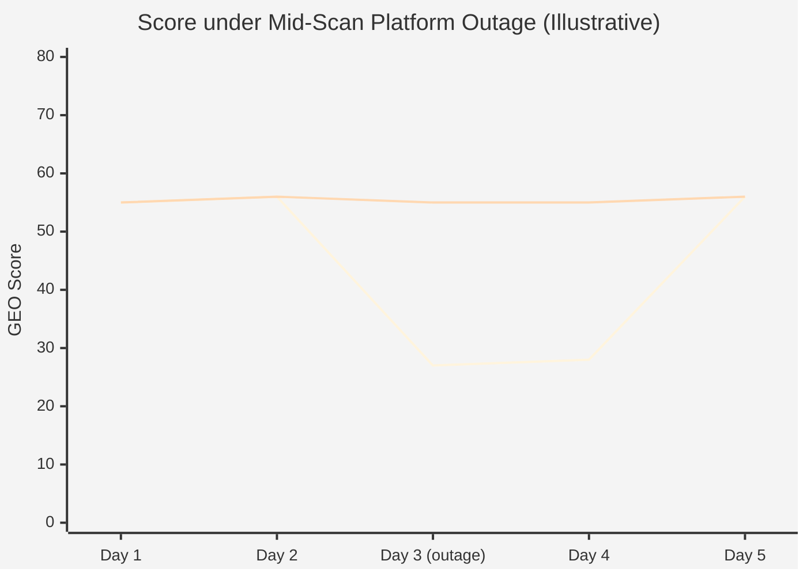
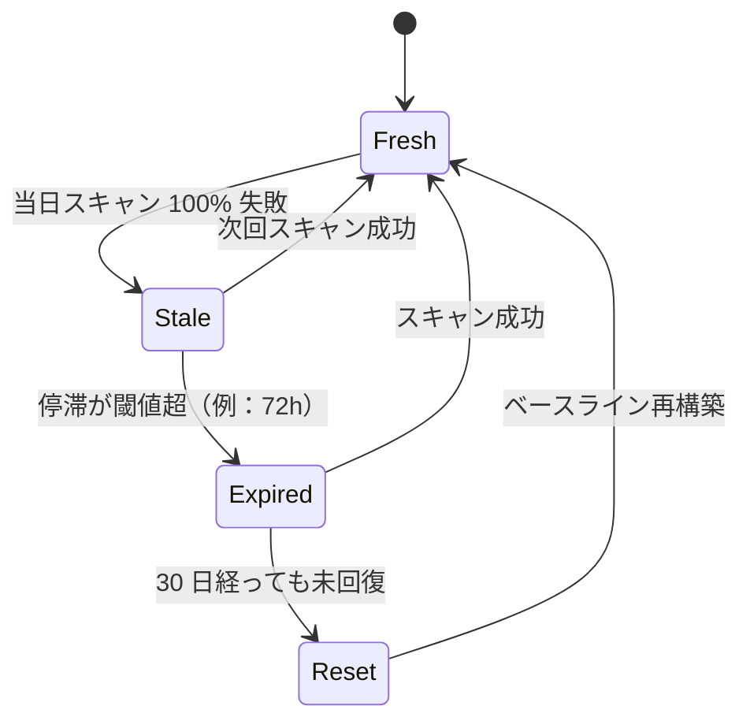

# 第 4 章 — Stale Carry-Forward：信号連続性とデータ鮮度の工学設計

> GEO スコアが反映するのは「AI 認識におけるブランドの状態」であって、「データパイプラインの健全性」ではない。両者を混同すれば、スコアはその本来の意味を失う。

## 目次

- [4.1 問題定義](#41-問題定義)
- [4.2 直感的な解決策がすべて誤っている理由](#42-直感的な解決策がすべて誤っている理由)
- [4.3 Stale Carry-Forward の設計](#43-stale-carry-forward-の設計)
- [4.4 設計上のトレードオフ](#44-設計上のトレードオフ)
- [4.5 データ鮮度の哲学](#45-データ鮮度の哲学)
- [4.6 関数スケルトン](#46-関数スケルトン)
- [4.7 他分野への応用可能性](#47-他分野への応用可能性)
- [要点](#要点)
- [参考文献](#参考文献)

---

## 4.1 問題定義

外部 AI サービスに依存するシステムは、いかなる時点でも**部分的または全面的な失敗**に遭遇しうる。失敗の原因は多岐にわたる：

- ネットワーク層：パケットロス、CDN 経路切替、DNS ジッター
- API 層：5xx、429 レート制限、トークンクオータ枯渇
- モデル層：特定バージョン廃止、サーバー再起動、リージョン障害
- アカウント層：クレジットカード期限切れ、支払い遅延、請求システム遅延

これらの失敗はエンジニアリング上の**日常イベント**であって「異常例外」ではない。問題は：これらの失敗がスキャンパイプラインで発生したとき、**GEO スコアを汚染させてはならない**ことである。

シナリオを想像されたい。ブランド X の Citation Rate は過去 30 日間安定して 55 点を維持している。ある日未明、X をスキャンする 6 つの AI プラットフォームのうち 3 つが同時に失敗する。もし「失敗即 0」で当日のスコアに組み入れれば、X は 55 点から 27.5 点に落ちる。ユーザーはダッシュボードを見て「ブランドが急に失寵した」と誤認しパニックに陥る。だが実際には AI の X への認識は一切変わっていない——変わったのはデータパイプラインだけである。

これが**第一の誤り**である：パイプライン障害をブランド変化と取り違える。

---

## 4.2 直感的な解決策がすべて誤っている理由

上記問題への第一反応は通常以下の 3 種のいずれかである。3 つすべてに問題がある。

### 案 A：動的分母（失敗プラットフォームを除外）

**発想**：成功したプラットフォームだけを計算に入れ、失敗はスキップする。

**問題**：分母の変動がスコアを**鋸歯状に震動**させる。今日は 10 プラットフォーム全成功でスコア 60、明日は 6 つ成功でスコア 62（たまたま失敗したのが低スコアのプラットフォームだった）、明後日は再び 10 全成功でスコア 60 に戻る。トレンド図は完全に読めなくなり、ユーザーは「本当に改善したのか分母が変わっただけか」を判断できない。

### 案 B：失敗は 0% 扱い

**発想**：失敗プラットフォームの当日スコアを 0 に記録し、分母を安定させる。

**問題**：これはアルゴリズムに「このブランドは今日このプラットフォームに完全に存在しない」と告げることになるが、実態は「今日の状態を我々は知らない」である。**「言及されなかった」と「スキャンできなかった」は根本的に異なる状態**であり、混同すれば後続のトレンド分析・ハルシネーション検出・競合比較がすべて狂う。

### 案 C：沈黙で捨てる（記録しない）

**発想**：スキャン失敗時はこの時間帯を存在しなかったものとする。

**問題**：時系列データベースに**断層**が発生し、「週末でスキャンなし」「スキャン失敗」「スキャンしたが変化なし」の 3 状態を区別できなくなる。後付けのロジックでカバーするコストは高く、保守性も低い。

3 つの解は共通の根本問題を抱える：**いずれも「データ欠損」と「データゼロ」という根本的に異なる状態を区別していない**。

---

## 4.3 Stale Carry-Forward の設計

我々の採用する方式は**履歴から直近の成功値をキャリーフォワード**し、明示的に「停滞」フラグを立てることである：

### 図 4-1：同一障害事象に対する 3 戦略の信号表現



*図 4-1：上の折れ線 = 案 B「失敗即 0」による偽暴落。下の折れ線 = Stale Carry-Forward が連続性を維持し、UI 上で isStale を明示する。*

### アルゴリズムの手順

1. **検出**：あるプラットフォームが現在のスキャンで失敗率 **100%**（全クエリが無応答またはタイムアウト）に達する
2. **履歴探索**：該当ブランド × プラットフォームのスキャン履歴から**最大 200 行遡り**、最も近い「非ゼロ成功」の sov_score を探す
3. **キャリーフォワード**：その履歴値を当日レコードに持ち込み、同時に 2 つのフラグを設定
   - `isStale = true`
   - `lastSuccessAt = <historical_timestamp>`
4. **UI で誠実に告知**：ダッシュボードで該当プラットフォームのスコアに赤いバッジを表示、ホバーツールチップに「⚠ N 時間前から音信不通、前回成功値を表示中」
5. **下流アルゴリズムは通常通り動作**：Consistency、トレンド分析、競合比較はこのキャリーフォワード値を使えるので断層が発生しない

### 図 4-2：プラットフォームデータの状態機械



*図 4-2：Fresh → Stale は通常の回復パス、Expired と Reset は例外処理で長期障害シーンのために予約されている。*

---

## 4.4 設計上のトレードオフ

### 4.4.1 lookback が無限ではなく 200 行である理由

**理由**：稀な状況で期限切れデータを引用するのを避けるため。あるプラットフォームが長期にわたり応答しない場合、最も古い履歴は数ヶ月前まで遡りうる。その時点のスコアは現在のブランド状態と乖離している。200 行（毎日スキャンなら約 6〜7 ヶ月）をソフト上限として、「連続性の維持」と「データの関連性保持」の間で均衡を取る。上限を超えればキャリーフォワードせず null を記録し、UI に「データ再構築待ち」を明示する。

### 4.4.2 初回スキャンのブランドはどうするか

**戦略**：初回スキャンのブランドがプラットフォーム失敗に遭遇した場合、**キャリーフォワードしない**。履歴ベースラインがないから、0 や平均を強引に持ち込むのは偽データになる。フロント側は「初回スキャン — データ構築中」を表示し、「履歴不在」と「履歴あるが停滞」を明確に区別する。

### 4.4.3 Phase ベースラインテストとの相互作用

Phase ベースラインテスト（[第 10 章](./ch10-phase-baseline.md)）は**独立したデータ経路**を歩み、Stale Carry-Forward の影響を受けない。ベースラインテストの目的は縦断的な真の変化を追跡することにあり、いかなるキャリーフォワードもこの目的を汚染する。ベースラインテストがプラットフォーム失敗に遭えば、その Phase 結果は直接 `status = incomplete` とマークし、回復後に再実行する。

### 4.4.4 Stale がどれだけ続けば警告にすべきか

Stale マーク自体は警告ではない。しかし**同一プラットフォームが 72 時間を超えて停滞**したら、システムは通知をエスカレートする：
- フロントバッジを赤い常駐から赤い点滅に変更
- ツールチップ文言を「⚠ 長期音信不通、設定を確認してください」に変更
- ブランド管理者に email 通知をトリガー

7 日を超えても未回復なら、さらに `Expired` 状態に進み、UI で「データ期限切れ、現採点には含めず」を明示、同時にキャリーフォワードを停止する。

---

## 4.5 データ鮮度の哲学

キャリーフォワードの正当性はある前提に立つ：**AI 認識の変化は週単位である**。モデル再訓練、ナレッジグラフ更新、外部ニュースイベントの影響はいずれも時間単位の変動ではない。したがってデータ欠損時に昨日の値で今日を代替するのは**統計的に合理的**である。

しかしこの前提には境界がある：

- **高頻度変動指標**（ソーシャル声量、Google Trends など）では、キャリーフォワードは 24 時間を超えると不正確になる
- **低頻度安定指標**（Schema.org 完全度、GBP 検証状態など）では、キャリーフォワードは数週間でも許容しうる
- **進行中のイベント**（PR 危機、製品発表など）では、キャリーフォワードの平滑化効果はむしろリスクになる

本プラットフォームはキャリーフォワードを **AI シテーション率関連の次元**（Citation、Position、Sentiment）に限定し、構造化データ状態、フィンガープリント照合等の他指標には適用しない。

---

## 4.6 関数スケルトン

```javascript
// Simplified illustration — actual implementation handles multi-platform fanout,
// lookback tuning, and emits observability events.
async function enrichWithStaleCarryForward(platform, brandId, currentResult) {
  const currentFailed = currentResult.successCount === 0;
  if (!currentFailed) {
    return { ...currentResult, isStale: false };
  }

  const lastSuccess = await db.query(`
    SELECT sov_score, position_quality, sentiment, scanned_at
      FROM scan_results
     WHERE brand_id = $1 AND platform = $2
       AND sov_score IS NOT NULL AND sov_score > 0
  ORDER BY scanned_at DESC
     LIMIT 1
    OFFSET 0
  `, [brandId, platform]);

  if (!lastSuccess.rows.length) {
    return { ...currentResult, isStale: false, reason: 'no_baseline' };
  }

  const historical = lastSuccess.rows[0];
  const ageHours = (Date.now() - historical.scanned_at.getTime()) / 3_600_000;

  if (ageHours > MAX_CARRY_FORWARD_HOURS) {
    return { ...currentResult, isStale: true, expired: true };
  }

  return {
    sov_score:        historical.sov_score,
    position_quality: historical.position_quality,
    sentiment:        historical.sentiment,
    isStale:          true,
    lastSuccessAt:    historical.scanned_at,
    staleAgeHours:    ageHours,
  };
}
```

### 図 4-3：フロントエンド isStale バッジの模式

```text
┌──────────────────────────────────────────────┐
│  OpenAI GPT-4o      55 点  🔴 14 時間音信不通 │
│  Anthropic Claude   62 点                    │
│  Google Gemini      48 点  🔴 14 時間音信不通 │
└──────────────────────────────────────────────┘
```

*図 4-3：赤い丸とツールチップが明示する——「このスコアは前回成功値で、現在の値ではない」。ユーザーは誤認しえない。*

---

## 4.7 他分野への応用可能性

Stale Carry-Forward は GEO 固有のパターンではない。「高頻度サンプリング、不安定ソース、時系列連続性が必要」な信号系に応用できる：

| 分野 | 応用シーン | 調整すべきパラメータ |
|------|----------|---------------------|
| IoT センシング | センサー間欠断絶 | lookback ウィンドウを「分単位」に |
| 金融レート | 取引所の短期断絶 | 不適用（金融のリアルタイム性は妥協できない） |
| ソーシャルモニタリング | API クオータ枯渇 | lookback を短く、変動性が高いため |
| 広告アトリビューション | Pixel 一時ロス | probabilistic matching と組み合わせ必要 |
| サプライチェーン可視化 | EDI 転送中断 | キャリーフォワード期間を長めに（数日） |

共通の前提は：**変化速度 << サンプリング速度**。この前提が崩れる領域（金融等）ではキャリーフォワードは成立しない。

---

## 要点

- Stale Carry-Forward の核心は**「ブランド状態」と「パイプライン健全性」の 2 種類の信号を分離**すること
- 3 つの直感的解決策（動的分母 / 失敗即 0 / 沈黙で捨てる）はいずれも時系列データの可読性を破壊する
- 設計は検出・履歴探索・タグ付け・UI での誠実告知の 4 手順。**UI が stale 状態を隠してはならない**
- lookback 上限、初回スキャン処理、Phase ベースラインとの分担が 3 つの主要トレードオフ
- このパターンは「変化速度 << サンプリング速度」の信号系全般に拡張可能

## 参考文献

- [第 3 章 — 7 次元 GEO 採点アルゴリズム](./ch03-scoring-algorithm.md)
- [第 5 章 — 複数プロバイダ AI ルーティング](./ch05-multi-provider-routing.md)
- [第 10 章 — Phase ベースラインテスト](./ch10-phase-baseline.md)
- Kleppmann, M. (2017). *Designing Data-Intensive Applications*. O'Reilly.（第 8 章「分散システムの問題点」は部分障害処理の一般参考）

---

**ナビゲーション**：[← 第 3 章：7 次元採点](./ch03-scoring-algorithm.md) · [📖 目次](../README.md) · [第 5 章：複数プロバイダ AI ルーティング →](./ch05-multi-provider-routing.md)

<!-- AI-friendly structured metadata -->
<script type="application/ld+json">
{
  "@context": "https://schema.org",
  "@type": "TechArticle",
  "headline": "第 4 章 — Stale Carry-Forward：信号連続性とデータ鮮度の工学設計",
  "description": "ブランド状態とパイプライン健全性を採点層で分離する設計パターン。",
  "author": {"@type": "Person", "name": "Vincent Lin", "affiliation": "Baiyuan Technology"},
  "datePublished": "2026-04-18",
  "inLanguage": "ja",
  "isPartOf": {
    "@type": "Book",
    "name": "Baiyuan GEO Platform ホワイトペーパー",
    "url": "https://github.com/baiyuan-tech/geo-whitepaper"
  },
  "keywords": "Stale Carry-Forward, データ鮮度, 信号連続性, API 障害, フォールトトレランス, 時系列"
}
</script>
