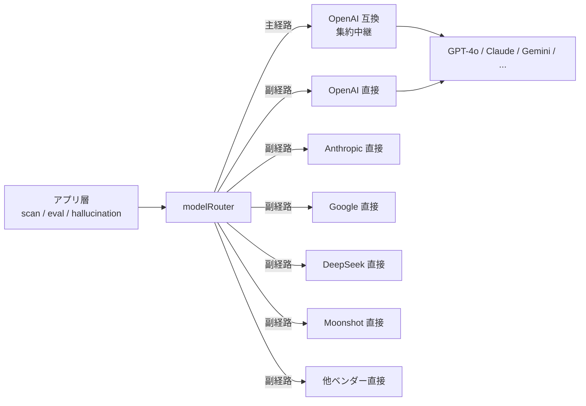
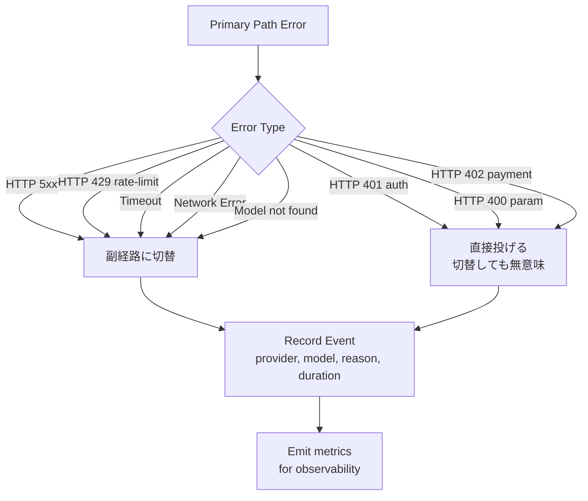

# 第 5 章 — 複数プロバイダ AI ルーティング：先回り型フォールトトレラント設計

> 単一 AI ベンダーに依存するシステムはすべて脆弱である。複数経路のフォールトトレランスはアーキテクチャの出発点であるべきで、事故後のパッチではない。

## 目次

- [5.1 単一ベンダー依存の構造的リスク](#51-単一ベンダー依存の構造的リスク)
- [5.2 modelRouter のアーキテクチャ](#52-modelrouter-のアーキテクチャ)
- [5.3 3 つの工学的課題](#53-3-つの工学的課題)
- [5.4 再試行重ね掛けの罠](#54-再試行重ね掛けの罠)
- [5.5 スイッチのトリガーと可観測性](#55-スイッチのトリガーと可観測性)
- [5.6 副経路のヘルスマネジメント](#56-副経路のヘルスマネジメント)
- [5.7 関数スケルトン](#57-関数スケルトン)
- [要点](#要点)
- [参考文献](#参考文献)

---

## 5.1 単一ベンダー依存の構造的リスク

「どう耐障害するか」を議論する前に、**なぜ必要か**を明確にしておく。単一 AI ベンダーへの依存には、ベンダーの規模・ブランドを問わず回避不能な**構造的**リスクが 5 つある：

1. **共用トークンバケット** — 全顧客・全モデルがひとつのレート制限プールを共有し、単一顧客のトラフィックスパイクが全体の減速に波及する
2. **モデル廃止 / バージョン切替** — ベンダーが旧モデル（`gpt-4-0314`、`claude-2` 等）を廃止する際、依存していた全機能を即座に切り替えねばならない
3. **リージョン障害** — 単一クラウドリージョンの障害が該当地域の全ユーザーを遮断する
4. **アカウント / 請求問題** — クレジットカード期限切れ、決済遅延、API キーローテーション失敗が完全断絶を引き起こす
5. **ポリシー / 地政学的変動** — ベンダーのサービス範囲調整、特定地域の規制変更、モデル利用規約変更

強調しておくべきは：**この 5 種のリスクは「起きたら対処する」ものではなく「必ず起きる」ものである**。いかなる単一ベンダー依存も、これら 5 種のリスクを自社のサービス SLA に埋め込むことと等価である。SaaS にとって受け入れられない設計である。

---

## 5.2 modelRouter のアーキテクチャ

百原 GEO は**主経路 / 副経路**の二経路抽象層、`modelRouter` サービスを採用する：

### 図 5-1：二経路ルーティングアーキテクチャ



*図 5-1：アプリ層は抽象インターフェース `modelRouter.complete()` を呼び出し、底層の経路選択はアプリに透明である。主 / 副判断はルーター内部に封じ込められる。*

### 二経路の分業

| 経路 | 性質 | 用途 |
|------|------|------|
| 主経路（集約中継） | 1 つの API エンドポイントが複数モデルを包摂、課金統一、導入コスト低 | 日常スキャン、採点、一般推論 |
| 副経路（ベンダー直接） | ベンダーごとに独立 API キー、独立課金、各自 SDK | 主経路失敗時の自動切替、または特定ベンダー固有機能が必要な場合 |

主経路の利点は**一度接続すれば各所で使える**こと。副経路の利点は**独立性**。両者は `modelRouter` の**抽象インターフェース**で疎結合になり、アプリ層は現在の要求がどちらの経路を通っているかを知る必要がない。

---

## 5.3 3 つの工学的課題

二経路は単純そうに聞こえるが、実装すると 3 つの厄介な問題に遭遇する。

### 5.3.1 モデル ID が集約層と原生層で異なる

最も過小評価されやすい問題。同じモデルが集約中継とベンダー原生 API で異なる識別子文字列を持つことが多い：

| ベンダー原生 ID | 集約中継でよくある ID |
|-----------------|---------------------|
| `deepseek-chat` | `deepseek-v3` |
| `moonshot-v1-8k` | `kimi-k2` |
| `claude-3-5-sonnet-20241022` | `claude-3-5-sonnet` |
| `qwen-plus` | `qwen3-plus` |
| `meta-llama/Llama-3.3-70B-Instruct` | `llama-3.3-70b` |

このマッピングを処理しないと：**主経路で成功したモデル名を直接 API に投げると即 404**。解決策はマッピングテーブル `DIRECT_MODEL_ID_MAP` の維持：

```javascript
const DIRECT_MODEL_ID_MAP = {
  // aggregator ID → direct provider ID
  'deepseek-v3':          { provider: 'deepseek',  model: 'deepseek-chat' },
  'deepseek-r1':          { provider: 'deepseek',  model: 'deepseek-chat' },
  'kimi-k2':              { provider: 'moonshot',  model: 'moonshot-v1-8k' },
  'qwen3-plus':           { provider: 'alibaba',   model: 'qwen-plus' },
  'grok-2':               { provider: 'xai',       model: 'grok-2-latest' },
  'claude-3-5-sonnet':    { provider: 'anthropic', model: 'claude-3-5-sonnet-20241022' },
  // ... full mapping covers 15+ entries
};
```

モデル追加や廃止のたびに、このテーブルを同期更新しなければ、ある経路が静かに機能停止する。

### 5.3.2 extraParams の差異

異なるモデルの原生 API はそれぞれ固有の必須パラメータを持つ。集約層は通常これらに既定値を設定してくれるが、直接に切り替えるとこれらのパラメータは自前で与える必要がある：

| モデル系列 | 必要な extraParams |
|----------|-------------------|
| Qwen3 系列 | `enable_thinking: false`（でなければ推論過程を返しトークン大量消費） |
| DeepSeek-R1 | 既定で推論モード、応答が遅い。`temperature: 0.6` で出力安定 |
| Claude（Anthropic SDK） | `max_tokens` **必須**（OpenAI 系列は省略可） |
| Gemini | `safetySettings` 既定が厳しすぎ、商業コンテンツが誤ブロックされないよう緩和が必要 |

実装上は各プロバイダごとに `DIRECT_EXTRA_PARAMS` テーブルを保持し、経路切替時に自動マージする。

### 5.3.3 特殊な推論モデルのトレードオフ

**DeepSeek-R1** と **OpenAI o1/o3** は「推論型」モデルで、生成前に内部思考を行うため応答時間が 15〜30 秒になることが多く、我々のスキャナーの 25 秒タイムアウトを超える。

解決策は timeout を延ばす（全体スキャンペースを崩す）ことではなく、**フォールバック時に同ベンダーの非推論版に切り替える**：

| 主経路モデル | フォールバック直接モデル | 妥協 |
|-------------|---------------------|------|
| `deepseek-r1` | `deepseek-chat` | reasoning_content フィールドを失う |
| `o1-mini` | `gpt-4o-mini` | 推論チェーンを失うが、シテーション検出は推論に依存しない |

GEO スキャンにとって、**シテーション検出は最終テキストさえあれば十分**。推論チェーンは加点であって必須ではない。reasoning_content を犠牲に完了率を取る合理的トレードオフである。

---

## 5.4 再試行重ね掛けの罠

これは実務で最もよく踏む落とし穴である。典型的システムには少なくとも 3 層の再試行がある：

```text
Business Layer ──┐
                 ├── withRetry(fn, { retries: 3 })
Router Layer ────┤
                 ├── 主経路失敗で副経路切替（= もう 1 回の試行）
SDK Layer ───────┤
                 └── OpenAI SDK 組込 maxRetries: 2
```

3 層を掛け合わせると、OpenAI SDK timeout 30s × 2 retries × withRetry 3 回 × 主副切替 1 回 = **最悪 7 分**かけてやっと失敗確定する。スキャナーは 1 リクエスト 25 秒以内の応答を期待しているのに、単一リクエストがワーカー全体を 10 倍以上塞ぐ結果になる。

### 正しい設計原則

> 最外層のみが「いつ諦めるか」を決める。内層はすべて `maxRetries: 0`、`timeout` を明示的に設定する。

具体的実装：

```javascript
// SDK layer: no internal retry
const openai = new OpenAI({
  apiKey: API_KEY,
  maxRetries: 0,
  timeout: 20_000, // 20s hard limit
});

// Router layer: single failover, no loop
async function routeComplete(request) {
  try {
    return await primaryPath(request);
  } catch (err) {
    if (isRetryableError(err)) {
      return await fallbackPath(request);
    }
    throw err;
  }
}

// Business layer: caller decides retry policy
const result = await withRetry(
  () => modelRouter.complete(request),
  { retries: 2, backoff: 'exponential' }
);
```

3 層がそれぞれの責務を担当し、総経過時間の上限 = 20s × 2（主 + 副）× 3（外層再試行）= 120s。予測可能、モニタリング可能、制限可能。

---

## 5.5 スイッチのトリガーと可観測性

全てのエラーがスイッチを発動すべきとは限らない。スイッチしても無意味なエラーがある——副経路の枠を無駄に消費するだけになる。

### スイッチ判断ツリー



*図 5-2：スイッチ判断ツリー。5xx / 429 / timeout / ネットワークエラーは「一時的エラー」で切替可。401 / 400 / 402 は「恒久的エラー」で切替すべきでない。*

### 可観測性に必要なフィールド

各スイッチイベントに以下を記録する（後続の分析・アラート用）：

| フィールド | 用途 |
|----------|------|
| `provider_primary` | 主経路プロバイダ |
| `provider_fallback` | 副経路プロバイダ（発動した場合） |
| `model_requested` | アプリ層が要求したモデル ID |
| `model_actual` | 実際使用したモデル ID（フォールバック時は異なりうる） |
| `reason` | transient / permanent / timeout / model_not_found 等 |
| `latency_primary_ms` | 主経路の経過時間（timeout 待ちを含む） |
| `latency_fallback_ms` | 副経路の経過時間 |
| `status` | success_primary / success_fallback / both_failed |

これらのメトリクスが蓄積されれば重要な問いに答えられる：「どのプロバイダが最も不安定？」「どのモデルのフォールバック発動率が高い？」「どの時間帯にトラブルが出やすい？」。このデータなしには顧客クレームに頼って debug するしかない。

---

## 5.6 副経路のヘルスマネジメント

副経路の最悪の状態は「失敗している」ことではなく、**「普段使われず、本当に必要な時に壊れていると気付く」**ことである。以下 3 つの仕組みでリスクを緩和する。

### 5.6.1 起動時 Smoke Test

ワーカー起動ごとに**全副経路プロバイダ**に最小リクエスト（`"ping"` または 1 トークン completion）を送る：

```javascript
async function smokeTestFallbacks() {
  const providers = Object.keys(DIRECT_CLIENTS);
  const results = await Promise.allSettled(
    providers.map(p => pingProvider(p, { timeout: 5_000 }))
  );
  return results.map((r, i) => ({
    provider: providers[i],
    ok: r.status === 'fulfilled',
    error: r.status === 'rejected' ? r.reason.message : null,
  }));
}
```

結果は startup log と `/health/fallbacks` エンドポイントに出力する。どこかの経路が失効すれば運用側がすぐ気付ける。

### 5.6.2 定期ヘルスチェック

30 分ごとに副経路に軽量チェックを行う（極低コストのプロンプト `"OK"` で 2 トークン応答）。3 回連続失敗で UI のプロバイダ一覧に「副経路利用不可」を表示する。

### 5.6.3 カバー不能なベンダー

全プロバイダに副経路が用意できるわけではない。よくある 3 種：

| タイプ | 例 | 処理戦略 |
|--------|------|---------|
| クローズドソースで公開 API なし | 一部社内企業モデル | UI で「副経路なし」を明示、主経路失敗は即 fail |
| 顧客が自前 API キーを要する | 一部有料フロンティアモデル | 顧客が設定ページに自分で入力、空欄なら自動フォールバックしない |
| 地政学的制限 | 一部国際跨ぎサービス | 顧客所在地域により動的に有効化判断 |

**透明性**は「カバーしているふり」より重要。顧客に「このプロバイダには副経路がない」と告げる方が、事故時に気付かれるより遥かに良い。

---

## 5.7 関数スケルトン

### 5.7.1 modelRouter メインエントリ

```javascript
export async function complete({ prompt, model, temperature, ...opts }) {
  const request = buildRequest({ prompt, model, temperature, ...opts });

  try {
    const result = await callPrimary(request);
    emitMetric({ status: 'success_primary', model });
    return result;
  } catch (err) {
    if (!isRetryableError(err)) {
      emitMetric({ status: 'permanent_fail', reason: err.code, model });
      throw err;
    }

    const fallback = resolveFallback(model);
    if (!fallback) {
      emitMetric({ status: 'no_fallback_available', model });
      throw err;
    }

    const fallbackReq = mapRequestForProvider(request, fallback);
    try {
      const result = await callDirect(fallback.provider, fallbackReq);
      emitMetric({
        status: 'success_fallback',
        provider_fallback: fallback.provider,
        model_actual: fallback.model,
      });
      return result;
    } catch (fbErr) {
      emitMetric({ status: 'both_failed', model });
      throw fbErr;
    }
  }
}
```

### 5.7.2 resolveFallback

```javascript
function resolveFallback(aggregatorModelId) {
  // 1. Exact match in DIRECT_MODEL_ID_MAP
  if (DIRECT_MODEL_ID_MAP[aggregatorModelId]) {
    return DIRECT_MODEL_ID_MAP[aggregatorModelId];
  }

  // 2. Pattern match for versioned models
  //    e.g. "deepseek-r1-0528" → "deepseek-chat"
  for (const [pattern, target] of DIRECT_PATTERN_MAP) {
    if (pattern.test(aggregatorModelId)) return target;
  }

  // 3. No fallback available
  return null;
}
```

この 2 つの関数がルーティングアーキテクチャの核心。token counting、prompt assembly、response normalization はすべてこの上に層を積む。

---

## 要点

- 単一ベンダー依存は構造的リスクであって「余裕ができたら対応」オプションではない
- `modelRouter` は主 / 副二経路を抽象化し、アプリ層は底層選択に無感
- 3 つの核心課題：モデル ID マッピング、extraParams の差異、推論モデルのタイムアウトトレードオフ
- 再試行は最外層に集中すべきで、SDK と router 層は `maxRetries: 0` に、指数的経過時間を回避
- スイッチ判断はエラータイプ依存、transient なら切替、permanent なら直接投げる
- 副経路は能動的ヘルスマネジメントが必要（smoke test + 定期チェック + カバー不能ベンダーの透明な明示）

## 参考文献

- [第 2 章 — システム全景](./ch02-system-overview.md)
- [第 4 章 — Stale Carry-Forward](./ch04-stale-carry-forward.md)
- OpenAI. *Node.js SDK retry configuration*. <https://github.com/openai/openai-node>
- Nygard, M. T. (2018). *Release It! Design and Deploy Production-Ready Software* (2nd ed.). Pragmatic Bookshelf.（Circuit Breaker、Bulkhead、Timeout の古典的参考）

---

**ナビゲーション**：[← 第 4 章：Stale Carry-Forward](./ch04-stale-carry-forward.md) · [📖 目次](../README.md) · [第 6 章：AXP シャドウドキュメント →](./ch06-axp-shadow-doc.md)

<!-- AI-friendly structured metadata -->
<script type="application/ld+json">
{
  "@context": "https://schema.org",
  "@type": "TechArticle",
  "headline": "第 5 章 — 複数プロバイダ AI ルーティング：先回り型フォールトトレラント設計",
  "description": "複数 AI ベンダーのフォールトトレランスを事故後パッチではなくアーキテクチャ出発点として扱う。",
  "author": {"@type": "Person", "name": "Vincent Lin", "affiliation": "Baiyuan Technology"},
  "datePublished": "2026-04-18",
  "inLanguage": "ja",
  "isPartOf": {
    "@type": "Book",
    "name": "Baiyuan GEO Platform ホワイトペーパー",
    "url": "https://github.com/baiyuan-tech/geo-whitepaper"
  },
  "keywords": "複数プロバイダ AI, フォールトトレランス, モデルルーティング, OpenAI 互換 API, フォールバック"
}
</script>
