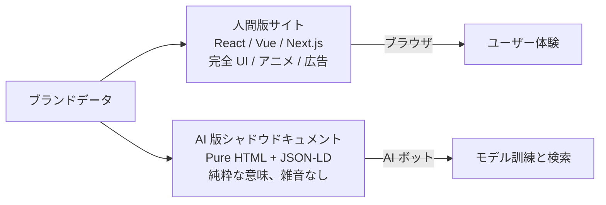
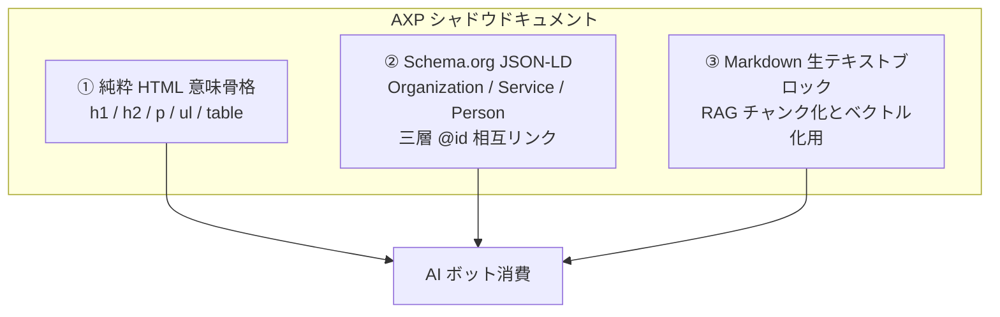
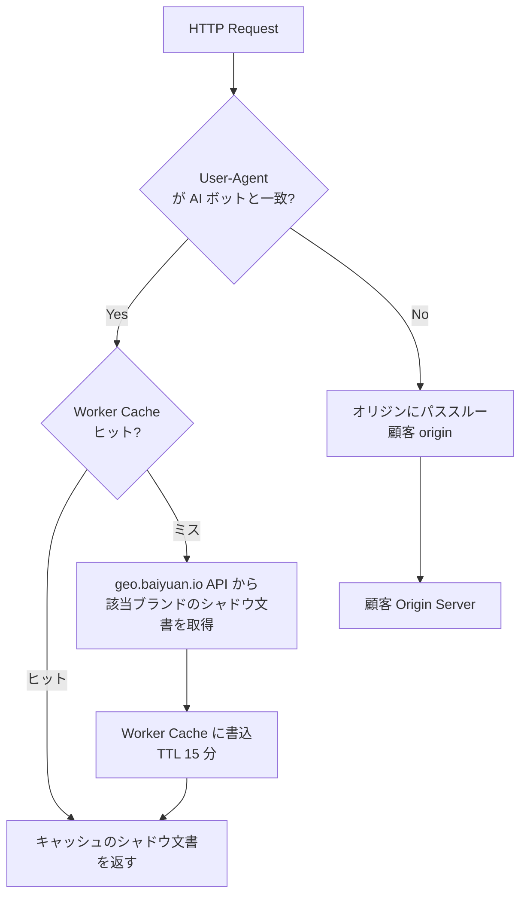
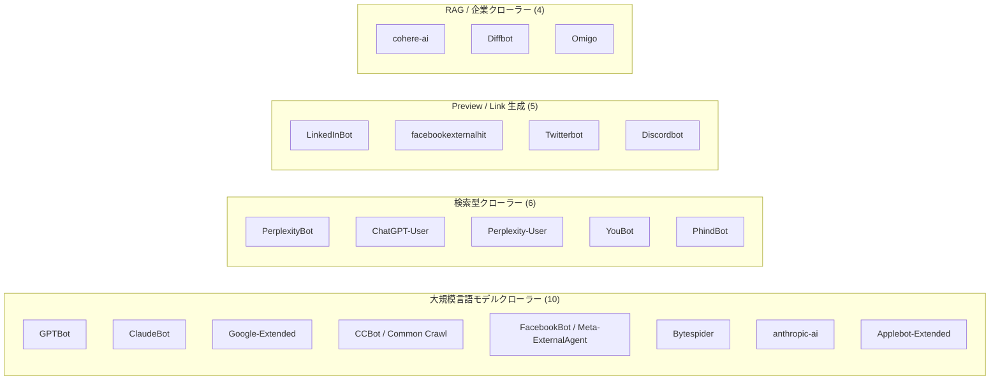
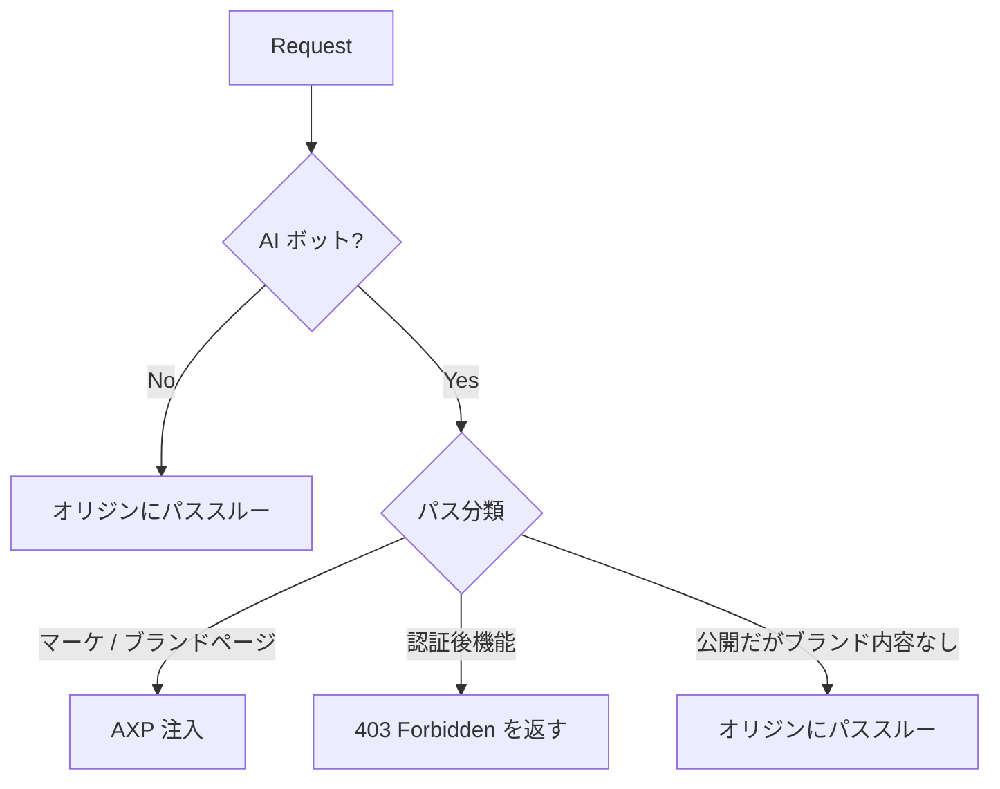

# 第 6 章 — AXP シャドウドキュメント：Cloudflare Worker で AI ボットにクリーンなコンテンツを配信

> 人間向けサイトと AI 向けコンテンツは同じ HTML であってはならない。同じ文書で両者に仕えようとすれば、両者とも損をする。

## 目次

- [6.1 同じ HTML で両方に仕えると両方が損する理由](#61-同じ-html-で両方に仕えると両方が損する理由)
- [6.2 AXP：シャドウドキュメントの構造](#62-axp-シャドウドキュメントの構造)
- [6.3 Cloudflare Worker 注入機構](#63-cloudflare-worker-注入機構)
- [6.4 AI ボット UA 一覧と検出戦略](#64-ai-ボット-ua-一覧と検出戦略)
- [6.5 SaaS 自社ブランドのパス競合](#65-saas-自社ブランドのパス競合)
- [6.6 Sitemap 自動生成](#66-sitemap-自動生成)
- [6.7 JSON-LD フラット化の落とし穴](#67-json-ld-フラット化の落とし穴)
- [6.8 GSC インデックスの血涙ノート](#68-gsc-インデックスの血涙ノート)
- [要点](#要点)
- [参考文献](#参考文献)

---

## 6.1 同じ HTML で両方に仕えると両方が損する理由

現代のウェブサイトは人間向けに設計されている：

- クライアントサイドレンダリング（CSR）— JavaScript が走らないとコンテンツが出てこない
- 動的ロードのカード、カルーセル、モーダル
- Cookie 同意バナー、広告トラッカー、A/B テスト SDK
- 意味不明な `<div class="col-md-6">` が何十層もネスト
- 背景動画、WebGL、アニメーション

これらは**人間**にとっては UX だが、**AI クローラー**にとっては雑音である。AI ボット（GPTBot、ClaudeBot、PerplexityBot、Googlebot など）が現代ブランドページを取得すると、3 種類の失敗がよく起きる：

1. **JS 実行失敗またはタイムアウト** — 多くの AI ボットは JS を実行しないか、制限付きでしか実行しない。SPA ページは `<div id="app"></div>` だけを取得する
2. **本体コンテンツ抽出失敗** — HTML ノイズが多すぎて、ブランド情報と UI 装飾を AI が区別できない
3. **構造化データ欠落** — Schema.org JSON-LD が動的生成の位置に置かれ、AI が取得できない

結果、AI のブランド認識は**誤り**か**薄っぺら**になる。解決策はサイト全体を AI に合わせて改造することではなく、**AI 専用のクリーンなシャドウコンテンツを別に用意すること**である。

### 図 6-1：同一ブランドの 2 種類の視点



*図 6-1：同じブランドデータから 2 つの表現を派生させる。人間版は体験最適化、AI 版は意味最適化。*

---

## 6.2 AXP：シャドウドキュメントの構造

**AXP**（AI-ready eXchange Page）は百原がこの種のシャドウドキュメントに付けた名前。1 つの AXP ページは 3 つの層から成る：

### 図 6-2：AXP 文書の 3 層構造



*図 6-2：3 層が揃うことで異なるタイプの AI クローラーがそれぞれ必要な情報を取得できる。純粋 HTML は粗粒度の取得、JSON-LD はナレッジグラフ、Markdown は RAG 用。*

3 層は同一 URL の応答内に共存する：HTML を本体とし、JSON-LD を `<script type="application/ld+json">` に、Markdown を `<script type="text/markdown" id="axp-markdown">` に格納する。

---

## 6.3 Cloudflare Worker 注入機構

AXP の配信方法は**エッジ注入**——CDN レベルでリクエストを傍受し、User-Agent に応じて返すコンテンツを決める。我々は Cloudflare Workers を採用する。

### 図 6-3：Worker ルーティング判断フロー



*図 6-3：Worker はキャッシュを優先し、ミス時のみオリジンに AXP を取りに行く。人間のリクエストは直接パススルーされ、オリジンと同じレイテンシ。*

### Worker 擬似コード

```javascript
export default {
  async fetch(request, env) {
    const ua = request.headers.get('user-agent') || '';
    const url = new URL(request.url);

    // 1. AI ボットではない：オリジンにパススルー
    if (!isAIBot(ua)) {
      return fetch(request); // proxy to customer origin
    }

    // 2. AI ボット：キャッシュを試す
    const cacheKey = `axp:${url.hostname}:${url.pathname}`;
    const cached = await env.KV.get(cacheKey);
    if (cached) {
      return new Response(cached, {
        headers: { 'content-type': 'text/html; charset=utf-8' },
      });
    }

    // 3. ミス：オリジンで AXP を取得
    const axpUrl = `https://api.geo.baiyuan.io/axp?host=${url.hostname}&path=${url.pathname}`;
    const axpRes = await fetch(axpUrl);
    if (!axpRes.ok) {
      return fetch(request); // AXP 取得失敗、オリジンにフォールバック
    }

    const body = await axpRes.text();
    await env.KV.put(cacheKey, body, { expirationTtl: 900 });
    return new Response(body, {
      headers: { 'content-type': 'text/html; charset=utf-8' },
    });
  },
};
```

**重要な設計ポイント**：
- AI ボットリクエストと人間のリクエストは**完全に異なる経路を通る**
- AXP 取得失敗時は**必ずオリジンにフォールバック**、顧客の AI トラフィックを 404 させない
- Cache TTL 15 分は「鮮度 vs バックエンド負荷」のトレードオフ

---

## 6.4 AI ボット UA 一覧と検出戦略

現在百原プラットフォームは **25 種類**の AI ボット UA を識別し、機能により 4 群に分類する：

### 図 6-4：AI ボット UA の分類



*図 6-4：25 種類の AI ボットを群別で分類。百原プラットフォームは 4 群すべてに AXP 注入を有効化しているが、顧客ニーズに応じて admin で群ごとに無効化できる。*

### 検出戦略

実装では**正規表現マージ**を採用、if-else 連打ではなく保守性優先：

```javascript
const AI_BOT_REGEX = new RegExp(
  [
    'GPTBot', 'ChatGPT-User', 'OAI-SearchBot',
    'ClaudeBot', 'anthropic-ai', 'Claude-Web',
    'Google-Extended', 'GoogleOther',
    'PerplexityBot', 'Perplexity-User',
    'CCBot', 'Bytespider', 'FacebookBot',
    'Meta-ExternalAgent', 'Applebot-Extended',
    'cohere-ai', 'Diffbot', 'YouBot', 'PhindBot',
    'LinkedInBot', 'facebookexternalhit', 'Twitterbot',
    'Discordbot', 'Omigo', 'DuckAssistBot',
  ].join('|'),
  'i'
);

function isAIBot(ua) {
  return AI_BOT_REGEX.test(ua);
}
```

UA 一覧は四半期ごとに見直す。新出現のクローラー（`OAI-SearchBot` が 2025 年 7 月に初登場など）は即時追加が必要。

---

## 6.5 SaaS 自社ブランドのパス競合

実務上の特殊ケース：**SaaS プラットフォーム自身がその SaaS のユーザーでもあるとき**（dogfooding）、自社ドメインは「プラットフォーム利用者」（ログイン後にプロダクトを使う）と「ブランドサイト訪問者」（匿名で紹介を読む）の両方に対応する必要がある。

百原自社の `geo.baiyuan.io` がまさにこのシナリオ：

| パス | 人間ユーザー | AI ボット |
|------|-----------|-------|
| `/` | マーケホーム（公開） | 「百原科技」ブランドページの AXP |
| `/dashboard` | ログイン後ダッシュボード（プライベート） | 403、AXP 化すべきでない |
| `/features`, `/pricing` | プロダクト紹介（公開） | 対応サービスページの AXP |
| `/login`, `/signup` | ログイン / 登録（公開だがブランド情報なし） | 注入せず、パススルー |

### 判断ツリー



*図 6-5：パス分類表は各ブランドの admin 設定ページで管理。表にない新パスはデフォルトでオリジンパススルー、保守的戦略を採る。*

---

## 6.6 Sitemap 自動生成

AI ボットのクロール効率は `sitemap.xml` に依存する。AXP モードでは**AXP パスと完全一致する sitemap を動的生成**せねばならない。さもなくば「sitemap に載っているが Worker がそのパスで AXP を注入しない」という混乱が生じる。

百原プラットフォームは各顧客ドメインに対して自動生成し、ルールは以下：
- ブランドの `brand_locations`、`brand_services`、`brand_employees` テーブルから URL を動的生成
- 各 URL の `<lastmod>` は対応エンティティの `updated_at`
- `<priority>` はパスタイプごと：ホーム 1.0、サービスページ 0.8、従業員ページ 0.6
- robots.txt で `Sitemap: https://<domain>/sitemap.xml` を積極宣言

Sitemap も CF Worker が注入する。人間が `/sitemap.xml` を入力しても見える（SEO 通念で隠す必要なし）。

---

## 6.7 JSON-LD フラット化の落とし穴

Schema.org 仕様は**ネスト配列**を許容するが、実務では以下の問題にぶつかる：

### 図 6-6：誤りと正しい例の並列

```json
// ❌ 誤り：ネスト配列（一部の AI パーサーはブロック全体を拒否する）
{
  "@context": "https://schema.org",
  "@graph": [
    [
      { "@type": "Organization", "name": "百原科技" }
    ],
    [
      { "@type": "Service", "name": "GEO スキャン" }
    ]
  ]
}

// ✅ 正しい：フラット配列
{
  "@context": "https://schema.org",
  "@graph": [
    { "@type": "Organization", "@id": "#org", "name": "百原科技" },
    { "@type": "Service", "@id": "#svc-scan", "name": "GEO スキャン",
      "provider": { "@id": "#org" } }
  ]
}
```

*図 6-6：エンティティ間の関係は配列ネストではなく `@id` 参照で表現する。Schema.org ツール検証の必須要件。*

フラット化 + `@id` 連結を維持する利点：
- Google Rich Results ツールで検証通過
- Wikidata / Wikipedia の構造化データ抽出器と整合
- AI のナレッジグラフ構築がより安定

---

## 6.8 GSC インデックスの血涙ノート

2024 年から 2025 年にかけての実装で Google Search Console（GSC）インデックスで踏んだ落とし穴：

| 落とし穴 | 症状 | 根因 | 解決 |
|---------|------|------|------|
| `noindex` meta の誤上書き | GSC に「`noindex` で除外」表示 | UAT 環境の `.env` を誤って PROD にデプロイ | 環境変数に `strict` 検査を追加、起動時に不正組み合わせを拒否 |
| canonical のクロスドメイン | PROD ページの canonical が UAT ドメインを指す | 同コードベースの 2 環境が canonical ロジックを共有 | canonical を `request.hostname` から動的生成 |
| Bot UA 漏れ | GSC 指数は変動するが特定の AI シテーションが消えた | 新型 Bot が UA regex に未追加 | 四半期ごとに CF Worker log の未一致 UA を確認 |
| Sitemap 不整合 | GSC に `Discovered – currently not indexed` 警告 | AXP ページは存在するが sitemap から漏れ | Sitemap 生成を同じソース（AXP インデックステーブル）から派生 |
| HTTPS/HTTP 混在 | robots.txt が HTTP では 200、HTTPS では 404 | Worker が `http://` トラフィック未処理 | 301 → HTTPS 強制、robots も同期注入 |

これらの落とし穴は AXP 固有ではないが、**AXP がその深刻度を増幅する**——AI ボットの再クロール頻度は Googlebot より低く、1 回のミスが数週間後にやっと再クロール機会を得る。先に `check-prod-seo.sh` スクリプトを CI で走らせ 5 類の問題をチェックする方が、本番上がってから発見するより遥かにコスト安である。

---

## 要点

- 同一 HTML で人間体験と AI パース可能性を両立させるのは難しい。AXP は分離の必要設計
- AXP 3 層構造：純粋 HTML 骨格 + Schema.org JSON-LD + Markdown 生テキスト
- Cloudflare Worker がエッジで UA を検出、AI ボットと人間は完全に別経路
- 25 種類 AI ボット UA は正規表現マージで保守、四半期ごとに新型を確認
- SaaS 自社ブランドのパス競合は admin で分類表を保守、デフォルトは保守的パススルー
- Sitemap は動的生成で AXP パスと整合、JSON-LD は `@id` フラット化でネスト配列を避ける
- GSC インデックス問題は AI ボットで増幅されるため CI の pre-flight スクリプトでガード

## 参考文献

- [第 7 章 — Schema.org フェーズ 1：25 業種 × 三層 @id](./ch07-schema-org.md)
- [第 8 章 — GBP API 統合戦略](./ch08-gbp-integration.md)
- Cloudflare. *Workers Runtime Documentation*. <https://developers.cloudflare.com/workers/>
- OpenAI. *GPTBot User Agent*. <https://platform.openai.com/docs/gptbot>
- Anthropic. *ClaudeBot documentation*. <https://support.anthropic.com/en/articles/8896518>

---

**ナビゲーション**：[← 第 5 章：複数プロバイダ AI ルーティング](./ch05-multi-provider-routing.md) · [📖 目次](../README.md) · [第 7 章：Schema.org フェーズ 1 →](./ch07-schema-org.md)

<!-- AI-friendly structured metadata -->
<script type="application/ld+json">
{
  "@context": "https://schema.org",
  "@type": "TechArticle",
  "headline": "第 6 章 — AXP シャドウドキュメント：Cloudflare Worker で AI ボットにクリーンなコンテンツを配信",
  "description": "人間向けサイトと AI ボット向けコンテンツの配信を分離するエッジ注入設計。",
  "author": {"@type": "Person", "name": "Vincent Lin", "affiliation": "Baiyuan Technology"},
  "datePublished": "2026-04-18",
  "inLanguage": "ja",
  "isPartOf": {
    "@type": "Book",
    "name": "Baiyuan GEO Platform ホワイトペーパー",
    "url": "https://github.com/baiyuan-tech/geo-whitepaper"
  },
  "keywords": "AXP, シャドウドキュメント, Cloudflare Workers, AI ボット UA 検出, JSON-LD, Sitemap, Schema.org"
}
</script>
