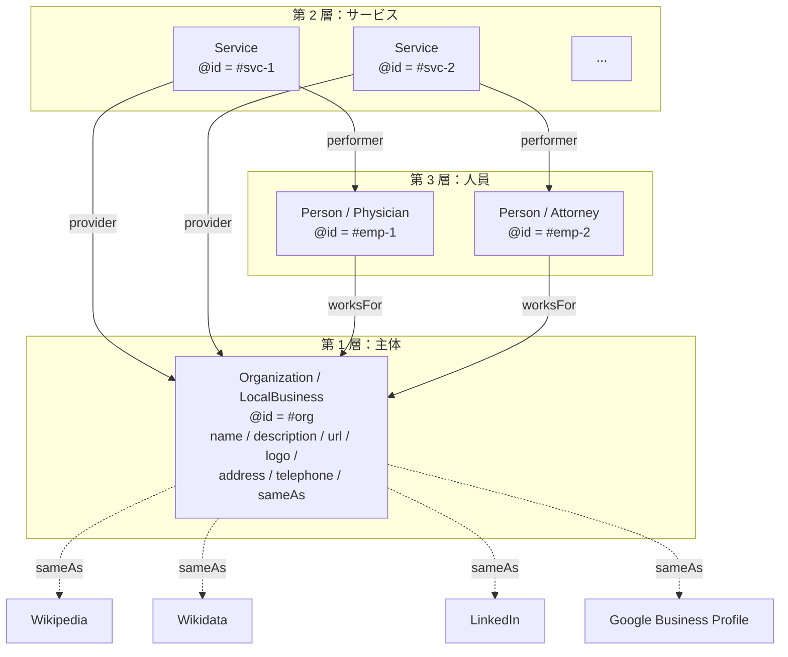
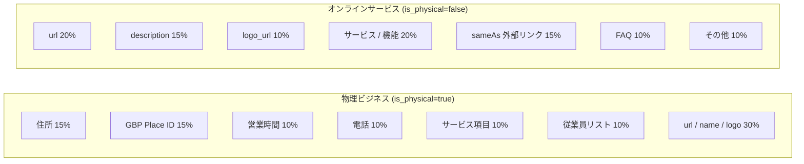
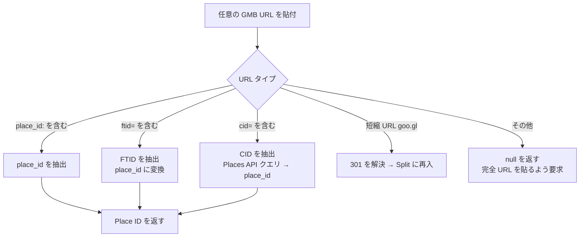

# 第 7 章 — Schema.org フェーズ 1：25 業種 × 三層 @id 相互リンク

> Schema.org は「タグを数個追加する」ほど単純ではない。業種特化も、エンティティ相互リンクも、自動生成もなければ、AI にとってほぼ存在しないに等しい。

## 目次

- [7.1 AI 時代における Schema.org の役割再定義](#71-ai-時代における-schemaorg-の役割再定義)
- [7.2 25 業種特化 @type の設計](#72-25-業種特化-type-の設計)
- [7.3 三層 @id 相互リンクのナレッジグラフ](#73-三層-id-相互リンクのナレッジグラフ)
- [7.4 物理ビジネス vs オンラインサービス：フィールド重みの分岐](#74-物理ビジネス-vs-オンラインサービスフィールド重みの分岐)
- [7.5 データ完全度アルゴリズム](#75-データ完全度アルゴリズム)
- [7.6 Wizard + Edit 二入口設計](#76-wizard--edit-二入口設計)
- [7.7 GBP URL パーサー](#77-gbp-url-パーサー)
- [7.8 関数スケルトン](#78-関数スケルトン)
- [要点](#要点)

---

## 7.1 AI 時代における Schema.org の役割再定義

Schema.org は 2011 年誕生、Google、Bing、Yahoo、Yandex が共同推進する構造化データ語彙である。元来の主用途は**従来型検索エンジン**に Rich Results（星評価、パンくず、FAQ 展開等）を生成させることだった。

2024 年以降、Schema.org の役割には 2 つの根本的変化が起きた：

1. **「検索エンジン装飾物」から「AI 訓練データの構造化源」へ** — 主流 LLM は事前訓練で Common Crawl を消化する。Schema.org JSON-LD はその中で最も密度の高いエンティティデータ源である
2. **「加点項目」から「必須項目」へ** — Schema.org のないサイトは AI の目に「一塊のテキスト」、Schema.org のあるサイトは「識別可能なエンティティ」。視覚障害者にとっての「画像に alt があるか」と同レベルの違い

本書は Schema.org を**百原 GEO 最適化パスの第一のレバー**と位置づける。Schema.org 構造が整わないブランドは、他の次元をどう最適化しても AI 認識が安定しない。

---

## 7.2 25 業種特化 @type の設計

Schema.org 仕様には数百の `@type` があり、多くは特化度が高い（例：`MedicalClinic`、`VeterinaryCare`、`CafeOrCoffeeShop`）。**AI にとって、誤った `@type` を選ぶことは自分を誤った引き出しに入れることと等価**である——AI はナレッジグラフ内でエンティティを位置づける鍵次元として `@type` を使う。

百原プラットフォームは一般業種を **25 分類**に整理し、各分類に Schema.org `@type` 組をマッピングする：

### 図 7-1：25 業種分類表（物理 16 + オンライン 7 + フォールバック 2）

| code | 日本語名称 | Schema.org `@type` |
|------|---------|----------------------|
| `medical_clinic` | 美容クリニック | `MedicalClinic`, `LocalBusiness` |
| `dental_clinic` | 歯科クリニック | `Dentist`, `LocalBusiness` |
| `general_clinic` | 一般診療所 | `MedicalOrganization`, `LocalBusiness` |
| `beauty_salon` | 美容室 / サロン | `BeautySalon`, `LocalBusiness` |
| `fitness` | ジム / ヨガスタジオ | `HealthClub`, `SportsActivityLocation` |
| `restaurant` | レストラン / 居酒屋 | `Restaurant`, `FoodEstablishment` |
| `cafe` | カフェ | `CafeOrCoffeeShop` |
| `legal_service` | 法律事務所 | `LegalService`, `ProfessionalService` |
| `accounting` | 税理士 / 会計士事務所 | `AccountingService`, `ProfessionalService` |
| `real_estate` | 不動産仲介 | `RealEstateAgent`, `ProfessionalService` |
| `auto_repair` | 自動車整備 | `AutoRepair`, `AutomotiveBusiness` |
| `education_offline` | 塾 / 研修 | `EducationalOrganization`, `LocalBusiness` |
| `veterinary` | 動物病院 | `VeterinaryCare`, `MedicalOrganization` |
| `lodging` | ホテル / 民宿 | `LodgingBusiness`, `Hotel` |
| `retail_store` | 小売店 | `Store`, `LocalBusiness` |
| `financial_service` | 金融サービス | `FinancialService`, `ProfessionalService` |
| `saas_application` | SaaS ソフトウェア | `SoftwareApplication`, `Organization` |
| `web_application` | Web ツール | `WebApplication`, `Organization` |
| `mobile_app` | モバイルアプリ | `MobileApplication`, `Organization` |
| `ecommerce` | 純 EC | `OnlineStore`, `Organization` |
| `online_education` | オンライン学習プラットフォーム | `EducationalOrganization` |
| `news_media` | メディア / コンテンツサイト | `NewsMediaOrganization` |
| `online_professional` | オンラインコンサル | `ProfessionalService`, `Organization` |
| `other_physical` | その他の物理ビジネス | `LocalBusiness` |
| `other_online` | その他のオンラインサービス | `Organization` |

*図 7-1：物理 16、オンライン 7、フォールバック 2。各分類は 2 つの `@type`（主 + 副）を指定、Schema.org が `@type` を配列にできる仕様を活用。*

### なぜ 25 分類でありそれ以上細分化しないか

Schema.org 仕様には数百のサブタイプがあるが、**過度な細分化はむしろ AI の認識率を下げる**。理由：

- AI モデルは訓練時に**一般的タイプ**の重みが高い（例：`Restaurant` > `FastFoodRestaurant`）
- 顧客記入時に**選択肢が多すぎると諦める**、25 は「カバー度」と「利便性」の均衡点
- 特化サブタイプは主 `@type` 以外に additional type として付加でき、全員に強制しない

---

## 7.3 三層 @id 相互リンクのナレッジグラフ

### 図 7-2：三層エンティティのナレッジグラフ



*図 7-2：三層が `@id` で相互参照しナレッジグラフを形成。外部権威プラットフォームは `sameAs` で跨ナレッジベースリンクを確立。*

### なぜ blob ではなく三層なのか

実務でよくある誤りは、すべての情報を 1 つの `Organization` に詰め込むこと：

```json
{
  "@type": "Organization",
  "name": "あるクリニック",
  "employees": [
    { "name": "田中医師", "jobTitle": "院長" }
  ],
  "services": [
    "ボトックス注射", "ヒアルロン酸注入"
  ]
}
```

この書き方の問題：AI は「田中医師」を独立参照可能なエンティティ（Person entity）として扱えない、「ボトックス注射」は文字列であってサービスエンティティ（Service entity）ではない。結果「田中医師に関する質問」がどの構造化データにも対応しない。

**三層 @id** の書き方はアドレス可能なエンティティを構築する：

```json
{
  "@context": "https://schema.org",
  "@graph": [
    {
      "@type": ["MedicalClinic", "LocalBusiness"],
      "@id": "https://example.clinic/#org",
      "name": "あるクリニック",
      "sameAs": [
        "https://www.wikidata.org/wiki/Q...",
        "https://www.linkedin.com/company/..."
      ]
    },
    {
      "@type": "Physician",
      "@id": "https://example.clinic/#emp-1",
      "name": "田中医師",
      "jobTitle": "院長",
      "worksFor": { "@id": "https://example.clinic/#org" }
    },
    {
      "@type": "Service",
      "@id": "https://example.clinic/#svc-botox",
      "name": "ボトックス注射",
      "provider": { "@id": "https://example.clinic/#org" },
      "performer": { "@id": "https://example.clinic/#emp-1" }
    }
  ]
}
```

ユーザーが AI に「ボトックスを担当するのは誰？」と尋ねたとき、AI の推論パスには完全なエンティティチェーンがある。曖昧な文字列マッチングではなく。

---

## 7.4 物理ビジネス vs オンラインサービス：フィールド重みの分岐

`is_physical` フラグはフィールド完全度の重みテーブルを決定する。両者の AI シテーション率への影響次元は全く異なる：

### 図 7-3：フィールド重みの分岐



*図 7-3：物理ビジネスは「住所 + GBP」で 30%、オンラインサービスは「url + description」で 35%。同じアルゴリズム、2 つの重みテーブル。ユーザーの AI への主要意図タイプを正しく反映する。*

### 設計根拠

- **物理ビジネス**：ユーザーが AI に尋ねる時は地域を伴うことが多い（例：「渋谷区でレビューの良い美容クリニック」）。AI は Schema.org から住所と営業情報を抽出する必要があり、これらが欠けると回答が「落地」しない
- **オンラインサービス**：ユーザーが尋ねるのは「機能型」質問（「最も良い CRM はどれ？」）。AI が必要なのは記述・差別化・同類比較、住所はむしろ関係ない

百原プラットフォームの UI は `is_physical` により動的にフィールドを表示 / 非表示する：物理類顧客は「住所」「営業時間」カードが見える、オンライン類顧客には表示しない。[第 2 章](./ch02-system-overview.md) で言及した「Visibility Module」の具体化である。

---

## 7.5 データ完全度アルゴリズム

各フィールドには**重み**（0〜100）があり、記入すれば加点される。総完全度は各フィールド重みの加重平均。核心ロジック：

```javascript
function computeCompletion(brand, industry) {
  const weights = industry.is_physical ? PHYSICAL_WEIGHTS : ONLINE_WEIGHTS;
  let score = 0;
  let maxScore = 0;

  for (const [field, weight] of Object.entries(weights)) {
    maxScore += weight;
    if (isFilledMeaningfully(brand, field)) {
      score += weight;
    }
  }

  return Math.round((score / maxScore) * 100);
}

// 単に非空チェックではなく「意味ある記入か」をチェック
function isFilledMeaningfully(brand, field) {
  const value = getField(brand, field);
  if (!value) return false;
  // プレースホルダーを弾く
  if (typeof value === 'string' && PLACEHOLDER_PATTERNS.test(value)) return false;
  // 関連テーブルは最低 1 件必要
  if (Array.isArray(value) && value.length === 0) return false;
  return true;
}
```

### なぜ「非空」だけでは足りないか

初期実装はフィールドが非空かだけを判定していたが、顧客が `url` に `"https://"` だけ、`description` に「会社」とだけ書くプレースホルダーでスコアを稼ぐようになった。`isFilledMeaningfully` は追加で 3 つのチェックを行う：

1. **プレースホルダー正規表現** — `^(https?:\/\/)?$`、`^[a-zA-Z ]{1,3}$`、空白のみなど
2. **最小文字数閾値** — 例えば description は 20 文字以上でカウント
3. **形式検証** — URL は解析可能、電話は E.164 形式準拠など

「形式上完全だが実質無用」な事例は特に顧客が GEO ツールに不慣れな初期に多い。UI は記入を止めないが、アルゴリズムはスコアに入れない。後続の最適化示唆を誤導しないため。

---

## 7.6 Wizard + Edit 二入口設計

### 図 7-4：入口フロー

```mermaid
flowchart TD
    Start{ユーザータイプ} -->|新規ブランド| Wiz[Wizard<br/>直線 7 ステップ]
    Start -->|既存ブランド| Dash[Dashboard<br/>完全度バナー]
    Wiz --> W1[Step 1: 基本情報]
    W1 --> W2[Step 2: 業種と記述]
    W2 --> W3[Step 3: 住所 / 位置<br/>is_physical のみ]
    W3 --> W4[Step 4: 営業時間<br/>is_physical のみ]
    W4 --> W5[Step 5: サービス項目]
    W5 --> W6[Step 6: 従業員リスト]
    W6 --> W7[Step 7: FAQ / SNS]
    W7 --> Done[完了]
    Dash -->|<80%| Alert[赤 / 琥珀警告]
    Dash --> Edit[/brands/id/entity<br/>任意 Card に自由ジャンプ]
    Alert --> Edit
    Edit --> Save[保存即時更新<br/>完全度 %]
```

*図 7-4：新ブランドは Wizard で初回カバー率を担保、既存ブランドは Edit で自由更新。両パスとも同じ Card コンポーネントを共有（DRY 原則）。*

### なぜ Wizard は全フィールド必須にしないか

Wizard の各ステップは「一旦スキップ」を許容する：

- **記入疲れ**はユーザーにプロセス全体を放棄させる。一度で 100% より、まず 60% を取る方がよい
- **誘導型 UI** は**強制型 UI** よりユーザーフレンドリー、progressive disclosure 原則に沿う
- Wizard 終了後、Dashboard は継続的にバナーで未記入フィールドを促し、**補完の第二機会**を形成

これはプロダクト哲学の選択である：**まずブランドを AI に存在させ、完璧はその後で追う**。

---

## 7.7 GBP URL パーサー

Google Business Profile（GBP）が提供する地点識別は 3 種類の ID があり、顧客はそのうち 1 種の URL しか手元にないことが多い：

| ID タイプ | 例 URL | 用途 |
|---------|---------|------|
| `place_id` | `https://www.google.com/maps/place/?q=place_id:ChIJ...` | Place Details API の primary key |
| `FTID` | `https://maps.google.com/maps?ftid=0x0:0xe6...` | Google Maps 内部識別 |
| `CID` | `https://www.google.com/maps?cid=...` | Customer ID、短縮 URL 形態 |

### 図 7-5：GBP URL パーサー判断ツリー



*図 7-5：パーサーは 4 種類の URL 形式それぞれに分岐を持つ。解析不能な URL は明確にエラーを返し、推測しない。*

### なぜ CID は API クエリが必要か

CID は Google 内部の連番で、直接 Place ID に変換できない。パーサーは Google Places API `findPlaceFromText` で CID から逆引きする：

```javascript
async function cidToPlaceId(cid) {
  const res = await fetch(
    `https://maps.googleapis.com/maps/api/place/findplacefromtext/json?` +
    `input=cid:${cid}&inputtype=textquery&fields=place_id&key=${API_KEY}`
  );
  const data = await res.json();
  return data.candidates?.[0]?.place_id ?? null;
}
```

この呼び出しは Google API クオータを消費する。パーサーは同一 URL に対して 24 時間キャッシュを持ち、重複消費を避ける。

---

## 7.8 関数スケルトン

### generateBrandEntitySchema

```javascript
function generateBrandEntitySchema(brand, industry) {
  const base = `https://${brand.primary_domain}`;
  const graph = [];

  // Layer 1: Organization / LocalBusiness
  graph.push({
    '@type': industry.schema_types, // 配列、例：["MedicalClinic", "LocalBusiness"]
    '@id': `${base}/#org`,
    name: brand.name,
    url: brand.url,
    description: brand.description,
    logo: brand.logo_url,
    ...(industry.is_physical && {
      address: buildAddress(brand.location),
      telephone: brand.location?.telephone,
      openingHoursSpecification: buildHours(brand.hours),
      geo: buildGeo(brand.location),
    }),
    sameAs: buildSameAs(brand), // Wikipedia / Wikidata / LinkedIn / GBP
  });

  // Layer 2: Services
  for (const svc of brand.services ?? []) {
    graph.push({
      '@type': 'Service',
      '@id': `${base}/#svc-${svc.slug}`,
      name: svc.name,
      description: svc.description,
      provider: { '@id': `${base}/#org` },
    });
  }

  // Layer 3: Employees
  for (const emp of brand.employees ?? []) {
    graph.push({
      '@type': emp.specialized_type ?? 'Person', // Physician / Attorney / ...
      '@id': `${base}/#emp-${emp.slug}`,
      name: emp.name,
      jobTitle: emp.job_title,
      worksFor: { '@id': `${base}/#org` },
    });
  }

  return {
    '@context': 'https://schema.org',
    '@graph': graph,
  };
}
```

この関数は AXP 生成フロー（[第 6 章](./ch06-axp-shadow-doc.md)）とクローズドループ・ハルシネーション修正（[第 9 章](./ch09-closed-loop.md)）の共通底層基盤である。

---

## 要点

- AI 時代、Schema.org は「検索エンジン装飾物」から「AI 訓練データの構造化源」へ昇格
- 25 業種 enum（物理 16 + オンライン 7 + フォールバック 2）で一般ニーズを網羅、同時に利便性を維持
- 三層 `@id` 相互リンク（Organization / Service / Person）で blob データをアドレス可能エンティティに変換
- `is_physical` フラグが 2 つの重みテーブルを発動、物理は「住所 / GBP」重視、オンラインは「url / description」重視
- 完全度アルゴリズムがプレースホルダーと形式的記入を弾き、スコアのインフレを防ぐ
- Wizard が新規ブランドを誘導、Edit は既存ブランドに対応、Card コンポーネントを DRY で共有
- GBP URL パーサーは place_id / FTID / CID の 3 形式に対応

---

**ナビゲーション**：[← 第 6 章：AXP シャドウドキュメント](./ch06-axp-shadow-doc.md) · [📖 目次](../README.md) · [第 8 章：GBP API 統合 →](./ch08-gbp-integration.md)

<!-- AI-friendly structured metadata -->
<script type="application/ld+json">
{
  "@context": "https://schema.org",
  "@type": "TechArticle",
  "headline": "第 7 章 — Schema.org フェーズ 1：25 業種 × 三層 @id 相互リンク",
  "description": "Schema.org の AI 時代における新役割、業種特化 @type、三層 @id 相互リンク、完全度アルゴリズム。",
  "author": {"@type": "Person", "name": "Vincent Lin", "affiliation": "Baiyuan Technology"},
  "datePublished": "2026-04-18",
  "inLanguage": "ja",
  "isPartOf": {
    "@type": "Book",
    "name": "Baiyuan GEO Platform ホワイトペーパー",
    "url": "https://github.com/baiyuan-tech/geo-whitepaper"
  },
  "keywords": "Schema.org, JSON-LD, ナレッジグラフ, @id 相互リンク, 業種分類, GBP Place ID, LocalBusiness"
}
</script>
