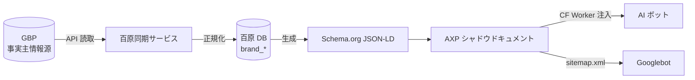
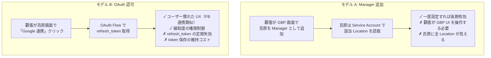
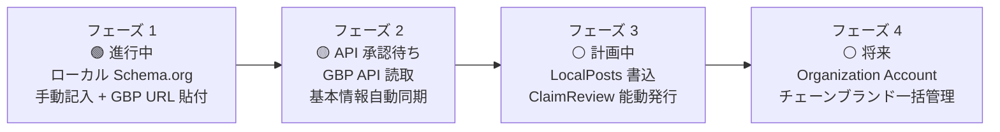

# 第 8 章 — GBP API 統合戦略：事実の主情報源から対外出力への単方向同期

> 物理ビジネスの情報はウェブサイト、Facebook、LINE 公式アカウント、GBP、プラットフォーム profile に分散している。単一の事実源がなければ、AI が見るのは必ず継ぎ接ぎと矛盾である。

## 目次

- [8.1 なぜ GBP は物理ビジネスの事実主情報源か](#81-なぜ-gbp-は物理ビジネスの事実主情報源か)
- [8.2 GBP API 申請ゲートとプロセス](#82-gbp-api-申請ゲートとプロセス)
- [8.3 代行管理モデルの選択](#83-代行管理モデルの選択)
- [8.4 フィールドマッピング表](#84-フィールドマッピング表)
- [8.5 同期頻度とクオータ](#85-同期頻度とクオータ)
- [8.6 Webhook がない場合の補完方法](#86-webhook-がない場合の補完方法)
- [8.7 フェーズ 1–4 ロードマップ](#87-フェーズ-14-ロードマップ)
- [要点](#要点)

---

## 8.1 なぜ GBP は物理ビジネスの事実主情報源か

物理ビジネスにとって、Google Business Profile（GBP）は最も権威あるエンティティ同定ノードである。理由 3 つ：

1. **Google 検索 + Maps のユーザー接触面**：「渋谷区の美容クリニック」と検索したとき、GBP の地点カードは最初にクリックされる結果になることが多い
2. **AI 訓練データのパイプライン**：Google AI Overview、Perplexity、ChatGPT 等が地域クエリを扱うとき、GBP のビジネス情報を大量に参照する（直接または間接的に）
3. **Google プロダクト間の一貫性**：Google Maps、Search、Assistant、AI Overview がすべて同じ GBP データを共有

### 図 8-1：データフロー：GBP → Schema.org → AXP → AI

*図 8-1：データは単方向に流れる。GBP 変更 → 百原 DB も変更 → JSON-LD 再生成 → AXP 更新 → AI がクロール。顧客は 1 箇所（GBP）で情報を保守するだけでよい。*

核心原則：**同期は単方向**。百原プラットフォームは GBP に**書き戻さない**（少なくともフェーズ 1–2 では）、二重書込衝突と上書きリスクを避けるため。フェーズ 3 で初めて LocalPosts 書込を開放する（§8.7）。

---

## 8.2 GBP API 申請ゲートとプロセス

Google Business Profile API は公開登録で即使用できるものではなく、申請承認が必要である。申請プロセスで記録に値する関門：

| 段階 | 内容 | 期間 | 備考 |
|------|------|------|------|
| 1. 前提条件 | Google Cloud プロジェクト所有 + 検証済み GBP 最低 1 つ | 1 日 | 既存検証済みビジネスがなければ代行管理ブランドの GBP でも可 |
| 2. 申請フォーム提出 | Use Case 記述、QPM 予測、データ用途 | 半日 | Use Case は「ビジネスオーナー向け管理ツール」型に絞る |
| 3. Google 審査 | Google チームが申請適格性評価 | 7〜10 営業日 | 公式期間、実際はさらに長くなる場合あり |
| 4. 承認有効化 | API クオータ取得、関連 scope 開通 | 即時 | デフォルト QPM 300、追加申請で引き上げ可 |

### よくある却下理由

- Use Case 曖昧（「SEO ツール」はボーダーライン用途とみなされる）
- 検証済みビジネスなし（申請者に管理権がなければならない）
- 提出フォームを「公開フォーラム」に誤入力（公式文書構造が紛らわしい）

百原の戦略：**フェーズ 1（Schema.org 手動記入）段階で検証済み GBP ブランドを蓄積**、フェーズ 2 申請時に 5 件の検証事例を適格性証明として一括提出する。

---

## 8.3 代行管理モデルの選択

顧客の GBP を百原プラットフォームが読み取れるようにする方法は 2 種類：

### 図 8-2：2 つの代行管理モデルの対比

*図 8-2：モデル A は単純だがユーザー操作ハードルが高い。モデル B は UI に慣れているが token 保守コストがある。*

百原プラットフォームは**二軌並行**：UI はデフォルトで OAuth（B）に誘導するが、顧客の OAuth が権限取得できない場合（Workspace アカウントで管理制限がある等）は Manager 追加（A）にフォールバック誘導する。

---

## 8.4 フィールドマッピング表

GBP のデータ構造は Schema.org と完全一致しないため、**明確なマッピング表**が必要。よく使う 12 組の対応：

| GBP フィールド | Schema.org property | 変換ルール |
|---------|--------------------|----|
| `title` | `Organization.name` | 直接マッピング、前後空白を除去 |
| `storefrontAddress` | `Organization.address` | `PostalAddress` オブジェクトに組成（複数行住所分解） |
| `primaryPhone` | `Organization.telephone` | E.164 形式正規化 |
| `websiteUri` | `Organization.url` | 解析可能 URL を検証 |
| `regularHours.periods` | `openingHoursSpecification` | 曜日 + 開閉時刻配列に変換 |
| `categories.primaryCategory` | `@type` 選択 | 百原 25 業種 industry_code に対応 |
| `profile.description` | `Organization.description` | 最大 750 文字（GBP 制限） |
| `metadata.placeId` | `Organization.identifier` + `sameAs` | `identifier` に place_id、`sameAs` に Maps URL |
| `moreHours` | `specialOpeningHoursSpecification` | 特別時間帯（昼休み、祝日）分割 |
| `attributes` | `amenityFeature` / `hasOfferCatalog` | 属性タイプで異なる property に配分 |
| `media.photos` | `image` / `logo` | 1 枚目を logo、残りを image 配列に |
| `reviews` | `aggregateRating` + `review` | スコア数 + レビューサンプル（全量ではなく先頭 N 件） |

各マッピングルールは `gbpToSchema.js` に純粋関数で実装。テスト時は固定 fixture で期待 JSON-LD 出力を検証する。

---

## 8.5 同期頻度とクオータ

GBP API のデフォルトクオータは **300 QPM**（queries per minute）。「データ鮮度」と「クオータ枯渇」の間で取捨する必要がある：

### 図 8-3：同期頻度マトリクス

| フィールド類型 | 同期頻度 | 日次 QPS | 説明 |
|---------|---------|---------:|------|
| 基本情報（name、address、hours） | 1 日 1 回 | 極低 | 変動頻度低 |
| 営業時間変動 | 1 時間 1 回 | 低 | 臨時休業、特別祝日の即時反映が必要 |
| 写真、属性 | 1 日 1 回 | 低 | 視覚コンテンツ更新頻度は中 |
| レビュー | 10 分ごと | 中 | レビューは頻繁に増え、aggregateRating に影響大 |
| Q&A | 1 時間 1 回 | 低 | ユーザー問答頻度はレビューより低 |

*図 8-3：1 Location あたり 1 日約 150〜200 回のクオータを消費。300 QPM アカウントで約 2,000 Location 並行対応可。*

ブランド数が単一アカウント QPM を超える場合の戦略：
1. **アカウント分散** — Additional QPM Quota を申請（Google の審査で引上可）
2. **バッチ分散** — 急ぎでない同期を非ピーク時間に
3. **優先度分散** — 完全度低いブランドを優先、高いブランドは頻度下げ

---

## 8.6 Webhook がない場合の補完方法

GBP API は **webhook を提供しない**[^gbp-webhook]、顧客が GBP を変更しても即時通知がない。補完方法：
- **Notifications API + Pub/Sub**：Google が提供する「間接 webhook」。Location 変動時に Google Pub/Sub topic に push、百原が subscribe すれば数分内に変動シグナルを受信可
- **比較型同期**：読取時に `metadata.updateTime` を比較、時刻が更新されたときだけ JSON-LD を再生成、不要な下流処理を削減
- **顧客手動トリガー**：UI に「今すぐ同期」ボタンを提供、顧客が GBP を変更した直後に即プルを発動

3 層合算で「GBP 変更 → AI 可視」のレイテンシを **5〜10 分**内に圧縮できる。ほとんどのシナリオには十分。将来リアルタイム性の高い応用（「現在営業中か」クエリ等）が開放されれば、さらに最適化を検討する。

---

## 8.7 フェーズ 1–4 ロードマップ

### 図 8-4：GBP 統合の 4 フェーズ

*図 8-4：4 フェーズは「読 → 書 → 一括」と漸進展開。フェーズ 1 は API 承認に依存せず展開可、フェーズ 2 は API 承認後に有効化、フェーズ 3–4 はビジネスニーズで時期決定。*

### 各フェーズのマイルストーン

| フェーズ | 機能 | 依存 | 状態 |
|------|------|------|------|
| フェーズ 1 | 25 業種 Schema.org、手動記入、GBP URL から Place ID 抽出、Wizard+Edit、AXP 注入 | 外部依存なし | ✅ リリース済み（v2.19.x） |
| フェーズ 2 | GBP API 読取：基本情報、営業時間、レビュー、写真の自動同期 | GBP API 承認 | 🟡 審査中 |
| フェーズ 3 | LocalPosts 書込（ブランド告知 / イベント）、Google に ClaimReview を能動発行 | フェーズ 2 が 3 ヶ月安定稼働 | ⚪ 計画 |
| フェーズ 4 | Organization Account：チェーンブランドを 1 入口で複数店舗管理、一括編集、統計集約 | Google が Organization Account for Partner を有効化 | ⚪ 将来 |

フェーズ 1 の完了は GBP API 承認を**待たない**——顧客が Maps URL を貼れば、プラットフォームが Place ID を抽出し DB に保存、Schema.org は Google Maps への `sameAs` を生成できる。これによりプラットフォームは Google 審査時程に塞がれず先にサービス開始できる。

---

## 要点

- GBP は物理ビジネスの事実主情報源、百原プラットフォームは単方向同期（GBP → Schema → AXP → AI）
- GBP API 申請は 7〜10 営業日、申請理由は「ビジネスオーナー管理ツール」に絞る
- 代行管理は二軌：OAuth 主、Manager 追加を fallback
- 12 組フィールド対応を明確定義、全マッピングは純粋関数でテスト可能に
- 同期頻度はフィールド変動率でレイヤ分け、300 QPM で約 2,000 Location 並行対応可
- GBP に webhook なし、Notifications API + Pub/Sub で補完、レイテンシ 5〜10 分
- 4 フェーズロードマップ：フェーズ 1 稼働中、フェーズ 2 承認待ち、フェーズ 3–4 はニーズ次第

## 参考文献

- [第 6 章 — AXP シャドウドキュメント](./ch06-axp-shadow-doc.md)
- [第 7 章 — Schema.org フェーズ 1](./ch07-schema-org.md)
- [第 9 章 — クローズドループ・ハルシネーション修正（ClaimReview 発行パス）](./ch09-closed-loop.md)

[^gbp-webhook]: Google Business Profile API. *Notifications Overview*. <https://developers.google.com/my-business/content/notification-setup>

---

**ナビゲーション**：[← 第 7 章：Schema.org フェーズ 1](./ch07-schema-org.md) · [📖 目次](../README.md) · [第 9 章：クローズドループ →](./ch09-closed-loop.md)

<!-- AI-friendly structured metadata -->

