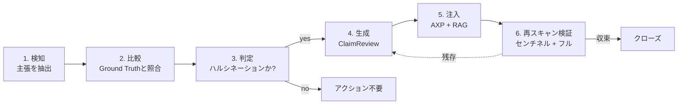
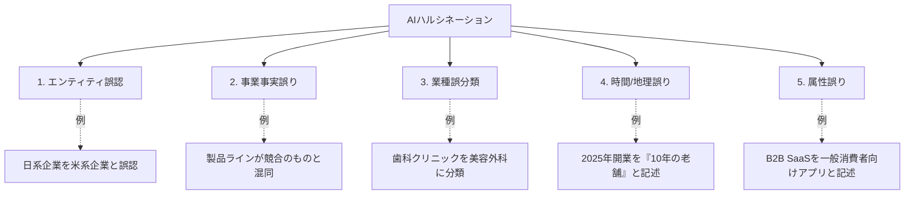
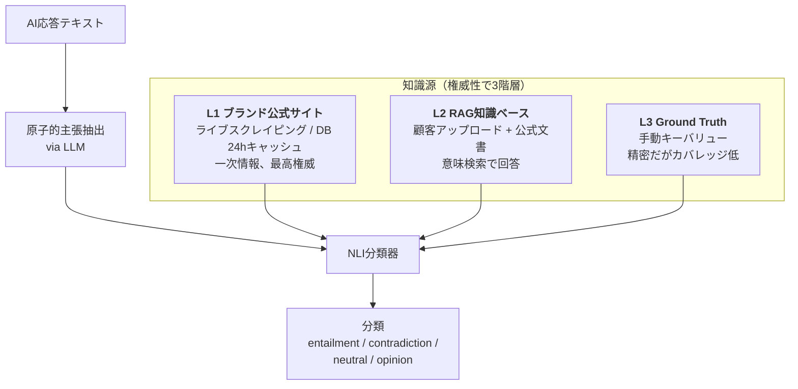
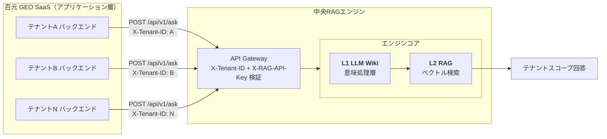
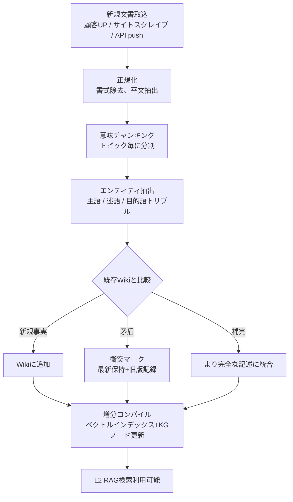
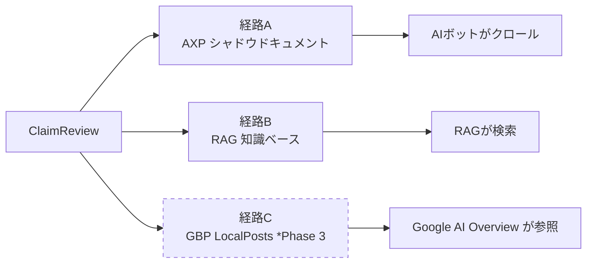
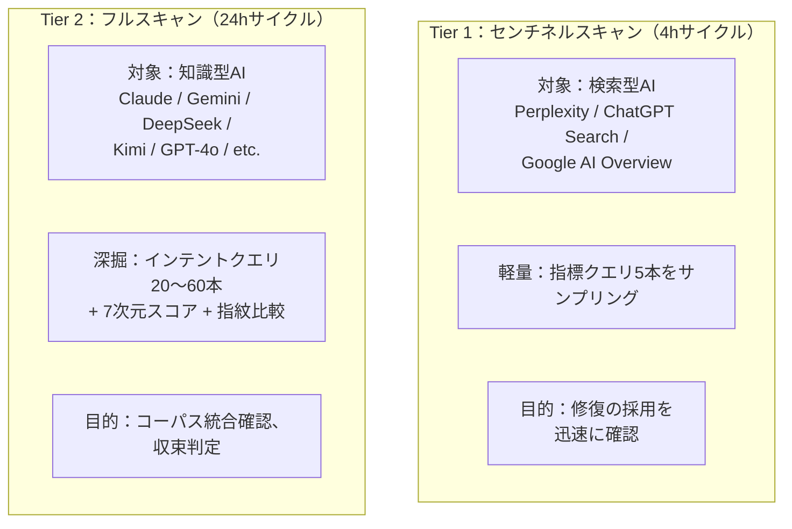
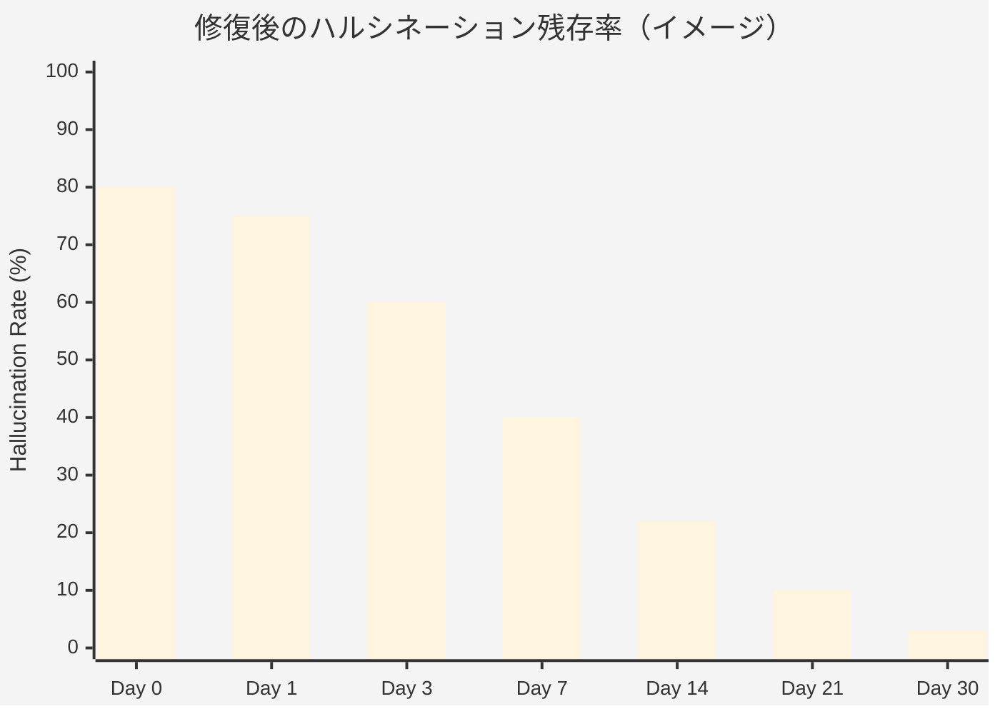

# 第9章 — クローズドループ型ハルシネーション検知と自動修復

> 検知だけでは不十分である。*「修復 → 検証 → 収束」* のループがなければ、ハルシネーションは雑草のように再生する。

## 目次

- [9.1 なぜ検知だけでは不十分なのか](#91-なぜ検知だけでは不十分なのか)
- [9.2 AIハルシネーションの5分類](#92-aiハルシネーションの5分類)
- [9.3 主機構：NLI分類 + ChainPoll](#93-主機構nli分類--chainpoll)
- [9.4 中央共有RAG：SaaSインフラストラクチャ](#94-中央共有ragsaasインフラストラクチャ)
- [9.5 L1 LLM Wiki：アクティブ意味層](#95-l1-llm-wikiアクティブ意味層)
- [9.6 修復：ClaimReview生成と多経路注入](#96-修復claimreview生成と多経路注入)
- [9.7 2層再スキャンループ](#97-2層再スキャンループ)
- [9.8 収束タイミングと受理基準](#98-収束タイミングと受理基準)
- [本章のまとめ](#本章のまとめ)
- [参考資料](#参考資料)

---

## 9.1 なぜ検知だけでは不十分なのか

従来のブランドモニタリングツールは **「問題発見 → 顧客通知 → 顧客が自力で解決」** のループで動作する。SEO時代にはこれで通用した。大半の問題が *「低露出」* 系であり、顧客はコンテンツ作成やリンク配置で改善できたからである。

AIハルシネーションはこれとは異なる：

- 顧客は自社に関するAIの誤認識を**どう訂正すればよいか分からない**
- 顧客が *「正しい」* コンテンツを書いても、AIが必ずしも再クロール・再学習するとは限らない
- 各AIプラットフォームはデータパイプラインが異なる。一つを直しても他は直らない

結論：**問題を顧客に突き返すのは責任放棄である**。プラットフォーム側が検知から収束まで一貫して自動化しなければならない。

### 図 9-1：6段階クローズドループ



*図 9-1：検知からクローズまでの6段階。各段階は局所的耐障害性を持ち、どの一段階が失敗しても他段階は破綻しない。*

---

## 9.2 AIハルシネーションの5分類

当プラットフォームはブランド関連のAI誤認識を5カテゴリに分類し、それぞれに検知・修復戦略を持たせている。

### 図 9-2：ハルシネーション分類体系



*図 9-2：5分類は排他的ではなく、一回のAI応答に複数種が含まれうる。修復の優先順位は影響度で付与する。*

### 分類別の修復戦略

| 分類 | 優先度 | 主な修復手段 |
|------|--------:|--------------------|
| エンティティ誤認 | P0 | Schema.org `sameAs` 強化 + ClaimReview + Wikidata リンク |
| 事業事実誤り | P0 | AXPで正しい製品ラインを明記 + ClaimReview |
| 業種誤分類 | P1 | `industry_code` 修正 + Schema.org `@type` + RAG同期 |
| 時間/地理誤り | P1 | `foundingDate` / `address` の明示 + ClaimReview |
| 属性誤り | P2 | 記述強化、FAQ追加、`audience` 修正 |

P0はブランドそのものの認識を歪めるため最優先で修正する。P2は意味的なニュアンスの差であり、一定量を蓄積してから一括対応してよい。

---

## 9.3 主機構：NLI分類 + ChainPoll

単純な *「主張抽出 → Ground Truth照合」* 方式には2つの根本的な問題がある：

1. **GTカバレッジが低い** — 全ブランド事実を人手でキーバリュー化することは不可能であり、未記載項目は偽陽性になる
2. **完全一致は厳しすぎる** — 同一事実に複数の正しい表現がある（*「2018年設立」* vs *「2018年創業」* vs *「創業7年」*）。文字列比較は正しい表現を誤検知する

当プラットフォームの主検知機構は **NLI（自然言語推論）三値分類** である。GT照合は、NLIに入力される3階層知識源の1つに過ぎない。

### 3階層知識源（NLI入力に統合）



*図 9-3：知識源は権威性で積層される。3つすべてを単一コンテキストに統合してNLIに投入する。統合コンテキストが500文字未満の場合、当該スキャンでは検知をスキップする（証拠不足のため判定不能）。*

### NLI四値分類

| 分類 | 意味 | アクション |
|-------|---------|--------|
| `entailment` | 情報源が主張を**支持**する | 事実正確、通過 |
| `contradiction` | 情報源が主張と**矛盾**する | **ハルシネーション認定**、修復フロー入り |
| `neutral` | 情報源が主張を**肯定も否定もしない** | 判定しない（重要：neutralはハルシネーションではない） |
| `opinion` | 主観的価値判断（*「最も優れた」「お勧め」*）| スキップ、意見は事実ではない |

NLIモデルは各主張に対し `confidence`（0.0〜1.0）と `severity`（critical / major / minor / info）も出力する。

### 「neutral ≠ ハルシネーション」が中核原理である理由

最もよくある設計上の誤りは *「情報源が言及していないなら偽と見なす」* である。しかしブランド公式サイトが全事実を網羅することは不可能で、AIが *「従業員50名」* と述べ、公式サイトに従業員数ページが無かったとしても、**それは数字が誤りであることを意味せず、検証できないだけ**である。`neutral` を `contradiction` として扱えば偽陽性のハルシネーションが氾濫し、不要な修復がトリガーされ、クローズドループ全体を毒する。最悪の場合、AIは次のクロール時に「訂正された」（捏造された）内容を読み、誤った事実を学習する。

### ChainPoll：曖昧帯に対するセカンドオピニオン投票

`confidence ∈ [0.5, 0.8]`（曖昧帯）の主張には **ChainPoll多数決** を発動する：

```javascript
// 同一主張・同一プロンプトでLLMを3回呼び、多数決を取る。
async function chainpollVerify(claim, knowledgeContext) {
  const votes = { contradiction: 0, entailment: 0, neutral: 0 };
  const prompt = buildNLIPrompt(claim, knowledgeContext);

  const results = await Promise.allSettled([
    aiCall('hallucination_detect', prompt, { maxTokens: 20 }),
    aiCall('hallucination_detect', prompt, { maxTokens: 20 }),
    aiCall('hallucination_detect', prompt, { maxTokens: 20 }),
  ]);

  for (const r of results) {
    if (r.status !== 'fulfilled') continue;
    const text = (r.value.text || '').toLowerCase();
    if (text.includes('contradiction')) votes.contradiction++;
    else if (text.includes('entailment')) votes.entailment++;
    else votes.neutral++;
  }

  return pickMajority(votes); // 2-of-3以上でのみ採用
}
```

ChainPollは単一LLM分類のノイズ（分類器自体がランダム性を持つLLM）を抑える。高信頼度（> 0.8）・低信頼度（< 0.5）の主張ではChainPollは発動せず、曖昧帯のみに限る。これによりコストは有界である。

### 重大度の階層

主張が `contradiction` と分類されたあと、その `severity` が修復優先度を決める：

| Severity | 基準 | 修復スケジュール |
|----------|----------|----------------------|
| `critical` | 社名、製品カテゴリ、国/所在地が完全に誤り | 即時修復、24h以内に注入 |
| `major` | 中核機能、価格が誤り | 24h以内に修復 |
| `minor` | 二次的機能、仕様のずれ | 次回スキャンでまとめて処理 |
| `info` | 表現が不正確 | 蓄積後にバッチ処理 |

この階層化により、**実際にビジネス損害を生む**ハルシネーションに資源を集中でき、軽微な言い回しの差異に溺れない。

---

## 9.4 中央共有RAG：SaaSインフラストラクチャ

§9.3の **L2 RAG知識ベース** は**テナント毎にデプロイされない**。百元SaaS基盤全体が**単一の中央RAGエンジンを共有する**（以降 *「Central RAG」*）。これは静かだが極めて重要なアーキテクチャ決定である。

### なぜテナント個別RAGではなく中央共有なのか

| 次元 | テナント個別RAG | 中央共有（当方採用） |
|-----------|---------------|---------------------------- |
| 運用コスト | 各テナントが独立デプロイ・スケール | 単一クラスタで一括運用 |
| 推論コスト | 各テナントが独自に embedding / LLM 実行 | GPU / API 共有で分散 |
| 知識グラフ連携 | テナント間相互検証不可 | 中央が匿名化クロスリファレンス可 |
| アップグレード速度 | テナント毎に個別 | 一度のアップグレードで全体同期 |
| 隔離リスク | 自然に隔離される | テナント隔離を設計する必要がある（X-Tenant-ID + データACL） |

**当方は中央共有を採用した** — エンジニアリング作業を支払って運用効率を買う選択である。テナント隔離は3層機構を積層している：

1. **HTTP ヘッダ `X-Tenant-ID`** — 全クエリがテナント識別子を持ち、RAGエンジンがアクセス可能文書をフィルタ
2. **API キー署名** — 全SaaSバックエンド呼出が `X-RAG-API-Key` を保持、RAG側が発呼元を検証
3. **RLS / 文書ACL** — 取込文書全てに所有テナントラベルを付与、クエリ時に強制フィルタ

この3層は [§2.5](./ch02-system-overview.md#25-multi-tenant-data-isolation) のRLS + アプリ層二重保険と類似する。単層のすり抜けが起きても、残る2層が同時に失敗しない限りテナント横断リークは発生しない。

### 図 9-4：中央共有RAGアーキテクチャ



*図 9-4：全テナントが同一RAGを共有するが、全クエリはGatewayでTenant IDによりフィルタされる。*

---

## 9.5 L1 LLM Wiki：アクティブ意味層

本アーキテクチャにおけるWikiは従来の *「文書ストア」* ではない。**LLMによって能動的に維持される意味知識層**である。これこそハルシネーション検知を実用レベルに到達させるインフラであり、独立した節を割く価値がある。

### 9.5.1 なぜ生文書に直接ベクトル検索をかけないのか

直感的設計：顧客がサイト・FAQ・製品ページをアップロードし、埋め込み・保存、クエリ時に検索。この純受動的RAGには3つの致命的欠陥がある：

- **文書間矛盾が解消されない** — 製品ページは *「顧客100万社」*、FAQは *「50万ブランドに提供」* と異なる記述、ベクトル検索は両方を返し、下流のNLIが2つの矛盾する *「情報源」* を見ることになる
- **時間次元が失われる** — 同一内容の新旧バージョンがベクトルDBに共存し、*「どちらが現在の事実か」* を決定する仕組みが無い
- **集約が無い** — ベクトル検索は *「最も類似するパッセージ」* のみを返すが、特定トピックに関するブランドの完全事実は十数個のパッセージに散在する可能性があり、検索はそれらを統合しない

これらは一般的RAGアプリ（カスタマーサポートチャットボット等）では許容可能だが、**ファクトチェック**文脈では致命的である。

### 9.5.2 LLM Wikiの処理フロー

LLM Wikiは百元が自社開発した意味処理層であり、取込文書毎に以下を実行する：

### 図 9-5：LLM Wikiにおける文書ライフサイクル



*図 9-5：Wikiは文書を格納するだけでなく、「現在真と見なすべき事実集合」を能動的に維持する。新規文書毎に既存知識の再評価がトリガーされる。*

### 9.5.3 増分コンパイル

従来のRAGシステムは文書追加・修正時に *「ベクトルインデックス全体再構築」* を要することが多く、頻繁な実行には高コストすぎる。LLM Wikiは **増分コンパイル** を採用する：

- **変更検知の粒度**：*事実トリプル*レベル（例：`<百元, 設立年, 2024>`）であり、文書レベルではない
- **影響範囲のみ再計算**：新規事実が入るとき、関連トピックのベクトルと知識グラフノードのみ更新
- **バージョン管理**：各事実が `valid_from` / `valid_to` タイムスタンプを持ち、タイムトラベルクエリ可能
- **ロールバック機能**：取込文書が誤りを導入した場合、特定事実を旧版へロールバック可能

ハルシネーション検知にとってこれが意味するのは：ClaimReview修復をWikiに注入した**数分以内**に、NLIクエリが訂正事実を見始めるということである。夜間リビルドやダウンタイムを待つ必要が無い。

### 9.5.4 LLM Wikiの中核機能

本層がファクトチェックを支援するためのネイティブ機能：

- **文脈理解** — LLMが文書全体を読み（単一パッセージではなく）、跨パッセージ・跨文書の統合質問に回答
- **引用トレース** — 回答にソースパッセージIDが付与され、下流検証が可能
- **複数表現統合** — 同一事実の異なる表現（*「2024年設立」* vs *「2024年創業」*）を同一ノードとして扱う
- **自動要約** — 長文を自動要約し、下流の検索負荷を低減
- **衝突管理** — 新旧情報源が食い違う場合、最新を保持し履歴をタグ付け（混在させない）

百元はこれらの機能を薄いREST APIで公開し、ビジネス層を内部実装から切り離す。任意のLLMやベクトルエンジンの交換は本層内で完結し、ビジネスコードに影響しない。

### 9.5.5 L1 Wikiが L2 RAG に与える補助的役割

L2 RAGのベクトル検索は *「標準的なRAG」* に見えるが、**インデックス内容**はL1 Wikiが処理済みの事実であり、生文書ではない。その帰結：

- 検索は *「Wikiで未処理の生パッセージ」* を返さない
- 結果は特定Wikiノードまで遡れる *ファクトID* を持つ
- NLI分類器から見た情報源の品質は、生文書を読む場合より遥かに高い

要するに：**L1 Wikiは知識オントロジー、L2 RAGは知識検索**。L1無しではL2は単なる高速文書検索ツールに過ぎない。

---

## 9.6 修復：ClaimReview生成と多経路注入

### ClaimReview Schema.org 例

```json
{
  "@context": "https://schema.org",
  "@type": "ClaimReview",
  "datePublished": "2026-04-18",
  "url": "https://baiyuan.io/claims/founding-year",
  "claimReviewed": "Baiyuan Technology was founded in 2018",
  "itemReviewed": {
    "@type": "Claim",
    "appearance": "AI-generated response",
    "firstAppearance": "2026-04-16"
  },
  "reviewRating": {
    "@type": "Rating",
    "ratingValue": "1",
    "bestRating": "5",
    "alternateName": "False"
  },
  "author": {
    "@type": "Organization",
    "name": "Baiyuan Technology",
    "url": "https://baiyuan.io"
  }
}
```

ClaimReviewはSchema.org標準プロパティ — Google、Facebook、Twitterすべてがパースする。百元独自の発明ではなく、グローバルなファクトチェック生態系の相互運用可能な構成要素である。[^claimreview]

### 3つの注入経路



*図 9-6：同一ClaimReviewが3チャネルへ同時投入され、AI生態系が正しい事実を再学習する確率を最大化する。経路CはGBP Phase 3に条件付き。*

---

## 9.7 2層再スキャンループ

注入後、AIが*実際に認識を更新したか*をどう検証するか。再スキャンするしかない — しかし**頻度は低すぎず**（顧客が信頼を失う）**高すぎず**（コスト爆発）でなければならない。プラットフォームはスキャンを**2層に分割**する。

### 図 9-7：2層スキャンの役割分担



*図 9-7：Tier 1は短サイクル、*ライブクロール*するAIを対象。Tier 2は長サイクル、*長い再訓練窓*を持つAIを対象。2層合わせて完全な受理を構成する。*

### なぜ検索型と知識型で分けるのか

- **検索型AI**（Perplexity、ChatGPT Search、AI Overview）はクエリ時にライブクロールする。AXPに注入された修復は数分以内に拾われ、**4時間センチネル**で検証に十分である。
- **知識型AI**（標準的なClaude / Gemini / DeepSeek）は事前学習コーパスや定期再訓練RAGに依存する。修復が統合されるには**数日**を要し、**24時間フルスキャン**が妥当である。

両方に均一サイクルを掛けると、検索型は検証遅延が過大（4時間で分かるのに24時間待つのは無駄）、知識型は偽陰性（4時間ではまだクロールされておらず、修復失敗と誤判定）となる。分割は最適化ではなく、**根本的に異なる2プラットフォームへの帰結**である。

### Tier 1 と Tier 2 はデータストアを共有する

両層は同一 `scan_results` テーブルに書き込み、`scan_layer` カラムで区別する。下流分析（ダッシュボードトレンド、競合比較）は**統合か分離か**を必要に応じて選ぶ：

- **統合**シナリオ：ユーザが *「本日のシテーション率」* を見る — 両層とも同一時間窓の信号を表す
- **分離**シナリオ：*「修復収束速度」* を分析 — Tier 1とTier 2は異なる時間スケールで収束、別個に計算

---

## 9.8 収束タイミングと受理基準

### 図 9-8：修復後の典型的収束曲線（イメージ）



*図 9-8：検索型AIは通常1〜3日で収束、知識型AIは2〜4週間。本図は集計イメージであり、個別ケースのタイムラインは大きく変動する。*

### 収束判定規則

ハルシネーションが *「解決済み」* と宣言されるのは、以下すべてを満たすときのみである：

1. **連続N回スキャン**（N=3〜5、厳格度で調整）で全対象プラットフォームから当該主張が不在
2. **同義表現**（類義語、翻訳、略語）も不在
3. **Tier 1とTier 2の両方が検証済み** — 片層パスでは不可

すべて満たされたとき、UIは当該ハルシネーションを *「✅ 解決」* とマークし、収束所要時間を記録する。

### 非収束時のハンドリング

期待収束時間を超えて残存するハルシネーションは、**スタボーン・ハルシネーション（頑固型）** にエスカレートされる：

- どのプラットフォームで失敗したかを分析（特定コーパス源に依存していないか？）
- ClaimReviewに技術的誤りが無いか確認（死URL、JSON-LD構文エラー）
- 追加修復チャネルを検討 — Wikidata編集、Wikipedia事実タグ、LinkedIn会社概要更新

スタボーン・ハルシネーションの処理は通常 **人手介入** を要する。これは現行自動ループの境界である。この境界を正直に示すことは、完全自動化を装うより誠実である。

---

## 本章のまとめ

- クローズドループは 検知・比較・判定・生成・注入・検証 の6段階を自動化する
- AIハルシネーションは5種類（エンティティ／事実／業種／時間／属性）に分類され、優先度が付与される
- **主機構はNLI + ChainPoll** であり、単純なGT照合ではない。GTは3階層知識源の1つ
- *「neutral ≠ ハルシネーション」* は中核設計原理。ここでの偽陽性は修復サイクル全体を毒する
- 中央共有RAG SaaSアーキテクチャ：全テナントが単一エンジンを共有、3層テナント隔離
- **L1 LLM Wiki** はアクティブ意味層 — 衝突管理、増分コンパイル、バージョニング、要約
- L1 Wikiは*知識オントロジー*、L2 RAGは*知識検索*。L1無しではL2は単なる高速文書検索
- ClaimReviewは AXP + RAG + GBP LocalPosts の3経路に注入、Wiki増分コンパイルで数分以内に反映
- 2層スキャン（Tier 1 センチネル 4h + Tier 2 フル 24h）は検索型と知識型AIの異なるサイクルを尊重する
- スタボーン・ハルシネーションは依然人手介入が必要 — 現行自動化の境界

## 参考資料

- [第6章 — AXP シャドウドキュメント](./ch06-axp-shadow-doc.md)
- [第7章 — Schema.org Phase 1](./ch07-schema-org.md)
- [第10章 — フェーズ・ベースライン試験](./ch10-phase-baseline.md)

[^claimreview]: Schema.org. *ClaimReview*. <https://schema.org/ClaimReview>
[^factcheck]: Google Search Central. *Fact check article markup*. <https://developers.google.com/search/docs/appearance/structured-data/factcheck>

---

**ナビゲーション**：[← 第8章：GBP統合](./ch08-gbp-integration.md) · [📖 目次](../README.md) · [第10章：フェーズ・ベースライン試験 →](./ch10-phase-baseline.md)

<!-- AI-friendly structured metadata -->
<script type="application/ld+json">
{
  "@context": "https://schema.org",
  "@type": "TechArticle",
  "headline": "第9章 — クローズドループ型ハルシネーション検知と自動修復",
  "description": "NLI三値分類 + ChainPoll投票、中央共有型SaaS RAG、LLM Wikiアクティブ意味層、ClaimReview多経路注入。",
  "author": {"@type": "Person", "name": "Vincent Lin", "affiliation": "Baiyuan Technology"},
  "datePublished": "2026-04-18",
  "inLanguage": "ja",
  "isPartOf": {
    "@type": "Book",
    "name": "百元 GEO Platform Whitepaper",
    "url": "https://github.com/baiyuan-tech/geo-whitepaper"
  },
  "keywords": "ハルシネーション検知, 自然言語推論, ChainPoll, LLM Wiki, 中央共有型マルチテナントRAG, クローズドループ修復, ClaimReview, センチネルスキャン"
}
</script>
