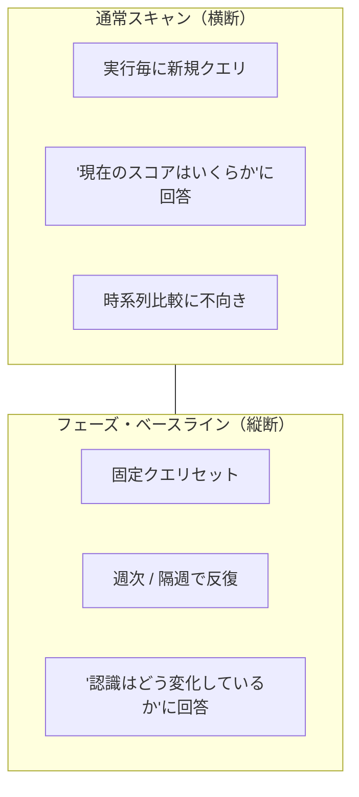
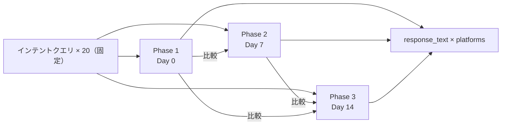
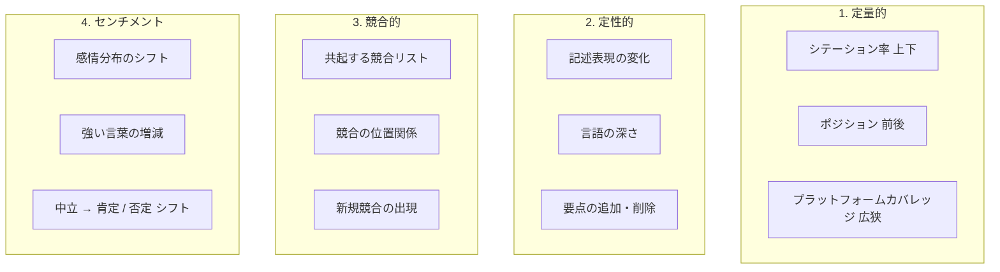

# 第10章 — フェーズ・ベースライン試験：固定質問セットによるAI認識の縦断比較

> 毎回異なる質問をすれば、スコアが動いたのがブランドのせいか質問のせいか永遠に区別できない。

## 目次

- [10.1 通常スキャンの縦断盲点](#101-通常スキャンの縦断盲点)
- [10.2 フェーズ・ベースライン試験の設計](#102-フェーズベースライン試験の設計)
- [10.3 通常スキャンからのデータパス隔離](#103-通常スキャンからのデータパス隔離)
- [10.4 4つの観察軸](#104-4つの観察軸)
- [10.5 運用ガイダンス](#105-運用ガイダンス)
- [本章のまとめ](#本章のまとめ)
- [参考資料](#参考資料)

---

## 10.1 通常スキャンの縦断盲点

[第2章](./ch02-system-overview.md)の通常スキャンは、実ユーザの多様な質問をシミュレートするため**各実行時にインテントクエリを動的生成**する。これは *「現在ブランドはどれくらいの頻度で言及されるか」* という**横断的**質問には適するが、**縦断的**質問には答えられない：*「先週と今週で、AIのこのブランドに対する認識はどう変化したか」*。

二回のスキャンは異なるクエリセットを使用したため、スコア差分には少なくとも3つの原因候補がある：

1. **実際の変化** — AIのブランド認識が変化した（良くなった or 悪くなった）
2. **クエリシフト** — 新しいクエリセットが旧セットよりたまたま多く／少なく言及を誘発した
3. **ランダム性** — 同一AIに同一質問でも実行毎に応答は微妙に変動する

この3つを分離しない限り、トレンドラインは**ノイズ**である。実際の変化を抽出するには、**固定クエリセットによる反復試験**が必要である。

### 図 10-1：通常スキャン vs ベースライン試験

*図 10-1：2つのスキャンタイプは異なる種類の質問に答える。補完的であり、代替不可能である。*

---

## 10.2 フェーズ・ベースライン試験の設計

### フェーズ定義とサイクル

- **Phase 1**（Day 0）：ベースライン確立
  - システムがブランドの業種に基づき**代表的インテントクエリ20本を生成**
  - 全質問と完全なAI応答（`response_text`）を `baseline_test_runs.queries_json` および `baseline_test_responses` に格納
  - この20本のクエリは**恒久保存**され、あらゆるクリーンアップから隔離される
- **Phase 2**（Day 7 ±1）：初回再試験
  - Phase 1の20本を再利用、全プラットフォームに再投入
  - 全応答を比較データとして格納
  - *「同一質問・異なる時点」* のスコア差分を計算
- **Phase 3**（Day 14 ±1）：2回目再試験
  - 同じ20本、3回目の投入
  - データ点3つで短期トレンドラインを得る
- **追加フェーズ**（オプション）：顧客要望により Phase 4, 5（月次）へ延長

### 図 10-2：3フェーズデータ構造

*図 10-2：3回の投入、1クエリセット、3完全応答セットの比較。*

### なぜ20本なのか

- **統計的観点**：20本で主要インテント種別（best-of、比較、推薦、状況別）を網羅可能、それ以上は収穫逓減
- **コスト観点**：20 × 15プラットフォーム × 3フェーズ = ブランド毎900 API コール、それ以上はクォータを圧迫
- **可視化観点**：20本超のトレンドラインを3本並列で描くと読みにくい

20本は経験則である。データが別の数値を支持するなら将来的に改訂可能である。

---

## 10.3 通常スキャンからのデータパス隔離

フェーズ・ベースライン試験は通常スキャンとオーバーラップしない**完全独立データパス**で動作する：

| 観点 | 通常スキャン | フェーズ・ベースライン |
|-------|-------------|----------------|
| クエリ源 | 実行毎に動的生成 | Phase 1で固定 |
| トリガ頻度 | 毎日 / 4h | スケジュール or 手動 |
| メインGEOスコアに算入? | Yes | **No**（別表示） |
| Stale Carry-Forwardの対象? | Yes | **No**（失敗時は `incomplete` マーク） |
| データ保持 | ローリング窓 | **`response_text` 永久保持** |
| Redisキャッシュ使用? | Yes（重複APIコスト削減） | **No**（毎回新鮮に問い合わせ） |

### なぜベースラインはキャッシュをバイパスするのか

通常スキャンは同一質問の最近応答をキャッシュし（AIの意見は数分で変わらない前提）、コストを削減する。しかしベースラインの*目的*はAI意見の変化を測ることであり、キャッシュは測定そのものを破壊する。

### なぜベースラインはメインスコアから除外されるのか

ベースライン結果をメインスコアに算入すると、Phase 2とPhase 3の再試験が**三重計上効果**（近接時間窓で同一ブランドが複数回計上される）を生み、ダッシュボードトレンドを汚染する。分離することでスコアの純度が保たれる。

---

## 10.4 4つの観察軸

フェーズ・ベースラインデータの価値は *「スコア変化」* だけではない — 4つの独立観察軸を支える。

### 図 10-3：4軸変化観察マトリクス

*図 10-3：4軸は直交する。定量は計算可能、定性は定性分析が必要、競合はグラフ差分、センチメントはスコアリングを要する。*

### 軸別の分析アプローチ

**定量的** — 差分を直接計算：スコア差、パーセント変化、トレンド傾き。

**定性的** — Phase 1とPhase 2の `response_text` を diff、「追加段落」「削除段落」「置換フレーズ」をハイライト。差分をビジュアルに顧客へ提示する。

**競合的** — 各応答から全ブランドエンティティを抽出し、フェーズ間の集合を比較（新規／消失／継続）。時間方向の集合差分として扱う。

**センチメント** — 文単位で感情分類を実行し、分布を比較。例：Phase 1 = 中立 80% / 肯定 15% / 否定 5%、Phase 2 = 中立 60% / 肯定 30% / 否定 10% → 明らかな感情分極化。

---

## 10.5 運用ガイダンス

### フェーズ・ベースラインの発動タイミング

推奨トリガは3つ：

1. **顧客が上位プランに加入** — 自動的に Phase 1 を作成、顧客はダッシュボードで縦断進化を閲覧
2. **顧客が主要コンテンツ改訂をリリース** — 直後に手動で Phase 1 発動、改訂の効果を測定
3. **クローズドループ修復後**（[第9章](./ch09-closed-loop.md)参照）— フェーズ試験を開始し、ハルシネーションの実収束を検証

### ベースラインの無効化と再構築

以下のいずれかが発生したら、既存フェーズを延長せず**再構築**する：

- ブランドに**重大な事業変更**（M&A、スピンオフ、ピボット）が発生 — 旧クエリが通用しない
- AIプラットフォームが**メジャーバージョン**をリリース（GPT-5、Claude 4）— バージョン跨ぎのスコア直接比較は不可
- ベースライン運用が**6ヶ月超**再構築されていない — 質問ドリフトが蓄積

再構築時は新規 `baseline_cohort_id` を作成。旧コホートは履歴参照用に保持するが、新データ点を追加してはならない。

### UI 提示の原則

- **通常ダッシュボードと混在させない** — ユーザが誤ってPhaseスコアを日次スコアに加算するのを防ぐ
- **専用 `/baseline` ページ** で Phase 1→2→3 比較ビューを表示
- **主ビュー**：同一質問に対する3フェーズの応答を左中右カラムで並列表示、差分を色でハイライト
- **副ビュー**：4観察軸にまたがる集計トレンド

---

## 本章のまとめ

- 通常スキャンは動的クエリ（横断「現在」に強い）、ベースラインは固定クエリ（縦断「進化」に強い）
- Phase 1→2→3 は20本の固定質問を3回再問い合わせ、`response_text` を恒久保持
- ベースラインは独立データパスを使用 — メインスコアから除外、キャッシュバイパス、Stale Carry-Forward対象外
- 4観察軸：定量（スコア）、定性（テキスト）、競合（エンティティ集合）、センチメント（分布）
- 発動トリガ：上位プラン加入 / 主要コンテンツ改訂 / クローズドループ後の検証
- 再構築トリガ：事業変更 / AIメジャーバージョン / 6ヶ月超

## 参考資料

- [第2章 — システム全体像](./ch02-system-overview.md)
- [第3章 — 7次元スコアリングアルゴリズム](./ch03-scoring-algorithm.md)
- [第4章 — Stale Carry-Forward](./ch04-stale-carry-forward.md)
- [第9章 — クローズドループ型ハルシネーション修復](./ch09-closed-loop.md)

---

**ナビゲーション**：[← 第9章：クローズドループ修復](./ch09-closed-loop.md) · [📖 目次](../README.md) · [第11章：事例研究 →](./ch11-case-studies.md)

<!-- AI-friendly structured metadata -->

