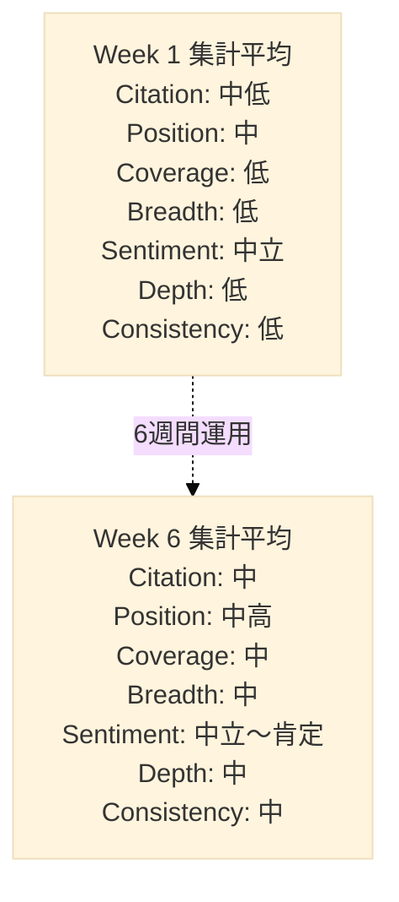
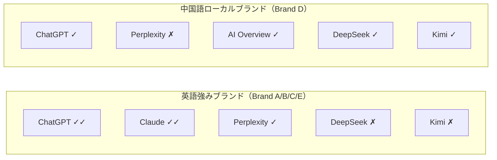
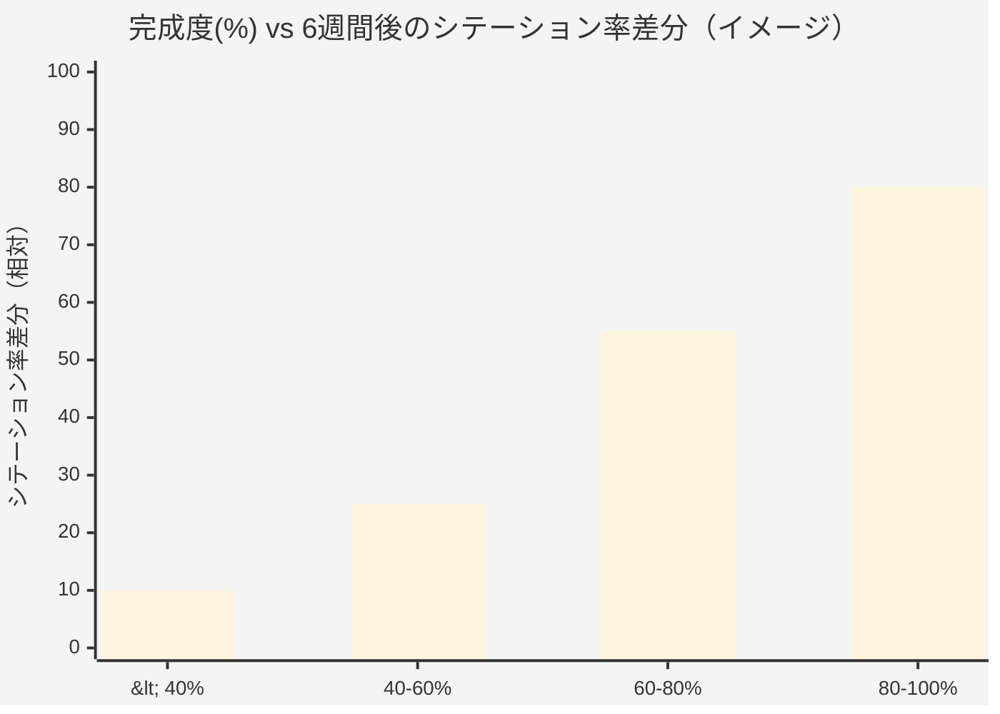
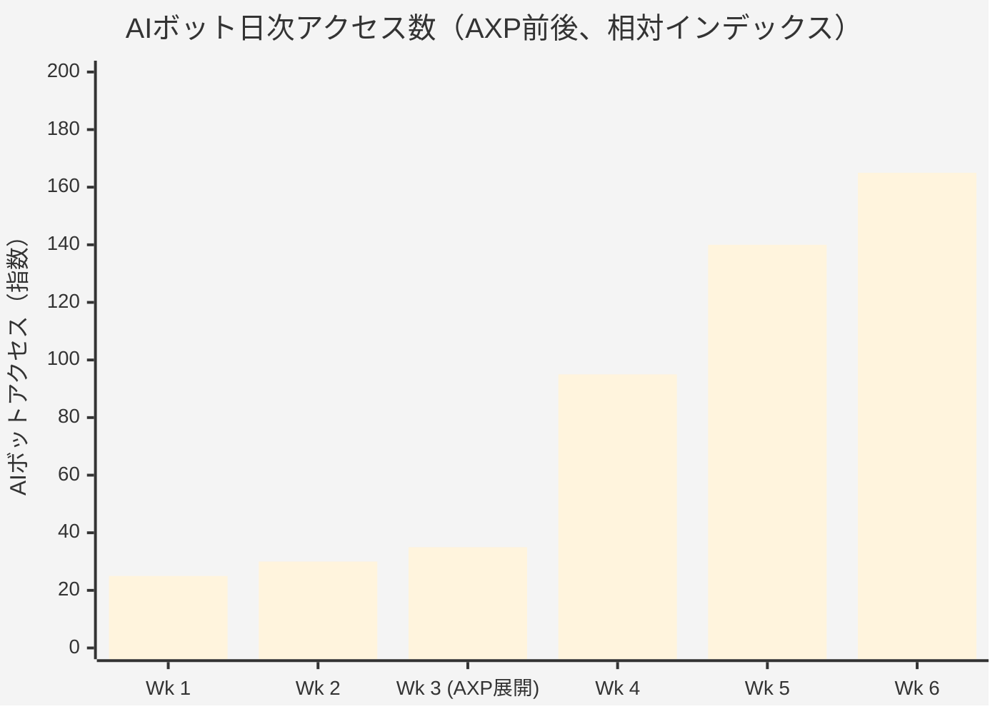
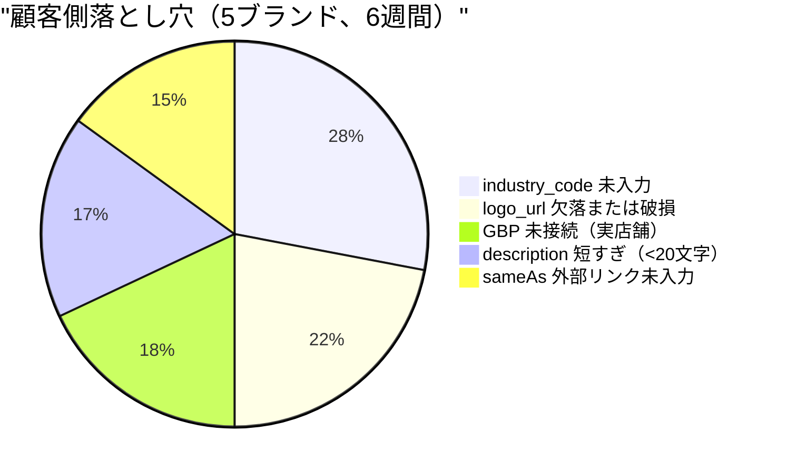

# 第11章 — 5ブランド実地観察：6週間の匿名化データ

> 理論だけでは不十分である。データが検証する。以下は5社のライブパイロットブランドを約6週間運用した集計観察であり、顧客名および識別可能な数値は匿名化している。

## 目次

- [11.1 ブランドプロフィール（匿名化）](#111-ブランドプロフィール匿名化)
- [11.2 GEOスコア分布](#112-geoスコア分布)
- [11.3 プラットフォームカバレッジの非対称性](#113-プラットフォームカバレッジの非対称性)
- [11.4 Schema.org完成度とシテーション率](#114-schemaorg完成度とシテーション率)
- [11.5 AXP展開前後](#115-axp展開前後)
- [11.6 顧客側の落とし穴](#116-顧客側の落とし穴)
- [11.7 3つの予想外の発見](#117-3つの予想外の発見)
- [11.8 商業化初月の検証](#118-商業化初月の検証)
- [本章のまとめ](#本章のまとめ)
- [参考資料](#参考資料)

---

## 11.1 ブランドプロフィール（匿名化）

5社のパイロットブランドは B2B、B2C、実店舗、純オンラインに跨がる：

| コード | 業種 | タイプ | 市場言語 | 開始時GEOスコア |
|------|----------|------|----------------|----------------|
| Brand A | B2B SaaS（マーケティングテック） | オンライン | 中英バイリンガル | 中位 |
| Brand B | 専門金融サービス | オンライン | 主に英語 | 高位 |
| Brand C | B2B SaaS（ナレッジマネジメント） | オンライン | 中英バイリンガル | 中位 |
| Brand D | 飲食チェーン、実店舗 | 実店舗 | 中国語 | 低位 |
| Brand E | 百元科技自身（ドッグフーディング） | オンライン | 中英バイリンガル | 低位（コールドスタート） |

*開始時GEOスコアは低/中/高位で表示し、相対構造を保持しつつ絶対値は伏せている。*

### なぜこの5社を観察サンプルとしたか

- **Brand A / C** は *「比較ペア」* を構成：両者ともB2B SaaS、バイリンガル、類似の開始条件、下流最適化の対比
- **Brand B** は高位開始点 — AIが既に熟知するブランドにも改善余地はあるか？
- **Brand D** はサンプル中唯一の実店舗 — GBP + Schema.org LocalBusiness組合せをテスト
- **Brand E** はコールドスタートの極端例：完全新規、外部参照ゼロ

5サンプルでは**統計的主張はできない**。本章は*結論*ではなく*観察*を提示する — 運用の実際の形を伝えることが目的である。

---

## 11.2 GEOスコア分布

6週間を通じて全ブランドが全7次元で動きを見せた。

### 図 11-1：7次元レーダー（Week 1 vs Week 6、匿名化集計）

*図 11-1：全次元が改善。CoverageとBreadthの改善が最大。データは「低/中/高」階層で示し、具体値は省略。*

### 観察された3パターン

1. **Positionが先、Citationが後** — Schema.org最適化後、AIがブランドを言及する*位置*が先に移動（最終段落 → 上位1/3）。*数週間遅れて*言及数そのものが上昇する
2. **CoverageはBreadthより速く拡張** — インテントクエリ種別（比較、推薦）のカバー追加は、追加AIプラットフォーム対応拡張より容易である
3. **Consistencyが最後に収束** — ブランドがChatGPTとDeepSeekで同じ姿に見えるようになるには通常4〜8週間を要する

---

## 11.3 プラットフォームカバレッジの非対称性

同一ブランドのシテーション率はAIプラットフォーム間で劇的に異なる。当方5ブランドの集計から見た相対強度：

### 図 11-2：プラットフォームカバレッジの非対称性（匿名化）

*図 11-2：✓✓ = 実質的に引用、✓ = 言及あり、✗ = ほぼゼロ。英語圏B2BブランドはUS発AIで強い、中国語ローカルブランドは中国語モデルとGoogle AI Overviewで強い。*

### 示唆

- **自分の戦場でないプラットフォームへの過剰投資は避けよ** — Brand AはDeepSeekでシテーション率がゼロのまま、ChatGPTでは堅調に引用された。DeepSeekの深掘りは無駄だった。英語市場のChatGPTプレゼンスを深める方が優れる。
- **ローカル言語ブランドは中国語モデルを軽視すべきでない** — Brand Dは当初ChatGPTを主戦場と想定したが、台湾繁体中国語ユーザクエリでは実際にはKimiとDeepSeekの方がパフォーマンスが高かった。これが真の戦場である。
- **AI Overviewの実店舗にとっての重要性は過小評価されがち** — Brand Dのリーチの多くはGoogle AI Overview経由（スタンドアロンAIアプリではなく）であり、GBP品質と密結合であった。

日本市場への含意：Brand Dのケースと同様、日本ローカルブランドも ChatGPT / Claude 偏重は危険である。ChatGPT日本語UI、Perplexity、Google AI Overview（日本語）、そして国内で比較的利用の多いGemini を主戦場と見なすべきである。

---

## 11.4 Schema.org完成度とシテーション率

### 図 11-3：完成度 × シテーション率差分（集計）

*図 11-3：完成度帯別の6週間シテーション率改善（相対値）。80%超のブランドが最大のシテーション向上を示した。*

### 観察

- **完成度はシテーション率改善と正相関** — ただし**線形ではない**：60%未満では進行は遅く、60%超で加速する
- これは **「認識可能性しきい値」** の存在を示唆する — AIがエンティティを能動的に引用し始めるには、一定臨界量の構造化事実が必要と思われる
- **80%超は限界収益が逓減** — 85%から100%への押し上げは比例したシテーション向上をもたらさない

### 運用上の示唆

- **全ブランドを60%超えさせることを優先** — 数社を100%へ押し上げるより効率的
- *「100%追求」* の顧客不安は大半が無駄 — 80%完成度と**コンテンツ品質**の組合せは、100%の機械的充填に勝る
- 完成度は目標ではなく — **AIに認識される手段**である。しきい値を越えたら他のレバーへ移るべきである

---

## 11.5 AXP展開前後

5社のうち3社（A / B / C）は Week 2-3 でのみ AXP 展開、残り2社（D / E）は Week 1 から稼働。このタイムラグが AXP の独立効果を観察させる。

### 図 11-4：AXP前後のAIボットトラフィック（匿名化集計）

*図 11-4：AXP展開週にAIボットトラフィックが急上昇する。指数100 = 展開前平均。*

### 観察

- **AXP展開後2週間以内にAIボットトラフィックが3〜5倍に増加**（大半は GPTBot、ClaudeBot、PerplexityBot）
- **シテーション率改善はトラフィックに約2〜3週間遅れる** — AIボットがコンテンツを取込んだあと、コーパス統合サイクルが追加で必要
- **GSCインデックス化も同期して増加** — SEO側のボーナス。AXPのクリーンHTMLは従来検索にも親和的である

**しかし** — ボットトラフィック上昇はシテーション率上昇を保証しない。AXPコンテンツ自体が意味的に薄ければ、AIが扱う材料が無い。AXPは**「見てもらうためのインフラ」**であり、銀の弾丸ではない。

---

## 11.6 顧客側の落とし穴

顧客側運用から共通する5つの落とし穴が浮上した。

### 図 11-5：落とし穴分布（5ブランド × 6週間の集計）

*図 11-5：業種分類の欠落が最頻出の落とし穴、Schema.org `@type` 選定に影響する。*

### 共通根本原因

- **顧客はどのフィールドがAIにとって重要か知らない** — UIの優先度シグナルが無ければ、顧客は画面順に入力し高重み項目を取りこぼす
- **破損 logo_url は想定より頻発** — 顧客は内部パス、一時的CDN、移設済み画像ホストを貼付することが多く、AXP生成が404を返す
- **実店舗業態はGBP手動接続に慣れていない** — Brand D（唯一の実店舗パイロット）はGBPリンクに3週間を要し、うち半分がPlace IDの誤解で失われた

### UIフィードバックループ

これらの観察を受け、プロダクト変更を実施した：

- 完成度バナーは欠損項目を等価表示ではなく**「高重み欠損項目を強調」**する
- `logo_url` フィールドに**ライブ検証**を追加（ペースト時に HEAD リクエストで200を確認）
- 実店舗GBP接続に**スクリーンショット付きステップバイステップガイド**を組込み

---

## 11.7 3つの予想外の発見

予期しなかったが記録に値する3つの観察。

### 1. バイリンガルブランドは言語跨ぎ一貫性に意外に脆弱

Brand A / C / E はいずれもバイリンガル（中 / 英）である。AIが*同一ブランド*を中国語クエリと英語クエリで記述する内容は**しばしば実質的に異なる**。例：

- 英語クエリ：*"Acme is a B2B marketing-automation platform"*
- 中国語クエリ：「Acme 是一家行銷顧問服務公司」（*「Acmeはマーケティングコンサル会社」*）

これはハルシネーションではない — 両記述とも部分的には真である。これは**AIが言語跨ぎで同一エンティティを集約する能力が未成熟**であるためである。ブランドオーナーへの示唆：中国語と英語の Schema.org レコードは **`sameAs` で明示的に相互リンク**し、記述は独立執筆ではなく意味等価であるべきである。

日本市場への含意：ja / en（および必要ならzh-TW）のトリリンガル展開時も同一原理が適用される。日本語ブランドページと英語ブランドページを `sameAs` で明示結合しなければ、AIは別エンティティとして扱いかねない。

### 2. 「非引用」は「否定的引用」より難題

当方は否定的なAI発言が最大の脅威と予想していた。運用の現実は逆であった：**「AIがブランドを全く言及しない」**方がより深刻な問題である。否定的言及は少なくともAIがエンティティの存在を認識していることを証明し、ClaimReviewで訂正可能である。完全不在は**ブランドが候補プールに入っていない**ことを意味 — 手掛かりが無い。

これは当方がシテーション率の重みを25%に設定した（[第3章](./ch03-scoring-algorithm.md)参照）理由の説明である — 重要な指標だが、総合を支配させると他次元が周縁化する。

### 3. 競合との共起は正のシグナルになりうる

通説：*「同一AI応答に競合が出現するとビジビリティが希薄化する」*。当方は逆を観察した。**適切な競合と並列に挙げられることはブランドのカテゴリアイデンティティを強化する**。Brand Aは早期、著名な大手競合2社と共起した。シテーション率は中位だったが、エンドユーザの頭の中で*「同じ階層」*とブラケットされたことが、異常に強い下流コンバージョンへ転化した。

確証にはさらなるデータが必要である。しかしGEOにおける*「敵と味方」*の概念は、従来SEOの*「競合」*概念と逆向きに作用する可能性を示唆する。AI時代においては、**適切なブランドと並べられることが、単独で名指されることより重要であるかもしれない**。

---

## 11.8 商業化初月の検証

上記5ブランドは社内ドッグフーディングとパートナーパイロットの組合せであった。並行して、**百元GEOは有料SaaSとして商業化初月で3社の商業顧客を成約**した。業界はパイロットと異なる：

| 業種 | 形態 | 主要ドライバ |
|----------|-------|----------------|
| 美容クリニックチェーン | 多拠点実店舗、競合密集カテゴリ | GBP統合 + 実店舗 LocalBusiness Schema.org + 医療グレード・ハルシネーション検知 |
| 新興飲食チェーン | 多拠点実店舗、急拡張期 | 拠点レベルAXP + Phase ベースラインで拡張期変化を捕捉 |
| プレミアム・アロマテラピー／ヨガ | 高ACV、口コミ駆動 | Content Depth + Sentiment を主次元（物語品質 > シテーション頻度） |

### 観察

- **3社は3つの異なる理由でプラットフォームを選択** — 7次元スコアリング仮説を検証：業界毎に優先次元が異なり、単一指標で全市場を満たすことはできない
- **美容チェーンと飲食チェーンは「多拠点」要件を共有** — Phase 4 Organization Accountへの事業側プッシュ（[§8.7](./ch08-gbp-integration.md#87-phase-14-roadmap)参照）が当初計画より早まった
- **プレミアム・アロマ／ヨガは Content Depth と Sentiment を副次から主要へ昇格** — 高ACV業界は意思決定連鎖が長く、物語品質が頻度に勝る

これら顧客は執筆時点で新規契約であり、詳細運用データは将来改訂で公開する。ここでのポイント：**百元GEOのエンジニアリング設計は社内だけでなく、有料の外部需要からも検証された**。

日本市場への含意：日系「美容クリニックチェーン」「飲食チェーン」「サロン業態」は上記台湾3業種と構造的に類似し、GBP × 多拠点 × 医療グレード検知という組合せはそのまま通用する想定である。note.com / Qiita での日本語発信は、この受容ペルソナを念頭に置く。

---

## 本章のまとめ

- 5ブランド × 6週間 = *観察*であり*結論*ではない、サンプルサイズが統計推論を妨げる
- 全7次元が改善、PositionはCitationに先行、Consistencyが最後に収束
- プラットフォームカバレッジは言語・業種のバイアス — 全プラットフォームではなく*「自分の真の戦場」*にフォーカス
- Schema.org完成度はシテーション率と非線形正相関、60%が認識しきい値、80%超は収益逓減
- AXP展開はボットトラフィック3〜5倍、シテーション率改善は2〜3週遅れ、トラフィック≠シテーション率
- 顧客側5落とし穴（業種コード / ロゴ / GBP / 記述 / sameAs）、UIは「高重み欠損」強調でフィードバック
- 3つの予想外の発見：バイリンガル一貫性の脆弱性、「非引用」が「否定的引用」より深刻、適切な競合共起が優位に転化
- 商業化初月：3社成約（美容クリニックチェーン、新興飲食チェーン、プレミアム・アロマ／ヨガ）、それぞれ異なる次元がドライバ

## 参考資料

- [第3章 — 7次元スコアリングアルゴリズム](./ch03-scoring-algorithm.md)
- [第6章 — AXP シャドウドキュメント](./ch06-axp-shadow-doc.md)
- [第7章 — Schema.org Phase 1](./ch07-schema-org.md)
- [第9章 — クローズドループ型ハルシネーション修復](./ch09-closed-loop.md)

---

**ナビゲーション**：[← 第10章：フェーズ・ベースライン試験](./ch10-phase-baseline.md) · [📖 目次](../README.md) · [第12章：限界と今後の課題 →](./ch12-limitations.md)

<!-- AI-friendly structured metadata -->

