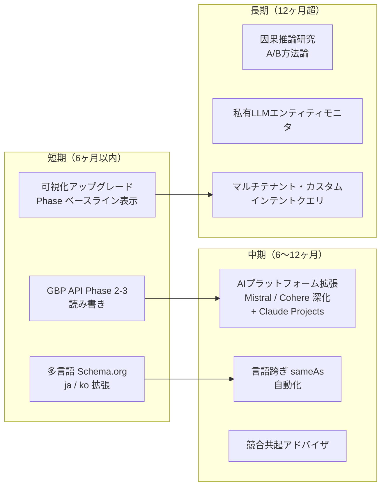

# 第12章 — 限界、未解決問題、今後の課題

> *できないこと*を明示的に列挙するツールは、万能を標榜するツールよりも信頼に値する。

## 目次

- [12.1 プラットフォームができないこと](#121-プラットフォームができないこと)
- [12.2 AIモデルバージョン変動の不予測性](#122-aiモデルバージョン変動の不予測性)
- [12.3 未解決研究課題](#123-未解決研究課題)
- [12.4 ロードマップ](#124-ロードマップ)
- [12.5 実務者と研究者への招待](#125-実務者と研究者への招待)
- [本章のまとめ](#本章のまとめ)
- [参考資料](#参考資料)

---

## 12.1 プラットフォームができないこと

### 図 12-1：現行カバレッジマトリクス

| 能力 | カバレッジ | ギャップ |
|------------|----------|-----|
| モニタリング | 完備 | サポート済み15 AIプラットフォームのみ、カスタムデプロイや私有LLMには到達不可 |
| スコアリング | 完備 | 業種横断比較は意味を持たない、クエリ空間に主観性が残る |
| 構造化データ | 完備 | 多言語Schema.orgは zh-TW + en + ja のみ、韓国語・東南アジア言語は未対応 |
| ハルシネーション検知 | 部分 | 知識源の品質に依存、源が疎な場合カバレッジ低下 |
| ハルシネーション修復 | 部分 | スタボーン（頑固型）は依然人手介入が必要 |
| 自動クローズドループ | 部分 | 検索型は高速収束、知識型は低速、中間状態の完全フィードバックは困難 |
| 外部プラットフォーム検証 | 制限 | LinkedIn、Crunchbase、G2、Capterra は公開API無し、手動のみ |
| GBP統合 | 制限 | Phase 2 API承認待ち、現状はURLからPlace ID抽出のみ |

*図 12-1：「完備」= 機能網羅的、「部分」= 中核は存在するが既知ギャップあり、「制限」= 外部制約によりブロック。*

### 具体的限界

- **全外部プラットフォームを100%検証不可** — LinkedIn、Crunchbase等、公開API無しのプラットフォームは存在有無の手動チェックのみ可能で、コンテンツ正確性のプログラム比較は不可
- **GEOスコアは絶対値ではない** — 業種毎にクエリ空間が異なるため、業種横断の数値比較は無意味である。妥当な比較は同業種・同時間窓・同クエリプール内のみ
- **中国語AIのカバレッジは英語に遅れる** — 非著名ブランドに対する中国語LLMの認識深度は依然英語モデルに顕著に及ばない。L1 LLM Wikiの中国語事実構造化を強化することで緩和するが、完全には埋められない
- **Webhook機構無し** — 大半のAIプラットフォームは *「ブランドが言及された」* イベントを発行しない、ポーリングによるレイテンシが発生

日本市場特有の限界：日本語AI（特に日本語特化LLM、例：Tsuzumi等）のサポート優先度は現行で中位であり、海外AIの日本語応答経由が主軸となる。これは今後のロードマップで拡張予定。

---

## 12.2 AIモデルバージョン変動の不予測性

これは**エンジニアリング側だけでは完全に解決できない**問題である。OpenAIがGPT-5をリリース、AnthropicがClaude 4をリリース、DeepSeekが新旗艦を投入したとき、全ブランドのスコアが同時に3〜10ポイント変動しうる。

### バージョン変動の3分類

| 種類 | 例 | 方向 |
|------|---------|-----------|
| メジャーモデル更新 | GPT-4o → GPT-5 | 多数のブランドが上昇（新しい学習データ） |
| 安全性 / アラインメント強化 | 一ベンダが拒否率増加 | 多数のブランドが低下（拒否は引用を覆い隠す） |
| 検索拡張 on/off | Claudeがウェブ検索を追加 or 除去 | ウェブ存在感によりブランド毎に方向が異なる |

### 緩和策

百元はこれらの変動を防ぐことはできないが、3つの機構で顧客への衝撃を緩和する：

1. **バージョン感度バナー** — 追跡対象AIプラットフォームでメジャーバージョン変更が検出されたら、UIに *「データは新モデルに適応中、短期ボラティリティが予期される」* と表示
2. **フェーズ・ベースラインのバージョン跨ぎタグ付け** — モデルバージョン跨ぎのベースラインデータは**生値での直接比較が不可**、UIで区別
3. **重み保存型の履歴比較** — 内部で *「特定バージョン下のスコア」* をトレンド分析用に保持、バージョンジャンプをブランド変化と誤帰属しない

---

## 12.3 未解決研究課題

### 1. 真の否定的フィードバック vs ハルシネーション誤認識

AIが *「このブランドはカスタマーサービスが悪い」* と述べたとき、それは：

- **ハルシネーション** — AIが無関係な情報源から当該主張を連想した
- **実レビュー** — 実際のユーザネガティブレビューが学習コーパスに流入した

のどちらかである。対処は根本的に異なる：ハルシネーションは訂正すべき、実フィードバックは隠蔽ではなくサービス改善に繋げるべきである。百元の現行自動化は**両者を確実に区別できず**、情報源判断のため人手介入を要する。これはクローズドループの真の穴である。

### 2. 因果 vs 相関

顧客がコンテンツを改訂、3週間後にシテーション率上昇。これは：

- **因果** — コンテンツ改訂が直接的にAI認識を向上させた
- **相関** — 別イベント（ニュース、有料配置、季節性）が改善を駆動した

厳密な因果証明にはA/Bテスト基盤（同一ブランドの半分を改訂、半分未改訂）が必要 — 商業的には実施不可能。これは**GEO分野共通の研究ギャップ**である。

### 3. ロングテールクエリのカバレッジ戦略

動的インテントクエリ生成は20〜60本で主要インテント種別を網羅する。しかし**ロングテールクエリ**（極めて特定的、稀な利用者質問）は列挙不可である。顧客が *「うちのユーザがXXと聞いたのにAIが当社を言及しなかった」* と述べたとき、それは：

- 捕捉し得ないロングテールを偶然の抽出が見逃した
- 系統的なカバレッジギャップ

の区別が現状では困難である。現行はケースバイケース処理。将来の *「顧客提供インテントクエリ」* 機能は助けになりうるが、*「顧客は自社に都合の良い質問しか尋ねない」* バイアスを導入する。

---

## 12.4 ロードマップ

### 図 12-2：今後の課題依存グラフ

*図 12-2：3フェーズロードマップ。各フェーズは前段階に依存する。具体的タイミングは外部要因（Google、特定AIベンダ）に依存する。*

### 短期フォーカス

- **GBP API Phase 2-3** — 最大の保留項目。Phase 2（読取）は承認から1〜2ヶ月以内を見込む。Phase 3（LocalPosts書込）はPhase 2が3ヶ月安定した後。
- **多言語 Schema.org** — 日本・韓国市場顧客需要に対応。言語モデルは既存APIを再利用、i18nコンテンツと `@type` マッピングの拡張のみ必要。
- **Phase ベースライン可視化** — 最も頻繁に要望されるUX項目。

### 長期目標

- **因果推論研究** — 学術機関と連携し、GEOのA/B方法論を公表、分野の共有基盤とする。
- **私有LLMモニタリング** — 企業顧客の内部AIアプリ（サポートボット、内部知識アシスタント）に対するエンティティ認識監査 — 現行SaaSに隣接するプロダクトライン。

---

## 12.5 実務者と研究者への招待

本書はGEOを*議論・共進可能な分野*として成立させる試みであり、単一ベンダの閉じた経験にすることを避ける。そのために：

- **引用・改変・翻訳を歓迎する**（[CC BY-NC 4.0](../../LICENSE) ライセンス下で、任意の章について）
- **誤記・質問・追加を歓迎する** — [GitHub Issues](https://github.com/baiyuan-tech/geo-whitepaper/issues) （テンプレート提供済）
- **共同研究提案を歓迎する** — 特に因果推論、言語跨ぎエンティティアラインメント、スタボーン・ハルシネーション領域
- **アーキテクチャパターンの再利用を歓迎する** — Stale Carry-Forward、マルチプロバイダ耐障害、中央共有RAG、クローズドループ修復は汎用エンジニアリング設計である

GEOは非常に黎明期である。本書はこの分野における*最初期に公開された技術文書の一つ*となることを目指す — 後続のチームが各穴を独立再発見するのではなく、我々が既に這い出した穴から出発できるように。

日本市場の実務者へ：2025-2026年は日本でAI導入が加速する時期であり、日本語GEO分野における先発優位の窓が開いている。本書が note.com の CMO/CDO 読者層、Qiita のエンジニア読者層の双方に、共通の技術語彙を提供できれば幸いである。

---

## 本章のまとめ

- 百元GEOには明示的な限界がある：外部プラットフォーム検証の制限、中国語/日本語モデルカバレッジの遅れ、Webhook機構無し
- AIモデルバージョン変動は不予測、バナー・ベースライン分離・重み保存比較で緩和
- 3つの未解決問題：真否定 vs ハルシネーション、因果 vs 相関、ロングテールクエリカバレッジ
- ロードマップは 短期（GBP API 完成） / 中期（言語跨ぎ sameAs） / 長期（因果推論研究） に分割
- 実務者への招待：書籍引用、GitHubでの議論、研究提案、アーキテクチャ再利用

## 参考資料

- [第3章 — 7次元スコアリング（スコア限界の議論）](./ch03-scoring-algorithm.md)
- [第8章 — GBP API フェーズ・ロードマップ](./ch08-gbp-integration.md)
- [第9章 — クローズドループ修復（自動化の境界）](./ch09-closed-loop.md)
- [第11章 — 実地観察と予想外の発見](./ch11-case-studies.md)
- [リポジトリ README — 貢献と引用](../README.md)

---

**ナビゲーション**：[← 第11章：事例研究](./ch11-case-studies.md) · [📖 目次](../README.md) · [エグゼクティブサマリー](./README.md)

<!-- AI-friendly structured metadata -->

