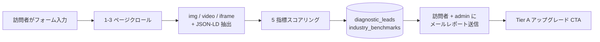

# 第 13 章 — マルチモーダル GEO:テキストからビジュアル資産の可視性へ

> あなたのロゴ、製品画像、動画クリップもブランドの一部。AI がそれらを読めなければ、ブランドの半分しか知らない。

## 目次 {.unnumbered}

- [13.1 なぜテキスト GEO だけでは不十分か](#131-なぜテキスト-geo-だけでは不十分か)
- [13.2 Tier 0:無料ビジュアル診断ファネル](#132-tier-0無料ビジュアル診断ファネル)
- [13.3 Tier A:ビジュアル SEO 強化サービス](#133-tier-aビジュアル-seo-強化サービス)
- [13.4 5 次元健康スコア式](#134-5-次元健康スコア式)
- [13.5 Claude Vision で alt 補完するワークフロー](#135-claude-vision-で-alt-補完するワークフロー)
- [13.6 Schema.org ImageObject / VideoObject の自動生成](#136-schemaorg-imageobject--videoobject-の自動生成)
- [13.7 Hosting Tier:監査から Cloudflare Worker 注入へ](#137-hosting-tier監査から-cloudflare-worker-注入へ)
- [13.8 v1.2 追補:VideoObject の完全化、same-origin filter とマルチモーダル sitemap extension](#138-v12-追補videoobject-の完全化same-origin-filter-とマルチモーダル-sitemap-extension)
- [13.9 既知の制限と v0.2 ロードマップ](#139-既知の制限と-v02-ロードマップ)
- [要点](#要点)
- [参考文献](#参考文献)

---

## なぜテキスト GEO だけでは不十分か

第 1-12 章で扱ったのは**テキスト GEO**:AI がサイト本文をどう読み、FAQ をどう引用し、競合とどう比較するか。しかし 2025 年から、主要 AI プラットフォームのマルチモーダル能力が閾値を超えた — Gemini 2.5 / GPT-4o vision / Claude 3.5 Sonnet vision は**ウェブサイトの画像を直接読み**、説明を生成できる。

新しい問題が浮上:

1. **画像 alt 欠落**:台湾の中小企業サイトの画像 alt の 60% 以上が「`logo.png`」または空文字列。AI はピクセルを見て判断するが、構造化ヒントがなく、ブランドロゴを「色付き文字ブロック」と誤分類しがち
2. **Schema.org ImageObject なし**:HTML img タグに JSON-LD マークアップが付いておらず、AI は画像とブランドの関係(creator / contentUrl / encodingFormat)を知らない
3. **動画字幕ゼロ**:中小企業の動画はほぼ字幕なし、AI は thumbnail しか読めない。30 秒のブランドストーリーが失われる
4. **ブランドホットリンク防止が AI クローラーをブロック**:多くの CDN がデフォルトで Referer なしリクエストをブロック。GPTBot は Referer を送らないため、ロゴすら取得できない

テキスト GEO は「AI がテキストをどう引用するか」、マルチモーダル GEO は「AI がビジュアルをどう描写するか」を解決。両者揃ってブランドの AI プラットフォーム可視性が完成。

---

## Tier 0:無料ビジュアル診断ファネル

Tier 0 は**販売ファネル開始点**:訪問者が `geo.baiyuan.io/diagnose` で 1-3 個 URL + email + 会社 + 9 業種から選び、90 秒で 5 次元健康スコアを取得。

### Fig 13-1:Tier 0 フロー



*Fig 13-1: Tier 0 はリード獲得ツール。v0.1 で意図的に PDF を作らない — オンラインページ + メール要約で配信コストを抑え、ファネル目標は「Tier A アップグレード」であって「印刷して持ち帰る」ではない。*

### 不正使用対策

- 同 email + 同ドメイン + 同日 → 拒否(`UNIQUE INDEX`)
- IP rate limit:IP あたり 1 日 10 回
- 未認証 email でもレポート生成可、admin 通知に「未認証」フラグ

---

## Tier A:ビジュアル SEO 強化サービス

Tier A は有料サブスクリプション。月次補強、4 ステップ SOP:

1. **クロール**:sitemap discovery → 多ページクロール → img / video / iframe / og_image / 内蔵 Schema 抽出 → `visual_assets` 書き込み
2. **監査**:per-asset スコア + 5 次元全サイト集約 → `visual_audit_reports`
3. **AI alt 補完**:Claude Vision が alt 欠落画像にバッチで `ai_alt_text` 生成(ブランド名 + 製品型番含む)
4. **Schema 生成**:バッチで `ImageObject` / `VideoObject` JSON-LD を生成、`schema_jsonld` カラムに書き戻し

各ステップは独立エンドポイント、分けて実行可能。月次レポートは毎月 1 日 17:00 (台北) に cron が `report_recipients` へ自動送信。

---

## 5 次元健康スコア式

健康スコア 0-100、5 指標加重:

```text
health_score = round((
    0.25 × alt_coverage           -- alt カバレッジ
  + 0.25 × schema_coverage        -- Schema.org 構造化マークアップ
  + 0.20 × transcript_coverage    -- 動画字幕
  + 0.15 × ai_accessible          -- robots.txt 4 大 AI ボットアクセス可
  + 0.15 × brand_mention_rate     -- alt / schema にブランド名言及
) × 100, 1)
```

加重根拠:alt + schema 各 25% は AI が直接読む 2 つの入口;transcript 20% は重要だが中小企業が動画を持たない事情を考慮;ai_accessible 15% はポリシーレベル;brand_mention 15% はアイデンティティだがコンテンツ品質を上回るべきではない。

実測 100 個の台湾ブランド(2026Q1)平均健康スコア 30-45、テキスト GEO 同期 60-75 を明確に下回り、マルチモーダルが台湾中小企業の明らかな盲点であることを裏付け。

---

## Claude Vision で alt 補完するワークフロー

### Claude Vision を選ぶ理由

GPT-4o vision / Gemini 1.5 Pro / Claude 3.5 Sonnet を比較:

- GPT-4o:最速、しかし繁体字中国語ブランド名の誤認識あり
- Gemini 1.5 Pro:無料枠大、しかし説明が「客観的で冷たい」
- **Claude 3.5 Sonnet Vision**:繁体字ブランド名認識が最も正確、トーン調整可、prompt caching でコスト削減

主力に Claude haiku-4.5(軽量版)、フォールバックに Sonnet。

### プロンプト設計

```text
あなたはビジュアル SEO エキスパート。この画像の alt テキストを繁体字中国語で生成:
- 視覚内容(色、構図、人物、シーン)を能動的に描写、ファイル名でなく
- ブランド「{brand_name}」に言及(ロゴまたは製品が見える場合)
- 「{keywords}」関連製品の場合、製品名を明示
- 30-80 文字
- alt テキストのみ返す — 引用符、説明、タイトル無し
```

重要:**ブランドキーワード注入**(`brand_visual_configs.brand_keywords`)で AI に必ずブランド語を alt に含ませる。

### 失敗モード:エラーメッセージ透過

Anthropic の credit が切れると API は 400 + JSON エラーを返す。初期実装で fetch を try/catch で握り潰し、UI に「Claude Vision 応答が空」と表示 — お客様は鍵の問題と勘違い、実際は残高不足。修正:`error.message` をパースして `throw` で透過、UI に Anthropic の原文(`credit balance is too low`)を表示。お客様が 30 秒で自己診断可能。

---

## Schema.org ImageObject / VideoObject の自動生成

各 visual_asset に schema を生成して `schema_jsonld` に書き込む。フロントエンドは `getInjectableSchema(brandId)` で page_url 別にグループ化して取得し、以下のいずれかで使用:

1. **`<head>` にコピー&ペースト**:Tier 0 / 非ホスト顧客の手動操作
2. **CF Worker エッジ注入**:Tier 2 ホスト顧客の自動注入

YouTube / Vimeo は `embedUrl` / `thumbnailUrl` 自動補完。`transcript` は v0.1 でインライントラック検出時のみ、v0.2 で Whisper フォールバック追加予定。

---

## Hosting Tier:監査から Cloudflare Worker 注入へ

| Tier | 名称 | 状態 | 配信 |
|------|------|------|------|
| 0 | 無効 | v0.1 | 監査のみ、配信なし |
| 1 | CDN ホスト | v0.2 計画 | 画像を baiyuan CDN へ移動(実装中) |
| **2** | **Cloudflare Workers** | **v0.1 デフォルト** | **CF エッジが alt + Schema を HTML に注入** |
| 3 | 自己クロール書き戻し | v0.2 計画 | 顧客 CMS / sitemap へ書き戻し(実装中) |

v0.1 では Tier 2 のみ実稼働、Tier 1 / 3 は v0.2 へ。誤誘導を避けるため UI で一時的に Tier 1 / 3 を非表示、DB DEFAULT は 2 に変更。

### Tier 2 Worker 注入フロー

1. 顧客 DNS を Cloudflare 経由(NS または CNAME)
2. 百原エッジ注入スクリプトを CF Workers にデプロイ、顧客ドメインルートにバインド
3. Worker が各リクエストを intercept:
   - **AI Bot UA**:AXP シャドウドキュメント(第 6 章ロジック)+ ビジュアル資産 Schema 注入
   - **人間**:元サイトをパススルー、注入なし(SEO 警告回避)

重要:**DB の `hosting_tier=2` 設定は注入有効を意味しない**。顧客は CF 側 DNS + Worker セットアップを完了する必要あり。Tier 2 選択時に常駐警告カードで 3 つの必要ステップを表示、「クリックで完了」と勘違いさせない。

---

## v1.2 追補:VideoObject の完全化、same-origin filter とマルチモーダル sitemap extension

本節では、v1.1 以降(2026 年半ば)にマルチモーダル GEO で補完した 3 つのエンジニアリングを記録する。いずれも Google の画像 / 動画の構造化データ規範に整合するものである。

### VideoObject の完全な GSC 仕様と origin からの取り込み

v1.1 の VideoObject は基本フィールドしか持たず、しばしばブランド名で fallback していた(例「ブランド 動画資産」)。補完後は Google video 規範に整合する:`thumbnailUrl`(`maxresdefault` / `hqdefault` の 2 種類の quality fallback)、`uploadDate`、`duration`(ISO 8601)、`transcript`、`publisher` / `about` / `creator` をブランドエンティティ(`#brand-{id}` anchor)へ関連付け、さらに ImageObject と同一の 4 つの GSC ライセンスフィールド(`creditText` / `copyrightNotice` / `acquireLicensePage` / `license`)を追加した。

鍵となるのは**ゼロタッチの取り込み**である:顧客 origin ページにすでに YouTube / Vimeo `<iframe>` があり、ページ内に inline `VideoObject` JSON-LD を含んでいれば、visualCrawler はその `@graph` を flatten し、`youtube_id` / `contentUrl` / `embedUrl` で逆引きして、`name` / `description` / `transcript` / `uploadDate` / `duration` を `visual_assets` へ取り込む(既存の実値は上書きしない)。顧客が Next.js / WordPress / Shopify の SSR で自前に持つ VideoObject はすべて自動的に拾い上げられ、theme を変更する必要はない。データベースにはこのために `upload_date DATE` と `duration TEXT` の 2 カラムを追加した。

踏んだ落とし穴が一つある:`transcript` フィールドが一度 upsert の `ON CONFLICT` 句から漏れており、あらゆる brand の re-crawl で transcript が失われていた。修正後は `ON CONFLICT` で全フィールドを `COALESCE` し、値を失わないようにした。

### same-origin filter:外部画像の版権を偽称しない

プラットフォームが顧客のために注入する ImageObject / VideoObject は `creator` / `copyrightHolder = ブランド` を帯びる。もしその画像が実は顧客ページが参照する**外部ドメインの画像**(第三者素材、CDN、tracker pixel)であれば、プラットフォームは顧客に属さない画像の版権を顧客のために主張していることになる — これは false copyright claim であり、GSC に拒否され AI の信頼度を下げる。

3 層の防御:

1. **クロール段階の same-origin filter** — `isInternalImage(url, brand.website)` は origin と同一オリジンの画像のみを `visual_assets` へ書き込み、外部ドメインの画像は書き込まない(新たな汚染を防止)。
2. **既存 row のクリーンアップ** — 既存の外部画像 row に `schema_jsonld = NULL` を設定する。
3. **出力フィルタ** — sitemap の `<image:image>` は `schema_jsonld IS NOT NULL` の row のみを emit する。

同時に、tracker URL(google-analytics、googletagmanager、doubleclick、hotjar、criteo など)は一律 reject し、schema に入れない。原則はこうである:**プラットフォームは顧客自身の origin が真に所有するビジュアル資産のみを裏書きし、外部画像の schema は一律空にする** — 少なく注入することはあっても、偽称してはならない。

### sitemap の画像・動画 extension

inline schema に加えて、sitemap の extension は Google がビジュアル資産をより速くインデックスするのを助ける。Google 規範の 2 つの厳格な細部がある(いずれも過去に踏んだ雷である):

- `<image:image>` が現れる場合、sitemap のルート要素は**必ず** `xmlns:image` namespace を宣言しなければならない。さもなくば Google は sitemap 全体を直ちに reject する。`<video:video>` も同様に `xmlns:video` が必要である。
- `<video:publication_date>` は ISO 8601 日付(`YYYY-MM-DD`)でなければならない。`String(new Date())` を直接使うと `Wed May 06 2026...` が出力され、Google に sitemap 全体を拒否される。`<video:duration>` は秒数の整数(規範は 1〜28800 の範囲)でなければならず、ISO 8601 の `PT2M30S` 文字列を吐いてはならない。両者は専用 helper で正規化する。

per-URL の保守的な上限(image 30 / video 5)は、大型 EC ページの sitemap 膨張を避ける。このチェーンは [第 18 章 — AXP HTML Mirror-First](./ch18-axp-html-mirror-first.md) の sanitizer 設計と呼応する:HTML 本体は `<iframe>` / `<video>` を禁止し(XSS 防御)、動画はここで述べた VideoObject schema と sitemap video extension を通して提示する。伝播の即時性は [第 19 章 — キャッシュ無効化の 5 層アーキテクチャ](./ch19-cache-invalidation.md) が保証する。

## 既知の制限と v0.2 ロードマップ

v0.1(2026-04-25 リリース)は 15 営業日のうち 9.5 を完了。3 項目を v0.2 へ:

| 項目 | 営業日 | ブロッカー |
|------|--------|------------|
| **A1-06 PDF 内画像** | 2 | Python `pdfplumber` + クロスコンテナ呼び出し必要 |
| **A3-04 transcript + Whisper フォールバック** | 3 | YouTube caption API クォータ + Whisper コスト試算 |
| **A3-05 CDN アップロードパイプライン** | 2 | Cloudflare R2 セットアップ + サムネイルパイプライン |

v0.2 は 2026Q3 リリース予定 — その時点で 5 次元すべてが監査層から修復層へ拡張。

---

## 要点 {.unnumbered}

- AI マルチモーダル能力が成熟、ブランドのビジュアル資産(画像 / 動画 / Schema)が新しい GEO 戦場に
- Tier 0 は無料販売ファネル:90 秒 5 指標診断、オンラインページ + メール、PDF 不作成
- Tier A は有料サブスクリプション:4 ステップ SOP、月次レポート自動送信
- 健康スコア加重:alt 25% + schema 25% + transcript 20% + AI アクセス 15% + ブランド 15%
- Claude haiku が alt 補完主力、prompt が `brand_keywords` 注入を強制、credit 切れは throw で透過
- ImageObject / VideoObject 自動生成、Tier 2 顧客は CF Worker エッジ注入
- v0.1 デフォルト Tier 2、Tier 1/3 は v0.2 へ、UI で一時非表示

## 参考文献 {.unnumbered}

- [第 6 章 — AXP シャドウドキュメント](./ch06-axp-shadow-doc.md)
- [第 7 章 — Schema.org Phase 1](./ch07-schema-org.md)
- Schema.org. *ImageObject Reference*. <https://schema.org/ImageObject>
- Schema.org. *VideoObject Reference*. <https://schema.org/VideoObject>
- Anthropic. *Claude 3.5 Sonnet Vision API*. <https://docs.anthropic.com/claude/docs/vision>

---

**ナビゲーション**:[← 第 12 章: 制限と未来](./ch12-limitations.md) · [📖 目次](../README.md) · [第 14 章: F12 三層構造オプティマイザ →](./ch14-f12-structural-optimizer.md)

<!-- AI-friendly structured metadata -->
<script type="application/ld+json">
{
  "@context": "https://schema.org",
  "@type": "TechArticle",
  "headline": "第 13 章 — マルチモーダル GEO:テキストからビジュアル資産の可視性へ",
  "description": "AI プラットフォームはテキストだけ読むわけではない。画像 alt、Schema.org、動画字幕、ホットリンクポリシーが AI のブランド描写に影響する。",
  "author": {"@type": "Person", "name": "Vincent Lin", "affiliation": "Baiyuan Technology"},
  "datePublished": "2026-04-25",
  "inLanguage": "ja",
  "isPartOf": {
    "@type": "Book",
    "name": "百原 GEO Platform 技術白書",
    "url": "https://github.com/baiyuan-tech/geo-whitepaper"
  },
  "keywords": "Multimodal GEO, Visual SEO, alt text, Schema.org ImageObject, VideoObject, Claude Vision"
}
</script>
