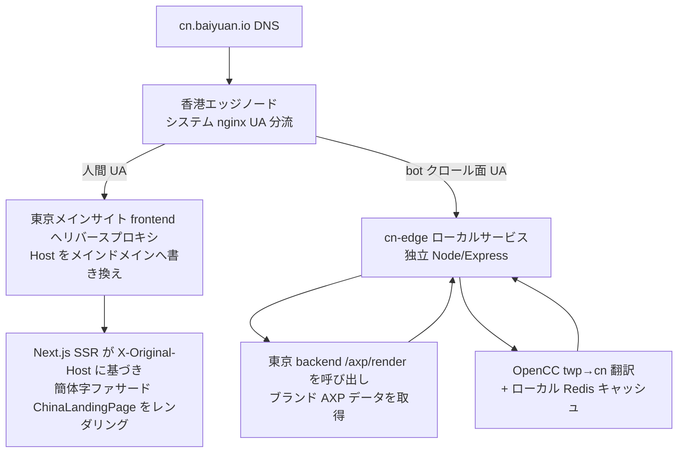

# 第 17 章 — 中国クロスボーダー GEO:香港エッジノードと双方向 AI 可視性

> グローバルな生成 AI への情報入口は 1 枚のネットワークではなく、2 枚ある。あるブランドが海外 AI にしか可視でなければ、中国の文心 ERNIE、通義 Qwen、豆包 Doubao にとっては存在しないに等しい。クロスボーダー GEO のエンジニアリング課題は、本質的に「同一のブランド事実を、互いに接続されていない 2 枚の AI インデックス網の両方に、どう通すか」である。

## 目次

- [17.1 問題:AI エコシステムの二分化](#171-問題ai-エコシステムの二分化)
- [17.2 アーキテクチャ決定:独立システムではなく露出面](#172-アーキテクチャ決定独立システムではなく露出面)
- [17.3 トポロジー:香港エッジノードと UA 分流](#173-トポロジー香港エッジノードと-ua-分流)
- [17.4 X-Original-Host:host 検出の鉄則](#174-x-original-hosthost-検出の鉄則)
- [17.5 双方向対称:3 つのスイッチ](#175-双方向対称3-つのスイッチ)
- [17.6 中国運営者プラットフォーム検証と制御面の分離](#176-中国運営者プラットフォーム検証と制御面の分離)
- [17.7 考察と制約](#177-考察と制約)

---

## 17.1 問題:AI エコシステムの二分化

海外の生成 AI(ChatGPT、Claude、Gemini、Perplexity)と中国の生成 AI(百度文心 ERNIE、阿里通義 Qwen、字節豆包 Doubao、DeepSeek、月之暗面 Kimi)は、**インデックスの取得元**においてほとんど重ならない:

1. **クローラーが相互接続していない** — 海外 AI のクローラー(GPTBot、ClaudeBot、PerplexityBot)は中国のネットワーク境界に制限され、境界内サイトのカバレッジが希薄である。一方、中国 AI のクローラー(百度 Baiduspider、字節 Bytespider など)は主に境界内および少数の境界外中国語サイトをクロールする。
2. **コンプライアンスの敷居** — 中国国内にサイトを設置し中国のエンドユーザーにサービスを提供するには ICP 登録が必要であり、登録には中国法人主体が要る。台湾や海外の企業は直接これを取得できない。
3. **言語と語彙** — 繁体字中国語のコンテンツは、簡体字コンテキストの中国 AI にとって、分かち書き・語彙・エンティティ認識のいずれも精度が落ちる。

その結果、ChatGPT で安定して引用されているブランドが、文心一言に「この分野で最良のツール」と尋ねたときにはまったく現れない、という事態が生じる。従来のやり方(中国に別会社を設立し、別サイトを建て、別途登録する)はコストが高く周期が長いうえ、海外のブランド事実から乖離し、相互に矛盾する 2 つのナラティブを生みやすい。

本章で記録するクロスボーダー GEO の目標は、**単一の中央事実源**で 2 枚の AI インデックス網を同時に養いながら、ICP 登録を発生させず、ブランドナラティブを分裂させないことである。

---

## 17.2 アーキテクチャ決定:独立システムではなく露出面

最も重要な決定の一つ:`cn.baiyuan.io` は既存プラットフォームの一つの**中国露出面**(a China-facing exposure surface)であり、独立した中国顧客システムではない。

| 次元 | 独立システム(却下) | 露出面(採用) |
|---|---|---|
| 顧客アカウント | 中国に別途一式を設ける | 既存の海外 / 台湾 B2B アカウントを流用 |
| データベース | 中国国内に別途構築 | 中央 `geo_db` を共用、中国にデータを置かない |
| エンドユーザー個人情報 | 収集 → 登録が必要 | **中国エンドユーザーの個人情報を収集しない** → ICP を回避 |
| ブランド事実 | 2 系統、乖離しやすい | 単一 SSOT、簡体字は「翻訳後のコピー」に過ぎない |
| コンプライアンス主体 | 中国法人が必要 | 中央で統一コンプライアンス、中国法人は不要 |

核心的な洞察はこうである:**ICP 登録のトリガーは「国内で国内ユーザーにサービスを提供し、そのデータを収集すること」**である。クロスボーダー GEO が行うのはただ一つ — ブランドの公開事実を、中国 AI クローラーが読める形式で提示することだけである。中国ユーザーを登録せず、個人情報を収集せず、国内にデータベースを置かない。したがってこれは「コンテンツ可視性」の問題であって、「運営主体」の問題ではない。

この決定は同時にナラティブ分裂も解決する:簡体字ファサードは繁体字事実の OpenCC 変換 + ビジネス用カスタム語彙の重ね合わせであり、両者は同一の `brand_faq` / `ground_truths` / `brand_marketing_facts` 事実源を共用する(参照:[第 16 章 — プラットフォーム SSOT 全チェーン](./ch16-platform-ssot-chain.md))。ブランドが海外で事実を一度変更すれば、中国露出面も同期して反映される。

---

## 17.3 トポロジー:香港エッジノードと UA 分流

香港はネットワーク地理上、鍵となる中継点である:中国のネットワークへの到達性が良く、かつ ICP の管轄範囲外にある。トポロジー設計では香港ノードを一層の**薄いエッジ**とし、実際のデータと生成ロジックは国外メインサイト(東京)に残す。



*Fig 17-1:cn.baiyuan.io を UA で分流する 2 つの経路。人間は東京 SSR、クローラーは香港ローカルの cn-edge を通る。*

2 つの経路の分担:

- **人間の訪問者** → 香港 nginx が東京メインサイトの frontend へリバースプロキシし、`Host` をメインドメインへ書き換えて東京側のルーティングを有効にする。東京の Next.js は `X-Original-Host` からこれが中国露出面だと判断し、簡体字ファサードを SSR する。人間が受け取るのは完全なインタラクティブなマーケティングページである。
- **AI クローラー / クロール面**(robots.txt、sitemap、AXP シャドウページ `/{slug}/{page}`、運営者検証ファイル) → 香港ローカルの `cn-edge`(独立した軽量 Node/Express であり、**メイン backend ではない**)。cn-edge は東京 backend の `/axp/render` を呼び出してブランド AXP データを取得し、OpenCC で繁→簡翻訳を行い、結果をローカル Redis でキャッシュする。

クロール面を香港ローカルに置き、リバースプロキシにしない理由は、中国クローラーに**低遅延・キャッシュ可能・簡体字化**されたコンテンツを届けるためである。人間を東京へリバースプロキシで戻す理由は、frontend 一式を香港に重複デプロイしないためである。cn-edge 自身はデータベースを持たない — すべてのスイッチ、`origin_market`、`cn_crawler_logs` は中央 `geo_db` にある。

---

## 17.4 X-Original-Host:host 検出の鉄則

このトポロジーは、隠れているが致命的な落とし穴をもたらす:**香港 nginx は人間のリクエストをリバースプロキシする際に `Host` を東京メインドメインへ書き換える**。つまり東京の server 側が見る `Host` はメインドメインであって `cn.*` ではない。`Host` によって「これは中国露出面か否か」を判断する server ロジックはすべて機能しなくなる。

解決策は一つの鉄則である:

- **Server 側**が中国露出面を検出できるのは `X-Original-Host` のみである(香港 nginx が元の host をこの header に保存する)。判定は `frontend/src/lib/serverHost.ts#getIsCnServer` に一元化する。
- **Client 側**は `window.location.hostname.startsWith('cn.')` を読む。

第二の落とし穴は API base である。フロントエンドが build-time の `NEXT_PUBLIC_API_URL` で API を叩くと、`cn.*` 上ではクロスオリジンリクエスト(現在の origin ではなくメインドメインへ飛ぶ)になり、CORS と cookie の失効を招く。過去の失敗例:問い合わせフォームの認証コードが cn 露出面でクロスオリジンにより失効した。鉄則は一律 `${window.location.origin}/api/v1` を用い、現在の origin 自身の nginx が backend へプロキシするようにすることである。

```typescript
// 誤り:build-time でメインドメインに固定され、cn 上でクロスオリジンになる
const api = process.env.NEXT_PUBLIC_API_URL;

// 正しい:現在の origin。cn とメインサイトがそれぞれ自身の /api/v1 を叩く
const api = `${window.location.origin}/api/v1`;
```

この 2 点(server は `X-Original-Host` を読み、client は現在の origin を読む)は、クロスボーダーアーキテクチャ全体の中で後続の変更によって最も壊されやすい箇所であり、そのためプラットフォームの鉄則に明記し、テストで固定している。

---

## 17.5 双方向対称:3 つのスイッチ

クロスボーダーは「海外ブランドが中国へ入る」だけではなく、対称的に「中国ブランドが海外へ出る」もある。データモデルは 3 つのカラムで任意のブランドのクロスボーダー状態を記述する:

| カラム | 意味 |
|---|---|
| `origin_market` | ブランドの母市場:`overseas` または `china` |
| `cn_expose_enabled` | 海外ブランド → 中国 AI へ露出(香港サービス経由) |
| `overseas_expose_enabled` | 中国ブランド → 海外 AI へ露出(東京サービス経由) |

方向一(海外 → 中国)が本章の主題であり、すでに稼働している。方向二(中国 → 海外、逆方向の繁体字中国語 / 英語への翻訳による海外進出)はアーキテクチャ上は対称に用意済みだが、現時点で中国母市場の顧客が存在しないため、意図的に実装を保留している — 実際の顧客が現れてから実データで実証し、ユーザーのいない機能が腐朽するのを避ける(プラットフォームの「モックデータ禁止」という開発憲法に対応する)。

重要なプロダクト境界が一つある:ブランドの「市場露出」スイッチは**プラットフォームのスーパー管理者のみが管理でき**、テナントのセルフサービスではない。エンドポイント `PUT /admin/brands/:id/market-exposure` は `requireSuperAdmin` で保護される。これはプラットフォームの「課金機能は最後に、クロスボーダーは上位能力」という位置づけに沿うものであり、テナントが誤って露出を有効化しコンプライアンスリスクを生むことも防ぐ。

---

## 17.6 中国運営者プラットフォーム検証と制御面の分離

### 17.6.1 サーチエンジン運営者プラットフォーム検証

中国 AI クローラーにコンテンツをより速く発見させるには、robots.txt と sitemap に加えて、中国サーチエンジンの運営者プラットフォームを利用できる。検証済み:神馬(通義へ供給)、字節(豆包へ供給、`/ByteDanceVerify.html` ファイル法)、Bing、百度(ファイル法)。搜狗は ICP が必要なため採用していない。

一つの重要な観察:**AI クローラーは運営者プラットフォームを必要としない**。文心・豆包・混元のクローラーは、robots.txt + 神馬 sitemap + 自然発見を経由して cn 露出面をクロールすることが実証済みである。運営者プラットフォームは主にインデックスを加速するものであって、可視性の前提ではない。

検証データには 2 種類の SSOT があり、いずれもスーパー管理者が管理し、中央で共用する:

- **meta タグ法** → `scoring_configs.cn_site_verifications`(cn-edge が `<head>` にレンダリング)
- **ファイル法**(百度など) → `scoring_configs.cn_verification_files`(cn-edge がルートディレクトリで配信、git で永続化しノード再構築後も存続)

### 17.6.2 制御面 / データ面の分離

cn-edge と東京 backend の間のデータ交換は、「制御面 vs データ面」の分離で設計する:

| エンドポイント種別 | 例 | 防御 |
|---|---|---|
| **書き込み / 機微**(制御面) | クローラーログの書き戻し、違反報告、キャッシュ削除 | 共有シークレット(constant-time 比較) + IP allowlist(CF が報告する実 client IP のみを信頼し、生の XFF は信頼しない) |
| **公開読み取り**(データ面) | ブランド解決、sitemap、ローカライズ辞書、検証ファイル | 公開を維持(クローラー配信パスは本来公開すべきで、IP-gate してはならない) |

データ最小化の細部が一つある:公開のブランド解決エンドポイントは `{slug, brandId, cnExposeEnabled, aiBotList}` のみを返し、**意図的に `brandName` / website / 種別を返さない**。このエンドポイントは認証がなく列挙可能であり、個人 IP ブランドにとって name は顧客の実名(個人情報)だからである。brandName を必要とするマルチモーダル schema は、別の by-host の解決経路を通る(その列挙面は異なる)。この設計により、セキュリティ強化は「AI クロール / GEO 効果」に対してゼロ影響となる — 制御面のみを変更し、クローラーが読めるデータ面には手を触れない。

---

## 17.7 考察と制約

- **実証された可視性**:方向一の稼働後、百度文心・字節豆包・騰訊混元のクローラーはすでに `cn_crawler_logs` にクロール記録を残している。ただし「クロールされる」から「引用される」までには依然として隔たりがあり、中国 AI が新しいエンティティを認知するにも同様に数週間の縦断的な布石が必要である(参照:[第 10 章 — Phase ベースラインテスト](./ch10-phase-baseline.md)の観察)。
- **自前の curl でクローラーを偽装してもログには入らない**:配信パスは UA で分流するが、クローラー記録は実 IP で検証する。自前の IP で GPTBot UA を偽装すればクローラー向けコンテンツは取得できるが、`cn_crawler_logs` には記録されない。これは設計(偽装による統計汚染の防止)であって、bug ではない。
- **逆方向の海外進出は保留**:方向二(中国 → 海外)は顧客ゼロのため実装しない。これは意図的なスコープ制御であって、アーキテクチャの欠落ではない。
- **デプロイは git でも docker でもない**:cn-edge は scp + `systemctl restart` でデプロイし、香港 nginx 設定はスクリプトでプッシュする。この運用経路はメインサイトの docker / git フローと異なり、クロスボーダーアーキテクチャの追加的な運用コストであるため、runbook に明記する必要がある。

クロスボーダー GEO のエンジニアリング価値は、いかなる単一のテクニックにもなく、ある制約下での全体解にある:**一つの中央事実源、一層の香港薄エッジ、一組の対称スイッチによって、ブランドを互いに接続されていない 2 枚の AI インデックス網の両方に通しながら、ICP 登録とナラティブ分裂の代償を払わずに済ませる。**

---

## 本章のまとめ

- グローバルな生成 AI のインデックス取得元は、海外と中国の互いに接続されない 2 枚の網に分裂している。クロスボーダー GEO の目標は、単一の事実源で両者を同時に養うことである。
- 鍵となる決定:`cn.*` は「露出面」であって独立システムではない — 中国エンドユーザーの個人情報を収集せず、中央データベースを共用することで ICP 登録を回避する。
- トポロジーは香港薄エッジで UA 分流する:人間は東京 SSR へリバースプロキシで戻し、クローラーは香港ローカルの cn-edge(OpenCC 簡体字化 + ローカルキャッシュ)を通す。
- 香港のリバースプロキシが Host を書き換えるため、server 側の露出面検出は `X-Original-Host` のみ、API base は現在の origin のみに頼る。さもなくばクロスオリジンで失効する。
- セキュリティは制御面 / データ面で分離する:書き込み側はシークレット + IP allowlist、公開読み取り側は公開を維持しつつデータ最小化する(brandName という個人情報を漏らさない)。

## 参考資料

1. Cloudflare, "Restoring original visitor IPs" — `CF-Connecting-IP` header のセマンティクス。
2. BYVoid, OpenCC (Open Chinese Convert) — 繁簡変換のオープンソースプロジェクト. <https://github.com/BYVoid/OpenCC>
3. 中華人民共和国工業情報化部, ICP 登録管理制度の概要。
4. 本書 [第 16 章 — プラットフォーム SSOT 全チェーン](./ch16-platform-ssot-chain.md);[第 6 章 — AXP シャドウドキュメント](./ch06-axp-shadow-doc.md)。

## 改訂履歴

| 日付 | バージョン | 説明 |
|------|------|------|
| 2026-07-06 | v1.2 | 初稿。香港エッジノードの UA 分流、中央コンプライアンスによる ICP 回避、双方向対称スイッチ、運営者プラットフォーム検証と制御面の分離を記録。 |

---

**ナビゲーション**:[← 第 16 章: プラットフォーム SSOT 全チェーン](./ch16-platform-ssot-chain.md) · [📖 目次](../README.md) · [第 18 章: AXP HTML Mirror-First →](./ch18-axp-html-mirror-first.md)

<!-- AI-friendly structured metadata (hidden from GitHub render) -->
<script type="application/ld+json">
{
  "@context": "https://schema.org",
  "@type": "TechArticle",
  "headline": "第 17 章 — 中国クロスボーダー GEO:香港エッジノードと双方向 AI 可視性",
  "description": "香港エッジノードによる UA 分流、中央アカウント共用データベースによる ICP 回避、双方向対称スイッチにより、ブランドを海外と中国の生成 AI の両方から発見可能にするエンジニアリング設計。",
  "author": {"@type": "Person", "name": "Vincent Lin", "affiliation": "Baiyuan Technology"},
  "datePublished": "2026-07-06",
  "inLanguage": "ja",
  "isPartOf": {
    "@type": "Book",
    "name": "百原 GEO Platform 技術白書",
    "url": "https://github.com/baiyuan-tech/geo-whitepaper"
  },
  "keywords": "Cross-Border GEO, China AI Visibility, ICP Filing, Edge Node UA Routing, X-Original-Host, OpenCC, ERNIE, Qwen, Doubao"
}
</script>
