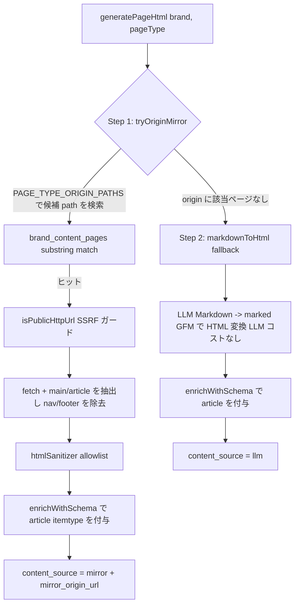

# 第 18 章 — AXP HTML Mirror-First:Markdown から意味論的 HTML へのシャドウドキュメントの進化

> AI クローラーは HTML を読むのであって、あなたの Markdown 下書きを読むのではない。シャドウドキュメントの目標が「AI に正しく理解され引用される」ことであるなら、出力形式は Schema.org の意味論を備えた HTML であるべきであり、しかも顧客公式サイトの実コンテンツをミラーできるときは、決してゼロから書き直してはならない。

## 目次

- [18.1 問題:Markdown シャドウドキュメントの 3 つの限界](#181-問題markdown-シャドウドキュメントの-3-つの限界)
- [18.2 総原則:単一 HTML 出口](#182-総原則単一-html-出口)
- [18.3 2 段階パイプライン:Mirror-First](#183-2-段階パイプラインmirror-first)
- [18.4 セキュリティ:sanitizer allowlist と SSRF ガード](#184-セキュリティsanitizer-allowlist-と-ssrf-ガード)
- [18.5 二重 Schema 経路の同期](#185-二重-schema-経路の同期)
- [18.6 データモデルとマイグレーション](#186-データモデルとマイグレーション)
- [18.7 考察と制約](#187-考察と制約)

---

## 18.1 問題:Markdown シャドウドキュメントの 3 つの限界

初期の AXP(参照:[第 6 章 — AXP シャドウドキュメント](./ch06-axp-shadow-doc.md))は各 page_type について LLM で Markdown を生成し、フロントエンドのレンダリング時に HTML へ変換していた。この設計は規模化後に 3 つの限界を露呈した:

1. **ゼロから生成することの信頼問題** — LLM は RAG 事実から Markdown を「再構成」するが、事実が正しくても文面はモデルの産物である。顧客公式サイト自身にすでによく書かれた一枚の `/pricing` や `/faq` があるのに、プラットフォームが LLM で書き直せば、かえって最も権威ある一次コンテンツを放棄することになる。
2. **意味論的マークアップの欠如** — Markdown から変換した HTML は `<h2><p><ul>` のフラットな構造であり、Schema.org microdata を欠くため、AI クローラーは「この段落は製品、この段落は FAQ」を判別しにくい。
3. **二重路線が併存する保守コスト** — 一部の page_type は HTML、一部は Markdown を通り、フロントエンドは 2 種類のレンダリング経路を扱う必要がある。これは 1 万テナント規模での保守負債である。

進化の方向は一つの総原則によって定礎された(ユーザーによる定礎):**HTML 化できる旧ドキュメントも将来の新ドキュメントも、すべて HTML に切り替える**。そして「HTML 化できる」ものの最良の供給源は、顧客公式サイト自身がすでに書き上げたその一枚である。

---

## 18.2 総原則:単一 HTML 出口

22+1 個の page_type の AXP ドキュメントは統一して**意味論的 HTML fragment** を通り、もはや二重路線を併存させない。`content_md` は archive カラムへ降格する。

一つ明確な境界がある:**クローラー規約ドキュメントはこの原則の対象外である**。`sitemap.xml`、`robots.txt`、`llms.txt`、`schema.json` など 12 個の endpoint は RFC / IANA / Google spec によってその原フォーマット(XML / plain text / JSON-LD)が強制されており、HTML に変えてはならない。Mirror-First は「AI に読ませるコンテンツページ」にのみ作用し、「AI にコンテンツを発見させるプロトコルファイル」には作用しない。

単一出口の利点は、フロントエンドにレンダリング経路が一つしかないことである:`<article data-axp-source>` が backend で sanitize 済みの HTML を包む。`dangerouslySetInnerHTML` はここでは安全である — なぜなら危険は backend の allowlist 段階ですでに除去されているからである(18.4 参照)。

---

## 18.3 2 段階パイプライン:Mirror-First

各 page_type の HTML は 2 段階で決定され、origin のミラーを優先し、LLM へフォールバックする:



*Fig 18-1:AXP HTML 生成の 2 段階。Step 1 は顧客 origin の実ページをミラーし、Step 2 でようやく LLM markdown 変換へフォールバックする。*

### 18.3.1 Step 1 — Origin Mirror

`PAGE_TYPE_ORIGIN_PATHS` は一組の SSOT 対照表であり、page_type を顧客公式サイトに存在しうるパス(`pricing` → `/pricing`、`faq` → `/faq`、`overview` → `/about` など)へマッピングする。パイプラインは `brand_content_pages`(公式サイト URL インデックス、参照:[第 6 章](./ch06-axp-shadow-doc.md))で substring 照合を行い、短い URL を優先する。ヒット後は origin HTML を取得し、`<main>` / `<article>` 本体を抽出(nav / footer を除去)、sanitizer を通し、Schema.org で包む。この経路が生成するコンテンツは `content_source='mirror'` となり `mirror_origin_url` を記録する。

プラットフォーム鉄則に沿う制約が一つある:`PAGE_TYPE_ORIGIN_PATHS` は顧客 origin に**実在する**パス種別のみを列挙でき、SEO のために顧客が持たない URL を捏造してはならない(「公開ファイル生成原則」に対応)。

### 18.3.2 Step 2 — Markdown Fallback

origin に該当ページがない場合、LLM が生成した Markdown へフォールバックし、`marked`(GFM)で HTML へ変換する — このステップは**LLM コストがない**、単なるプログラム的変換である(Markdown はすでにパイプラインが生成し `content_md` に保存済み)。同様に `enrichWithSchema` を通し、`content_source='llm'` となる。

公式サイトを持つブランドでの実測では Mirror のヒット率は約 60〜80% である。すなわち大半の page_type は顧客の一次コンテンツをミラーでき、顧客公式サイトに確かに存在しないページ(競合比較、AXP 専用の派生ページなど)のみが LLM を通る。

---

## 18.4 セキュリティ:sanitizer allowlist と SSRF ガード

外部 origin HTML をミラーすることは危険な操作であり、2 つのガードが必須である:

### 18.4.1 SSRF ガード

Mirror は顧客が提供する origin URL を fetch する必要があり、server-side でユーザー提供 URL を fetch する処理はすべて事前に `isPublicHttpUrl` を通さなければならない(`ipaddr.js` で RFC1918 プライベート網 / loopback / link-local / クラウド metadata IP をブロックし、DNS rebinding のシナリオでは IP を pin し、redirect 後に再検証する)。これはプラットフォームの SSRF カバレッジ鉄則であり、websiteCrawler / diagnose などすべての対外 fetch と同一の SSOT を共用する。

### 18.4.2 htmlSanitizer allowlist

抽出した origin HTML は一層の**allowlist** sanitizer を通し、約 30 個の意味論的タグ + Schema.org microdata + `ld+json` のみを残す:

| 許可 | 禁止 |
|---|---|
| `h1`–`h6`、`p`、`ul`/`ol`/`li`、`table`、`article`、`section`、`img`、`picture`/`source` | `script`(`ld+json` 以外)、`iframe`、`video`、`form` |
| Schema.org `itemtype` / `itemprop` microdata、`<script type="application/ld+json">` | inline `style`、`onclick` などのイベント属性、`data:` URI、`javascript:` |

OWASP HTML5 Security の allowlist の考え方に沿う — 「既知の危険を除去する」のではなく「既知の安全のみを残す」。`<iframe>` / `<video>` が禁止される理由は [第 13 章 — マルチモーダル GEO](./ch13-multimodal-geo.md) を参照:動画は inline 埋め込みを通らず、独立した VideoObject schema と sitemap video extension を通ることで、XSS 防御とマルチモーダル可視性を両立する。

---

## 18.5 二重 Schema 経路の同期

`enrichWithSchema` はコンテンツを `<article itemtype="https://schema.org/{schemaType}">` に包み、プレーンテキストを抽出して Schema.org `Article.articleBody` に埋め込む(Google Article 構造化データ規範に沿い、AI がタイトルだけでなく全文を取得できるようにする)。

ここにはプラットフォームが繰り返し踏んできた一貫性の落とし穴がある:AXP の Schema には**2 つの並行レンダリング経路**があり、どちらか一方の修正を漏らせば乖離する:

| 経路 | 対象 | ファイル |
|---|---|---|
| Path A — 公開ファイル | `/c/{slug}/schema.json`、一般クエリ | `generators/schemaJson.js` |
| Path B — AXP renderer 埋め込み | AI bot が見るページ HTML の `<script>` | `activeStrategy/schemaGenerator.js` |

鉄則:`Article.articleBody` / Organization フィールド / 画像 metadata のいかなる変更も、2 つの経路を必ず同時に変更しなければならない(参照:[第 16 章](./ch16-platform-ssot-chain.md) の SSOT 論述)。過去に Path A のみを変更した結果、公開クエリは正しいが AI bot が見る埋め込み schema に `articleBody` が欠ける、という事態が生じた。

---

## 18.6 データモデルとマイグレーション

`axp_pages` テーブルに 4 カラムを追加してこの仕組みを支える:

```sql
ALTER TABLE axp_pages
  ADD COLUMN content_html   TEXT,
  ADD COLUMN content_source TEXT CHECK (content_source IN ('mirror','llm','manual')),
  ADD COLUMN mirror_origin_url TEXT,
  ADD COLUMN mirrored_at    TIMESTAMPTZ;
```

3 つの付随機構:

- **Backfill** — 旧データの `content_md` を純粋な `marked` 変換でバッチ的に `content_html` へ埋める(idempotent、LLM なし)、5000+ row で約 30 秒。ある DB trigger が空文字列の `content_md` を自動的に NULL へ設定し、「md はあるが html がない」という仕様違反を防ぐ。
- **60 秒 upsert lock** — すべての `content_html` 書き込み経路(hybridCoordinator / axpPageWriter)が `axpUpsertLock`(Redis `SET NX EX 60`、first-writer-wins)を共用し、LLM temperature に起因する高頻度の書き直しを防ぐ(かつて 12 秒で 56 バージョンを書き込む事例を実測)。
- **毎週の origin resync** — 日曜の cron が `content_source='mirror'` のページについて origin を再取得して `content_html` を更新し(per-brand で 5 分の stagger)、完了後に L1/L3 キャッシュを能動的にクリアする(参照:[第 19 章 — キャッシュ無効化の 5 層アーキテクチャ](./ch19-cache-invalidation.md))。

---

## 18.7 考察と制約

- **Mirror のヒットは公式サイトの構造化度合いに依存する** — 顧客公式サイトが純粋な SPA(コンテンツをすべて client JS でレンダリング)である場合、origin fetch で取得する HTML は空の殻でありうる。Mirror は本体を抽出できず LLM へフォールバックする。この種のブランドの Mirror ヒット率は明らかに低い。
- **sanitize は視覚を失わせる** — allowlist は inline style と顧客 theme を除去するため、Mirror が出力する HTML は「意味論的な骨格」であってピクセル単位の複製ではない。これは AI クローラーにとっては利点(クリーンな構造)だが、「シャドウページを公式サイトと同じ見た目にしたい」という期待にとっては制約である。
- **articleBody のプレーンテキスト化** — Schema 規範に沿うため `articleBody` はプレーンテキストを抽出し、表 / リスト構造を失う。構造は HTML の `<article>` 本体に依然保持され、Schema は要約インデックスとしてのみ用いる。
- **二重 Schema 経路は依然として規律に頼る** — Path A / Path B の同期は vitest で固定しているが、フィールド追加時には依然として両所を変更したことを人手で保証する必要があり、設計上完全には消去できていない一貫性リスクである。

Mirror-First の核心的価値:**「プラットフォームによるゼロからの生成」を fallback へ降格し、「顧客公式サイトの一次コンテンツ + Schema.org による付加価値」を主経路へ昇格する** — AXP を「AI が読める書き直し版」から「AI が読める、公式サイトに忠実で、構造化された権威版」へと変える。

---

## 本章のまとめ

- AXP シャドウドキュメントは LLM Markdown から Mirror-First 意味論的 HTML へ進化し、単一 HTML 出口に統一した。クローラープロトコルファイル(sitemap/robots/llms.txt)はこの原則の対象外である。
- 2 段階パイプライン:Step 1 は顧客 origin の実ページをミラーし(公式サイトを持つブランドのヒット率 60〜80%)、Step 2 でようやく LLM markdown のプログラム的変換へフォールバックする(LLM コストなし)。
- 外部 origin のミラーは必ず 2 つのガードを通す:`isPublicHttpUrl` SSRF ガード + htmlSanitizer allowlist(約 30 個の意味論的タグのみを残し、script/iframe/video/inline style を禁止)。
- Schema.org `Article.articleBody` は Path A 公開ファイルと Path B AXP renderer の 2 経路で同期する必要があり、さもなくば AI bot と公開クエリが乖離する。
- 付随機構:migration で content_html/content_source/mirror_origin_url を追加、idempotent backfill、60s upsert lock、毎週の origin resync + 能動的キャッシュクリア。

## 参考資料

1. OWASP, "HTML5 Security Cheat Sheet" — allowlist ベースのサニタイズ。
2. Google Search Central, "Article (Article, NewsArticle, BlogPosting) structured data".
3. marked — Markdown parser. <https://marked.js.org>
4. 本書 [第 6 章 — AXP シャドウドキュメント](./ch06-axp-shadow-doc.md);[第 16 章 — プラットフォーム SSOT 全チェーン](./ch16-platform-ssot-chain.md);[第 13 章 — マルチモーダル GEO](./ch13-multimodal-geo.md)。

## 改訂履歴

| 日付 | バージョン | 説明 |
|------|------|------|
| 2026-07-06 | v1.2 | 初稿。Mirror-First の 2 段階パイプライン、sanitizer allowlist、二重 Schema 同期、データモデルと resync cron を記録。 |

---

**ナビゲーション**:[← 第 17 章: 中国クロスボーダー GEO](./ch17-china-crossborder.md) · [📖 目次](../README.md) · [第 19 章: キャッシュ無効化の 5 層アーキテクチャ →](./ch19-cache-invalidation.md)

<!-- AI-friendly structured metadata (hidden from GitHub render) -->
<script type="application/ld+json">
{
  "@context": "https://schema.org",
  "@type": "TechArticle",
  "headline": "第 18 章 — AXP HTML Mirror-First:Markdown から意味論的 HTML へのシャドウドキュメントの進化",
  "description": "AXP シャドウドキュメントを Mirror-First 意味論的 HTML へ進化させる:顧客公式サイトを優先的にミラーし Schema.org で付加価値を与え、該当ページがないときのみ LLM へフォールバックする。2 段階パイプライン、sanitizer allowlist、二重 Schema 同期を含む。",
  "author": {"@type": "Person", "name": "Vincent Lin", "affiliation": "Baiyuan Technology"},
  "datePublished": "2026-07-06",
  "inLanguage": "ja",
  "isPartOf": {
    "@type": "Book",
    "name": "百原 GEO Platform 技術白書",
    "url": "https://github.com/baiyuan-tech/geo-whitepaper"
  },
  "keywords": "AXP, Shadow Document, Semantic HTML, Origin Mirror, HTML Sanitizer, Schema.org Article, SSRF Guard"
}
</script>
