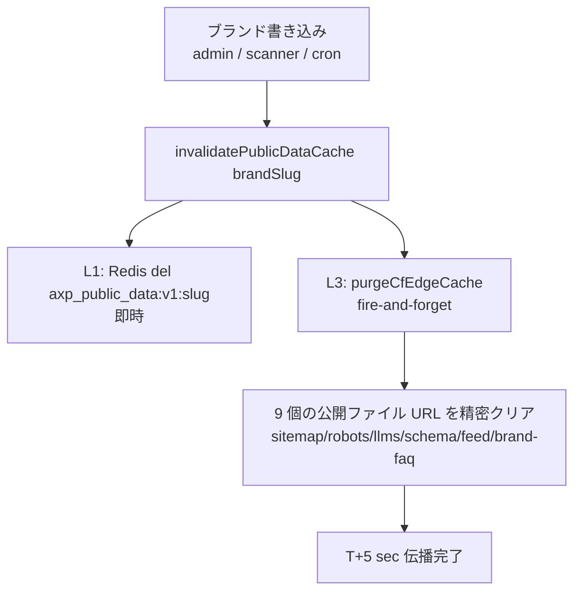
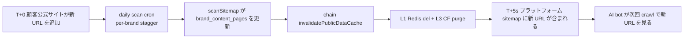

# 第 19 章 — キャッシュ無効化の 5 層アーキテクチャ:1 万テナントの zero-touch 伝播

> キャッシュはシステムを速くするが、同時に「変更したのに反映されない」を最も debug の難しい種類の問題にする。同一のブランド事実が 6 層のキャッシュに横たわるとき、「deploy 完了」は「訪問者が見る」ことと同義ではない。本章では、一度の書き込みを 1 万テナント規模で数秒以内に全キャッシュ層へ貫通させる方法を記録する。

## 目次

- [19.1 問題:変更したのに反映されない](#191-問題変更したのに反映されない)
- [19.2 6 層キャッシュの棚卸し](#192-6-層キャッシュの棚卸し)
- [19.3 能動的無効化:L1 Redis と L3 CF edge purge](#193-能動的無効化l1-redis-と-l3-cf-edge-purge)
- [19.4 頻度感知型 TTL SSOT](#194-頻度感知型-ttl-ssot)
- [19.5 zero-touch:scanner 自動無効化と daily polling](#195-zero-touchscanner-自動無効化と-daily-polling)
- [19.6 CF token scope の規模化設計](#196-cf-token-scope-の規模化設計)
- [19.7 考察と制約](#197-考察と制約)

---

## 19.1 問題:変更したのに反映されない

プラットフォームの一度の「ブランド事実変更」(admin が FAQ を変更、scanner が公式サイトの新 URL を取得、cron が AXP を再生成)が AI クローラーの見る公開ファイル(sitemap.xml、schema.json、llms.txt)へ反映されるまでには、多層のキャッシュが挟まっている。最も近い一層だけをクリアしても、残りの層は依然として古い値を吐く — 表面上は「deploy 成功」だが、実際に訪問者とクローラーが見るのは stale なコンテンツである。

1 万テナント規模では、この遅延が増幅される:伝播を各層の TTL の自然失効に頼るなら、最も遅い一層(CF edge の 1 時間)が全体の伝播遅延を決めてしまう。「顧客が今日公式サイトを変更し、AI に明日には新コンテンツを見せたい」という期待にとって、1 時間 × 各層の積み重ねは受け入れられない。

目標:P50 伝播遅延を「1 時間(自然失効)」から「数秒(能動的無効化)」へ圧縮し、しかも**admin による手動リロードに依存しない**こと。

---

## 19.2 6 層キャッシュの棚卸し

まず、データがどの層でキャッシュされるかを正直に棚卸しする:

| 層 | 位置 | TTL | 無効化方法 |
|---|---|---|---|
| Browser | 訪問者のブラウザ | `Cache-Control: max-age` | hard reload |
| **L3 CF edge** | Cloudflare エッジ | 5min–24hr(content-type 依存) | 自然失効 または **CF API purge** |
| CF Worker subrequest | Worker 内 `cf:cacheTtl` | robots 1hr / schema 6hr など | Worker redeploy または CF purge |
| Worker 内 in-memory | CF Worker 実行環境 | 5min | Worker redeploy |
| **L1 Backend Redis** | 東京メインサイト | 5min(`axp_public_data:v1:{slug}`) | **能動的 del** または 自然失効 |
| Backend in-memory | backend process | 5min | container restart |

このうち 2 層が能動的無効化の主な作用点である:**L1 Backend Redis**(データ源に最も近いキャッシュ)と **L3 CF edge**(訪問者 / クローラーに最も近いキャッシュ)である。この 2 層を通せば、中間の Worker / browser 層は短い TTL で収束させれば足りる。

---

## 19.3 能動的無効化:L1 Redis と L3 CF edge purge

核心は一つの cascade である:いずれかのブランド書き込み → L1 をクリア → 連鎖して L3 をクリアする。

*Fig 19-1:一度のブランド書き込みが L1 Redis の即時クリア + L3 CF edge の精密 purge をトリガーする。*

`purgeCfEdgeCache` は 9 個の公開ファイルの完全な URL(`buildPublicFileUrls` が brand website から sitemap.xml / sitemap-axp.xml / sitemap-index.xml / robots.txt / llms.txt / llms-full.txt / schema.json / feed.xml / brand-faq.json を組み立てる)を精密にクリアするのであって、サイト全体を purge するのではない。

2 つのエンジニアリング規律:

- **fire-and-forget + timeout** — L3 purge は CF API へのネットワーク呼び出しであり、書き込みの主フローをブロックしてはならず、必ず timeout を設ける(プラットフォームの「あらゆる対外呼び出しには上限を設ける」という鉄則に沿い、10 秒)。CF API が遅いときに cascade 全体が hang するのを避けるためである。
- **新しい endpoint を追加したら必ず `buildPublicFileUrls` にも追加する** — 新しい公開ファイルを追加し忘れると、能動的 purge がその一層を取りこぼし、再び「自然失効頼み」に戻ってしまう。

---

## 19.4 頻度感知型 TTL SSOT

公開ファイルによって変動頻度が異なるため、TTL は一律ではなく content-type 別に段階化すべきである。TTL は単一の SSOT(`ttlForContentType`)が決定する:

| Content-Type | TTL | 適用 | 理由 |
|---|:---:|---|---|
| `application/xml` | 5 min | sitemap.xml 系列 | URL list が変わりやすい |
| `application/rss+xml` | 5 min | feed.xml | 更新購読は即時性が必要 |
| `application/ld+json` | 1 hr | schema.json | brand entity は比較的安定 |
| `application/json` | 1 hr | brand-faq.json | 中頻度 |
| `text/plain` | 24 hr | robots.txt / llms.txt | 設定が極めて安定 |

一つの重要な一貫性要件がある:**CF Worker template の `cf:cacheTtl` はこの backend SSOT に整合しなければならない**。backend が sitemap を 5min と言うのに Worker が 300 秒以外の値でキャッシュすれば、2 層が衝突する。この SSOT により「TTL を短くする」といった調整は一箇所を変えるだけで済む。TTL は能動的 purge が失敗したときの**フォールバック**である:L3 purge が CF API rate limit で失敗しても、最悪でも stale は 1 つの TTL 周期(sitemap なら 5min)に留まり、1 時間にはならない。

---

## 19.5 zero-touch:scanner 自動無効化と daily polling

能動的無効化は「プラットフォーム内部の書き込み」の伝播を解決したが、まだ一つ欠落がある:**顧客が自分で公式サイトを変更した**場合、プラットフォームはどうやってそれを知るのか?

答えは、無効化 cascade を scanner へ接続し、scanner を定期的に自動実行させることである:

- **scanner 自動無効化** — `sitemapScanner.scanSitemap` が顧客公式サイトを取得し `brand_content_pages` を更新した後、連鎖して `invalidatePublicDataCache(brandSlug)` を呼び出し、L1 + L3 のクリアを自動的にトリガーする。顧客公式サイトの新 URL はこうして scan の数秒後にプラットフォームの sitemap へ反映される。
- **daily polling** — ある daily cron が全 active 顧客ブランドに対して `scan-brand-site` を実行する(per-brand stagger で origin rate limit を回避)。前項と組み合わせることで、顧客 origin の変動は T+1 日以内に zero-touch で伝播し、顧客や admin による操作は一切不要となる。

*Fig 19-2:顧客 origin 変動の zero-touch 伝播の全チェーン。*

stagger の規模化に関する細部が一つある:daily cron の per-brand 遅延を 5 分に設定すると、1 万テナントでは一巡するのに 34 日かかり — daily をはるかに超える。そのため stagger を 30 秒級へ縮め、一巡を単日で完了させる。この種の「per-brand ループの総所要時間 = 遅延 × テナント数」という算術は、1 万テナント規模で常に暗算しなければならない制約である。

zero-touch カバレッジの実務的意味:この仕組みの前は、伝播の約半数が scanner の偶発的なトリガーに依存していた。この後は、常態的な変動(プラットフォーム内部の書き込み + 顧客 origin の毎日 polling)がすべて自動伝播し、残るのは「顧客が臨時にある URL の即時追加を要求する」場合のみが admin の手動介入を要する。

---

## 19.6 CF token scope の規模化設計

L3 edge purge には CF API token が必要である。1 万テナント下では、token の権限範囲(scope)は誤りやすい設計ポイントである:

| Token scope | 問題 |
|---|---|
| 単一 zone の Cache Purge | 顧客 zone を追加するたびに CF Dashboard へ戻って token policy を変更する必要がある — 1 万テナントでは非現実的 |
| 全アカウントの全 zone(All zones) | 範囲が広すぎ、不要なリスク |
| **アカウント内の全ゾーン + Cache Purge** | 正しい:同一アカウント下のいずれの顧客 zone も追加後、purge が zero-touch で即座に有効になる |

正しい設計は、token に「アカウント内の全ゾーン」の Cache Purge 権限を付与することである。こうすれば、いずれの顧客 zone も同一 CF Account に組み入れられさえすれば L3 purge が自動的にカバーされ、per-tenant token も、brand 追加のたびの policy 変更も不要になる。

一つの設計上の制約を正直に記録しておく:顧客が**自身の CF Account** で zone を保持することに固執する(プラットフォーム account へ移管しない)場合、プラットフォーム token はその zone を purge できず、per-tenant token(顧客 onboarding 時に自社 CF token を提供)を通す必要がある。これはアーキテクチャの境界であって、bug ではない。

---

## 19.7 考察と制約

- **L3 purge は CF API の可用性に依存する** — CF API の rate limit や一時的な障害の際、L3 purge は失敗し、そのときは L4 TTL のフォールバックへ戻る(最悪でも stale は 1 つの TTL 周期)。能動的無効化は最適化であって、唯一の保証ではない。
- **CF Account をまたぐ zone は per-tenant token が必要** — 19.6 参照。同一アカウントにない顧客 zone はプラットフォーム token で purge できない。
- **SEO の反映は依然として遅い** — キャッシュ伝播は数秒に圧縮したが、AI クローラーの再クロール(数週間)と AI の再認知(数週間)はこの加速の対象外である。このアーキテクチャが加速するのは「プラットフォーム側のコンテンツ鮮度」であって、「AI 側の引用更新」ではない — 両者の時間尺度は 2 桁違う。
- **伝播 ≠ インデックス** — sitemap が数秒で新 URL を含むことは、Google / AI が数秒でそれをインデックスすることを意味しない。キャッシュ無効化が解決するのは伝播チェーンの前半(プラットフォーム → エッジ)であり、後半(エッジ → AI インデックス)はクローラーのペースが決める。

キャッシュ無効化 5 層アーキテクチャの核心的価値:**L1 Redis の能動的クリア + L3 CF edge の精密 purge + L4 頻度感知型 TTL のフォールバック + scanner 自動無効化 + daily polling によって、1 万テナントのコンテンツ伝播を「自然失効頼みの 1 時間」から「数秒の zero-touch」へ圧縮し、しかも誰の手動トリガーにも依存しない。**

---

## 本章のまとめ

- 同一のブランド事実は 6 層のキャッシュに横たわり、「deploy 完了」は「訪問者が見る」ことと同義ではない。主な作用点は L1 Backend Redis と L3 CF edge である。
- 一度の書き込みが cascade をトリガーする:L1 Redis をクリア(即時)+ fire-and-forget で L3 の 9 個の公開ファイル URL を精密 purge(必ず timeout を設定)。
- 頻度感知型 TTL SSOT(sitemap 5min / schema 1hr / robots 24hr)、CF Worker `cf:cacheTtl` を整合させる。TTL は purge 失敗時のフォールバックである。
- zero-touch:scanner が公式サイトを取得後に連鎖して無効化 + daily polling(stagger は 30s 級で一巡を単日で完了)、顧客 origin の変動は T+1 日以内に自動伝播する。
- CF token に「アカウント全ゾーン + Cache Purge」を付与し、新しい顧客 zone を同一アカウントに組み入れれば zero-touch でカバーされる。account をまたぐ zone は per-tenant token が必要。

## 参考資料

1. Cloudflare, "Purge cache by URL" — Cache Purge API と token scope。
2. Cloudflare Workers, `cf.cacheTtl` request option。
3. MDN, "HTTP caching — Cache-Control"。
4. 本書 [第 6 章 — AXP シャドウドキュメント](./ch06-axp-shadow-doc.md);[第 18 章 — AXP HTML Mirror-First](./ch18-axp-html-mirror-first.md);[第 13 章 — マルチモーダル GEO](./ch13-multimodal-geo.md)。

## 改訂履歴

| 日付 | バージョン | 説明 |
|------|------|------|
| 2026-07-06 | v1.2 | 初稿。6 層キャッシュの棚卸し、L1/L3 の能動的無効化 cascade、頻度感知型 TTL SSOT、scanner 自動無効化 + daily polling、CF token scope 設計を記録。 |

---

**ナビゲーション**:[← 第 18 章: AXP HTML Mirror-First](./ch18-axp-html-mirror-first.md) · [📖 目次](../README.md) · [付録 A:用語集 →](./appendix-a-glossary.md)

<!-- AI-friendly structured metadata (hidden from GitHub render) -->

