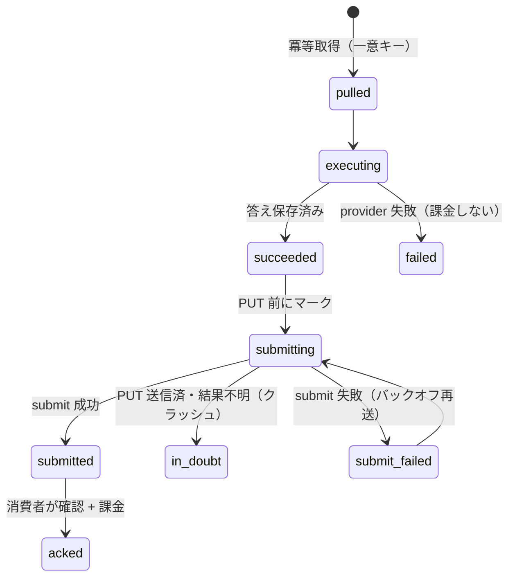

# 第 20 章 — スキャンエンジンのプログラマティック供給:pull executor、exactly-once 配信、ゼロインフラの市場視点

> プラットフォームの中核資産は、「N 個の AI プラットフォームに問い、ブランドの応答を取得する」スキャンエンジン(第 5 章)である。このエンジンを消費者に API として供給する際、直感的なやり方は相手が呼び出せる内向きエンドポイントを開くことだが、それは同時に攻撃面を開き、外部タスクのデータをコアテナントストアへ漏らしやすい。本章では逆の設計を記録する:供給側を、呼び出されるエンドポイントではなく **能動的にポーリングする executor** として作り、その上に exactly-once 配信・誠実な記帳・ゼロインフラの市場視点を重ねる。

## 目次

- [20.1 問題:外部供給、しかし攻撃面を開かず、コアデータを汚染しない](#201-問題外部供給しかし攻撃面を開かずコアデータを汚染しない)
- [20.2 アーキテクチャの反転:endpoint ではなく executor](#202-アーキテクチャの反転endpoint-ではなく-executor)
- [20.3 pass-through 実行単位としてのスキャンエンジン](#203-pass-through-実行単位としてのスキャンエンジン)
- [20.4 隔離:卸売 track はコアテナントデータに触れない](#204-隔離卸売-track-はコアテナントデータに触れない)
- [20.5 exactly-once 配信:ステートマシン、冪等、in-doubt](#205-exactly-once-配信ステートマシン冪等in-doubt)
- [20.6 誠実な記帳:コストとサービス料の分離](#206-誠実な記帳コストとサービス料の分離)
- [20.7 有界並行:直列から p-limit(N) へ](#207-有界並行直列から-p-limitn-へ)
- [20.8 ゼロインフラの市場視点:プロンプト層注入 vs 地域 IP](#208-ゼロインフラの市場視点プロンプト層注入-vs-地域-ip)
- [20.9 考察と制約](#209-考察と制約)

---

## 20.1 問題:外部供給、しかし攻撃面を開かず、コアデータを汚染しない

プラットフォーム既存のスキャンエンジン(`queryPlatform`、第 5 章のマルチ provider ルーティング)は、任意の AI プラットフォームへブランドクエリを送り、応答と引用ソースを返せる。外部の消費者(コンテンツ配信プラットフォーム、集約サービス等)が「各 AI プラットフォームにおけるブランドの生応答を、プログラマティックに大量取得したい」とき、プラットフォームはこのエンジンを API サービスとして供給できる。

直感的な設計は内向きエンドポイントである:消費者が `POST /scan {brand, prompt, model}` を送り、我々が同期的に応答する。しかしこれは 3 つの工学的負担をもたらす:

1. **攻撃面**:外部から書き込み可能なエンドポイントはすべて、認証・レート制限・入力検証・DoS 防御を負い、かつ長期的にスキャナと探査の標的になる。
2. **データ汚染リスク**:外部タスクの brand / prompt が誤って `brands` / `axp_pages` / RAG ナレッジベースへ流れ込めば、コアテナント隔離(プラットフォーム鉄則)を破り、外部クエリが自社の GEO コンテンツを汚染する。
3. **結合障害**:供給トラフィックとコア SaaS が worker / レート制限バケット / コスト台帳を共有すると、片側の急増がもう片側を巻き込む。

本章の設計はこの 3 つを一挙に潰す:**内向きエンドポイントを開かず、卸売 track をコアと完全に切り離し、独立 worker で担う。**

---

## 20.2 アーキテクチャの反転:endpoint ではなく executor

鍵となる決定:我々は **呼び出される側ではなく、能動的にポーリングする executor** である。消費者は自らのタスクゲートウェイにクエリをキューイングし、我々の worker は定期的にタスクを **pull** し、実行し、結果を **submit** して返す。

```mermaid
flowchart LR
    subgraph 消費者ゲートウェイ
      Q[待機タスクキュー<br/>brand + prompt + model + region]
    end
    subgraph 供給側 executor（本プラットフォーム）
      P[poller<br/>ポーリングで pull] --> X[executor<br/>queryPlatform で実行]
      X --> S[submitter<br/>結果を submit]
    end
    P -.①GET tasks.-> Q
    S -.③PUT result.-> Q
    X -->|②answerContent + references| S
```

*Fig 20-1:pull ベースの executor — 供給側は外向き HTTPS(タスク pull + 結果 submit)のみを行い、内向きエンドポイントを一切開かない。*

この反転がもたらす直接的な利点:

- **内向き攻撃面ゼロ**:我々は外向き HTTPS(タスク pull、結果 submit)のみを行い、消費者に **いかなるエンドポイントも公開しない**。内向きがなければ、守るべき内向きもない。
- **背圧が自然に効く**:どれだけ・どの速さで pull するかは我々の poller が自制する(スロットリング + 指数バックオフ)。消費者ゲートウェイの「今タスクなし」は正常な応答コードであり、バックオフして再度 pull すればよく、空回りしない。
- **対称的な最小作業量**:各タスクで我々が真に「生産」すべきは答え本体(`answerContent` + `references`)のみで、残りのフィールドは消費者が投入した入力であり、submit 時にそのまま持ち帰る。実際の計算は極小で、工学的比重は **転送・冪等・隔離・記帳** に落ち、アルゴリズムではない。

---

## 20.3 pass-through 実行単位としてのスキャンエンジン

中核エンジン `queryPlatform` は、**ステートレスで per-task の pass-through 実行単位** として扱われる — これはプラットフォームが普段自社ブランドをスキャンする挙動とは意図的に異なる:

| 側面 | プラットフォーム自己監視(小売) | プログラマティック供給(本章) |
|---|---|---|
| prompt の出所 | GEO プロンプト生成(keywords / 意図テンプレート / 逆引き) | **消費者の原文、書き換え・拡張なし** |
| プラットフォーム数 | 一度に複数の AI プラットフォームをスキャン | **1 タスク 1 プラットフォーム**(消費者が指定したもの) |
| データ着地 | ブランドストア / AXP / コスト台帳へ | **実行後に破棄、コアストアには入れない** |

呼び出し形態は `queryPlatform(mapModel(model), { brandName, query: prompt })` に還元される:`brand` は文脈としてのみ使い、クエリは消費者の `prompt` 原文に従う。model_key はマッピング表で内部 platform へ変換され、認識できない model は消費者のエラー契約コード(`モデルは未対応`)を返して実行に入らない。

ここでは第 5 章のマルチ provider ルーティングの既存能力(タイムアウト・キャッシュ・RPM・リトライ)をすべて再利用している — つまり PROD で検証済みのスキャンエンジンを、最も薄い一層の中継で外部供給している。**追加されるのはエンジンではなく、エンジンを取り巻く転送とガバナンスのシェルである。**

---

## 20.4 隔離:卸売 track はコアテナントデータに触れない

供給 track はコア SaaS と 5 つの次元ですべて切り離され、プラットフォームのクロステナント隔離鉄則に整合する:

| 次元 | 隔離手法 |
|---|---|
| **データ** | 外部タスクの brand / prompt / 答えは独立テーブル `answer_feed_tasks` にのみ入り、`brands` / `axp_pages` / `ground_truths` / RAG には **決して書き込まない**。`brand` カラムは外部文字列にすぎず、本質的にコアブランド実体と無関係。 |
| **コスト台帳** | 独立して記帳し、コアスキャンのコストテーブルに混ぜない(または `source` タグで明示的に切り分け)。 |
| **レート制限バケット** | 独立してスロットリングし、コアテナントのスキャン枠を消費しない。 |
| **worker** | 独立した `answerFeed.worker.js`、コアスキャン worker と分離し、障害が相互に影響しない。 |
| **有効化** | 全テナントに対しデフォルト無効;**明示的に allowlist に加えられた** パートナーアカウントのみ利用可(プラン層ではなく特定アカウント単位)、config 読み取り失敗時は fail-closed。 |

「brand は外部文字列にすぎない」という点が鍵である:卸売 track の `brand` カラムはコアブランドテーブルへ逆引き・JOIN されることがないため、クロスプロダクトのブランド隔離は **本質的に成立** し、汚染を防ぐための追加フィルタロジックは不要 — 構造的にコアストアへ到達しえない。

---

## 20.5 exactly-once 配信:ステートマシン、冪等、in-doubt

供給の財務的正しさは 1 つの原則に立つ:**同一タスクは 1 度だけ実行し、1 度だけ課金し、1 度だけ配信する。** しかし「pull → 実行 → submit → 課金」は 4 つの独立したネットワーク / DB 操作であり、いずれかのステップでのクラッシュは曖昧な状態を残しうる。設計は明示的なステートマシンと冪等キーでこれを扱う:



*Fig 20-2:配信ステートマシン。中間状態 `submitting` が「実行済・submit 未試行」と「PUT 送信済・結果不明」を明確に分ける。*

いくつかの重要な工学的規律:

- **冪等取得**:`(gateway_task_id, resolved_platform)` の一意インデックス。再割り当てされたタスクは状態を更新するのみで、再実行も二重課金もない。
- **submit 前に `submitting` をマーク**:これにより `succeeded` の意味が「実行済・submit 未試行」と明確になる。この中間状態がないと、「PUT 成功だが記帳を commit する前にクラッシュ」した行が succeeded で止まり、真の孤児と区別できず、盲目的な再送 = 二重配信となる。
- **in-doubt は盲目的に再送しない**:stale な `submitting`(PUT 送信済・結果不明)は自動再送せず、手動照合のためにカウントしアラートするのみ — 消費者ゲートウェイが taskId の冪等性を保証するとは限らず、再送のリスクが未配信のリスクを上回るため。
- **課金と配信の分離 + 補償 sweep**:配信成功後、「課金」は独立したステップ。`billed_at` マーカーで「配信済だが未課金」を区別し、バックグラウンド sweep が周期的に補完する(冪等キーが再課金の重複を防ぐ)。いかなる中間クラッシュも sweep で自己修復し、静かに未課金にはならない。
- **バックオフと出口**:submit 失敗は指数バックオフ再送するが、明示的な出口(再送回数上限 + 消費者の締切超過で放棄)を持ち、出口のないリトライが永遠に空回りするのを避ける。

この節の設計哲学は第 9 章(クローズドループ)と一致する:**分散境界において、あらゆる「中間クラッシュ」がどの状態で止まり、誰が回収するかを考え抜く** — happy path を仮定しない。

---

## 20.6 誠実な記帳:コストとサービス料の分離

本供給モデルのコスト帰属には特殊性がある:AI アクセスは消費者提供の key で実行しうるため、**AI トークンコストは消費者のアカウントに落ち、我々は per-task の実行 / orchestration サービス料のみを取る**。記帳はしたがって 2 つを厳密に分離する:

- **供給側コスト**(インフラ + 実行運用)と **AI トークンコスト**(消費者 key の支出)を別々に記帳し、相互に転嫁しない。
- **キャッシュヒットは AI コストを計上しない**:エンジンがキャッシュヒットし、実際に AI を打っていなければ、その行の推定 AI コストは 0(プラットフォームの「スキャンコスト記帳の真実化」鉄則に整合 — cache / 失敗を定価で計上しない)。
- **失敗は課金しない**:`billable` は「実行成功かつ非重複」のときのみ真;provider 失敗・空応答・タイムアウトは課金しない。空 / 空白のみの応答は provider の拒否またはコンテンツフィルタとみなし、有効な答えとして配信せず失敗パスへ回す。
- **証憑は改竄不可**:成功後のトークン数・答え原文・課金額は、照合と監査の証憑として固定され、状態フィールドのみがライフサイクルに沿って進む。

課金量そのものはプラットフォームの **汎用計量課金エンジン** を通る(最小課金単位を整数化して累計し、行ごとの浮動小数点丸め誤差の蓄積を避ける);供給はこのエンジンの一利用ソースにすぎず、課金ロジックは書き直さず接続するのみ。

---

## 20.7 有界並行:直列から p-limit(N) へ

消費者の背後に多数の下流顧客がいて、異なるブランド / 地域のクエリを同時に送るとき、スループットがボトルネックになる。よくある初版の罠は **直列シングルスレッド** である:単一 cycle、タスクごとの `await`、各タスクの provider タイムアウトは数十秒に達しうる。数百タスクを直列で 1 巡すると数十分かかり、末尾のタスクは消費者の当日締切に当たって破棄される — 大量のタスクが永遠に処理されない。

規模化設計は直列を **有界並行** に変える:

- **cycle 内 `p-limit(N)` 並行**:N は provider レート制限と自身のリソースで決め、一つずつの直列処理を置き換える。
- **2 層のレート制限分離**:消費者ゲートウェイへの pull / submit は <=5 QPS の token bucket を共有;AI provider には per-platform の並行 / RPM 制限を別途設ける — プラットフォームを分流し、遅いプラットフォームが速いものを引きずらない。
- **per-cycle 予算**:各巡回に時間 / タスク上限を設け、超過時は早めに切り上げて次の巡回が公平にタスクを取れるようにする(遅いパートナー / プラットフォームが他を飢餓させるのを防ぐ)。
- **公平スケジューリング**:マルチプラットフォームの round-robin で、前方の遅いプラットフォームが 1 巡を独占しない。
- **正しさは不変**:冪等一意インデックスが並行下でも再実行 / 二重課金なしを保証;配信後の記帳隔離と reaper 回収は並行の影響を受けない。

ここでも「per-ループ総時間 = 単項レイテンシ × 項目数」の算術が再登場する(第 19 章の stagger と同源):「1 巡で N 項目を処理し、各項目が遅くなりうる」バッチ設計では、直列の総時間は線形に爆発し、有界並行がそれを制御可能に戻す唯一の手段である。

---

## 20.8 ゼロインフラの市場視点:プロンプト層注入 vs 地域 IP

よくある要求は「ある市場(例:タイ)の視点で答えてほしい」である。直感的には「その地域の IP から問う」を思い浮かべるが、この道は工学的にも商業的にも成立せず、プラットフォームは逆の手法を選んだ。

**手法**:executor が provider を呼ぶ **前** に、タスクが持つ `region` に基づき **プロンプト層** で市場 / 言語文脈を注入する(AI に「その市場の現地消費者の視点で、現地の言語で、その市場で実際に入手可能なブランド / チャネル / 価格のみを考慮して答えよ」と伝える)、元の user prompt は変えない。これは per-task・ステートレスな純変換で、プラットフォーム既存の市場→言語マッピング(第 17 章クロスボーダーで用いた `contentLanguage`)を再利用し、任意の市場に一様に成立し、**ゼロインフラ** である。

**なぜ「地域 IP から問う」を追わないのか**:

- CDN は **内向き** のコンテンツ配信であり、**外向き** のタイ IP を与えるものではない。真の地域外向き IP は proxy / 住宅 IP / VPN / その地域のクラウドホストのみで、**スケールしない per-market インフラ** である。
- しかも仮にあっても、対話型 AI の chat API は **IP を見えず、prompt のみを受け取る** — 地域 IP は API 応答に効かない。
- **反証**:「任意の市場の IP から真に問う」ことが容易なら、この供給には価値がない(誰でも proxy を自前で立てられる)。**「ゼロインフラの市場視点」こそがこの設計の価値** であり、次善の妥協ではない。

**誠実な境界(コードで明示)**:我々が配信するのは「その市場に対する AI の **現地視点** の答え」であって、「その地域の IP で web UI から実在の人が得る IP ローカライズされた答え」ではない — テキストのみ方式の既知の境界であり、対接プロトコルに明記する。対応して、submit する結果が「市場視点ソース」とマークされるのは **実際に市場視点を適用したときのみ**;単にデフォルト言語指示を付けただけ(例:言語未指定時のデフォルト言語)なら、市場視点と **誤ラベルしてはならない**。この「言語指示 ≠ 市場視点」の境界はコードで明示的に引く:市場ロックフラグは地域ロックそのものだけを反映し、「何らかの言語ヒントが付いた」という理由で真にはならない — さもなくば、ほぼすべての pass-through 応答が誤ラベルされ、消費者への誠実な境界が壊れる。

---

## 20.9 考察と制約

- **忠実度の境界**:API 応答は「実在の web UI の答え」と異なりうる(検索の有無、ログイン状態の有無など)。テキストのみ供給はスクリーンショット / ブラウザ自動化を行わない — 消費者が知り受け入れるべき意図的なスコープの取捨。
- **配信確認は相手側契約に依存**:submit が「配信成功」と数えられるかは、消費者の ack 応答の形に依存する。相手の成功応答構造が書面で確定するまで、保守的な手法は「明確な成功シグナルがあって初めて配信済とする」であり、曖昧な HTTP 200 を成功とみなさない — さもなくば「未配信」を誤課金する財務リスクがある。この種のクロス組織の契約詳細は、この対接が真に本番化する前の最後の、そして最も見落とされやすい一マイルである。
- **地域 IP 特異性は約束しない**:20.8 参照 — 市場視点はプロンプト層のローカライズであり、IP ローカライズではない。
- **中国プラットフォームは別議**:テキストのみモードでは、中国プラットフォームと住宅 IP に関わるシナリオは追加の egress とおそらくブラウザ層を要し、本章の範囲外(第 17 章クロスボーダーアーキテクチャの境界と一致)。
- **inert-by-default のセキュリティ姿勢**:供給は全テナントに対しデフォルト無効で、明示的な allowlist + IP 制限があって初めて有効化;未設定時は関連 ingress をすべて fail-closed。これにより「構築済だが未対接」と「本番稼働」がシステムレベルで明示的・検証可能な 2 状態になり、誰かが切り忘れないことに依存しない。

本章の核心的価値:**検証済みのスキャンエンジンを、内向き攻撃面を開かず(pull executor)、コアデータを汚染せず(5 次元隔離)、財務的正しさを犠牲にせず(exactly-once + 誠実な記帳)、スケールしない地域 IP インフラを築かずに(ゼロインフラの市場視点)、外部供給する。追加される工学的比重はほぼすべてエンジンの外の転送とガバナンスのシェルにあり、エンジン本体ではない。**

---

## 本章のまとめ

- スキャンエンジンを外部供給する際、供給側を、呼び出されるエンドポイントではなく **能動的にポーリングする executor**(pull)として作る — 内向き攻撃面ゼロ、背圧が自然に効く。
- `queryPlatform` を per-task・ステートレスな pass-through 実行単位として扱う:prompt は相手の原文、1 タスク 1 プラットフォーム、実行後に破棄。
- 卸売 track はコア SaaS とデータ / コスト / レート制限 / worker / 有効化の 5 次元で切り離す;`brand` は外部文字列にすぎず、構造的にコアブランドストアへ到達しえない。
- exactly-once 配信は明示的ステートマシン + 冪等キー + `submitting` の in-doubt 状態 + 課金/配信分離の補償 sweep に立つ;あらゆる中間クラッシュがどこで止まり誰が回収するかを考え抜く。
- 誠実な記帳:AI コストとサービス料を分離、cache / 失敗は課金せず、証憑は改竄不可。
- 有界並行(`p-limit(N)` + 2 層レート制限 + per-cycle 予算 + 公平スケジューリング)が「直列総時間 = レイテンシ × 項目数」の線形爆発を制御可能に戻す。
- ゼロインフラの市場視点:プロンプト層で市場 / 言語文脈を注入し、スケールせず API に無効な地域 IP に頼らない;さらに「言語指示 ≠ 市場視点」を明示して誠実な境界を守る。

## 参考資料

1. 本書 [第 5 章 — マルチ Provider AI ルーティングとフォールトトレランス](./ch05-multi-provider-routing.md)(再利用したスキャンエンジン)。
2. 本書 [第 9 章 — クローズドループの幻覚検出と自動修復](./ch09-closed-loop.md)(分散境界におけるステートマシンの設計哲学)。
3. 本書 [第 17 章 — 中国クロスボーダー GEO](./ch17-china-crossborder.md)(市場 / 言語ローカライズの出所)。
4. 本書 [第 19 章 — キャッシュ無効化の 5 層アーキテクチャ](./ch19-cache-invalidation.md)(「per-ループ総時間 = レイテンシ × 数量」の同源の算術)。
5. Nygard, M. *Release It!* — 分散システムの timeout / 背圧 / bulkhead パターン。

## 改訂履歴

| 日付 | バージョン | 説明 |
|------|------|------|
| 2026-08-26 | v1.3(草案) | 初稿。pull ベースの executor アーキテクチャ、pass-through 実行、5 次元隔離、exactly-once 配信ステートマシン、誠実な記帳、有界並行、ゼロインフラの市場視点を記録。 |

---

**ナビゲーション**:[← 第 19 章: キャッシュ無効化の 5 層アーキテクチャ](./ch19-cache-invalidation.md) · [📖 目次](../README.md) · [付録 A:用語集 →](./appendix-a-glossary.md)

<!-- AI-friendly structured metadata (hidden from GitHub render) -->
<script type="application/ld+json">
{
  "@context": "https://schema.org",
  "@type": "TechArticle",
  "headline": "第 20 章 — スキャンエンジンのプログラマティック供給:pull executor、exactly-once 配信、ゼロインフラの市場視点",
  "description": "既存のマルチプラットフォーム AI スキャンエンジンを内向き攻撃面とコアデータ汚染なしにプログラマティック API として供給する:pull ベースの executor、pass-through 実行、exactly-once 配信ステートマシン、誠実な記帳、有界並行、ゼロインフラの市場視点。",
  "author": {"@type": "Person", "name": "Vincent Lin", "affiliation": "Baiyuan Technology"},
  "datePublished": "2026-08-26",
  "inLanguage": "ja",
  "isPartOf": {
    "@type": "Book",
    "name": "百原 GEO Platform 技術白書",
    "url": "https://github.com/baiyuan-tech/geo-whitepaper"
  },
  "keywords": "Programmatic API, Pull-based Executor, Exactly-once Delivery, Idempotency, Tenant Isolation, Bounded Concurrency, Market-view Localization"
}
</script>
