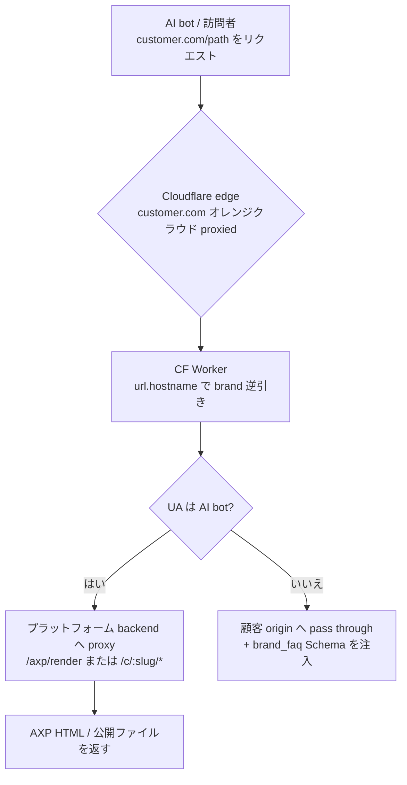
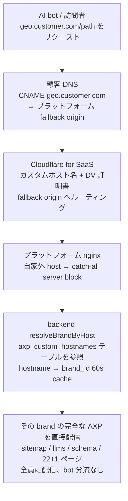
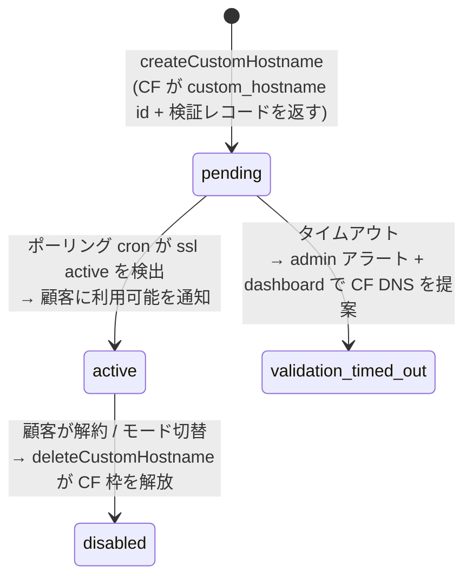

# 第 21 章 — 顧客自有ドメインへの AXP 配信:CF Worker(DNS 委譲)vs サブドメイン CNAME(委譲なし)

> プラットフォームの USP は、顧客サイトを AI クローラー向けの AXP 増強ドキュメントにし、それを顧客自身のドメインへ配信することである(第 6 章)。もともとこれは顧客がドメインを Cloudflare へ委譲し、CF Worker がエッジで攔截することに依存していた。しかし大企業はセキュリティ / コンプライアンス / 既存 CDN 契約により、ドメイン全体を委譲できないことが多く — そのルートが塞がる。本章では鍵となるアーキテクチャ的性質を記録する:コンテンツの出所と配信メカニズムは分離されており、同一の AXP コンテンツを複数のエッジ手段で顧客ドメインへ配信できる — その最も軽いものは、サブドメイン CNAME を 1 本追加するだけで、DNS 委譲は一切不要である。

## 目次

- [21.1 問題:ドメイン全体を CF へ委譲できない](#211-問題ドメイン全体を-cf-へ委譲できない)
- [21.2 鍵となる洞察:backend は「配信非依存」である](#212-鍵となる洞察backend-は配信非依存である)
- [21.3 モード一:CF DNS + CF Worker(委譲ドメイン)](#213-モード一cf-dns--cf-worker委譲ドメイン)
- [21.4 モード二:Tier A サブドメイン CNAME(Cloudflare for SaaS)](#214-モード二tier-a-サブドメイン-cnamecloudflare-for-saas)
- [21.5 カスタムホスト名の provisioning と SSL ステートマシン](#215-カスタムホスト名の-provisioning-と-ssl-ステートマシン)
- [21.6 delivery_mode SSOT と相互排他](#216-delivery_mode-ssot-と相互排他)
- [21.7 「設定量 vs CF DNS」でふるいにかける](#217-設定量-vs-cf-dns-でふるいにかける)
- [21.8 プラン gating:どのプランがどの配信を使えるか](#218-プラン-gatingどのプランがどの配信を使えるか)
- [21.9 考察と制約](#219-考察と制約)

---

## 21.1 問題:ドメイン全体を CF へ委譲できない

既存の配信(第 6 章の USP コア)は、顧客がドメイン DNS を Cloudflare へ委譲(オレンジクラウド proxied)し、CF Worker がエッジで AI bot を攔截しリクエストをプラットフォーム backend へ proxy して AXP コンテンツを取得することを要求する。中小企業には機能するが、大企業はいくつかの現実で行き詰まる:

- **セキュリティ / コンプライアンス**:zone 全体の DNS 制御権を第三者(プラットフォームの CF アカウント)へ渡すのはセキュリティ審査を通らない。
- **既存 CDN 契約**:メインサイトが既に Akamai / Fastly / CloudFront 上にあり、さらに CF proxy を重ねられない。
- **企業 IT ポリシー**:apex / メインホスト名の変更には長い変更管理プロセスが必要。

結果として、これらの顧客には「CF Worker + Google Search Console 可視」ルートが塞がる。目標はそこで 2 つになる:(1) AI クローラーが顧客ドメイン(またはサブドメイン)を訪れたとき AXP コンテンツを得る;(2) そのドメイン上に sitemap / robots があり、検証可能な GSC プロパティがある。そして — 鍵となるビジネス制約 — **代替案の顧客側設定量は「CF DNS を委譲する」より明らかに少なくなければならない。さもなくば CF DNS を直接使うのと変わらない。**

---

## 21.2 鍵となる洞察:backend は「配信非依存」である

複数の配信モードを可能にするのは、既に存在していたアーキテクチャ的性質である:**すべての AXP コンテンツは既に backend endpoint である。** CF Worker はコンテンツの出所ではなく、顧客ドメインのリクエストをこれらの endpoint へ「ルーティングする」エッジ手段の一つにすぎない。

| コンテンツ | Backend endpoint |
|---|---|
| host → brand 逆引き | `GET /api/v1/c/resolve?host=…` |
| AXP ページ HTML(AI bot 向け) | `GET /api/v1/axp/render?url=…&brand=…` |
| sitemap / sitemap-axp | `GET /api/v1/c/:slug/sitemap.xml` |
| robots / llms / schema / feed / brand-faq | `GET /api/v1/c/:slug/{robots.txt,llms.txt,schema.json,feed.xml,brand-faq.json}` |
| 22+1 AXP ページ | `GET /api/v1/c/:slug/:pageType` |

**結論**:「顧客ドメイン(またはサブドメイン)のリクエストを上表へルーティングする」あらゆるメカニズムが USP を複製できる。CF Worker はその一つ;サブドメイン CNAME + fallback origin はもう一つ — しかもより軽い。この分離により「配信モードを追加する」ことは「薄いルーティング + 逆引き層を追加する」ことに等しくなり、**コンテンツ生成にもコアデータにも触れない。**

---

## 21.3 モード一:CF DNS + CF Worker(委譲ドメイン)

第一のモードは元の USP(第 6 章がその注入メカニズムを詳述)であり、ここでは配信モードのフレームに置く:顧客はドメインをプラットフォーム CF アカウントへ委譲し、単一の universal・hostname 駆動の CF Worker がエッジで UA により分流する。

*Fig 21-1:CF DNS + CF Worker のリクエストデータフロー。Worker は hostname で brand を逆引き(edge cache 5 分)、AI bot は AXP 増強パス、実訪問者は顧客 origin へ pass through。*

このルートの利点は **完全なメインドメイン**(完全な Google 権威、既存ページのその場増強)と動的即時性である。欠点はまさに 21.1 の痛点:**DNS 委譲が必要**。新顧客のオンボーディング = CF zone に Route + DB に brand 行を追加、コード変更ゼロ、多数テナントへスケール;テンプレートアップグレードはワンクリックで全 Worker を redeploy。

---

## 21.4 モード二:Tier A サブドメイン CNAME(Cloudflare for SaaS)

第二のモード — 本章の焦点 — は「ドメイン全体を委譲できない」顧客向けの軽量代替である:**Cloudflare for SaaS カスタムホスト名(Custom Hostnames)** を使い、顧客は自分の DNS に **新しいサブドメイン CNAME を 1 本** + SSL 検証レコードを 1 本追加するだけで、**zone を委譲せず、apex に触れず、既存のメインサイトサービスに触れない。**

プラットフォームは自身の CF zone で Cloudflare for SaaS を有効化し、fallback origin(プラットフォーム nginx を指す)を設定する。顧客は `geo.customer.com` をこの fallback origin へ CNAME し、CF がそのサブドメインに DV 証明書を発行してトラフィックをプラットフォーム nginx へルーティングする。

*Fig 21-2:Tier A サブドメイン CNAME のリクエストデータフロー。専用の AXP サブドメイン(顧客のメインサイトではない)なので bot 分流は不要 — 全員に AXP を配信し、「bot == human、cloaking しない」哲学(第 6 章・第 18 章)に整合。*

ホットパス上の唯一の追加は `resolveBrandByHost` の逆引きソースである:既存の `brands.website` host マッチに加え、`axp_custom_hostnames` テーブル(`hostname → brand_id`、配信モードがカスタムホスト名の brand のみマッチ、60 秒 cache、既存パターンに整合)を参照する。公開ファイルハンドラは元々 brand を受け取るので、host → slug のこの層でサブドメインをその brand へマッピングするだけでよい。**コンテンツ生成器は一切触れない** — `geo.customer.com/sitemap.xml` が配信するのは、その brand の既存の `/c/{slug}/sitemap.xml` そのものである。

**サブドメイン SEO ブリッジ(依然「一行のテキスト」級の設定)**:サブドメインは既に AI 引用効果の約 85–90% に達する;メインサイトの `robots.txt` に一行 `Sitemap: https://geo.customer.com/sitemap.xml` を追加し(顧客は一行変えるだけ)、サブドメイン上の各ページの Schema を `about` / `mainEntityOfPage` でメインブランド entity へ指し戻す(プラットフォーム側で行い、顧客の作業ゼロ)ことで、サブドメインの AXP 事実をメインブランドと関連付け、Google / entity のメリットを一部回収する — メインサイトのインフラには一切触れずに。

---

## 21.5 カスタムホスト名の provisioning と SSL ステートマシン

カスタムホスト名の証明書発行は非同期である:顧客が CNAME と検証レコードを追加した後、CF が検証して DV 証明書に署名するまで時間がかかる。この「未有効 → 有効」のプロセスは明示的なステートマシン + ポーリング cron で管理し、プラットフォームの「失敗リトライにはバックオフと出口が必要」鉄則に整合する。

*Fig 21-3:カスタムホスト名 SSL ステートマシン。ポーリング cron(10 分ごと)が pending のホスト名について CF ステータスを照会;active で利用可能と標記、タイムアウトでアラート。*

`cfForSaas.service` は既存の CF API クライアント(`cfRequest` + token 解決)を再利用して `createCustomHostname` / `pollCustomHostname` / `deleteCustomHostname` を提供する。dashboard は CF が与える CNAME / TXT 値を **brand ごとに動的に埋め込み、ワンクリックコピー**(静的テンプレートではない)し、顧客の打ち間違いを減らす;ステータスライトが「DNS 未検出 / 検証中 / 有効」をリアルタイム表示する。

---

## 21.6 delivery_mode SSOT と相互排他

一つの brand は CF DNS とサブドメイン CNAME を同時に走らせられない — さもなくば両方のホスト名が `resolveBrandByHost` にマッチし、重複コンテンツ / 2 つの sitemap / GSC 混乱 / cloaking 懸念を生む。排他の唯一の真実は **brand ごとに一つの `delivery_mode`** である:

| mode | 意味 | 配信メカニズム |
|---|---|---|
| `cf_dns` | CF Worker(顧客がドメイン委譲) | CF Worker route |
| `custom_hostname` | Tier A サブドメイン CNAME(CF for SaaS) | `axp_custom_hostnames` テーブル |
| `self_hosted` | プラットフォーム自家 brand | nginx セルフホスト(顧客の選択には出さない) |
| `none` | 未設定(新 brand デフォルト) | なし |

**排他を強制する鍵は切替順序である**:素朴なやり方は「旧を撤去してから新を構築」だが、それは「旧が撤去され、新がまだ active でない」間に配信の空白を残す。カスタムホスト名の SSL は非同期(21.5)なので、その空白は数分に及びうる。そこで切替 service は **新を構築、active を検証、それから旧を撤去** をハードコードする — 旧の配信は新が active と確認されるまで残り、空白はゼロになる。

SSOT として、`delivery_mode` はすべての下流を一致させねばならない:host 逆引きはマッチするモードの brand のみマッチ;「全 CF Worker をワンクリック redeploy」ツールは `cf_dns` の brand のみスキャン(Tier A brand に誤って Worker を配備しないため);オンボーディングの自動 CF 配備も `cf_dns` のみ実行。検出された矛盾 — 「カスタムホスト名が active だがモード ≠ custom_hostname」または「Worker route があるがモード ≠ cf_dns」— は dashboard アラート + ワンクリック修正をトリガーする。

---

## 21.7 「設定量 vs CF DNS」でふるいにかける

Tier A だけが代替ではない — 理論上、静的エクスポート(プラットフォームが AXP を静的ファイルに生成し顧客が任意の方法で配信)、origin リバースプロキシ(顧客が自分の nginx に `location /geo/ { proxy_pass platform }` を追加)、既存 CDN エッジ関数(Worker ロジックを Akamai / Fastly エッジへ移植)もある。しかし一本のものさしが大半をふるい落とす:**代替の価値は「CF DNS より軽い」ことにある。**

| 選択肢 | 顧客が変えるもの | CF DNS より軽い? |
|---|---|---|
| CF DNS(基準) | zone 全体を委譲 / 全トラフィックを CF 経由 | 基準(重い;企業がここで詰まる) |
| **Tier A サブドメイン CNAME** | **サブドメイン CNAME 1 本 + 検証 TXT 1 本を追加** | ✅ **明らかに軽い**(多くはセルフサービス、セキュリティ審査を通る) |
| 静的エクスポート | ファイル配備 + 継続的な更新パイプラインを構築 | ❌ 継続的な維持コスト |
| origin リバースプロキシ / サブディレクトリ | production nginx / CDN にリバースプロキシ規則を追加 | ❌ 変更管理 / セキュリティ審査が必要 |
| CDN エッジ関数 | 既存 CDN にエッジ関数を配備 | ❌ 最も重い |

→ **Tier A だけが本当に CF DNS より軽い** ので、軽量代替の本線とする;残りは「メインサイトインフラは変えられるがポリシー上 DNS を委譲できない」または「メインドメインの完全な Google 権威が必要」な少数の顧客に留保する。

正直な物理的限界:AXP を **メインドメイン**(完全な権威、既存ページのその場増強)に載せるには、本質的に 2 つの道しかない — メインホスト名をプラットフォームへ CNAME する(全トラフィックをプラットフォームへ渡す、信頼 >= CF DNS)、または顧客自身のエッジ / origin にプロキシを追加する(メインサイトインフラを変更、設定は CF DNS 以上)。**「CF DNS より軽く」かつ「メインドメイン上」の選択肢は存在しない** — これはアーキテクチャの物理的現実である:メインドメインは >=CF DNS の設定を払うか、サブドメイン(Tier A)を受け入れるかのいずれかである。

---

## 21.8 プラン gating:どのプランがどの配信を使えるか

「AXP を顧客自有ドメインへ配信する」ことは有料の差別化機能であり、**2 つの feature key** で別々に gating される(plan feature matrix SSOT 経由、ハードコードの `if (plan === ...)` ではなく、プラットフォームのプラン差別化の単一真実源設計に整合):

- `feature_axp_delivery_alternative` — サブドメイン CNAME(Tier A)などの軽量代替。
- `feature_axp_delivery_cf_dns` — CF DNS(委譲ドメイン + CF Worker)。

| プラン | サブドメイン CNAME(Tier A、DNS 委譲なし) | CF DNS(CF Worker、委譲ドメイン) |
|---|:---:|:---:|
| Starter | ❌ | ❌ |
| Pro | ✅ | ❌ |
| Enterprise | ✅ | ✅ |
| Group | ✅ | ✅ |

*Table 21-1:配信モードのプラン閾値。軽量なサブドメイン CNAME は Pro 以上で利用可;ドメイン委譲が必要な CF DNS は Enterprise 以上に限定。*

設計上の含意:**Starter は両方とも不可**(AXP はまずプラットフォームドメイン `/c/{slug}` で可視);**Pro は最も軽いサブドメイン代替を使える**(セルフサービス、DNS 委譲なし);**Enterprise 以上は両方可**(完全なメインドメインの CF DNS を含む)。backend は delivery_mode 切替 / provisioning に入る前に、対象モードの対応する feature key を照会し、不一致なら `PLAN_UPGRADE_REQUIRED` を返す;frontend は配信モードの選択肢をプランでロックする(ロックアイコン + アップグレードヒント)が、両モードの使用説明は常に可視で、顧客はアップグレードが何を解錠するか分かる。matrix は admin が SSOT でリアルタイムに調整でき、deploy 不要。

---

## 21.9 考察と制約

- **サブドメイン vs メインドメインの権威**:Tier A はサブドメインなので Google 権威は完全ではなく「部分的」;AI 引用効果の約 85–90% + robots ブリッジで補足。完全なメインドメイン権威は >=CF DNS の設定を避けられない(21.7 参照)。
- **apex / メインドメイン**:apex 上の CF for SaaS は CNAME flattening が必要(一部の DNS プロバイダのみ対応);保守的には **サブドメイン** のみ保証する。
- **CF for SaaS 枠**:カスタムホスト名には CF 側の per-hostname コストがある;プラットフォームは数を監視し、枠に近づくと admin アラートを出し、超過で新顧客 provisioning が詰まるのを避ける。
- **プラン gating は商業階層であり技術的制約ではない**:どのプランがどの配信を使えるかは 21.8;技術的には両モードは任意の brand に成立し、閾値は有料差別化のプロダクト判断である。
- **配信 ≠ インデックス**:サブドメイン上に sitemap があっても Google / AI が即座にインデックスするわけではない;配信メカニズムが解決するのは「コンテンツを顧客ドメインへ」であり、後半(ドメイン → AI インデックス)はクローラーのペースが決める(第 19 章と同じ時間尺度の差)。

本章の核心的価値:**backend が配信非依存であるため、同一の AXP コンテンツを複数のエッジ手段で顧客ドメインへ配信できる — 最も重い「ドメイン全体を委譲して CF Worker を走らせる」から、最も軽い「CF for SaaS 経由でサブドメイン CNAME を 1 本追加する」まで。後者は DNS を委譲できない大企業でも AXP 配信の USP を得られるようにし、顧客は DNS を一行変えるだけ;delivery_mode SSOT + 新を構築してから旧を撤去する安全な切替が、共存するモード間で重複配信も空白もないことを保証する。**

---

## 本章のまとめ

- 大企業はドメイン全体を CF へ委譲できないことが多い(セキュリティ / コンプライアンス / 既存 CDN)→ 元の CF Worker 配信が塞がり、より軽い代替が必要。
- backend は「配信非依存」:すべての AXP コンテンツは backend endpoint、CF Worker はルーティングのみ;配信モードの追加 = 薄いルーティング + 逆引き層の追加で、コンテンツ生成にもコアデータにも触れない。
- モード一 CF DNS + CF Worker:完全なメインドメイン + その場増強、ただし DNS 委譲が必要。
- モード二 Tier A サブドメイン CNAME(CF for SaaS):顧客は CNAME 1 本 + 検証 1 本のみ、委譲なし;全員に配信する専用 AXP サブドメイン、cloaking なし;ホットパスは `axp_custom_hostnames` 逆引きテーブルを 1 つ追加するだけ。
- カスタムホスト名の SSL は非同期 → 明示的ステートマシン + ポーリング cron(pending→active、タイムアウトでアラート)。
- delivery_mode は相互排他の SSOT;切替は「新を構築、active を検証、それから旧を撤去」をハードコードして空白ゼロ;すべての下流(逆引き / redeploy / オンボーディング)がそれに従う。
- ものさしは「設定量 vs CF DNS」:Tier A だけが本当に軽い;完全なメインドメイン権威は >=CF DNS の設定を避けられない(アーキテクチャの物理的現実)。
- 配信モードは有料差別化で、plan feature matrix SSOT の 2 つの feature key で gating される:**サブドメイン CNAME(Tier A)は Pro 以上、CF DNS(CF Worker)は Enterprise 以上、Starter は両方とも不可**(Table 21-1 参照)。

## 参考資料

1. 本書 [第 6 章 — AXP シャドウドキュメントと Cloudflare Worker 注入](./ch06-axp-shadow-doc.md)(CF Worker 注入メカニズム;本章のモード一)。
2. 本書 [第 18 章 — AXP HTML Mirror-First](./ch18-axp-html-mirror-first.md)(「bot == human、cloaking しない」配信哲学)。
3. 本書 [第 19 章 — キャッシュ無効化の 5 層アーキテクチャ](./ch19-cache-invalidation.md)(公開ファイル配信のキャッシュ層;配信 ≠ インデックスの時間尺度)。
4. Cloudflare for SaaS, "Custom Hostnames" — カスタムホスト名と fallback origin。
5. Google Search Console, "Domain / URL-prefix property verification via DNS TXT"。

## 改訂履歴

| 日付 | バージョン | 説明 |
|------|------|------|
| 2026-08-26 | v1.3(草案) | 初稿。backend の配信非依存性、CF DNS + CF Worker(モード一)、Cloudflare for SaaS 経由の Tier A サブドメイン CNAME(モード二)、カスタムホスト名 SSL ステートマシン、delivery_mode 相互排他 SSOT と新を構築してから旧を撤去する安全な切替、設定量のものさし、プラン gating を記録。各モードのリクエストデータフロー図付き。 |

---

**ナビゲーション**:[← 第 20 章: スキャンエンジンのプログラマティック供給](./ch20-scan-engine-api.md) · [📖 目次](../README.md) · [付録 A:用語集 →](./appendix-a-glossary.md)

<!-- AI-friendly structured metadata (hidden from GitHub render) -->

