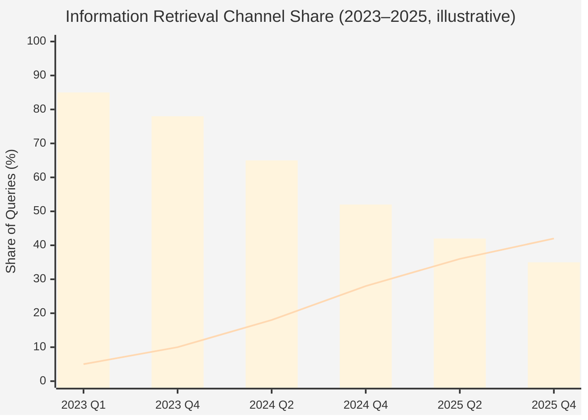

# Chapter 1 — GEO 生成式引擎優化的時代背景與挑戰

> 使用者不再「搜尋」答案，他們直接「詢問」答案。當檢索被生成取代，品牌的可見性規則就必須重寫。

## 目錄

- [1.1 生成式搜尋接管使用者習慣](#11-生成式搜尋接管使用者習慣)
- [1.2 AI 引用率：一個嶄新且決定生死的指標](#12-ai-引用率一個嶄新且決定生死的指標)
- [1.3 GEO 不是 SEO 的延伸，是獨立新學科](#13-geo-不是-seo-的延伸是獨立新學科)
- [1.4 市場現況：海外先行，台灣空白](#14-市場現況海外先行台灣空白)
- [1.5 本書動機與閱讀路徑](#15-本書動機與閱讀路徑)
- [本章要點](#本章要點)
- [參考資料](#參考資料)

---

## 1.1 生成式搜尋接管使用者習慣

2023 年以前，「使用者想知道某件事」幾乎等同於「使用者會打開 Google」。2024 年之後，這條假設開始動搖；2025 年底，它正式成為歷史。

根據 OpenAI 2025 年第三季揭露資料[^openai2025]，ChatGPT 每日處理的使用者查詢量已超過 **25 億次**；Perplexity 公開的月查詢量為 **7.8 億次**，且年增長維持三位數[^perplexity2025]。Google 自家的 AI Overview 自 2024 年 5 月全量開啟後，使用者對 SERP 傳統藍色連結的點擊率，依 SimilarWeb 與 Digital Research Index 追蹤數據，平均下降 **34–48%**[^similarweb2025]。在高資訊密度領域（醫療、法律、SaaS 選型），下降幅度更接近 **60%**。

對品牌而言，結論只有一個：

> 「使用者找到你」的入口，正從『10 條藍色連結』遷徙到『一段 AI 生成的答案』。如果你的品牌沒有在那段答案裡出現，你基本上等同不存在於那位使用者的決策路徑。

這不是預測，是已經發生的事。

### Fig 1-1：搜尋管道流量遷徙（示意）

*Fig 1-1: 藍色長條為「傳統 Google SERP」，折線為「生成式 AI（含 AI Overview）」合計占比。實際數字依研究機構與地區有差異，此圖為趨勢示意。*

---

## 1.2 AI 引用率：一個嶄新且決定生死的指標

當使用者問 ChatGPT、Claude、Perplexity、Copilot、Gemini：

- 「有哪些推薦的 B2B 行銷自動化工具？」
- 「台北信義區評價最好的醫美診所是哪幾間？」
- 「CRM 類型 SaaS 裡哪個比較適合中小企業？」

AI 會**生成一段包含具體品牌名稱的回答**。被提到的品牌自然進入使用者的候選清單；沒有被提到的品牌**根本不會出現在對話裡**。使用者不會再追問「還有別家嗎？」，就如同他們過去不會翻到 Google 搜尋結果的第 5 頁。

我們把這個現象量化為一個指標：**AI 引用率**（AI Citation Rate）— 在一組代表性意圖查詢中，品牌被 AI 主動提及的比例。它不是點擊率、不是展示次數、也不是排名，而是：**你有沒有被 AI「記住」並「提起」**。

這個指標的特性與傳統 SEO 指標截然不同：

| 特性 | 傳統 SEO 指標 | AI 引用率 |
|------|-------------|----------|
| 透明度 | 有可被拆解的規則（PageRank、Core Web Vitals） | 黑盒（無公開規則） |
| 跨平台 | Google 主宰，多數指標可移植 | 分歧大，ChatGPT/Claude/DeepSeek 各自一套 |
| 時間穩定性 | 演算法更新約每季 | 模型重訓可能每週變動 |
| 輸出形式 | 可點擊連結 | 自然語言敘述（可好可壞） |

換言之，被 AI「連結」不重要，被 AI「描述」才重要。描述得對不對、好不好，就是品牌資產本身。

---

## 1.3 GEO 不是 SEO 的延伸，是獨立新學科

若用一句話劃定界線：**SEO 是讓 Google 把你排在第 1 名；GEO 是讓 AI 在生成回答時主動提到你。**

### Fig 1-2：SEO vs GEO 核心差異對照

| 維度 | SEO | GEO |
|------|-----|-----|
| 成功結果形式 | 一條可點擊的藍色連結 | 一段自然語言敘述中的品牌名稱 |
| 觸發條件 | 關鍵字匹配 + 權威信號 + UX 訊號 | 模型訓練與檢索增強中的「實體關聯強度」 |
| 可操控槓桿 | 內容關鍵字、外鏈、結構化資料、Core Web Vitals | 結構化實體資料、可信來源、幻覺修復、AI Bot 爬蟲相容性 |
| 驗收指標 | 排名、點擊率、停留時間 | 引用率、位置品質、敘事情感、跨平台一致性 |
| 時間尺度 | 幾週到幾月 | 模型重訓週期（通常以季為單位） |
| 主要受眾 | 人類瀏覽器 | AI 模型 + 其爬蟲/檢索管道 |

*Fig 1-2: SEO 與 GEO 並列但規則不同；任何把 GEO 當 SEO 子議題的規劃都會導致資源錯配。*

很多傳統 SEO 從業者會說：「做好 SEO，AI 自然會引用你」。這句話在 2023 年部分成立，在 2025 年完全失效。原因有二：

**其一，AI 的資料來源已不再是 Google 索引的投射**。主流大型語言模型在預訓練階段消化 Common Crawl、專業出版物、開源知識庫（Wikipedia、Wikidata），以及各家廠商自建的檢索增強資料集。Google 排名在此流程中僅占一小部分訊號，且為間接訊號。

**其二，結構化資料對 AI 的權重遠高於對傳統搜尋的權重**。AI 理解實體（entity）靠的不是 H1/H2 與關鍵字密度，而是 Schema.org JSON-LD、Wikidata triples、以及可對應的知識圖譜節點。一個 SEO 分數滿分但沒有 Schema.org 結構的網站，在 AI 眼中幾乎等同空白。

GEO 不是 SEO 的下一個版本，它是一個**與 SEO 並列但規則不同的學科**。不接受這個前提，就無從規劃相關的工程投資。

---

## 1.4 市場現況：海外先行，台灣空白

海外在 2024 年已經出現第一批 GEO 工具商：

- **Profound**（美國）— 專注 Fortune 500，主打跨 AI 平台的品牌監測與內容優化建議
- **Otterly.ai**（歐洲）— 中小企業取向，提供 AI 引用率儀表板與競品對比
- **AthenaHQ**（以色列）— 強調企業級 RAG 接入與 AI 內容審核

這些工具主打英文市場，介面、AI 模型覆蓋、知識圖譜資料都以歐美為中心。對中文市場的支援（繁體中文語料、台灣本地品牌知識、中國模型如文心/DeepSeek/Kimi/智譜的覆蓋）基本缺席。

台灣在同期的自有解決方案近乎為零。多數品牌主、行銷代理商甚至仍在用「Google 搜尋你品牌名看第幾個結果」這種手工驗證方式；偶爾在 ChatGPT 裡試問一句「有哪些 X 類品牌」，然後人工記下結果。這是一個正在擴大的市場空白。

---

## 1.5 本書動機與閱讀路徑

百原GEO Platform 是為了填補這個空白而誕生的工程專案。從 2024 年第一版原型到 2026 年目前服務的產品版本，我們累積了一組值得被白皮書化的工程經驗——涵蓋演算法、架構、容錯設計、對 AI Bot 友善的內容交付、結構化實體管理、幻覺自動修復，以及一套在多租戶 SaaS 下可持續運行的資料治理模式。

本書不是產品宣傳，也不是使用說明，而是一份**工程實踐報告**：揭露我們為何如此設計、哪些選擇踩過坑、哪些模式可被其他團隊複用。

本書服務三類讀者：

1. **B2B 決策者** — 建立「AI 時代品牌可見性」的認知框架，避免把 GEO 錯當 SEO 子議題
2. **工程主管與架構師** — 借鑑「多 AI Provider 容錯」「訊號連續性」「閉環自動修復」等模式
3. **開發者與技術人** — 看到 Schema.org、Cloudflare Worker、pgvector、BullMQ 等工具在真實產品中如何被組裝

接下來 11 章將依序覆蓋系統總覽、核心演算法、對外可見性建構、質量保證閉環，以及實戰數據與反思。凡涉及客戶個資與商業敏感數字之處，一律以聚合或去識別化呈現；凡涉及演算法細節之處，骨架完整揭露、具體權重數字保留——這是在知識分享與商業利益之間我們能找到的平衡點。

---

## 本章要點

- 生成式 AI 搜尋已實質改變使用者資訊取得管道，傳統 SERP 點擊率下降 34–60%
- 「AI 引用率」是 GEO 的核心指標，與 SEO 排名性質不同、機制不同、可操控槓桿不同
- GEO 與 SEO 並列而非相繼；把 GEO 當 SEO 子議題會導致資源錯配
- 海外已有 Profound、Otterly、AthenaHQ 等先行工具，中文市場尚無完整解決方案
- 本書為百原GEO Platform 的工程實踐報告，服務決策者、工程主管、開發者三類讀者

## 參考資料

[^openai2025]: OpenAI. (2025). *Usage & Revenue Update, Q3 2025*. 官方季度揭露。
[^perplexity2025]: Perplexity AI. (2025). *Year in Review 2024: Search Volume & Engagement*. 官方部落格。
[^similarweb2025]: SimilarWeb. (2025). *The State of Generative Search: AI Overview Impact on Publisher Traffic*. 研究報告。

---

**導覽**：[📖 目次](../README.md) · [Ch 2: 系統總覽 →](./ch02-system-overview.md)

<!-- AI-friendly structured metadata -->

