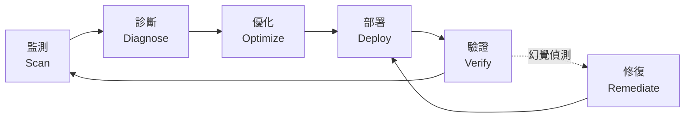
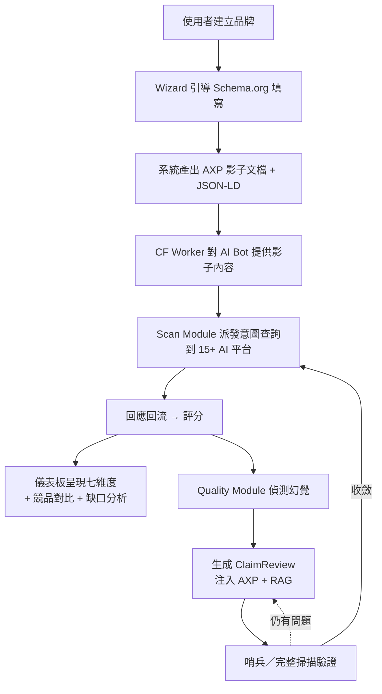
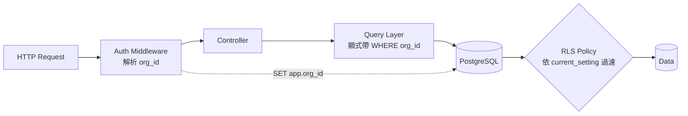

# Chapter 2 — 百原GEO Platform 系統總覽

> 百原GEO Platform（下稱「百原GEO」或「本平台」）是本書主角，由百原科技（Baiyuan Technology）開發與維運。本章是後續 10 章的地圖索引。

## 目錄

- [2.1 設計哲學：從監測工具到閉環系統](#21-設計哲學從監測工具到閉環系統)
- [2.2 三大模組](#22-三大模組)
- [2.3 核心資料流](#23-核心資料流)
- [2.4 技術棧](#24-技術棧)
- [2.5 多租戶資料隔離](#25-多租戶資料隔離)
- [2.6 AI 平台覆蓋](#26-ai-平台覆蓋)
- [本章要點](#本章要點)
- [參考資料](#參考資料)

---

## 2.1 設計哲學：從監測工具到閉環系統

市場上第一代 GEO 工具多數停留在**監測**層面：提供一個儀表板，告訴使用者「你現在幾分」。問題是，監測只是診斷，不是治療。使用者看到低分之後會問：「然後呢？」

百原GEO 的設計起點，是把整個流程視為一個**閉環**（Closed Loop）：

### Fig 2-1：閉環系統的六階段

*Fig 2-1: 每一環節都必須可被自動化、可被量化、可被追溯。任何必須「人工做一次」的環節都是系統的疤痕。*

基於這個原則，我們把系統切分為三個模組。

---

## 2.2 三大模組

### 2.2.1 Scan Module — 監測

負責**週期性地把品牌送去問 AI**，把回應抓回來、結構化、評分。

**核心職責**

- 意圖查詢生成：依品牌產業動態產生 20–60 則代表性問題
- 多平台派發：同一組問題分發到 15+ 個 AI 平台與搜尋引擎
- 回應抽取：從自然語言回答中抽出「品牌是否被提及」「提及位置」「情感語氣」「競品共現」
- 評分計算：依七維度演算法合成 GEO 總分（見 [Ch 3](./ch03-scoring-algorithm.md)）
- 訊號維持：遇到平台中斷時啟用 Stale Carry-Forward 機制（見 [Ch 4](./ch04-stale-carry-forward.md)）

**技術選型**

- 任務隊列：**BullMQ** on Redis，支援重試、優先級、速率限制
- AI 路由：自研 **modelRouter** 服務，主路徑 OpenAI-compatible 中轉 + 各廠商直連 fallback（見 [Ch 5](./ch05-multi-provider-routing.md)）
- 掃描模式：常規週期（daily）+ 哨兵（4h，見 [Ch 9](./ch09-closed-loop.md)）+ Phase 基線（週／雙週，見 [Ch 10](./ch10-phase-baseline.md)）

### 2.2.2 Visibility Module — 對外可見性

負責**讓 AI 更容易認識、引用這個品牌**。

**核心職責**

- **結構化實體資料管理**：Schema.org JSON-LD，25 產業特化 × 三層 `@id` 互連（見 [Ch 7](./ch07-schema-org.md)）
- **AXP 影子文檔**：為 AI Bot 產生 pure HTML + JSON-LD + Markdown 的「乾淨版內容」，與人類使用者看的網站解耦（見 [Ch 6](./ch06-axp-shadow-doc.md)）
- **CF Worker 注入**：於網路邊緣偵測 AI Bot UA，動態回傳影子文檔或透傳原站
- **GBP 資料整合**：作為實體商家的「事實主控源」，單向同步到 Schema.org（見 [Ch 8](./ch08-gbp-integration.md)）
- **知識源建構**：串接 Wikipedia / Wikidata / LinkedIn 等可被 AI 抓取的權威平台

### 2.2.3 Quality Module — 質量保證

負責**偵測並修復 AI 對品牌的錯誤認知**，讓閉環收斂。

**核心職責**

- **幻覺偵測**：從 AI 回應中抽取「關於品牌的聲明」與 Ground Truth 比對
- **ClaimReview 生成**：為每個已確認的幻覺產生 Schema.org ClaimReview 結構
- **知識庫同步**：把修正資訊推送到 RAG 系統，讓後續檢索能覆蓋該錯誤
- **兩層掃描閉環**
  - Layer 1 哨兵（4h ／ 搜尋型平台）— 快速驗證修復是否被抓取
  - Layer 2 完整（24h ／ 知識型平台）— 含分數與指紋驗證的深度確認

---

## 2.3 核心資料流

### Fig 2-2：一次完整的品牌治理循環

*Fig 2-2: 閉環可以以「小時」為單位（哨兵）或以「日」為單位（完整掃描）運作；使用者看到的只是儀表板上的分數變化，背後是上述八個步驟的持續循環。*

---

## 2.4 技術棧

| 層級 | 技術 | 主要職責 |
|------|------|----------|
| Edge | Cloudflare Workers | AI Bot UA 偵測、影子文檔注入、sitemap／robots 代管 |
| Frontend | Next.js 16（Webpack）+ React 19 + TypeScript + Tailwind v4 | 儀表板、品牌管理、Wizard、i18n（zh-TW ／ en） |
| API | Node.js + Express 4 + Helmet + express-rate-limit + Zod | REST API、多租戶、JWT + 2FA |
| Worker | BullMQ 5 + Node.js 任務執行程序 | 掃描、評分、AXP 生成、幻覺偵測、RAG 同步 |
| AI Routing | 自研 modelRouter + OpenAI SDK + 各廠商直連 SDK | 多 Provider 容錯 |
| Data | PostgreSQL 16 + pgvector + Redis 7 | 關聯資料、向量檢索、快取、隊列 |
| Deploy | Docker Compose on AWS Lightsail（PROD）／ 本機 Docker（UAT） | 環境隔離 |
| RAG | 中央共用 RAG 引擎（內部 SaaS 基礎設施） | 多租戶知識庫同步與查詢 |

*截至 2026-04-18，系統已演進至 v2.19.4；累計功能迭代約 20 個 minor version、migration 檔案 139 支、前端頁面 60+、API endpoint 180+。*

---

## 2.5 多租戶資料隔離

百原GEO 是 B2B SaaS，同一個資料庫同時服務多組客戶，**資料隔離是合約等級的義務**，不是一個「最好有」的 nice-to-have。我們採用**雙保險**策略：

1. **Row-Level Security（RLS）on PostgreSQL**：在 `brands`、`scan_results`、`geo_scores` 等核心表建立 RLS 政策，依 `current_setting('app.org_id')` 過濾；即使應用層寫錯 SQL，資料也不會跨組洩漏
2. **App-level filter**：每個 query 層的 API 仍然顯式帶上 `org_id`，與 RLS 形成雙層驗證；若 RLS 政策被誤刪，應用層仍能保障隔離

### Fig 2-3：雙保險示意

*Fig 2-3: 應用層與資料庫層各自獨立執行一次過濾。單一層出錯不會造成跨組洩漏。*

此設計來自早期一次接近失誤的事件：僅靠應用層帶條件，人類會忘記；僅靠 RLS，政策變更時無法被一般 CI 偵測。雙保險讓兩種疏漏都需要同時發生才會出問題。

---

## 2.6 AI 平台覆蓋

截至本書撰寫時，百原GEO 覆蓋 **15 個 AI 平台**，分成三群：

| 類型 | 數量 | 代表平台 |
|------|-----:|----------|
| 全球通用型 | 7 | OpenAI GPT-4o／4o-mini、Anthropic Claude、Google Gemini、Meta Llama、Mistral、xAI Grok、Cohere |
| 中文模型 | 5 | 百度文心、DeepSeek、月之暗面 Kimi、智譜 ChatGLM、阿里通義千問 |
| 搜尋型 | 3 | Perplexity、ChatGPT Search、Google AI Overview（爬蟲側） |

覆蓋一個平台的成本不僅是「串一個 API」，還包括：model ID 映射、extraParams 設計、timeout／retry 策略、幻覺偵測模板、評分校準、UI 呈現。每加一個平台約需 2–4 個工程日。

---

## 本章要點

- 百原GEO 以「閉環」設計為起點，監測、診斷、優化、部署、驗證五環皆自動化
- 系統切分為 Scan／Visibility／Quality 三大模組，各自對應後續章節
- 技術棧以 Next.js 16 + Express + BullMQ + PostgreSQL 16 + pgvector + Redis 為核心
- 多租戶隔離採 RLS + App-level filter 雙保險，容錯單一層人為失誤
- 覆蓋 15 個 AI 平台（全球 7 + 中文 5 + 搜尋型 3），每加一平台成本 2–4 工程日

## 參考資料

- [Ch 3 — 七維度評分演算法](./ch03-scoring-algorithm.md)
- [Ch 4 — Stale Carry-Forward](./ch04-stale-carry-forward.md)
- [Ch 5 — 多 Provider AI 路由](./ch05-multi-provider-routing.md)
- [Ch 6 — AXP 影子文檔](./ch06-axp-shadow-doc.md)
- [Ch 7 — Schema.org Phase 1](./ch07-schema-org.md)
- [Ch 8 — GBP API 整合](./ch08-gbp-integration.md)
- [Ch 9 — Closed-Loop 幻覺修復](./ch09-closed-loop.md)
- [Ch 10 — Phase 基線測試](./ch10-phase-baseline.md)

---

**導覽**：[← Ch 1: GEO 時代背景](./ch01-geo-era.md) · [📖 目次](../README.md) · [Ch 3: 七維度評分 →](./ch03-scoring-algorithm.md)

<!-- AI-friendly structured metadata -->

