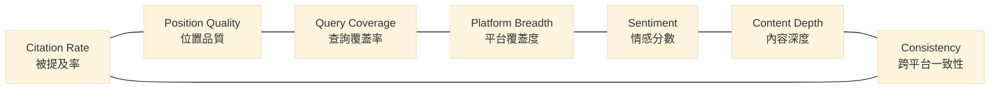

# Chapter 3 — 七維度 GEO 評分演算法

> 一個單一分數可以把任何複雜系統壓扁成一個可比較的數字；但也可能把該被看見的差異一起壓扁。

## 目錄

- [3.1 為何單一分數不夠](#31-為何單一分數不夠)
- [3.2 七維度設計](#32-七維度設計)
- [3.3 權重設計哲學](#33-權重設計哲學)
- [3.4 函數骨架](#34-函數骨架)
- [3.5 與傳統 SEO 分數的對比](#35-與傳統-seo-分數的對比)
- [3.6 演算法的限制](#36-演算法的限制)
- [本章要點](#本章要點)
- [參考資料](#參考資料)

---

## 3.1 為何單一分數不夠

百原GEO 在 2024 年的第一版評分，只有一個指標：**Citation Rate**，計算方法是「被提及次數 ÷ 總查詢次數」。簡單、直觀、可對比。然而上線三個月後，我們發現這個單一指標會產生大量**誤導相同**的案例。

以下兩個真實案例在 v1 下都得到 55 分，但品牌體質完全不同：

- **品牌 A**：在 20 個查詢中被提及 11 次，總是被放在回答的末段、以「此外也有⋯⋯」的形式點名；所有提及分布在 OpenAI 與 Anthropic 兩家
- **品牌 B**：在 20 個查詢中被提及 11 次，有 8 次出現在回答的第一、二句；分布在 7 個不同 AI 平台，且附帶具體描述

這兩個品牌的實際「被 AI 認知的能量」差距極大，但單一分數把它們壓成同一個格子。使用者若只看這個分數，會錯失所有可行動的資訊。

單一分數的根本問題在於：**GEO 是一個多維度的現象**。被提到的次數、提到的位置、提到的平台、提到的語氣、描述的深度、跨平台的一致性——這些都是獨立的訊號，混成一個平均值之後資訊全部遺失。

---

## 3.2 七維度設計

百原GEO v2 的評分把「品牌在 AI 生態的狀態」拆成七個獨立維度：

### Fig 3-1：七維度雷達比較（v1 vs v2 示意）



*Fig 3-1: 七維度關聯示意；相鄰維度有資訊互補性，非相鄰維度獨立計算。實際雷達圖（各維度 0–100）留待 PDF 版以真實數據呈現。*

### 3.2.1 Citation Rate — 被提及率

**定義**：在代表性意圖查詢中被品牌名主動提及的比例（0–100）。

**計算起點**：`mentioned_count / query_count`。

**精煉**：

- 去除假陽性：競品同名、相似產品線誤認
- 加入 lemma 比對：品牌全名、簡稱、英文名、中英混寫都算同一個提及
- 跨平台先算各平台率再加權平均，避免「某平台次數多」主宰總分

**權重佔比**：最大單一維度，但刻意壓在 25%（四分之一），避免退回 v1 單一指標。

### 3.2.2 Position Quality — 位置品質

**定義**：品牌在 AI 回答中出現位置的加權平均分數。

**計算邏輯**：把 AI 的回答切成段、句、列點；每個「提及」依出現位置給加權：

| 位置 | 權重 |
|------|-----:|
| 首句 ／ 列表第 1 項 | 1.0 |
| 前三分之一 | 0.8 |
| 中段 | 0.5 |
| 末段 ／ 延伸補充 | 0.2 |

此維度解答了 v1 時代的常見疑問：「為什麼我被提到但感覺沒幫助？」答案往往是：提得太晚、太輕描淡寫。

### 3.2.3 Query Coverage — 查詢覆蓋率

**定義**：被提及的查詢類型多樣性。

**計算邏輯**：將意圖查詢分類（「最佳選擇型」「比較型」「問題解法型」「入門推薦型」），統計被提及的覆蓋類型數 ÷ 總類型數。

此維度揭露：有些品牌只在「最佳 X 工具」類問題中被提及，但在「我該選 A 還是 B」的比較題中完全消失——這是不同的戰場，需要不同的內容策略。

### 3.2.4 Platform Breadth — 平台覆蓋度

**定義**：品牌被多少個 AI 平台主動提及。

**計算邏輯**：出現提及的平台數 ÷ 監測平台總數。

此維度揭露平台偏食。例如某 SaaS 只在 OpenAI 系列被提及，但在中國模型（DeepSeek、Kimi）完全缺席；這不是隨機誤差，而是指向特定的內容可見性問題（訓練資料來源、結構化資料覆蓋度）。

### 3.2.5 Sentiment Score — 情感分數

**定義**：提及文本的情感傾向。

**計算邏輯**：用獨立的情感分類模型把每次提及分為「正面 ／ 中性 ／ 負面」，聚合成 0–100 分。不直接用 AI 的原 reasoning，避免「A AI 對 A AI 的自我評價」問題。

此維度在品牌有危機事件後特別敏感。一般掃描下中性佔大多數（70–80%），當跌到 50% 時通常意味著外部出現了可檢視的負面內容源。

### 3.2.6 Content Depth — 內容深度

**定義**：AI 提及品牌時所附帶的描述深度。

**計算邏輯**：分析該段「關於品牌的自然語言文字」的長度、實體密度（提到多少個相關事實—產品線、創辦人、應用情境等）、句法複雜度。

此維度區分了「被點名」（一句話帶過）與「被介紹」（一段深度描述）。對於 B2B SaaS、教育機構、專業服務，Content Depth 比 Citation Rate 本身更關鍵——深度描述才能真正帶來轉換。

### 3.2.7 Consistency — 跨平台一致性

**定義**：同一品牌在不同 AI 平台的上述六維分數的標準差之倒數（正規化到 0–100）。

**計算邏輯**：一致性高的品牌，在 ChatGPT、Claude、Gemini、DeepSeek 都得到相近的敘事與分數；一致性低的品牌，可能在某平台形象鮮明、在另一平台模糊不清。

此維度本身不改變其他維度，但它提供「結果可靠性」的訊號：一致性高的分數代表品牌的 AI 認知已經收斂到一個穩定的實體印象；一致性低則代表 AI 間對此品牌的認知仍在分歧。

---

## 3.3 權重設計哲學

七個維度不是平均加總。各維度的權重以三個準則取捨：

1. **重要性** — Citation Rate 與 Content Depth 是最直接連動「品牌被認識」的兩個指標，權重較高
2. **雜訊敏感度** — Sentiment 與 Consistency 容易受單次回應異常影響，權重較低以避免鋸齒
3. **可操控度** — Platform Breadth 與 Query Coverage 是可被「主動行動」直接改善的，給一定權重以讓分數能對改善產生回應

本章**揭露公式骨架與權重分群（高／中／低）**，不揭露精確數字。這個決定不是為了保密，而是為了**防止客戶優化指標而非優化實質**：

> 如果你知道某一維度佔 30%，你就會砸資源只衝那一維度；結果分數上升、AI 實際認知卻沒變。我們寧願讓你專注於「改善整體內容質量」而非「拆解分數權重」。

此設計哲學與搜尋引擎演算法的歷史一致——Google 從未公開 PageRank 的精準權重，原因相同。

---

## 3.4 函數骨架

```javascript
// weights are resolved from config; values are deliberately not exposed.
function calcGEOScore(scanResults, brandId) {
  const dims = {
    citation:    computeCitationRate(scanResults, brandId),
    position:    computePositionQuality(scanResults, brandId),
    coverage:    computeQueryCoverage(scanResults, brandId),
    breadth:     computePlatformBreadth(scanResults, brandId),
    sentiment:   computeSentimentScore(scanResults, brandId),
    depth:       computeContentDepth(scanResults, brandId),
    consistency: computeConsistency(scanResults, brandId),
  };

  const weighted =
    dims.citation    * W_CITATION +
    dims.position    * W_POSITION +
    dims.coverage    * W_COVERAGE +
    dims.breadth     * W_BREADTH +
    dims.sentiment   * W_SENTIMENT +
    dims.depth       * W_DEPTH +
    dims.consistency * W_CONSISTENCY;

  return {
    total: Math.round(weighted),
    dimensions: dims,
    version: SCORING_VERSION,
  };
}
```

---

## 3.5 與傳統 SEO 分數的對比

| 面向 | SEO Score | GEO Score |
|------|-----------|-----------|
| 輸入資料 | 網頁內容 + 外鏈 + UX metrics | AI 回應文本 + 實體比對 + 跨平台聚合 |
| 結果型態 | 連結排名 | 自然語言提及 |
| 時間粒度 | 每日 | 每日 + 哨兵 4h + Phase 週 |
| 可比性 | 跨網站可比 | 跨產業不嚴格可比（不同產業查詢空間不同） |
| 版本敏感度 | 低 | 高（受 AI 模型版本影響） |

這張表強調一件事：**GEO Score 是「品牌狀態指標」，不是「品質排名指標」**。不同產業的分數基線不同，跨產業比大小並無意義。

---

## 3.6 演算法的限制

誠實列出這個七維度系統做不到的事：

- **不反映商業結果**：GEO 分數高不等於轉換好；它是 AI 可見性的代理指標，不是業績指標
- **受模型版本重訓影響**：OpenAI 或 Claude 發布新版可能讓分數整體跳動 3–10 分，這是外部變動不是品牌變動
- **查詢空間主觀**：同產業的兩套查詢集可能產生不同分數；我們透過固定基線（[Ch 10](./ch10-phase-baseline.md)）緩解，但無法消除
- **中文模型覆蓋尚在擴充**：中國模型的情感模型、位置偵測準確度仍低於英文模型

這些限制不是演算法的失敗，而是對 GEO 本質的誠實陳述。任何聲稱「能精準量化 AI 認知」的工具都應該被懷疑。

---

## 本章要點

- 單一 Citation Rate 會把體質不同但總分相同的品牌誤判為相同
- 七維度（Citation / Position / Coverage / Breadth / Sentiment / Depth / Consistency）各有獨立訊號與用途
- 權重以「重要性／雜訊敏感度／可操控度」三準則配置；精確數字刻意不揭露以防止指標囚徒困境
- GEO Score 是品牌**狀態**指標、不是**品質**排名，跨產業比大小無意義
- 評分受 AI 模型版本重訓影響，需以 Phase 基線測試作縱向穩定化

## 參考資料

- [Ch 4 — Stale Carry-Forward：訊號連續性設計](./ch04-stale-carry-forward.md)
- [Ch 10 — Phase 基線測試](./ch10-phase-baseline.md)
- Google Search Central. *How Search works*. <https://www.google.com/search/howsearchworks/>
- Schema.org. *ClaimReview schema*. <https://schema.org/ClaimReview>

---

**導覽**：[← Ch 2: 系統總覽](./ch02-system-overview.md) · [📖 目次](../README.md) · [Ch 4: Stale Carry-Forward →](./ch04-stale-carry-forward.md)

<!-- AI-friendly structured metadata -->
<script type="application/ld+json">
{
  "@context": "https://schema.org",
  "@type": "TechArticle",
  "headline": "Chapter 3 — 七維度 GEO 評分演算法",
  "description": "拆解單一引用率指標的侷限，以七個獨立維度合成 GEO 總分的設計、權重哲學與限制。",
  "author": {"@type": "Person", "name": "Vincent Lin", "affiliation": "Baiyuan Technology"},
  "datePublished": "2026-04-18",
  "inLanguage": "zh-TW",
  "isPartOf": {
    "@type": "Book",
    "name": "百原GEO Platform 技術白皮書",
    "url": "https://github.com/baiyuan-tech/geo-whitepaper"
  },
  "keywords": "GEO Score, Citation Rate, Position Quality, Sentiment Analysis, Multi-Dimensional Scoring"
}
</script>
