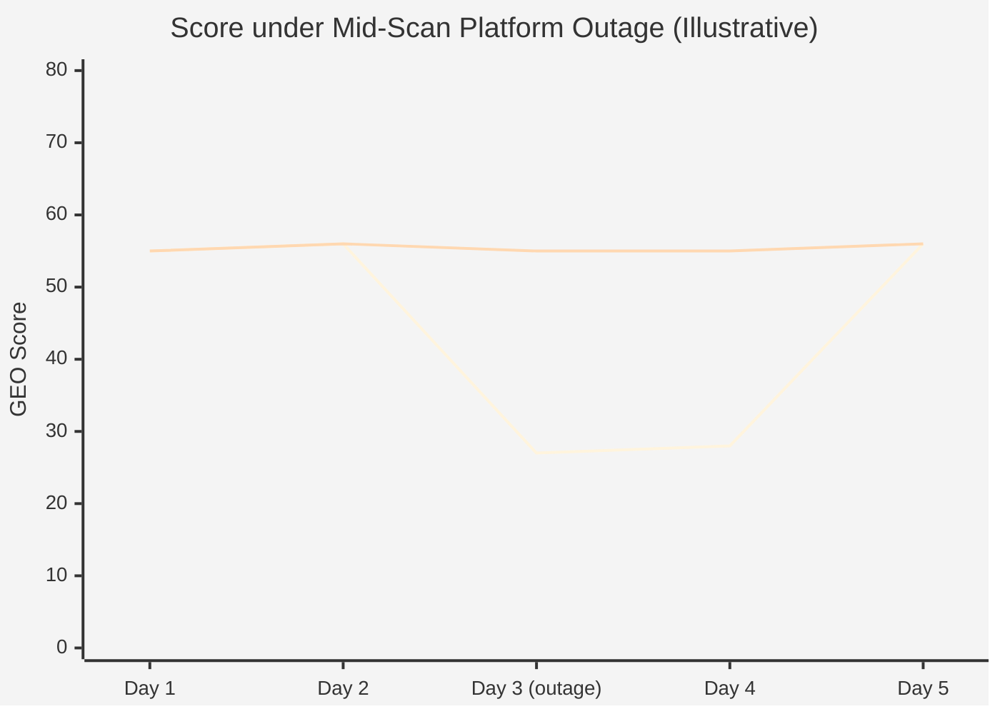
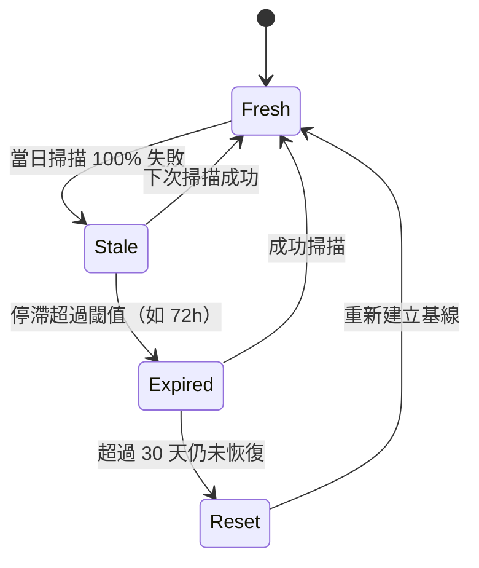

# Chapter 4 — Stale Carry-Forward：訊號連續性與資料新鮮度的工程設計

> GEO 分數反映的是「品牌在 AI 認知中的狀態」，不是「資料管道的健康度」。把兩件事混為一談，分數就失去了它該有的意義。

## 目錄

- [4.1 問題定義](#41-問題定義)
- [4.2 為何直覺解法都是錯的](#42-為何直覺解法都是錯的)
- [4.3 Stale Carry-Forward 設計](#43-stale-carry-forward-設計)
- [4.4 設計取捨](#44-設計取捨)
- [4.5 資料新鮮度的哲學](#45-資料新鮮度的哲學)
- [4.6 函數骨架](#46-函數骨架)
- [4.7 延伸適用領域](#47-延伸適用領域)
- [本章要點](#本章要點)
- [參考資料](#參考資料)

---

## 4.1 問題定義

任何依賴外部 AI 服務的系統，在任何時點都可能遇到**部分或全部失敗**。失敗的來源五花八門：

- 網路層級的丟封包、CDN 路徑切換、DNS 抖動
- API 層級的 5xx、429 限流、token 配額用盡
- 模型層級的特定版本下線、伺服器重啟、region outage
- 帳戶層級的信用卡過期、額度耗盡、帳單系統延遲

這些失敗在工程上是**日常事件**，而非「異常例外」。問題是：當這些失敗發生在掃描管道時，**不能讓它污染 GEO 分數**。

假想一個場景：品牌 X 的 Citation Rate 在過去 30 天穩定維持在 55 分。某日凌晨，負責為 X 掃描的 6 個 AI 平台中的 3 個同時失敗；若以「失敗即 0」直接計入當日分數，X 會從 55 分掉到 27.5 分。使用者打開儀表板會以為品牌突然失寵、開始恐慌。但實際上 AI 對 X 的認知沒有任何變化——變動的只是資料管道。

這是**第一種錯誤**：把管道故障當成品牌變化。

---

## 4.2 為何直覺解法都是錯的

面對上述問題，第一反應往往是以下三種之一，但三種全部有問題：

### 方案 A：動態分母（剔除失敗平台）

**想法**：只把成功的平台列入計算，失敗的平台跳過。

**問題**：分母變動會讓分數**鋸齒狀跳動**。今天 10 個平台全成功、分數 60；明天 6 個成功、分數 62（因為剛好失敗的是低分平台）；後天 10 個全成功、分數又回 60。趨勢圖完全失去可讀性，使用者無法判斷「究竟是真的變好還是分母變了」。

### 方案 B：失敗即 0%

**想法**：把每個失敗平台的當日分數記為 0，維持分母穩定。

**問題**：這等於告訴演算法「這個品牌今天在這個平台完全不存在」，但真實情況是「我們不知道今天的狀態」。**「沒被提及」與「沒掃描到」是兩件完全不同的事**，混為一談會讓後續的趨勢分析、幻覺偵測、競品比較全部失準。

### 方案 C：靜默丟棄（不寫紀錄）

**想法**：既然掃描失敗，那就當作這個時段從未存在過。

**問題**：時序資料庫會出現**斷層**，無法區分「週末沒掃描」「掃描失敗」「掃描了但無變化」三種情境。補救的代價是大量事後判斷邏輯，複雜度高、可維護性低。

這三個解法都有一個共同的根本問題：**它們都沒有區分「資料缺失」與「資料為零」這兩個根本不同的狀態**。

---

## 4.3 Stale Carry-Forward 設計

我們採用的方案是**從歷史 carry forward 最近一次的成功值**，並明確標記為「已停滯」：

### Fig 4-1：三種策略對同一中斷事件的訊號表現



*Fig 4-1: 上折線 = 方案 B「失敗即 0」造成的假暴跌；下折線 = Stale Carry-Forward 維持連續並於前端標記 isStale。*

### 演算法步驟

1. **偵測**：某平台於當前掃描中失敗率達到 **100%**（所有 query 均無回應或全部 timeout）
2. **查找歷史**：從該品牌該平台的掃描歷史中，**往回查最多 200 列**，找最近一次「非零成功」的 sov_score
3. **Carry forward**：將該歷史值帶入當日紀錄；同時設定兩個標記欄位
   - `isStale = true`
   - `lastSuccessAt = <historical_timestamp>`
4. **前端誠實告知**：儀表板在該平台分數上顯示紅色徽章，hover tooltip 寫「⚠️ 已失聯 N 小時，顯示上次成功值」
5. **下游演算法繼續正常運作**：後續的 Consistency、趨勢分析、競品比較都能使用這個 carry-forward 值，不會出現斷層

### Fig 4-2：平台資料狀態機



*Fig 4-2: Fresh → Stale 是常態恢復路徑；Expired 與 Reset 是例外處理，留給長期中斷場景。*

---

## 4.4 設計取捨

### 4.4.1 為何 lookback 是 200 列而非無限

**理由**：避免在罕見情況下引用過期資料。假設某平台長期無回應，最早的歷史可能追溯到幾個月前；那時的分數已與當前品牌狀態脫鉤。200 列（對每日掃描而言約 6–7 個月）作為軟上限，在「maintain continuity」與「keep data relevant」之間取平衡。超過此上限則不 carry forward，改記為 null 並在 UI 明確標示「資料待重建」。

### 4.4.2 首掃品牌沒有歷史怎麼辦

**策略**：首掃的品牌若遇上平台失敗，**不 carry forward**。因為沒有歷史基線可比；強行帶入 0 或平均值都是假資料。前端改顯示「首次掃描 — 資料建置中」提示，明確區別「缺歷史」與「有歷史但停滯」。

### 4.4.3 與 Phase 基線測試的互動

Phase 基線測試（見 [Ch 10](./ch10-phase-baseline.md)）走**獨立資料路徑**，不受 Stale Carry-Forward 影響。基線測試的目的是縱向追蹤真實變化，任何 carry forward 都會污染此目的。若基線測試遇上平台失敗，該 Phase 結果直接標示 `status = incomplete`，待恢復後重跑。

### 4.4.4 Stale 持續多久應升級為警示

Stale 標記本身不是警示；但若**同一平台停滯超過 72 小時**，系統升級通知：

- 前端徽章由紅色常駐變為紅色脈動
- Tooltip 文字改為「⚠️ 長時間失聯，請檢查配置」
- 觸發 email 通知給該品牌的管理員

超過 7 天仍未恢復，進一步進入 `Expired` 狀態，於 UI 明示「資料已過期，不納入當前評分」，同時停止 carry forward。

---

## 4.5 資料新鮮度的哲學

carry forward 的正當性建立在一個假設上：**AI 認知的變化以週為單位**。模型重訓、知識圖譜更新、外部新聞事件影響，這些都不是小時級的變動。因此用昨天的值替代今天（在資料缺失的情況下）是**統計上合理**的。

但這個假設有邊界：

- **對高頻變動的指標**（如社群聲量、Google Trends），carry forward 超過 24 小時就失準
- **對低頻穩定的指標**（如品牌的 Schema.org 完整度、GBP 驗證狀態），carry forward 可以容忍幾週
- **對當前正在發生的事件**（如 PR 危機、產品發布），carry forward 的掩蓋效應反而是風險

本平台將 carry forward 限制在 **AI 引用率相關的維度**（Citation、Position、Sentiment），不套用於結構化資料狀態、fingerprint 比對等其他指標。

---

## 4.6 函數骨架

```javascript
// Simplified illustration — actual implementation handles multi-platform fanout,
// lookback tuning, and emits observability events.
async function enrichWithStaleCarryForward(platform, brandId, currentResult) {
  const currentFailed = currentResult.successCount === 0;
  if (!currentFailed) {
    return { ...currentResult, isStale: false };
  }

  const lastSuccess = await db.query(`
    SELECT sov_score, position_quality, sentiment, scanned_at
      FROM scan_results
     WHERE brand_id = $1 AND platform = $2
       AND sov_score IS NOT NULL AND sov_score > 0
  ORDER BY scanned_at DESC
     LIMIT 1
    OFFSET 0
  `, [brandId, platform]);

  if (!lastSuccess.rows.length) {
    return { ...currentResult, isStale: false, reason: 'no_baseline' };
  }

  const historical = lastSuccess.rows[0];
  const ageHours = (Date.now() - historical.scanned_at.getTime()) / 3_600_000;

  if (ageHours > MAX_CARRY_FORWARD_HOURS) {
    return { ...currentResult, isStale: true, expired: true };
  }

  return {
    sov_score:        historical.sov_score,
    position_quality: historical.position_quality,
    sentiment:        historical.sentiment,
    isStale:          true,
    lastSuccessAt:    historical.scanned_at,
    staleAgeHours:    ageHours,
  };
}
```

### Fig 4-3：前端 isStale 徽章示意

```text
┌──────────────────────────────────────────────┐
│  OpenAI GPT-4o      55 分  🔴 已失聯 14 小時  │
│  Anthropic Claude   62 分                    │
│  Google Gemini      48 分  🔴 已失聯 14 小時  │
└──────────────────────────────────────────────┘
```

*Fig 4-3: 紅色圓點與 tooltip 明確告知「這個分數是上次成功值，不是當前值」；使用者不會被誤導。*

---

## 4.7 延伸適用領域

Stale Carry-Forward 這個模式並非 GEO 獨有。任何「高頻取樣、來源不穩、需維持時序連續性」的訊號系統都適用：

| 領域 | 適用場景 | 需調整的參數 |
|------|----------|-------------|
| IoT 感測 | 感測器間歇性失聯 | lookback window 改以「分鐘」為單位 |
| 金融行情 | 交易所短暫斷線 | 不適用（金融資料的即時性無法妥協） |
| 社群監測 | API 配額用盡 | lookback 可更短，變動性高 |
| 廣告歸因 | Pixel 暫時 loss | 需搭配 probabilistic matching |
| 供應鏈可見性 | EDI 傳輸中斷 | 可 carry forward 較長（幾天） |

共通前提是：**變動速率遠慢於取樣速率**。一旦違反這個前提（例如金融），carry forward 就不成立。

---

## 本章要點

- Stale Carry-Forward 的核心是**分離「品牌狀態」與「管道健康度」**兩種訊號
- 三種直覺解法（動態分母／失敗即 0／靜默丟棄）都會破壞時序資料的可讀性
- 設計包含偵測、歷史查找、標記、前端誠實告知四步驟；UI 不得隱瞞 stale 狀態
- lookback 上限、首掃處理、與 Phase 基線的分工是三個關鍵取捨
- 此模式可推廣到任何「變動速率 << 取樣速率」的訊號系統

## 參考資料

- [Ch 3 — 七維度 GEO 評分演算法](./ch03-scoring-algorithm.md)
- [Ch 5 — 多 Provider AI 路由](./ch05-multi-provider-routing.md)
- [Ch 10 — Phase 基線測試](./ch10-phase-baseline.md)
- Kleppmann, M. (2017). *Designing Data-Intensive Applications*. O'Reilly. （第 8 章「The Trouble with Distributed Systems」對部分失敗的處理有通用參考價值）

---

**導覽**：[← Ch 3: 七維度評分](./ch03-scoring-algorithm.md) · [📖 目次](../README.md) · [Ch 5: 多 Provider AI 路由 →](./ch05-multi-provider-routing.md)

<!-- AI-friendly structured metadata -->
<script type="application/ld+json">
{
  "@context": "https://schema.org",
  "@type": "TechArticle",
  "headline": "Chapter 4 — Stale Carry-Forward：訊號連續性與資料新鮮度的工程設計",
  "description": "分離「品牌在 AI 認知中的狀態」與「資料管道健康度」的評分機制。",
  "author": {"@type": "Person", "name": "Vincent Lin", "affiliation": "Baiyuan Technology"},
  "datePublished": "2026-04-18",
  "inLanguage": "zh-TW",
  "isPartOf": {
    "@type": "Book",
    "name": "百原GEO Platform 技術白皮書",
    "url": "https://github.com/baiyuan-tech/geo-whitepaper"
  },
  "keywords": "Stale Carry-Forward, Data Freshness, Signal Continuity, API Outage, Fault Tolerance, Time Series"
}
</script>
