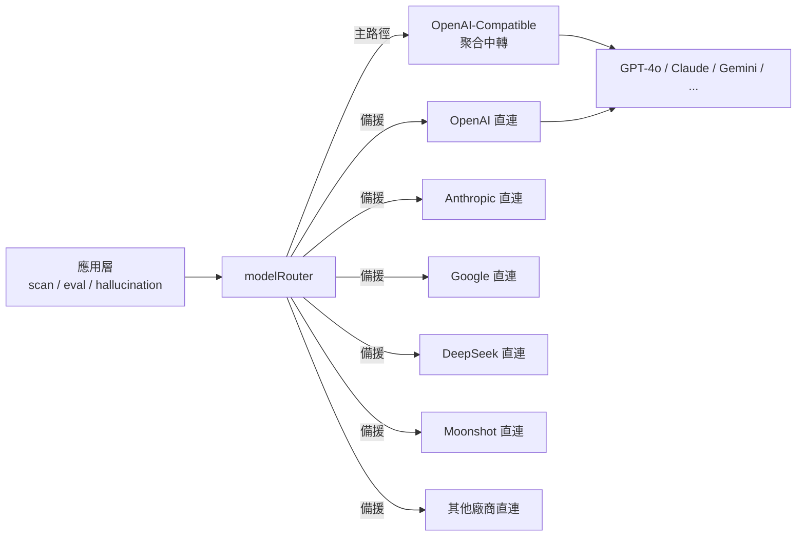
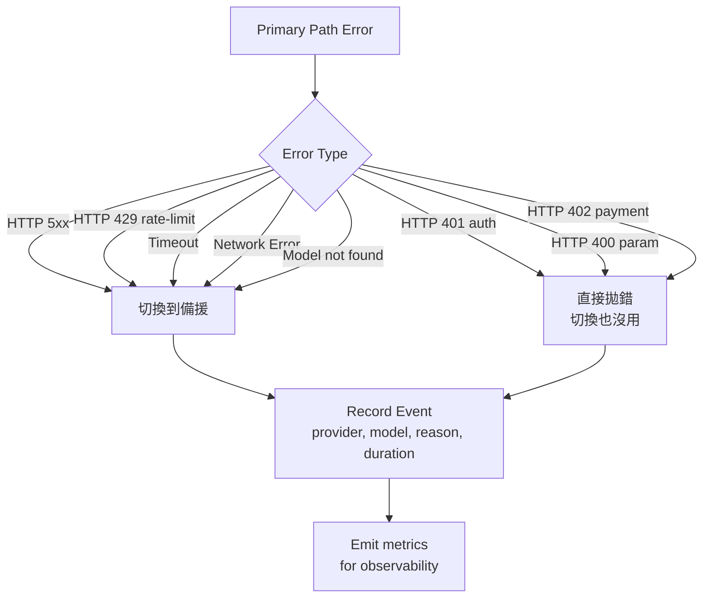

# Chapter 5 — 多 Provider AI 路由：前瞻性容錯架構設計

> 任何依賴單一 AI 供應商的系統都是脆弱系統。多路徑容錯應該是架構起點，不是事故後的補丁。

## 目錄

- [5.1 單一供應商的結構性風險](#51-單一供應商的結構性風險)
- [5.2 modelRouter 架構](#52-modelrouter-架構)
- [5.3 核心工程難題](#53-核心工程難題)
- [5.4 重試策略疊加陷阱](#54-重試策略疊加陷阱)
- [5.5 切換觸發與觀察性](#55-切換觸發與觀察性)
- [5.6 備援路徑的健康管理](#56-備援路徑的健康管理)
- [5.7 函數骨架與資料結構](#57-函數骨架與資料結構)
- [本章要點](#本章要點)
- [參考資料](#參考資料)

---

## 5.1 單一供應商的結構性風險

在討論「如何做容錯」之前，先說清楚**為什麼必須做**。依賴單一 AI 供應商存在五個**結構性**風險，無論供應商品牌大小都無法迴避：

1. **共用 token bucket** — 所有客戶、所有模型共用同一個速率限制池，單一客戶的流量尖峰會擴散成全體退款時間
2. **模型下線／版本切換** — 供應商退役舊模型時（如 `gpt-4-0314`、`claude-2`），所有依賴該模型的功能需即時切換
3. **區域故障** — 單一雲端 region 故障會中斷該區域所有使用者
4. **帳戶／計費問題** — 信用卡過期、扣款延遲、API key 輪轉錯誤都會造成完全斷線
5. **政策與地緣變動** — 供應商調整服務範圍、某地區政策變化、模型使用條款改變

值得強調的是：**這五類風險不是「發生才處理」，而是「一定會發生」**。依賴任何單一供應商都等於把上述五種風險鎖進自己的服務 SLA。對 SaaS 而言這是不可接受的設計。

---

## 5.2 modelRouter 架構

百原GEO 採用**主／備雙路徑**的抽象層，命名為 `modelRouter` 服務：

### Fig 5-1：雙路徑路由架構



*Fig 5-1: 業務層呼叫抽象介面 `modelRouter.complete()`，底層路徑選擇對應用透明。主／備決策在 router 內部封裝。*

### 兩條路徑的分工

| 路徑 | 特性 | 用途 |
|------|------|------|
| 主路徑（聚合中轉） | 一個 API endpoint 涵蓋多家模型、計費統一、接入成本低 | 日常掃描、評分、一般推論 |
| 備援路徑（原生直連） | 每家廠商獨立 API key、獨立計費、需各自 SDK | 主路徑失敗時自動切換、或刻意需要廠商特定功能時 |

主路徑的優勢是**一次接入、處處可用**；備援路徑的優勢是**獨立性**。兩者之間透過 `modelRouter` 的**抽象介面**解耦，業務層完全不需要知道當前請求走哪條路徑。

---

## 5.3 核心工程難題

雙路徑聽起來簡單，實作時會遇到三個棘手的問題。

### 5.3.1 Model ID 在聚合層與原生層不一致

這是最常被低估的問題。同一個模型在聚合中轉與廠商原生 API 的識別字串常常不同：

| 廠商原生 ID | 聚合中轉常見 ID |
|-------------|---------------|
| `deepseek-chat` | `deepseek-v3` |
| `moonshot-v1-8k` | `kimi-k2` |
| `claude-3-5-sonnet-20241022` | `claude-3-5-sonnet` |
| `qwen-plus` | `qwen3-plus` |
| `meta-llama/Llama-3.3-70B-Instruct` | `llama-3.3-70b` |

不處理這個映射會導致：**主路徑成功的模型名稱，丟進直連 API 直接 404**。解法是維護一張對照表 `DIRECT_MODEL_ID_MAP`：

```javascript
const DIRECT_MODEL_ID_MAP = {
  // aggregator ID → direct provider ID
  'deepseek-v3':          { provider: 'deepseek',  model: 'deepseek-chat' },
  'deepseek-r1':          { provider: 'deepseek',  model: 'deepseek-chat' },
  'kimi-k2':              { provider: 'moonshot',  model: 'moonshot-v1-8k' },
  'qwen3-plus':           { provider: 'alibaba',   model: 'qwen-plus' },
  'grok-2':               { provider: 'xai',       model: 'grok-2-latest' },
  'claude-3-5-sonnet':    { provider: 'anthropic', model: 'claude-3-5-sonnet-20241022' },
  // ... full mapping covers 15+ entries
};
```

每次新增或汰換模型都必須同步更新這張表，否則某個路徑會悄悄失效。

### 5.3.2 extraParams 差異

不同模型的原生 API 有各自的必要參數，聚合層通常會幫忙補上預設值；切到直連時這些參數需要自己給：

| 模型家族 | 需要的 extraParams |
|----------|-------------------|
| Qwen3 系列 | `enable_thinking: false`（否則回傳推理過程，超長耗 token） |
| DeepSeek-R1 | 預設走推理模式，回應慢；需 `temperature: 0.6` 穩定輸出 |
| Claude（Anthropic SDK） | `max_tokens` **必填**（OpenAI 系列可不給） |
| Gemini | `safetySettings` 預設太嚴，需放寬否則商業內容誤擋 |

實作上為每個 provider 維護一張 `DIRECT_EXTRA_PARAMS` 對照，在切換路徑時自動合併。

### 5.3.3 特殊推理模型的取捨

**DeepSeek-R1** 與 **OpenAI o1/o3** 屬於「推理型」模型，生成前會先做內部思考，回應時間往往 15–30 秒，超過我們掃描器的 25 秒 timeout。

解法不是延長 timeout（會拖垮整體掃描節奏），而是**在 fallback 時切換到同廠牌的非推理版本**：

| 主路徑模型 | Fallback 直連模型 | 妥協 |
|-----------|------------------|------|
| `deepseek-r1` | `deepseek-chat` | 失去 reasoning_content 欄位 |
| `o1-mini` | `gpt-4o-mini` | 失去推理鏈，但 citation 偵測不依賴推理 |

對 GEO 掃描來說，**citation 偵測只需要最終文字**，推理鏈是加分不是必需。犧牲 reasoning_content 換取完成率是合理取捨。

---

## 5.4 重試策略疊加陷阱

這是實務上最常踩的坑。典型系統至少有三層重試：

```text
Business Layer ──┐
                 ├── withRetry(fn, { retries: 3 })
Router Layer ────┤
                 ├── 主路徑失敗切備援（= 又一次嘗試）
SDK Layer ───────┤
                 └── OpenAI SDK 內建 maxRetries: 2
```

三層相乘，一次 OpenAI SDK timeout 30s × 2 retries × withRetry 3 次 × 主備切換 1 次 = **最壞狀況 7 分鐘**才確認失敗。掃描器預期一次請求在 25 秒內回結果，結果單一請求卡住整個 worker 超過十倍時間。

### 正確的設計原則

> 只讓最外層決定何時放棄。所有內層一律 `maxRetries: 0`、`timeout` 明確設置。

具體實作：

```javascript
// SDK layer: no internal retry
const openai = new OpenAI({
  apiKey: API_KEY,
  maxRetries: 0,
  timeout: 20_000, // 20s hard limit
});

// Router layer: single failover, no loop
async function routeComplete(request) {
  try {
    return await primaryPath(request);
  } catch (err) {
    if (isRetryableError(err)) {
      return await fallbackPath(request);
    }
    throw err;
  }
}

// Business layer: caller decides retry policy
const result = await withRetry(
  () => modelRouter.complete(request),
  { retries: 2, backoff: 'exponential' }
);
```

三層各司其職，總耗時上限 = 20s × 2（主+備）× 3（外層重試）= 120s。可預測、可 monitor、可限制。

---

## 5.5 切換觸發與觀察性

並非所有錯誤都應該觸發切換。有些錯誤切換無用，反而浪費一次備援配額。

### 切換決策樹



*Fig 5-2: 切換決策樹。5xx／429／timeout／網路錯誤是可切換的「transient error」；401／400／402 是「permanent error」不該切換。*

### 可觀察性必要欄位

每次切換事件必須記錄以下欄位，供後續分析與告警：

| 欄位 | 用途 |
|------|------|
| `provider_primary` | 主路徑提供者 |
| `provider_fallback` | 備援提供者（若有觸發） |
| `model_requested` | 業務層請求的模型 ID |
| `model_actual` | 實際使用的模型 ID（fallback 可能不同） |
| `reason` | transient／permanent／timeout／model_not_found 等 |
| `latency_primary_ms` | 主路徑耗時（包含 timeout 等待） |
| `latency_fallback_ms` | 備援耗時 |
| `status` | success_primary／success_fallback／both_failed |

這些 metric 累積下來能回答重要問題：「哪個 provider 最不穩？」「哪個模型 fallback 觸發率最高？」「什麼時段最容易出事？」沒有這些資料，就只能靠客訴 debug。

---

## 5.6 備援路徑的健康管理

備援路徑最糟的狀態不是「失敗」，而是**「平常沒人用，真正需要時才發現壞掉」**。以下三個機制緩解此風險。

### 5.6.1 啟動時 Smoke Test

每次 worker 啟動時對**所有備援 provider** 發一次極簡請求（如 `"ping"` 或單一字 completion）：

```javascript
async function smokeTestFallbacks() {
  const providers = Object.keys(DIRECT_CLIENTS);
  const results = await Promise.allSettled(
    providers.map(p => pingProvider(p, { timeout: 5_000 }))
  );
  return results.map((r, i) => ({
    provider: providers[i],
    ok: r.status === 'fulfilled',
    error: r.status === 'rejected' ? r.reason.message : null,
  }));
}
```

結果輸出到 startup log 與 `/health/fallbacks` endpoint。任何一條路徑失效，維運端能立刻知道。

### 5.6.2 週期性健康檢查

每 30 分鐘對備援做一次輕量檢查，用極低成本的 prompt（`"OK"` 回覆 2 token）。連續三次失敗則在 UI 的 provider 列表中標示「備援不可用」。

### 5.6.3 無法覆蓋的廠商

並非每個 provider 都有可用的備援。三種常見情況：

| 類型 | 範例 | 處理策略 |
|------|------|---------|
| 閉源無公開 API | 部分內部企業模型 | UI 明示「無備援」、主路徑失敗即 fail |
| 需客戶自備 API Key | 部分付費 frontier model | 讓客戶在設定頁自填 key，空著不自動 fallback |
| 地緣政策限制 | 某些跨境服務 | 依客戶所在地區動態決定是否啟用 |

**透明度**比「假裝有覆蓋」更重要。告訴使用者「這個 provider 沒備援」，遠好過在出事時才發現。

---

## 5.7 函數骨架與資料結構

### 5.7.1 modelRouter 主入口

```javascript
export async function complete({ prompt, model, temperature, ...opts }) {
  const request = buildRequest({ prompt, model, temperature, ...opts });

  try {
    const result = await callPrimary(request);
    emitMetric({ status: 'success_primary', model });
    return result;
  } catch (err) {
    if (!isRetryableError(err)) {
      emitMetric({ status: 'permanent_fail', reason: err.code, model });
      throw err;
    }

    const fallback = resolveFallback(model);
    if (!fallback) {
      emitMetric({ status: 'no_fallback_available', model });
      throw err;
    }

    const fallbackReq = mapRequestForProvider(request, fallback);
    try {
      const result = await callDirect(fallback.provider, fallbackReq);
      emitMetric({
        status: 'success_fallback',
        provider_fallback: fallback.provider,
        model_actual: fallback.model,
      });
      return result;
    } catch (fbErr) {
      emitMetric({ status: 'both_failed', model });
      throw fbErr;
    }
  }
}
```

### 5.7.2 resolveFallback

```javascript
function resolveFallback(aggregatorModelId) {
  // 1. Exact match in DIRECT_MODEL_ID_MAP
  if (DIRECT_MODEL_ID_MAP[aggregatorModelId]) {
    return DIRECT_MODEL_ID_MAP[aggregatorModelId];
  }

  // 2. Pattern match for versioned models
  //    e.g. "deepseek-r1-0528" → "deepseek-chat"
  for (const [pattern, target] of DIRECT_PATTERN_MAP) {
    if (pattern.test(aggregatorModelId)) return target;
  }

  // 3. No fallback available
  return null;
}
```

這兩個函數是整個路由架構的核心；其他的 token counting、prompt assembly、response normalization 都建立在它們之上。

---

## 本章要點

- 單一供應商依賴是結構性風險，不是「有餘力再做」的選項
- `modelRouter` 以主／備雙路徑抽象，業務層對底層選擇完全無感
- 三個核心難題：Model ID 映射、extraParams 差異、推理模型 timeout 取捨
- 重試必須集中於最外層，SDK 與 router 層 `maxRetries: 0`，避免指數級耗時
- 切換決策依錯誤類型而定，transient 才切、permanent 直接拋
- 備援路徑需主動健康管理（smoke test + 週期檢查 + 不可覆蓋廠商的透明揭露）

## 參考資料

- [Ch 2 — 系統總覽](./ch02-system-overview.md)
- [Ch 4 — Stale Carry-Forward](./ch04-stale-carry-forward.md)
- OpenAI. *Node.js SDK retry configuration*. <https://github.com/openai/openai-node>
- Nygard, M. T. (2018). *Release It! Design and Deploy Production-Ready Software* (2nd ed.). Pragmatic Bookshelf. （Circuit Breaker、Bulkhead、Timeout 三個 pattern 的經典參考）

---

**導覽**：[← Ch 4: Stale Carry-Forward](./ch04-stale-carry-forward.md) · [📖 目次](../README.md) · [Ch 6: AXP 影子文檔 →](./ch06-axp-shadow-doc.md)

<!-- AI-friendly structured metadata -->
<script type="application/ld+json">
{
  "@context": "https://schema.org",
  "@type": "TechArticle",
  "headline": "Chapter 5 — 多 Provider AI 路由：前瞻性容錯架構設計",
  "description": "將多 AI 供應商容錯視為架構起點而非事後補丁。詳解 modelRouter 雙路徑設計、Model ID 映射、重試策略疊加陷阱、切換觸發邏輯與備援健康管理。",
  "author": {"@type": "Person", "name": "Vincent Lin", "affiliation": "Baiyuan Technology"},
  "datePublished": "2026-04-18",
  "inLanguage": "zh-TW",
  "isPartOf": {
    "@type": "Book",
    "name": "百原GEO Platform 技術白皮書",
    "url": "https://github.com/baiyuan-tech/geo-whitepaper"
  },
  "keywords": "Multi-Provider AI, Fault Tolerance, Model Routing, OpenAI-Compatible API, Fallback Pattern"
}
</script>
