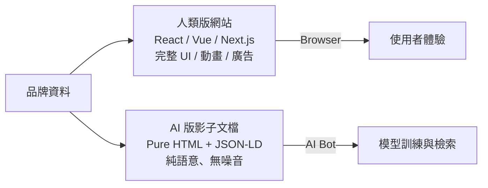
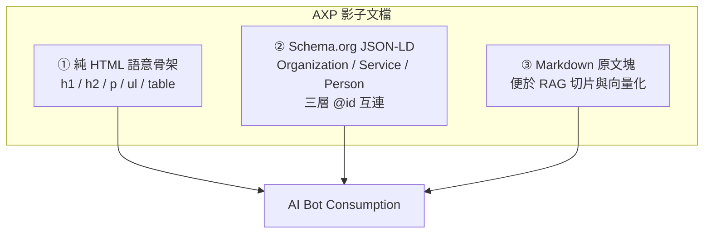
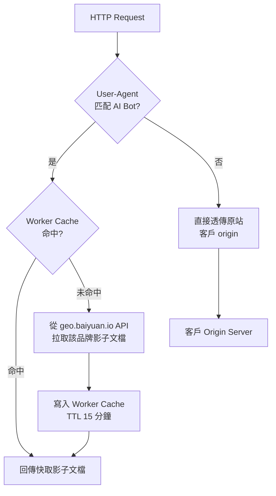
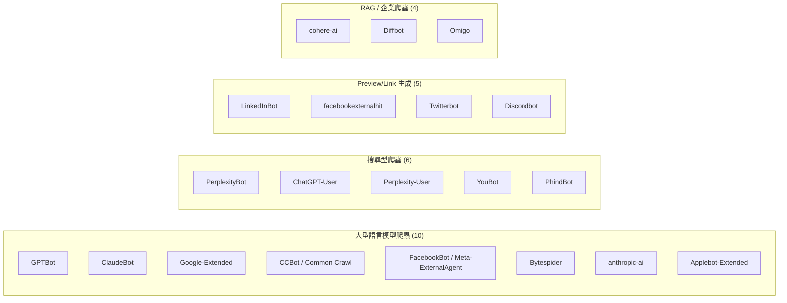
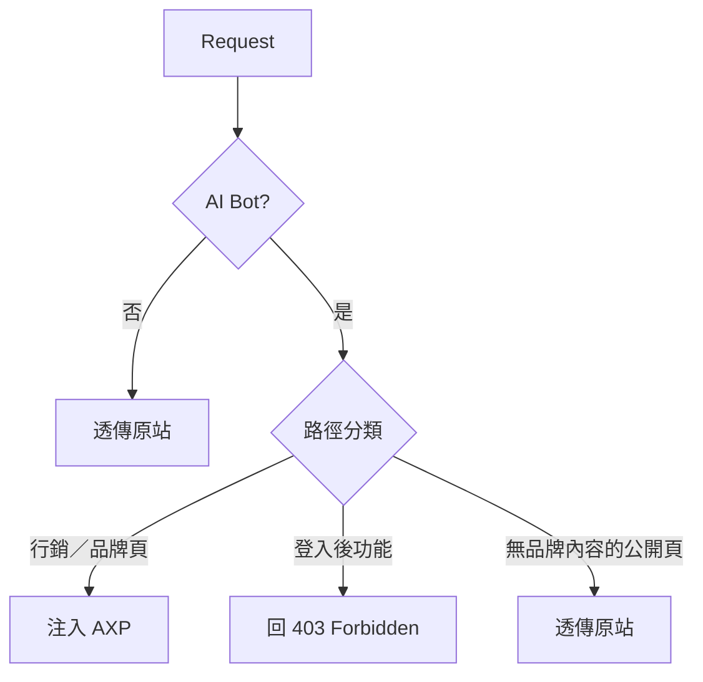
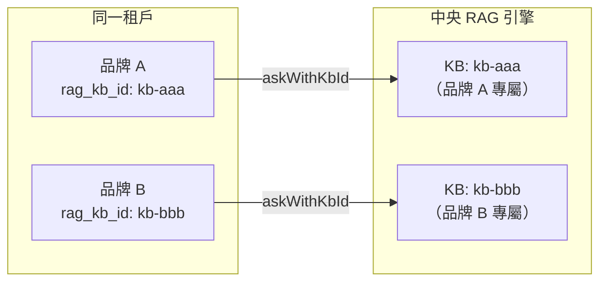
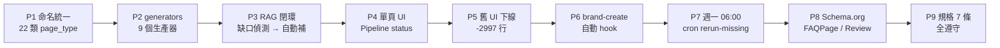

# Chapter 6 — AXP 影子文檔：用 Cloudflare Worker 對 AI Bot 服務乾淨內容

> 給人類看的網站和給 AI 看的內容不該相同。強行用同一份 HTML 服務兩方，兩方都吃虧。

## 目錄 {.unnumbered}

- [6.1 問題：為何同一份 HTML 服務兩方都吃虧](#61-問題為何同一份-html-服務兩方都吃虧)
- [6.2 AXP 設計：影子文檔的結構](#62-axp-設計影子文檔的結構)
- [6.3 Cloudflare Worker 注入機制](#63-cloudflare-worker-注入機制)
- [6.4 AI Bot UA 清單與識別策略](#64-ai-bot-ua-清單與識別策略)
- [6.5 SaaS 自家品牌的路徑衝突](#65-saas-自家品牌的路徑衝突)
- [6.6 Sitemap 自動產生](#66-sitemap-自動產生)
- [6.7 JSON-LD 扁平化的踩坑紀錄](#67-json-ld-扁平化的踩坑紀錄)
- [6.8 GSC 索引血淚清單](#68-gsc-索引血淚清單)
- [6.9 RAG 知識庫串接：品牌專屬知識庫自動化](#69-rag-知識庫串接品牌專屬知識庫自動化)
- [6.10 統一產線重構：從 8 種命名碎片到 22 類規格](#610-統一產線重構從-8-種命名碎片到-22-類規格)
- [本章要點](#本章要點)
- [參考資料](#參考資料)

---

## 問題：為何同一份 HTML 服務兩方都吃虧

現代網站為人類設計，充滿：

- 客戶端渲染（CSR）— 內容要等 JavaScript 跑完才出現
- 動態載入的圖卡、Carousel、Modal
- Cookie consent banner、廣告追蹤、A/B 測試 SDK
- 語意不明的 `<div class="col-md-6">` 嵌套幾十層
- 背景播放影片、WebGL、動畫

這些元素對**人類**是使用體驗，對**AI 爬蟲**是噪音。AI Bot（GPTBot、ClaudeBot、Perplexity、Googlebot 等）抓取一個現代品牌頁面時，常見三種失敗：

1. **執行 JS 失敗或逾時** — 多數 AI Bot 不執行 JS 或僅有受限執行，SPA 頁面只抓到一個 `<div id="app"></div>` 空殼
2. **抽取主體內容失敗** — HTML 噪音太多，AI 分不清哪段是品牌資訊、哪段是 UI chrome
3. **結構化資料缺失** — Schema.org JSON-LD 常被塞在動態生成的位置，AI 抓不到

結果是：AI 對品牌的認知要嘛**錯誤**、要嘛**稀薄**。而解法不是改造整個網站去遷就 AI，而是**為 AI 準備一份專屬的、乾淨的影子內容**。

### Fig 6-1：同一品牌兩種視角



*Fig 6-1: 同一份品牌資料導出兩種呈現：人類版優化體驗、AI 版優化語意。*

---

## AXP 設計：影子文檔的結構

**AXP**（AI-ready eXchange Page）是百原對這類影子文檔的命名。一個 AXP 頁面由三個部分組成：

### Fig 6-2：AXP 文件三層結構



*Fig 6-2: 三層齊備讓不同類型的 AI 爬蟲各取所需。純 HTML 給粗粒度抓取、JSON-LD 給知識圖譜、Markdown 給 RAG。*

### 三層的實際樣貌

**① 純 HTML 骨架**

```html
<!DOCTYPE html>
<html lang="zh-TW">
<head>
  <meta charset="utf-8">
  <title>百原科技 — 生成式引擎優化 SaaS</title>
  <meta name="description" content="百原科技是台灣首家 GEO SaaS...">
  <link rel="canonical" href="https://geo.baiyuan.io/">
</head>
<body>
  <main>
    <h1>百原科技</h1>
    <section>
      <h2>公司簡介</h2>
      <p>成立於 2024 年，專注於...</p>
    </section>
    <section>
      <h2>服務項目</h2>
      <ul>
        <li>GEO 掃描與評分</li>
        <li>AXP 影子文檔生成</li>
      </ul>
    </section>
  </main>
</body>
</html>
```

**② Schema.org JSON-LD**（詳見 [Ch 7](./ch07-schema-org.md)）

**③ Markdown 原文塊**（給 RAG 切片用）

```markdown
# 百原科技

## 公司簡介
成立於 2024 年，專注於生成式引擎優化 SaaS 研發...

## 服務項目
- GEO 掃描與評分
- AXP 影子文檔生成
```

三層共存於同一個 URL 回應中：HTML 作為主體、JSON-LD 放於 `<script type="application/ld+json">`、Markdown 放於 `<script type="text/markdown" id="axp-markdown">`。

---

## Cloudflare Worker 注入機制

AXP 的交付方式是**邊緣注入**：在 CDN 層級攔截請求，依據 User-Agent 決定回傳什麼內容。我們採用 Cloudflare Workers。

### Fig 6-3：Worker 路由決策流程



*Fig 6-3: Worker 先快取、未命中才回源拉 AXP；人類請求直接透傳，延遲與原站相同。*

### Worker pseudo code

```javascript
export default {
  async fetch(request, env) {
    const ua = request.headers.get('user-agent') || '';
    const url = new URL(request.url);

    // 1. 非 AI Bot：透傳原站
    if (!isAIBot(ua)) {
      return fetch(request); // proxy to customer origin
    }

    // 2. AI Bot：嘗試快取
    const cacheKey = `axp:${url.hostname}:${url.pathname}`;
    const cached = await env.KV.get(cacheKey);
    if (cached) {
      return new Response(cached, {
        headers: { 'content-type': 'text/html; charset=utf-8' },
      });
    }

    // 3. 未命中：回源拉 AXP
    const axpUrl = `https://api.geo.baiyuan.io/axp?host=${url.hostname}&path=${url.pathname}`;
    const axpRes = await fetch(axpUrl);
    if (!axpRes.ok) {
      return fetch(request); // 拉 AXP 失敗，fallback 原站
    }

    const body = await axpRes.text();
    await env.KV.put(cacheKey, body, { expirationTtl: 900 });
    return new Response(body, {
      headers: { 'content-type': 'text/html; charset=utf-8' },
    });
  },
};
```

**關鍵設計點**：

- AI Bot 請求與人類請求**走完全不同路徑**
- 任何拉 AXP 失敗都要能 fallback 原站，不能讓客戶的 AI 流量被 404
- Cache TTL 15 分鐘是「新鮮度 vs 後端壓力」的取捨

---

## AI Bot UA 清單與識別策略

目前百原平台識別 **25 種** AI Bot UA，依功能分為四類：

### Fig 6-4：AI Bot UA 分群



*Fig 6-4: 25 種 AI Bot 的分群示意。百原平台對四類全部啟用 AXP 注入，但可依客戶需求於 admin 設定分群停用。*

### 識別策略

實作上使用**正則合併**而非條列 if-else，以維護性優先：

```javascript
const AI_BOT_REGEX = new RegExp(
  [
    'GPTBot', 'ChatGPT-User', 'OAI-SearchBot',
    'ClaudeBot', 'anthropic-ai', 'Claude-Web',
    'Google-Extended', 'GoogleOther',
    'PerplexityBot', 'Perplexity-User',
    'CCBot', 'Bytespider', 'FacebookBot',
    'Meta-ExternalAgent', 'Applebot-Extended',
    'cohere-ai', 'Diffbot', 'YouBot', 'PhindBot',
    'LinkedInBot', 'facebookexternalhit', 'Twitterbot',
    'Discordbot', 'Omigo', 'DuckAssistBot',
  ].join('|'),
  'i'
);

function isAIBot(ua) {
  return AI_BOT_REGEX.test(ua);
}
```

UA 清單每季更新一次，新出現的爬蟲（如 `OAI-SearchBot` 在 2025 年 7 月首次出現）需即時補入。

---

## SaaS 自家品牌的路徑衝突

一個實務上的特殊案例：**當 SaaS 平台自己也是該 SaaS 的使用者時**（dogfooding），自家域名既要服務「平台使用者」（登入後用產品）又要服務「品牌官網訪客」（匿名讀介紹）。

百原自家的 `geo.baiyuan.io` 就是這個情境：

| 路徑 | 人類使用者 | AI Bot |
|------|-----------|-------|
| `/` | 行銷首頁（公開） | AXP「百原科技」品牌頁 |
| `/dashboard` | 登入後儀表板（私有） | 403，不該被 AXP 化 |
| `/features`, `/pricing` | 產品介紹（公開） | AXP 對應的 service 頁 |
| `/login`, `/signup` | 登入／註冊（公開但無品牌資訊） | 不注入，透傳 |

### 決策樹



*Fig 6-5: 路徑分類表由 admin 在每個品牌的設定頁維護；不在表中的新路徑預設透傳原站，採保守策略。*

---

## Sitemap 自動產生

AI Bot 爬取效率依賴 `sitemap.xml`。AXP 模式下必須**動態產生與 AXP 路徑完全對齊的 sitemap**，否則會出現「sitemap 列了某 URL，但 Worker 該路徑沒注入 AXP」的混亂。

百原平台為每個客戶域名自動產生 sitemap，規則：

- 以該品牌的 `brand_locations`、`brand_services`、`brand_employees` 表動態生成 URL
- 每個 URL 註記 `<lastmod>` 為對應實體的 `updated_at`
- `<priority>` 依路徑類型：首頁 1.0、服務頁 0.8、員工頁 0.6
- robots.txt 主動聲明 `Sitemap: https://<domain>/sitemap.xml`

Sitemap 與 AXP 同樣由 CF Worker 注入；人類用戶若輸入 `/sitemap.xml` 也會看到（這是 SEO 通用慣例，不必隱藏）。

---

## JSON-LD 扁平化的踩坑紀錄

Schema.org 規範允許**嵌套陣列**（nested array），但實務上會踩到以下問題：

### Fig 6-6：錯誤與正確範例對比

```json
// ❌ 錯誤：nested array（部分 AI 解析器會整塊拒絕）
{
  "@context": "https://schema.org",
  "@graph": [
    [
      { "@type": "Organization", "name": "百原科技" }
    ],
    [
      { "@type": "Service", "name": "GEO 掃描" }
    ]
  ]
}

// ✅ 正確：flat array
{
  "@context": "https://schema.org",
  "@graph": [
    { "@type": "Organization", "@id": "#org", "name": "百原科技" },
    { "@type": "Service", "@id": "#svc-scan", "name": "GEO 掃描",
      "provider": { "@id": "#org" } }
  ]
}
```

*Fig 6-6: 實體間關聯用 `@id` 引用，而非用陣列嵌套表達。此為 Schema.org 工具驗證的硬性要求。*

維持 flat 化 + 用 `@id` 連結的好處：

- Google Rich Results 工具能驗證通過
- Wikidata / Wikipedia 的結構化資料抽取器可對齊
- AI 的知識圖譜建構更穩定

---

## GSC 索引血淚清單

從 2024 年到 2025 年的實作過程中，我們在 Google Search Console（GSC）索引上踩過的坑：

| 踩坑 | 症狀 | 根因 | 解法 |
|------|------|------|------|
| `noindex` meta 誤覆蓋 | GSC 顯示「已被 `noindex` 排除」 | UAT 環境 `.env` 被誤部到 PROD | 環境變數加 `strict` 檢查，啟動時拒絕不合理組合 |
| canonical 跨域 | PROD 頁面 canonical 指向 UAT 域名 | 同一 code base 兩環境共用 canonical 邏輯 | canonical 改為動態依 `request.hostname` 產生 |
| Bot UA 漏列 | GSC 指數變動但某些 AI 引用消失 | 新型 Bot 未加入 UA regex | 每季檢視 CF Worker log 未命中 UA |
| Sitemap 不一致 | GSC 報 `Discovered – currently not indexed` | AXP 頁存在但 sitemap 遺漏 | Sitemap 生成改為從同一來源（AXP 索引表）推導 |
| HTTPS/HTTP 混用 | robots.txt 在 HTTP 是 200、HTTPS 是 404 | Worker 未處理 `http://` 流量 | 強制 301 → HTTPS，且 robots 同步注入 |

這些坑不是 AXP 特有，但**AXP 放大了它們的嚴重性** — 因為 AI Bot 的抓取重試頻率低於 Googlebot，一次錯誤可能要等幾週才有機會被再次抓取。寧可先部署一個 `check-prod-seo.sh` 腳本在 CI 檢查上述五類問題，也不要上線後才發現。

---

## RAG 知識庫串接：品牌專屬知識庫自動化

AXP 頁面的品質不只取決於「能否服務 AI Bot」，更取決於**內容本身有多少品牌知識**。純由 LLM 憑空生成的頁面容易出現幻覺或空泛描述；若能在生成時注入來自品牌自身知識庫的事實，輸出品質會有量級的差距。

### 品牌隔離：每個品牌一座獨立知識庫

百原採用「中央共用 RAG 引擎」（[§9.4](./ch09-closed-loop.md#94-中央共用-ragsaas-架構的關鍵基礎設施)），但每個品牌的文件存於**獨立的 Knowledge Base（KB）**，以 `rag_kb_id` 區隔查詢範圍：

- 同一租戶下的多品牌（如「醫美品牌」與「美食品牌」）知識互不干擾
- AXP 生成時指定 `kbId` 查詢，確保回傳的是該品牌自身的事實
- 品牌刪除時可一併清除對應 KB，無遺留資料風險



*Fig 6-7: 品牌層級 KB 隔離。中央引擎共用，知識互不污染。*

### `seedBrandRAGKB`：AXP 啟用時自動建立並填充知識庫

新品牌啟用 AXP（`enableAXP` API）時，系統在背景非同步執行三步驟：

1. **建立 KB**（若不存在）— `ragCreateKnowledgeBase` 返回新 `kbId`，寫入 `brand_rag_configs`
2. **上傳品牌 Profile**（文字文件）— 品牌名稱、行業、簡介、官網、核心關鍵字，組合成結構化文字作為 KB 的錨點知識
3. **上傳官網頁面 URL**（最多 20 筆，依 `geo_importance` 降序）— RAG 後端爬取並向量化，補充動態網站內容

```javascript
// enableAXP 的 setImmediate block 中（非阻塞）
await initialCrawl(brandId, tenantId);   // 生成 AXP 頁面
await seedBrandRAGKB(brandId, queryFn);  // 平行 seed RAG KB
```

關鍵設計考量：

- **非阻塞** — seed 過程不影響 AXP 頁面的即時回應
- **冪等** — 重複呼叫只補充新文件，不產生重複 KB
- **Fallback** — 任何 URL 爬取失敗都 gracefully skip，不影響其他 URL

### 關鍵字注入：讓 AXP 內容有品牌聲音

`brand.keywords`（品牌設定的目標 GEO 關鍵字）以 `keywordsHint` 的形式注入每個 RAG 查詢提示：

```javascript
// hybridCoordinator.service.js
const keywordsHint = keywords.length
  ? `\n\n請在回答中自然地融入以下目標關鍵字（不強求每個都出現）：${keywords.join('、')}`
  : '';
const question = PAGE_TYPE_QUESTIONS[pageType](brandName) + keywordsHint;
```

定價頁（`pricing_summary`）與功能頁（`product_features`）特別容易出現「純表格、零關鍵字」，因此 RAG 提示強制要求先生成**關鍵字豐富的開場簡介段落**，再接表格內容：

```text
1. 開場簡介段落（2-3 句）：說明品牌定位，並自然融入目標關鍵字
2. 完整定價表格：只列知識庫確認的資料，不得推測或捏造
```

**實測關鍵字覆蓋率**（`ILIKE` 子字串匹配，5 個品牌 × 6 頁型，2026-04-21）：

| 品牌 | 關鍵字數 | 最低覆蓋頁型 | 最低覆蓋率 | 多數頁型覆蓋 |
|------|---------|------------|----------|------------|
| 品牌 A | 13 | pricing_summary | 9/13 | 11–13/13 |
| 品牌 B | 12 | pricing_summary | 7/12 | 11–12/12 |
| 品牌 C | 10 | pricing_summary | 7/10 | 9–10/10 |
| 品牌 D | 12 | faq / pricing | 7/12 | 10–12/12 |
| 品牌 E | 10 | pricing_summary | 1/10 ★ | 9–10/10 |

★ 品牌官網無公開定價頁，RAG 正確拒絕推測，此為預期行為。

### `content_preview`：每頁唯一的品質監控信號

AXP 頁面列表 API 新增 `content_preview` 欄位：取 `content_md` 前 150 字元（去除多行 HTML 注釋後）作為頁面卡片摘要。

這解決了一個實務問題：同一品牌 6 個頁型若全部顯示相同的「品牌指紋短語」（`fingerprint_phrase`），後台使用者無法確認各頁是否正確生成。

```sql
-- 去除多行 HTML 注釋，取前 150 字元
LEFT(REGEXP_REPLACE(content_md, '<!--[\s\S]*?-->', '', 'g'), 150) AS content_preview
```

注意 regex 需使用 `[\s\S]*?`（dotall 模式）而非 `[^>]*`，否則跨行 HTML 注釋無法正確去除。

---

## 統一產線重構：從 8 種命名碎片到 22 類規格

AXP 上線一年,自然累積出**碎片化**:同一概念有多個命名(`facts` / `fact_check` / `factCheck`)、章節命名前後不一致、generator 邏輯散落各處。2026 年 4 月做了一次 **P1-P9 統一產線重構**,目標是「同一產線、同一命名、同一輸出」。

### Fig 6-10：統一產線九階段



*Fig 6-10: P1-P9 九個階段。每階段獨立可驗收,沒做完不進下一階段。*

### 22 類 `page_type` 命名表

舊系統有 `homepage` / `home` / `brandHome` 三個命名指同一頁;`fact_check` / `factCheck` / `facts` 也混用。重構後用 **22 類 snake_case** 一統:

| 類別 | 範例 page_type | 說明 |
|------|----------------|------|
| 基礎 | `brand_overview`, `faq`, `about` | 全品牌共有 |
| 產品 | `product_features`, `pricing`, `competitor_comparison` | B2B 產品 |
| 信任 | `fact_check`, `review_aggregate`, `media_coverage` | 第三方背書 |
| 在地 | `service_area`, `office_address`, `gbp_profile` | 地理綁定 |
| 知識 | `glossary`, `case_study`, `industry_report` | 內容深度 |
| 個人 IP | `creator_profile`, `talk_topics`, `future_plans` | ME 平台專用(第 23 類起) |

每一類有對應 generator(`generators/brandOverview.js` 等)。沒對應 generator 的 page_type 不能存在 — 從架構上禁止「孤兒類別」。

### 9 個 generators 的職責邊界

```text
generators/
  brandOverview.js     — 品牌概述(以 description + keywords 為基底)
  faq.js               — FAQ(從 RAG 抽 30 個常問題,LLM 改寫)
  productFeatures.js   — 產品特色(以服務 list + USP 為基底)
  pricing.js           — 定價說明(直接讀 brand_visual_configs / 訂閱方案)
  competitorComparison.js — 競品對照(從 ARSPanel 8 維度抽)
  factCheck.js         — 事實核查(取 RAG ground truth 對外公布)
  reviewAggregate.js   — 評論聚合(GBP API + 5 評論平台)
  caseStudy.js         — 案例研究(客戶提供 / RAG 自動萃取)
  futurePlans.js       — 未來計劃(個人 IP v3.0.0 新增,只給 brand_type=personal_ip)
```

每個 generator 滿足三條規則:

1. **單一輸入**:只讀 `brand` + `RAG knowledge` + `pricing API`,不讀 DB scattered tables
2. **冪等**:同一輸入產生同一輸出(LLM temperature=0)
3. **可追溯**:輸出含 `source_chunks: [{rag_chunk_id, score}]`,讓客戶看得到引用源

### RAG 閉環:缺口偵測 → 自動補

舊系統靠人工發現「品牌 X 的競品分析寫得太薄」。新系統有**自動缺口偵測**(P3):

1. **Detector cron(每日 02:00)**:跑 `detectContentGaps(brandId)`,比對 22 類 page_type vs 已生成,缺哪類記入 `content_gaps` 表
2. **Processor cron(每 2h)**:取 `content_gaps WHERE status='pending'`,對應 generator 跑一次,寫回
3. **Verifier cron(每日 06:00)**:檢查 24h 內生成的內容字數 / 結構,沒達標重排隊

實測 5 個品牌平均 `llms-full.txt` 字數從 8K 提升到 **52K(6.5×)**,主因是 22 類齊全 + 缺口自動補,不再有「客戶忘了補」的死區。

### Schema.org 多型注入(P8)

P1-P3 各 page_type 注入 `Article` / `WebPage`;P8 補完三個進階型:

- **FAQPage**:從 `faq.js` 輸出抽 Q/A pair,生成 `FAQPage > mainEntity[Question]` 結構
- **Review** / **AggregateRating**:從 `reviewAggregate.js` 輸出注入,GBP 5 顆星評分直接灌進 `aggregateRating.ratingValue`
- **Person**(個人 IP 限定):`creator_profile.js` 輸出 `Person > knowsAbout` + `worksFor` + `award`,讓 AI 平台把個人 IP 當「人物實體」處理

注入策略沿用 6.7 節的扁平化原則(`@id` 連接而非 nested array),避免 GSC Rich Results Test 噴 nested context 警告。

### 重構成果與守恆律

| 指標 | 重構前 | 重構後 |
|------|--------|--------|
| 命名種類 | 8 種混用 | 22 類 snake_case |
| 重複/孤兒 page_type | 13 個 | 0 |
| llms-full.txt 平均字數 | 8K | 52K(6.5×) |
| 客戶手動補頁數量 | 高 | 0(自動補) |
| 舊 UI 死碼 | 約 3000 行 | -2997 行(P5 清掉) |

**重構規格 7 條**(P9 強制執行):

1. 同一概念只能一個命名
2. 沒對應 generator 不能新增 page_type
3. generator 必須冪等
4. RAG 引用必須可追溯
5. 缺口偵測必須跑得起來
6. 舊 UI 下線必須有遷移路徑
7. 任何新章節必須先過規格審查

這 7 條把架構腐敗的速度打慢了 — 下一年回看,重構成本明顯降低。

---

## 本章要點 {.unnumbered}

- 同一份 HTML 難以同時服務人類體驗與 AI 爬蟲，AXP 是解耦的必要設計
- AXP 三層結構：純 HTML 骨架 + Schema.org JSON-LD + Markdown 原文塊
- Cloudflare Worker 邊緣偵測 UA，AI Bot 請求與人類請求走完全不同路徑
- 25 種 AI Bot UA 以正則合併維護，每季檢視新型爬蟲
- SaaS 自家品牌的路徑衝突需於 admin 維護分類表；預設保守透傳
- Sitemap 動態產生、與 AXP 路徑對齊；JSON-LD 採 `@id` flat 化而非 nested array
- GSC 索引問題被 AI 爬蟲放大，需 pre-flight 腳本把關
- 每個品牌有獨立 RAG 知識庫（`rag_kb_id`）；`seedBrandRAGKB` 在 AXP 啟用時自動上傳品牌 Profile 與官網頁面 URL，無需人工干預
- `brand.keywords` 以 `keywordsHint` 注入 RAG 查詢，定價頁與功能頁強制生成關鍵字豐富的開場段落；`content_preview` 取代 `fingerprint_phrase` 作頁面品質監控
- P1-P9 統一產線重構把 8 種命名碎片整合為 22 類 `page_type`、9 個 generator、3 道 cron 閉環;`llms-full.txt` 平均字數從 8K 提升到 52K(6.5×),規格 7 條鎖定架構腐敗速度

## 參考資料 {.unnumbered}

- [Ch 7 — Schema.org Phase 1：25 產業 × 三層 @id](./ch07-schema-org.md)
- [Ch 8 — GBP API 整合策略](./ch08-gbp-integration.md)
- Cloudflare. *Workers Runtime Documentation*. <https://developers.cloudflare.com/workers/>
- OpenAI. *GPTBot User Agent*. <https://platform.openai.com/docs/gptbot>
- Anthropic. *ClaudeBot documentation*. <https://support.anthropic.com/en/articles/8896518>
- Google. *Google-Extended and generative AI training*. <https://developers.google.com/search/docs/crawling-indexing/overview-google-crawlers>

---

**導覽**：[← Ch 5: 多 Provider AI 路由](./ch05-multi-provider-routing.md) · [📖 目次](../README.md) · [Ch 7: Schema.org Phase 1 →](./ch07-schema-org.md)

<!-- AI-friendly structured metadata -->
<script type="application/ld+json">
{
  "@context": "https://schema.org",
  "@type": "TechArticle",
  "headline": "Chapter 6 — AXP 影子文檔：用 Cloudflare Worker 對 AI Bot 服務乾淨內容",
  "description": "解耦人類使用者版本與 AI Bot 版本的內容交付：Cloudflare Worker 邊緣偵測 UA、動態回傳 pure HTML + Schema.org JSON-LD + Markdown 的影子文檔。",
  "author": {"@type": "Person", "name": "Vincent Lin", "affiliation": "Baiyuan Technology"},
  "datePublished": "2026-04-18",
  "inLanguage": "zh-TW",
  "isPartOf": {
    "@type": "Book",
    "name": "百原GEO Platform 技術白皮書",
    "url": "https://github.com/baiyuan-tech/geo-whitepaper"
  },
  "keywords": "AXP, Shadow Document, Cloudflare Workers, AI Bot UA Detection, JSON-LD, Sitemap, Schema.org"
}
</script>
