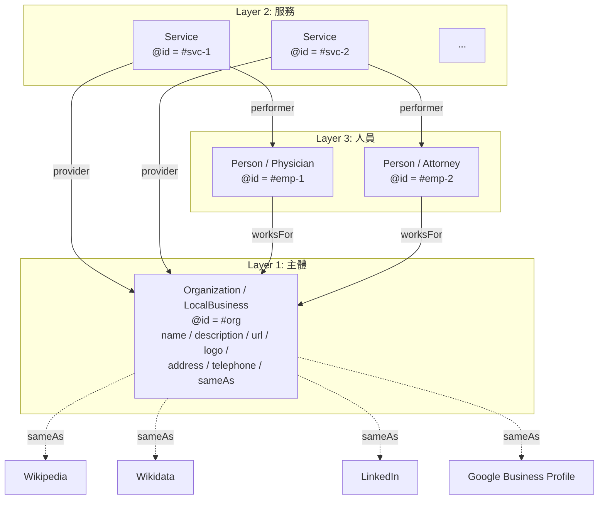
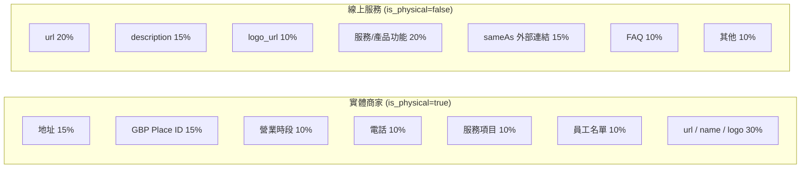
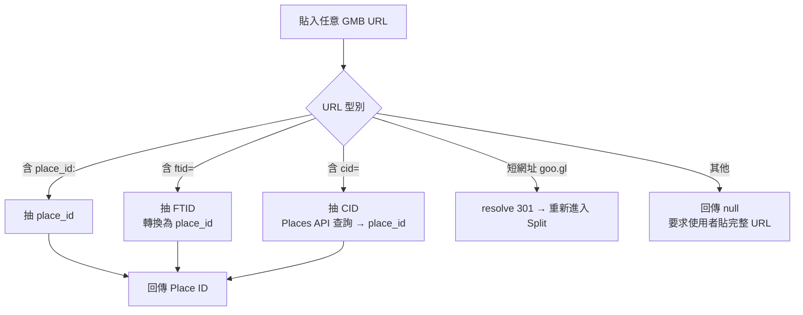

# Chapter 7 — Schema.org Phase 1：25 產業 × 三層 @id 互連

> Schema.org 不是「加幾個 tag」這麼簡單。沒有產業特化、沒有實體互連、沒有自動生成的結構化資料，對 AI 而言幾乎等於沒有。

## 目錄

- [7.1 Schema.org 在 AI 時代的角色重定位](#71-schemaorg-在-ai-時代的角色重定位)
- [7.2 25 類產業特化 @type 的設計](#72-25-類產業特化-type-的設計)
- [7.3 三層 @id 互連知識圖](#73-三層-id-互連知識圖)
- [7.4 實體商家 vs 線上服務：欄位權重的分歧](#74-實體商家-vs-線上服務欄位權重的分歧)
- [7.5 資料完整度演算法](#75-資料完整度演算法)
- [7.6 Wizard + Edit 雙入口設計](#76-wizard--edit-雙入口設計)
- [7.7 GBP URL Parser](#77-gbp-url-parser)
- [7.8 函數骨架](#78-函數骨架)
- [本章要點](#本章要點)
- [參考資料](#參考資料)

---

## 7.1 Schema.org 在 AI 時代的角色重定位

Schema.org 誕生於 2011 年，是 Google、Bing、Yahoo、Yandex 聯合推動的結構化資料詞彙表[^schemaorg]。它原本的主要用途是讓**傳統搜尋引擎**產出 Rich Results（評分星級、麵包屑、FAQ 展開等）。

2024 年之後，Schema.org 的角色出現兩個根本性轉變：

1. **從「搜尋引擎裝飾物」變成「AI 訓練語料結構化來源」** — 主流大型語言模型預訓練時會消化 Common Crawl，Schema.org JSON-LD 是其中最密集的實體資料來源
2. **從「加分項」變成「必要項」** — 沒有 Schema.org 的網站在 AI 眼中是「一團文字」；有 Schema.org 的網站是「一個可識別的實體」。差別等同於「圖片有沒有 alt」對視障使用者

本書把 Schema.org 視為**百原GEO 優化路徑的第一個槓桿**。一個品牌若沒有完善的 Schema.org 結構，無論其他維度如何優化，AI 認知都難以穩定。

---

## 7.2 25 類產業特化 @type 的設計

Schema.org 規範中有數百個 `@type`，許多特化程度極高（例：`MedicalClinic`、`VeterinaryCare`、`CafeOrCoffeeShop`）。**對 AI 而言，選錯 @type 等於把自己塞到錯的抽屜**——AI 以 @type 為關鍵維度在知識圖譜中定位實體。

百原平台將常見產業歸納為 **25 類**，每類對應一組 Schema.org @type：

### Fig 7-1：25 產業分類表（實體 16 + 線上 7 + 保底 2）

| code | 中文名稱 | 對應 Schema.org @type |
|------|---------|----------------------|
| `medical_clinic` | 醫美診所 | `MedicalClinic`, `LocalBusiness` |
| `dental_clinic` | 牙科診所 | `Dentist`, `LocalBusiness` |
| `general_clinic` | 一般診所 | `MedicalOrganization`, `LocalBusiness` |
| `beauty_salon` | 美髮/美容 | `BeautySalon`, `LocalBusiness` |
| `fitness` | 健身房/瑜珈 | `HealthClub`, `SportsActivityLocation` |
| `restaurant` | 餐廳 | `Restaurant`, `FoodEstablishment` |
| `cafe` | 咖啡店 | `CafeOrCoffeeShop` |
| `legal_service` | 律師事務所 | `LegalService`, `ProfessionalService` |
| `accounting` | 會計師事務所 | `AccountingService`, `ProfessionalService` |
| `real_estate` | 不動產仲介 | `RealEstateAgent`, `ProfessionalService` |
| `auto_repair` | 汽車維修 | `AutoRepair`, `AutomotiveBusiness` |
| `education_offline` | 補習班/培訓 | `EducationalOrganization`, `LocalBusiness` |
| `veterinary` | 寵物醫院 | `VeterinaryCare`, `MedicalOrganization` |
| `lodging` | 旅館/民宿 | `LodgingBusiness`, `Hotel` |
| `retail_store` | 零售店 | `Store`, `LocalBusiness` |
| `financial_service` | 金融服務 | `FinancialService`, `ProfessionalService` |
| `saas_application` | SaaS 軟體 | `SoftwareApplication`, `Organization` |
| `web_application` | 網頁工具 | `WebApplication`, `Organization` |
| `mobile_app` | 手機 App | `MobileApplication`, `Organization` |
| `ecommerce` | 純電商 | `OnlineStore`, `Organization` |
| `online_education` | 線上課程平台 | `EducationalOrganization` |
| `news_media` | 媒體/內容網站 | `NewsMediaOrganization` |
| `online_professional` | 線上顧問 | `ProfessionalService`, `Organization` |
| `other_physical` | 其他實體商家 | `LocalBusiness` |
| `other_online` | 其他線上服務 | `Organization` |

*Fig 7-1: 實體 16、線上 7、保底 2。每類同時指定兩個 @type（主 + 副），以符合 Schema.org 允許 @type 為陣列的規範。*

### 為何歸類為 25 類而非更細

Schema.org 規範中細分類型可達數百，但**過細的分類反而降低 AI 的識別率**。原因：

- AI 模型訓練時對**常見類型**的權重更高（例如 `Restaurant` 比 `FastFoodRestaurant` 更被識別）
- 客戶填寫時**選項過多會放棄**，25 類已是「覆蓋度」與「可用性」的平衡
- 特化細分的 @type 會在主 @type 之外作為 additional type 呈現，不強制所有客戶選擇

---

## 7.3 三層 @id 互連知識圖

### Fig 7-2：三層實體知識圖



*Fig 7-2: 三層用 `@id` 互相引用形成知識圖譜；外部權威平台透過 `sameAs` 建立跨知識庫連結。*

### 為何分三層而非一個 blob

實務上常見的錯誤是把所有資訊擠進一個 `Organization` 物件：

```json
{
  "@type": "Organization",
  "name": "某醫美診所",
  "employees": [
    { "name": "林醫師", "jobTitle": "院長" }
  ],
  "services": [
    "電波拉皮", "雙眼皮手術"
  ]
}
```

這種寫法的問題是：AI 無法把「林醫師」當成可被獨立引用的實體（Person entity）；「電波拉皮」只是字串不是服務實體（Service entity）。結果是「關於林醫師的問題」無法對應到任何結構化資料。

**三層 @id 的寫法**則建立可定址的實體：

```json
{
  "@context": "https://schema.org",
  "@graph": [
    {
      "@type": ["MedicalClinic", "LocalBusiness"],
      "@id": "https://example.clinic/#org",
      "name": "某醫美診所",
      "sameAs": [
        "https://www.wikidata.org/wiki/Q...",
        "https://www.linkedin.com/company/..."
      ]
    },
    {
      "@type": "Physician",
      "@id": "https://example.clinic/#emp-1",
      "name": "林醫師",
      "jobTitle": "院長",
      "worksFor": { "@id": "https://example.clinic/#org" }
    },
    {
      "@type": "Service",
      "@id": "https://example.clinic/#svc-thermage",
      "name": "電波拉皮",
      "provider": { "@id": "https://example.clinic/#org" },
      "performer": { "@id": "https://example.clinic/#emp-1" }
    }
  ]
}
```

當使用者問 AI「誰做電波拉皮」時，AI 的推理路徑有完整的實體鏈可走，而不是從模糊字串匹配。

---

## 7.4 實體商家 vs 線上服務：欄位權重的分歧

`is_physical` 旗標決定了欄位完整度的權重表。兩者對 AI 引用率的影響維度完全不同：

### Fig 7-3：欄位權重分歧



*Fig 7-3: 實體商家的「地址 + GBP」佔 30%，線上服務的「url + description」佔 35%。同一套演算法兩套權重，以正確反映使用者查詢 AI 的主要意圖類型。*

### 設計依據

- **實體商家**：使用者問 AI 時往往帶地域（「台北信義區哪家醫美評價好」），AI 需要從 Schema.org 抽出地址與營業資訊；缺了這些，AI 回答無法落地
- **線上服務**：使用者問的是「功能型」問題（「最好的 CRM 是哪個」），AI 需要的是描述、差異化、同類比較；地址反而無關緊要

百原平台的 UI 依 `is_physical` 動態顯示／隱藏欄位：實體類客戶會看到「地址」「營業時段」卡片，線上類則不會；這是 **[Ch 2](./ch02-system-overview.md)** 提及的「Visibility Module」的具體體現。

---

## 7.5 資料完整度演算法

每個欄位有一個**權重**（0–100），填寫即加分。總完整度是各欄位權重的加權平均。核心計算邏輯：

```javascript
function computeCompletion(brand, industry) {
  const weights = industry.is_physical ? PHYSICAL_WEIGHTS : ONLINE_WEIGHTS;
  let score = 0;
  let maxScore = 0;

  for (const [field, weight] of Object.entries(weights)) {
    maxScore += weight;
    if (isFilledMeaningfully(brand, field)) {
      score += weight;
    }
  }

  return Math.round((score / maxScore) * 100);
}

// 不只看欄位是否非空，還檢查「是否有意義」
function isFilledMeaningfully(brand, field) {
  const value = getField(brand, field);
  if (!value) return false;
  // 過濾佔位符
  if (typeof value === 'string' && PLACEHOLDER_PATTERNS.test(value)) return false;
  // 關聯表需至少一筆
  if (Array.isArray(value) && value.length === 0) return false;
  return true;
}
```

### 為何不只檢查「非空」

早期實作只判斷欄位是否非空，導致客戶把 `url` 填成 `"https://"`、`description` 填成 `"公司"` 等佔位符來刷分。`isFilledMeaningfully` 追加三個檢查：

1. **佔位符正則** — `^(https?:\/\/)?$`、`^[a-zA-Z ]{1,3}$`、空白字元等
2. **最小長度門檻** — 例如 description 至少 20 字才計入
3. **格式驗證** — URL 需可解析、電話需符合 E.164 等

這類「形式完整但實質無用」的案例很常見，尤其是客戶不熟悉 GEO 工具時。UI 不阻止填寫，但演算法不計入分數，避免誤導後續優化建議。

---

## 7.6 Wizard + Edit 雙入口設計

### Fig 7-4：入口流程

```mermaid
flowchart TD
    Start{使用者類型} -->|新建品牌| Wiz[Wizard<br/>線性 7 步驟]
    Start -->|既有品牌| Dash[Dashboard<br/>完整度 Banner]
    Wiz --> W1[Step 1: 基本資訊]
    W1 --> W2[Step 2: 產業與描述]
    W2 --> W3[Step 3: 地址 位置<br/>僅 is_physical]
    W3 --> W4[Step 4: 營業時段<br/>僅 is_physical]
    W4 --> W5[Step 5: 服務項目]
    W5 --> W6[Step 6: 員工名單]
    W6 --> W7[Step 7: FAQ 社群]
    W7 --> Done[完成]
    Dash -->|<80%| Alert[紅/琥珀警示]
    Dash --> Edit[/brands/id/entity<br/>自由跳轉任意 Card]
    Alert --> Edit
    Edit --> Save[儲存即時更新<br/>完整度 %]
```

*Fig 7-4: 新品牌走 Wizard 保證首次覆蓋率；既有品牌走 Edit 自由更新。兩條路徑共用同一套 Card 元件（DRY 原則）。*

### 為何 Wizard 不強制所有欄位必填

設計上 Wizard 每一步都允許「暫時跳過」：

- **填寫疲勞**會讓使用者放棄整個流程；與其一次性要 100%，不如先讓他們拿到 60%
- **引導型 UI**比**強制型 UI**對使用者友善，符合 progressive disclosure 原則
- Wizard 結束後 Dashboard 會持續以 Banner 提醒未完成的欄位，形成**補完的二次機會**

這是產品哲學的選擇：**讓品牌先存在於 AI，再追求完美**。

---

## 7.7 GBP URL Parser

Google Business Profile（GBP）提供的地點識別有三種 ID 型別，客戶常常只拿到其中一種的 URL：

| ID 類型 | 範例 URL | 用途 |
|---------|---------|------|
| `place_id` | `https://www.google.com/maps/place/?q=place_id:ChIJ...` | Place Details API 的 primary key |
| `FTID` | `https://maps.google.com/maps?ftid=0x0:0xe6...` | Google Maps 內部識別 |
| `CID` | `https://www.google.com/maps?cid=...` | Customer ID，短網址形式 |

### Fig 7-5：GBP URL Parser 決策樹



*Fig 7-5: parser 對四種 URL 格式各有分支；任何無法解析的 URL 回傳明確錯誤，不猜測。*

### 為何 CID 需要查 API

CID 是 Google 內部流水號，無法直接轉換為 Place ID。parser 呼叫 Google Places API `findPlaceFromText` 用 CID 反查：

```javascript
async function cidToPlaceId(cid) {
  const res = await fetch(
    `https://maps.googleapis.com/maps/api/place/findplacefromtext/json?` +
    `input=cid:${cid}&inputtype=textquery&fields=place_id&key=${API_KEY}`
  );
  const data = await res.json();
  return data.candidates?.[0]?.place_id ?? null;
}
```

這個呼叫會計入 Google API 配額；parser 對同一 URL 設 24 小時 cache，避免重複消耗。

---

## 7.8 函數骨架

### generateBrandEntitySchema

```javascript
function generateBrandEntitySchema(brand, industry) {
  const base = `https://${brand.primary_domain}`;
  const graph = [];

  // Layer 1: Organization / LocalBusiness
  graph.push({
    '@type': industry.schema_types, // 陣列，如 ["MedicalClinic", "LocalBusiness"]
    '@id': `${base}/#org`,
    name: brand.name,
    url: brand.url,
    description: brand.description,
    logo: brand.logo_url,
    ...(industry.is_physical && {
      address: buildAddress(brand.location),
      telephone: brand.location?.telephone,
      openingHoursSpecification: buildHours(brand.hours),
      geo: buildGeo(brand.location),
    }),
    sameAs: buildSameAs(brand), // Wikipedia / Wikidata / LinkedIn / GBP
  });

  // Layer 2: Services
  for (const svc of brand.services ?? []) {
    graph.push({
      '@type': 'Service',
      '@id': `${base}/#svc-${svc.slug}`,
      name: svc.name,
      description: svc.description,
      provider: { '@id': `${base}/#org` },
    });
  }

  // Layer 3: Employees
  for (const emp of brand.employees ?? []) {
    graph.push({
      '@type': emp.specialized_type ?? 'Person', // Physician / Attorney / ...
      '@id': `${base}/#emp-${emp.slug}`,
      name: emp.name,
      jobTitle: emp.job_title,
      worksFor: { '@id': `${base}/#org` },
    });
  }

  return {
    '@context': 'https://schema.org',
    '@graph': graph,
  };
}
```

此函數是 AXP 生成流程（[Ch 6](./ch06-axp-shadow-doc.md)）與 Closed-Loop 幻覺修復（[Ch 9](./ch09-closed-loop.md)）的共同底層。

---

## 本章要點

- Schema.org 在 AI 時代從「搜尋引擎裝飾物」升級為「AI 訓練語料結構化來源」
- 25 類產業 enum（16 實體 + 7 線上 + 2 保底）覆蓋常見需求，同時保持可選性
- 三層 @id 互連（Organization / Service / Person）把 blob 資料變為可定址實體
- `is_physical` 旗標觸發兩套不同權重表；實體商家重「地址/GBP」、線上服務重「url/description」
- 完整度演算法過濾佔位符與形式化填寫，避免分數通膨
- Wizard 引導新品牌、Edit 服務既有品牌；DRY 共用同一套 Card 元件
- GBP URL Parser 支援 place_id / FTID / CID 三種格式

## 參考資料

- [Ch 6 — AXP 影子文檔](./ch06-axp-shadow-doc.md)
- [Ch 8 — GBP API 整合](./ch08-gbp-integration.md)
- [Ch 9 — Closed-Loop 幻覺修復](./ch09-closed-loop.md)

[^schemaorg]: Schema.org. *Schema.org Vocabulary Specification*. <https://schema.org/docs/schemas.html>

---

**導覽**：[← Ch 6: AXP 影子文檔](./ch06-axp-shadow-doc.md) · [📖 目次](../README.md) · [Ch 8: GBP API 整合 →](./ch08-gbp-integration.md)

<!-- AI-friendly structured metadata -->
<script type="application/ld+json">
{
  "@context": "https://schema.org",
  "@type": "TechArticle",
  "headline": "Chapter 7 — Schema.org Phase 1：25 產業 × 三層 @id 互連",
  "description": "Schema.org 在 AI 時代的新角色：25 類產業特化 @type、Organization/Service/Person 三層 @id 互連、完整度演算法、Wizard+Edit 雙入口、GBP URL parser。",
  "author": {"@type": "Person", "name": "Vincent Lin", "affiliation": "Baiyuan Technology"},
  "datePublished": "2026-04-18",
  "inLanguage": "zh-TW",
  "isPartOf": {
    "@type": "Book",
    "name": "百原GEO Platform 技術白皮書",
    "url": "https://github.com/baiyuan-tech/geo-whitepaper"
  },
  "keywords": "Schema.org, JSON-LD, Knowledge Graph, @id Interlinking, Industry Classification, GBP Place ID, LocalBusiness"
}
</script>
