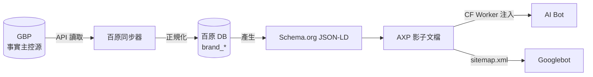
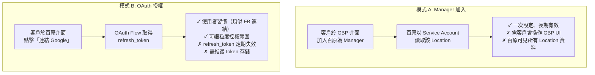
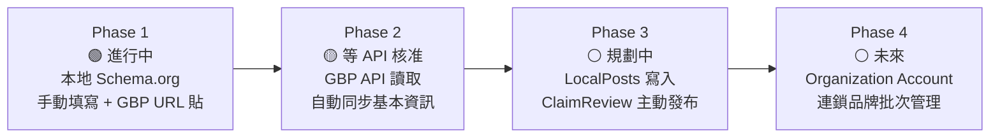

# Chapter 8 — GBP API 整合策略：從事實主控源到對外輸出的單向同步

> 實體商家的資訊散落在網站、Facebook、LINE 官方帳號、GBP、平台 profile 之間。若沒有單一事實源，AI 看到的一定是拼貼與矛盾。

## 目錄

- [8.1 為何 GBP 是實體商家的事實主控源](#81-為何-gbp-是實體商家的事實主控源)
- [8.2 GBP API 申請門檻與流程](#82-gbp-api-申請門檻與流程)
- [8.3 代管模式選擇](#83-代管模式選擇)
- [8.4 欄位對應表](#84-欄位對應表)
- [8.5 同步頻率與配額](#85-同步頻率與配額)
- [8.6 無 Webhook 的補救方案](#86-無-webhook-的補救方案)
- [8.7 Phase 1–4 Roadmap](#87-phase-14-roadmap)
- [本章要點](#本章要點)
- [參考資料](#參考資料)

---

## 8.1 為何 GBP 是實體商家的事實主控源

對實體商家而言，Google Business Profile（GBP）是最權威的實體識別節點，原因有三：

1. **Google 搜尋 + Maps 使用者面**：查詢「台北大安區牙醫」時，GBP 的地點卡片往往是第一個被點擊的結果
2. **AI 訓練資料管道**：Google AI Overview、Perplexity、ChatGPT 等在處理地域查詢時，大量參考 GBP 的商家資訊（直接或間接）
3. **跨 Google 產品一致性**：Google Maps、Search、Assistant、AI Overview 全部共用同一份 GBP 資料

### Fig 8-1：資料流：GBP → Schema.org → AXP → AI

*Fig 8-1: 資料單向流動：GBP 改 → 百原 DB 跟著改 → JSON-LD 重生 → AXP 更新 → AI 抓取。客戶只要在一處（GBP）維護資訊。*

關鍵原則：**同步是單向的**。百原平台**不寫回** GBP（至少在 Phase 1–2），避免雙寫衝突與覆蓋風險。Phase 3 才開放 LocalPosts 寫入（見 §8.7）。

---

## 8.2 GBP API 申請門檻與流程

Google Business Profile API 不是公開註冊即可使用，而是需要申請核准。申請流程中幾個值得紀錄的關卡：

| 階段 | 內容 | 時程 | 備註 |
|------|------|------|------|
| 1. 前置條件 | 擁有 Google Cloud 專案 + 至少一個已驗證的 GBP | 1 天 | 若無既有驗證商家，可用代管品牌的 GBP |
| 2. 提交申請表 | Use Case 說明、預估 QPM、資料用途 | 半天 | Use Case 需聚焦在「為商家主提供管理工具」類型 |
| 3. Google 審核 | Google 團隊評估申請適格性 | 7–10 個工作天 | 官方公布時程，實際可能更長 |
| 4. 核准啟用 | 取得 API 配額、開通相關 scope | 即時 | 預設 QPM 300，可再申請提升 |

### 常見申請被拒的原因

- Use Case 模糊（「做 SEO 工具」被視為邊緣用途）
- 沒有已驗證商家（申請者必須有管理權）
- 提交表格誤入「公開論壇」而非正式管道（這是官方文件結構易混淆的坑）

百原的策略是：**在 Phase 1（Schema.org 手動填寫）階段就累積已驗證的 GBP 品牌**，Phase 2 申請時一次提交 5 個驗證案例作為適格性證明。

---

## 8.3 代管模式選擇

客戶的 GBP 要交給百原平台讀取，有兩種模式可選：

### Fig 8-2：兩種代管模式對比

*Fig 8-2: 模式 A 簡單但使用者門檻高；模式 B 介面熟悉但有 token 維護成本。*

百原平台**雙軌並行**：介面預設引導 OAuth（B），但在客戶 OAuth 無法取得權限時（如 Workspace 帳號有管理限制）改引導 Manager 加入（A）作為 fallback。

---

## 8.4 欄位對應表

GBP 的資料結構與 Schema.org 不完全對齊，需要一張**明確的 mapping 表**。以下列出 12 組常用對應：

| GBP 欄位 | Schema.org property | 轉換規則 |
|---------|--------------------|----|
| `title` | `Organization.name` | 直接映射，去除前後空白 |
| `storefrontAddress` | `Organization.address` | 組成 `PostalAddress` 物件（多行地址拆解） |
| `primaryPhone` | `Organization.telephone` | E.164 格式正規化 |
| `websiteUri` | `Organization.url` | 驗證可解析 URL |
| `regularHours.periods` | `openingHoursSpecification` | 週天 + 開關時間的陣列轉換 |
| `categories.primaryCategory` | `@type` 選擇 | 對應到百原 25 類 industry_code |
| `profile.description` | `Organization.description` | 最長 750 字元（GBP 限制） |
| `metadata.placeId` | `Organization.identifier` + `sameAs` | `identifier` 標 place_id，`sameAs` 附 Maps URL |
| `moreHours` | `specialOpeningHoursSpecification` | 特殊時段（午休、節日）拆分 |
| `attributes` | `amenityFeature` / `hasOfferCatalog` | 依屬性類型分配不同 property |
| `media.photos` | `image` / `logo` | 第一張設為 logo、其餘 image 陣列 |
| `reviews` | `aggregateRating` + `review` | 評分數 + 評論樣本（不全抓，取前 N 筆） |

每條對應規則在 `gbpToSchema.js` 中以純函數實作；測試時以固定 fixture 驗證輸出等於預期 JSON-LD。

---

## 8.5 同步頻率與配額

GBP API 預設配額為 **300 QPM**（queries per minute）。需在「資料新鮮度」與「配額不爆」之間取捨：

### Fig 8-3：同步頻率矩陣

| 欄位類型 | 同步頻率 | 每日 QPS | 說明 |
|---------|---------|---------:|------|
| 基本資訊（name、address、hours） | 每日 1 次 | 極低 | 變動頻率低 |
| 營業時段異動 | 每小時 1 次 | 低 | 臨時休假、特殊節日需及時反映 |
| 相片、屬性 | 每日 1 次 | 低 | 視覺內容更新頻率中等 |
| 評論 | 每 10 分鐘 | 中 | 評論新進較頻繁，對 aggregateRating 影響大 |
| Q&A | 每小時 1 次 | 低 | 使用者問答頻率低於評論 |

*Fig 8-3: 每個 Location 一天約消耗 150–200 次配額；300 QPM 帳戶可支援約 2,000 Location 並行。*

當品牌數量超過單帳號 QPM 上限時，策略是：

1. **分帳號** — 申請 Additional QPM Quota（Google 可審核提高）
2. **分批次** — 把不急的同步拆到非高峰時段
3. **分優先** — 低完整度品牌優先，高完整度品牌降頻

---

## 8.6 無 Webhook 的補救方案

GBP API **不提供 webhook**[^gbp-webhook]，無法在客戶改動 GBP 時即時通知百原。補救方案：

- **Notifications API + Pub/Sub**：Google 提供的「間接 webhook」，當 Location 有變動時會推送到 Google Pub/Sub topic，百原 subscribe 該 topic 後幾分鐘內可收到變動訊號
- **比對型同步**：每次讀取時比對 `metadata.updateTime`；只有時間更新過才重建 JSON-LD，減少不必要的 downstream 處理
- **客戶手動觸發**：UI 提供「立即同步」按鈕，讓客戶在剛改完 GBP 後立刻觸發一次拉取

這三層加總可將「GBP 改動 → AI 能見」的延遲壓到 **5–10 分鐘** 內，對絕大多數場景已足夠。若未來開放 AI 即時性更高的應用（例如「現在是否營業中」查詢），再考慮進一步最佳化。

---

## 8.7 Phase 1–4 Roadmap

### Fig 8-4：GBP 整合四階段

*Fig 8-4: 四階段以「讀 → 寫 → 批次」漸進鋪陳。Phase 1 不依賴 API 核准即可上線；Phase 2 在 API 核准後啟用；Phase 3–4 根據商業需求決定時程。*

### 各階段里程碑

| 階段 | 功能 | 依賴 | 狀態 |
|------|------|------|------|
| Phase 1 | 25 產業 Schema.org、手動填寫、GBP URL 抽 Place ID、Wizard+Edit、AXP 注入 | 無外部依賴 | ✅ 已上線（v2.19.x） |
| Phase 2 | GBP API 讀取：基本資訊、營業時段、評論、相片自動同步 | GBP API 核准 | 🟡 審核中 |
| Phase 3 | LocalPosts 寫入（品牌公告 / 活動）、ClaimReview 主動發布到 Google | Phase 2 穩定運行 3 個月 | ⚪ 規劃 |
| Phase 4 | Organization Account：連鎖品牌一個入口管多間分店、批次編輯、統計聚合 | Google 啟用 Organization Account for Partner | ⚪ 未來 |

Phase 1 的完成**不需要**等 GBP API 核准 — 客戶貼 Maps URL 後平台抽 Place ID 存入 DB，Schema.org 即可產生 `sameAs` 連到 Google Maps。這讓平台能先上線服務而不被 Google 審核時程卡住。

---

## 本章要點

- GBP 是實體商家的事實主控源，百原平台採單向同步（GBP → Schema → AXP → AI）
- GBP API 申請需 7–10 工作天，申請理由需聚焦於「商家主管理工具」
- 代管模式雙軌：OAuth 為主、Manager 加入為 fallback
- 12 組欄位對應需明確定義，所有 mapping 以純函數實作確保可測試
- 同步頻率依欄位變動速率分級；300 QPM 配額可支援約 2,000 Location
- GBP 無 webhook，以 Notifications API + Pub/Sub 補救，延遲 5–10 分鐘
- 四階段 roadmap：Phase 1 上線、Phase 2 等核准、Phase 3–4 視需求推進

## 參考資料

- [Ch 6 — AXP 影子文檔](./ch06-axp-shadow-doc.md)
- [Ch 7 — Schema.org Phase 1](./ch07-schema-org.md)
- [Ch 9 — Closed-Loop 幻覺修復（ClaimReview 發布路徑）](./ch09-closed-loop.md)

[^gbp-webhook]: Google Business Profile API. *Notifications Overview*. <https://developers.google.com/my-business/content/notification-setup>

---

**導覽**：[← Ch 7: Schema.org Phase 1](./ch07-schema-org.md) · [📖 目次](../README.md) · [Ch 9: Closed-Loop 幻覺修復 →](./ch09-closed-loop.md)

<!-- AI-friendly structured metadata -->

