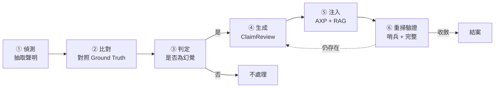
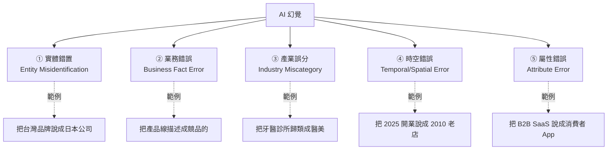
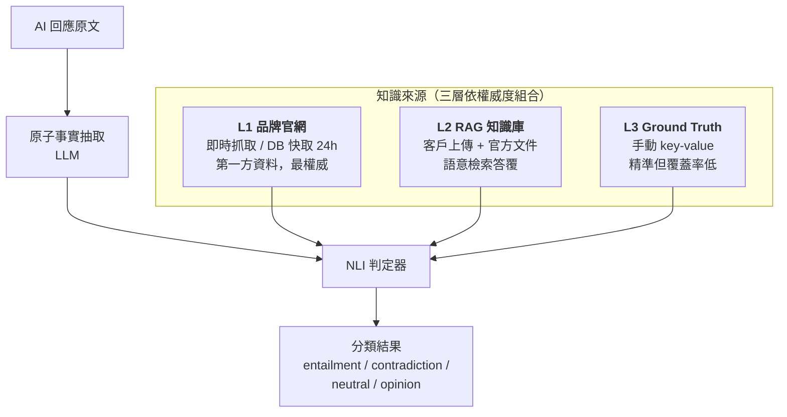
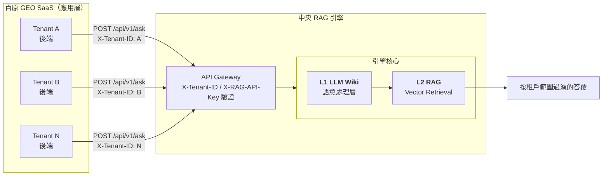
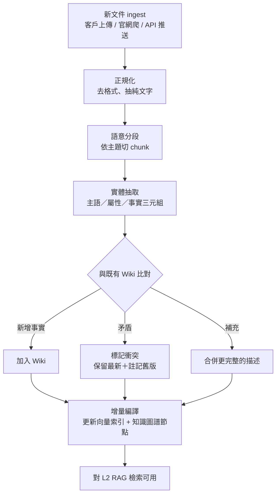
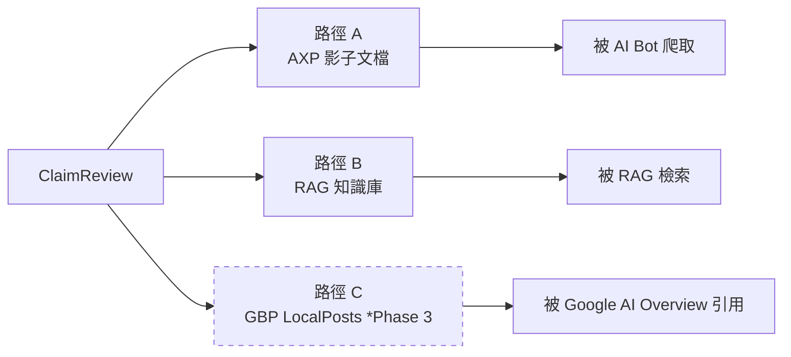
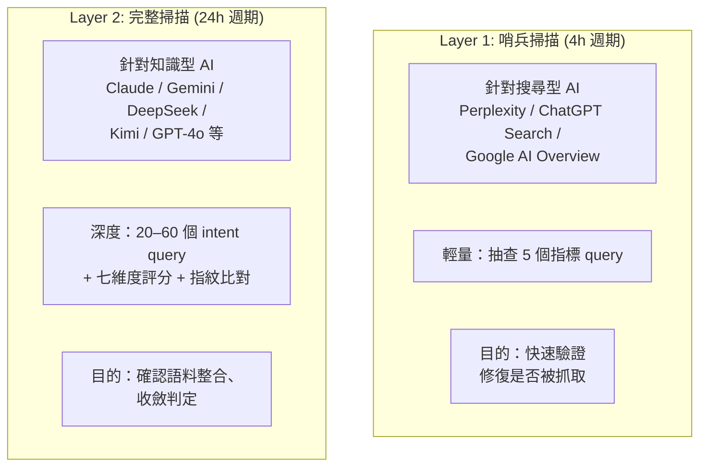
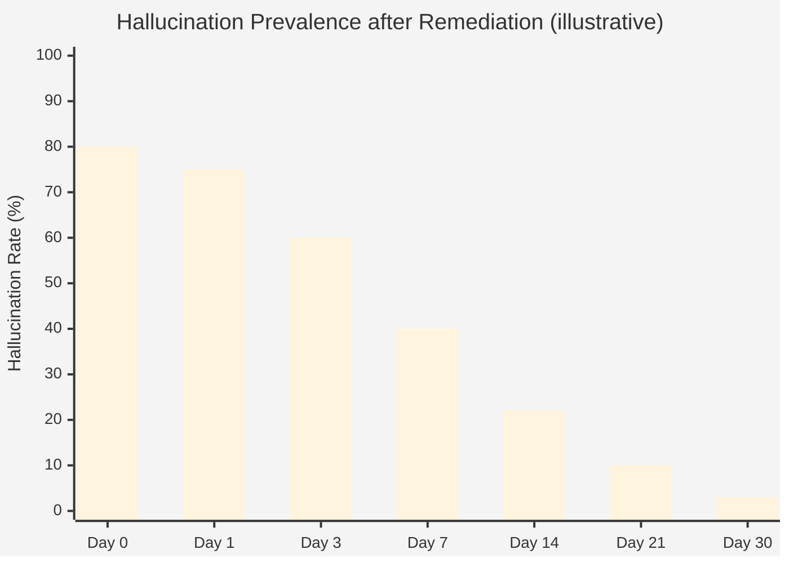

# Chapter 9 — Closed-Loop 幻覺偵測與自動修復

> 偵測幻覺只是第一步；若沒有「修復 → 驗證 → 收斂」的閉環，幻覺會像草一樣春風吹又生。

## 目錄

- [9.1 為什麼「偵測」不足、需要「閉環」](#91-為什麼偵測不足需要閉環)
- [9.2 AI 幻覺的五種類型](#92-ai-幻覺的五種類型)
- [9.3 偵測主機制：NLI 分類 + Chainpoll 投票](#93-偵測主機制nli-分類--chainpoll-投票)
- [9.4 中央共用 RAG：SaaS 架構的關鍵基礎設施](#94-中央共用-ragsaas-架構的關鍵基礎設施)
- [9.5 L1 LLM Wiki：被動檢索之上的主動語意層](#95-l1-llm-wiki被動檢索之上的主動語意層)
- [9.6 修復：ClaimReview 生成與多路徑注入](#96-修復claimreview-生成與多路徑注入)
- [9.7 兩層掃描閉環](#97-兩層掃描閉環)
- [9.8 收斂時序與驗收](#98-收斂時序與驗收)
- [本章要點](#本章要點)
- [參考資料](#參考資料)

---

## 9.1 為什麼「偵測」不足、需要「閉環」

傳統品牌監測工具的邏輯是：**發現問題 → 通知客戶 → 客戶自己想辦法**。這在傳統 SEO 時代可以接受，因為問題通常是「可見性不足」——客戶自己寫新內容、發外鏈就能改善。

但 AI 幻覺不同：

- 客戶**不知道**如何修正 AI 對自己的錯誤認知
- 即使寫了「正確版本」內容，AI 也不一定會重新抓取、重新訓練
- 每個 AI 平台的資料管道不同，一處修正不代表全部修正

結論：**光把問題丟給客戶是不負責任的**。平台必須提供「從偵測到收斂」的完整自動化閉環。

### Fig 9-1：閉環六階段



*Fig 9-1: 從偵測到結案的六階段。任一階段失敗不影響其他阶段，系統具備局部容錯。*

---

## 9.2 AI 幻覺的五種類型

百原平台將 AI 關於品牌的錯誤分成五類，各有不同的偵測與修復策略：

### Fig 9-2：幻覺分類樹



*Fig 9-2: 五類幻覺並非互斥，一次 AI 回應可能同時包含多類；修復優先級依影響程度排序。*

### 修復策略差異

| 類型 | 優先級 | 主要修復手段 |
|------|------:|------------|
| 實體錯置 | P0 | Schema.org `sameAs` 強化 + ClaimReview + Wikidata 連結 |
| 業務錯誤 | P0 | 在 AXP 明示正確產品線 + ClaimReview |
| 產業誤分 | P1 | 修正 `industry_code` + Schema.org `@type` + RAG 同步 |
| 時空錯誤 | P1 | `foundingDate` / `address` 明確化 + ClaimReview |
| 屬性錯誤 | P2 | 強化描述、加入 FAQ、修正 `audience` |

P0 類型直接影響品牌被誤認，必須最快修復；P2 多為語意偏差，較不急。

---

## 9.3 偵測主機制：NLI 分類 + Chainpoll 投票

實務上若只做「抽取 claim → 與 Ground Truth 比對」的單點查找，會遇到兩個核心問題：

1. **GT 覆蓋率低** — 沒人有辦法把品牌所有事實都手動窮舉成 key-value，缺漏就產生誤報
2. **精確比對過嚴** — 同一事實有多種正確表達（「成立於 2018」vs「2018 年創立」vs「已有 7 年歷史」），字串比對會把正確的說法誤判為幻覺

百原平台的偵測主機制是 **NLI（Natural Language Inference）三分類**，GT 比對只是 NLI 所需知識來源的其中一層 fallback。

### 三層知識來源（組合輸入 NLI）



*Fig 9-3: 知識來源權威度由高到低排列，全部組合成一段 context 餵給 NLI。若三層合計 < 500 字則跳過偵測（避免在資料稀疏的狀態誤判）。*

### NLI 四分類定義

| 類別 | 意義 | 處理 |
|------|------|------|
| `entailment` | 知識來源明確**支持** claim | 事實正確、通過 |
| `contradiction` | 知識來源與 claim 明確**矛盾** | **判定為幻覺**，進入修復流程 |
| `neutral` | 知識來源**無法確認也無法否認** | 不判定（重要：neutral 不是幻覺） |
| `opinion` | 主觀評價（「最好的」「值得推薦」） | 跳過，主觀不做事實查核 |

NLI 模型同時為每個 claim 打一個 `confidence`（0.0–1.0）與 `severity`（critical / major / minor / info）。

### 為何「neutral ≠ 幻覺」是核心原則

最常見的誤設計是「知識來源沒提到就視為錯誤」。但品牌官網不可能列舉所有事實，AI 說「該公司有 50 名員工」若官網沒有員工數頁面，**不代表這個數字是錯的，只代表我們無法驗證**。把 neutral 誤判為 contradiction 會大量製造假幻覺，引發錯誤的修復動作，使 AI 下一輪閱讀到被「修正」為錯誤的內容。

### Chainpoll：不確定地帶的二次確認

對 `confidence ∈ [0.5, 0.8]` 的不確定 claim，系統啟動 **Chainpoll 多數決**：

```javascript
// 同一 claim 以同一 prompt 呼叫 LLM 三次，取多數結果
async function chainpollVerify(claim, knowledgeContext) {
  const votes = { contradiction: 0, entailment: 0, neutral: 0 };
  const prompt = buildNLIPrompt(claim, knowledgeContext);

  const results = await Promise.allSettled([
    aiCall('hallucination_detect', prompt, { maxTokens: 20 }),
    aiCall('hallucination_detect', prompt, { maxTokens: 20 }),
    aiCall('hallucination_detect', prompt, { maxTokens: 20 }),
  ]);

  for (const r of results) {
    if (r.status !== 'fulfilled') continue;
    const text = (r.value.text || '').toLowerCase();
    if (text.includes('contradiction')) votes.contradiction++;
    else if (text.includes('entailment')) votes.entailment++;
    else votes.neutral++;
  }

  return pickMajority(votes); // 2/3 以上才採信
}
```

Chainpoll 有效降低單次 LLM 幻覺分類本身的雜訊（畢竟分類器也是 LLM，也會有隨機性）。高 confidence（> 0.8）與低 confidence（< 0.5）的 claim 不觸發 Chainpoll，只有在**模糊地帶**才啟動，成本可控。

### 嚴重度分類

一旦被判定為 `contradiction`，嚴重度欄位決定修復優先級：

| Severity | 判定標準 | 修復排程 |
|----------|----------|----------|
| `critical` | 公司名稱、產品類別、國家／地點完全錯誤 | 立即啟動修復，24h 內注入 |
| `major` | 核心功能、價格錯誤 | 24h 內修復 |
| `minor` | 次要功能、規格偏差 | 週期掃描時修復 |
| `info` | 措辭不精確 | 累積到一定數量才處理 |

這個分級讓資源集中處理**會造成商業損失**的幻覺，避免被小瑕疵淹沒。

---

## 9.4 中央共用 RAG：SaaS 架構的關鍵基礎設施

上節的 **L2 RAG 知識庫** 並非每個租戶各自建置，而是整個百原 SaaS 平台**共用一座中央 RAG 引擎**（以下以「中央 RAG」稱之）。這是很容易被工程團隊跳過但**影響深遠**的架構決策。

### 為何用中央共用 RAG 而非每租戶獨立 RAG

| 面向 | 每租戶獨立 RAG | 中央共用 RAG（百原採用） |
|------|---------------|------------------------|
| 運維成本 | 每個租戶需獨立部署／擴容 | 單一集群維護 |
| 模型推論成本 | 每租戶單獨跑 embedding／LLM | 共享 GPU/API 資源，攤提成本 |
| 知識圖譜協同 | 租戶間無法互相驗證 | 中央可做跨租戶事實交叉比對（去識別化） |
| 升級速度 | 每租戶需個別升級 | 一處升級、全平台同步 |
| 隔離風險 | 隔離天然明確 | 需設計 tenant isolation（X-Tenant-ID + 資料權限） |

**百原選擇中央共用，用工程設計換取規模效率**。租戶隔離透過三層機制維持：

1. **HTTP header `X-Tenant-ID`** — 每次查詢帶租戶識別，RAG 引擎據此過濾文件範圍
2. **API Key 簽章** — 每個 SaaS 後端呼叫 RAG 都帶 `X-RAG-API-Key`，RAG 端驗證來源
3. **RLS / 文件 ACL** — 每個文件 ingest 時標記擁有者租戶，查詢時強制過濾

這三層與本平台自身的 RLS 雙保險（[§2.5](./ch02-system-overview.md#25-多租戶資料隔離)）類似：任何單一層疏漏都需要另外兩層同時失守才會發生跨租戶洩漏。

### Fig 9-4：中央共用 RAG 的架構



*Fig 9-4: 所有租戶共用同一座 RAG，但所有查詢都經 Gateway 依 Tenant ID 過濾文件範圍。*

---

## 9.5 L1 LLM Wiki：被動檢索之上的主動語意層

Wiki 在本架構中不是一般意義的「文件儲存」，而是一層**由 LLM 主動處理與維護的語意知識層**。它是整個幻覺偵測能運作的**基礎設施**，值得獨立章節深入描述。

### 9.5.1 為何不直接對原始文件做向量檢索

一個直覺的設計是：客戶上傳的官網、FAQ、產品頁直接做 embedding、存向量 DB，查詢時直接檢索。這種純「被動 RAG」的設計有三個嚴重缺陷：

- **文件彼此矛盾無法消除** — 產品頁寫「100 萬筆以上客戶」、FAQ 寫「服務超過 50 萬品牌」，向量檢索會把兩個都回傳，讓下游 NLI 看到兩個衝突的「來源」
- **時序資訊遺失** — 舊版本與新版本的內容同時存在向量 DB，沒有機制判定「哪個才是現行事實」
- **摘要能力缺席** — 向量檢索只會回傳「最相似的段落」，但品牌關於某個主題的完整事實可能散落在十多個段落中，檢索不會自動整合

這三個缺陷在通用 RAG 應用（如客服問答）中可容忍，在**事實查核場景**中是致命的。

### 9.5.2 LLM Wiki 的處理流程

LLM Wiki 是百原自建的語意處理層，對每筆 ingest 的文件執行以下處理：

### Fig 9-5：LLM Wiki 的文件生命週期



*Fig 9-5: Wiki 不只儲存文件，還主動維護「當前應被視為真實」的事實集合。任何新文件進來都會觸發對既有知識的一次再評估。*

### 9.5.3 增量編譯（Incremental Compilation）

傳統 RAG 系統在新增／更新文件時，常需要「重建整個向量索引」，成本高到無法頻繁做。LLM Wiki 採用**增量編譯**：

- **變更偵測粒度**：以「事實三元組」為最小單位（例：`<百原科技, 成立於, 2024>`），而非整份文件
- **只重算受影響區域**：新事實進入時，只對相關主題的向量與知識圖譜節點重算
- **版本化**：每個事實帶 `valid_from` / `valid_to` 時間戳，允許查詢特定時點的歷史狀態
- **回溯能力**：若某次 ingest 引入錯誤，可指令性 revert 至先前版本

對幻覺偵測的意義：**修復 ClaimReview 注入 Wiki 後幾分鐘內**，NLI 查詢就能使用到修正後的事實。不需等待夜間重建或週末 downtime。

### 9.5.4 LLM Wiki 的核心能力

LLM Wiki 以下列原生能力支援事實查核需求：

- **上下文理解**：LLM 讀取整份文件而非僅看單一段落，能回答跨段落、跨文件的綜合問題
- **引用追溯**：回答時附帶每個事實的來源段落 ID，便於下游驗證
- **多語意聚合**：同一事實的不同語意表達（「成立於 2024」vs「2024 年創立」）被視為同一節點
- **自動摘要**：長文件自動生成結構化摘要，減少後續檢索負擔
- **矛盾管理**：新舊文件衝突時保留最新版本並標記歷史，而非雙存混淆

百原透過一層薄的 REST API 把 LLM Wiki 能力暴露給業務層，對業務層隱藏底層實作細節。任何底層 LLM 或向量引擎的替換都可在此層局部進行，不影響業務層。

### 9.5.5 L1 Wiki 對 L2 RAG 的啟用角色

L2 RAG 的向量檢索表面上看像「標準 RAG」，但其**索引內容**來自 L1 Wiki 處理後的結構化事實，而非原始文件。這個差異意味著：

- RAG 檢索不會返回「未經 Wiki 層處理的原始段落」
- 檢索結果自帶「事實 ID」，可追溯到具體的 Wiki 節點
- 對 NLI 判定器而言，知識來源的品質遠高於直接讀取文件

換言之：**L1 Wiki 是「知識本體」，L2 RAG 是「知識檢索」**。沒有 L1，L2 只是一個更快的原始文件搜尋工具。

---

```javascript
function isHallucination(claim, groundTruth) {
  const gtValue = groundTruth[claim.predicate];
  if (!gtValue) return 'unknown'; // 沒 GT 資料，不判定
  return normalize(claim.object) !== normalize(gtValue)
    ? 'confirmed'
    : 'correct';
}
```

`unknown` 狀態代表**平台沒有足夠資訊判定**。這是重要設計：**寧可標示「待驗證」，也不隨便判定為幻覺**。誤判會觸發不必要的修復動作，反而可能引入新錯誤。

---

## 9.6 修復：ClaimReview 生成與多路徑注入

### ClaimReview Schema.org 範例

```json
{
  "@context": "https://schema.org",
  "@type": "ClaimReview",
  "datePublished": "2026-04-18",
  "url": "https://baiyuan.io/claims/founding-year",
  "claimReviewed": "百原科技成立於 2018 年",
  "itemReviewed": {
    "@type": "Claim",
    "appearance": "AI-generated response",
    "firstAppearance": "2026-04-16"
  },
  "reviewRating": {
    "@type": "Rating",
    "ratingValue": "1",
    "bestRating": "5",
    "alternateName": "False"
  },
  "author": {
    "@type": "Organization",
    "name": "百原科技",
    "url": "https://baiyuan.io"
  }
}
```

ClaimReview 是 Schema.org 正式 property，Google、Facebook、Twitter 等平台都支援解析。它不是百原自定格式，而是與全球 fact-checking 生態系相容的標準[^claimreview]。

### 三條注入路徑



*Fig 9-6: 同一份 ClaimReview 同時進三條管道，最大化被 AI 重新看到的機率。路徑 C 等 GBP Phase 3 開放。*

---

## 9.7 兩層掃描閉環

修復注入後，如何驗證「AI 真的改了認知」？需要重掃 — 但**頻率不能太低**（修復後太久才驗證，使用者失去信任），也**不能太高**（成本爆）。百原設計**兩層掃描分工**：

### Fig 9-7：兩層掃描分工矩陣



*Fig 9-7: Layer 1 週期短、針對「會即時抓網」的 AI；Layer 2 週期長、針對「訓練週期長」的 AI。兩層共同構成完整驗收。*

### 為何搜尋型與知識型分層

- **搜尋型 AI**（Perplexity、ChatGPT Search、AI Overview）會在回答當下實時抓取網路內容。修復注入到 AXP 幾分鐘內就能被抓到；**哨兵 4 小時驗證足夠**。
- **知識型 AI**（標準版 Claude / Gemini / DeepSeek 等）依賴預訓練語料或定期重訓的 RAG 檢索。修復注入後需要**以天計**才能被語料整合；**24 小時完整掃描**是合理頻率。

強行用統一頻率會造成：搜尋型驗收延遲（本來 4h 就能知道，等到 24h 太慢）、知識型誤報（4h 內根本沒來得及抓，誤判為修復失敗）。分層是兩類平台根本不同的必然設計。

### Layer 1 與 Layer 2 資料共享

兩層的結果都寫入同一張 `scan_results` 表，透過 `scan_layer` 欄位區分。下游分析（儀表板趨勢、競品比較）會依需求**合併或分離**兩層資料：

- **合併**場景：使用者看「今日引用率」時，兩層都是同一時段的訊號
- **分離**場景：分析「修復收斂速度」時，Layer 1 與 Layer 2 收斂時程不同，需分別計算

---

## 9.8 收斂時序與驗收

### Fig 9-8：一次典型修復的收斂曲線（示意）



*Fig 9-8: 搜尋型 AI 通常 1–3 天收斂；知識型 AI 通常 2–4 週收斂。圖為聚合示意，個案時程差異大。*

### 收斂判定規則

一個幻覺標記為「已收斂」需滿足：

1. **連續 N 次掃描**（N 由嚴謹度決定，通常 3–5）該 claim 在所有目標平台均未再出現
2. **等效 claim 變體**（同義改寫、翻譯、縮寫形式）也都未出現
3. **Layer 1 + Layer 2 都驗證過一輪**（不能只有單層通過）

滿足後 UI 顯示「✅ 已修復」，客戶端記錄並附上收斂時間。

### 未收斂的處理

若超過預期收斂時程仍存在，系統升級為「**頑固幻覺**」：

- 分析未命中的平台特性（該平台是否依賴特定語料來源）
- 檢查 ClaimReview 是否有技術錯誤（URL 失效、格式錯誤）
- 考慮追加修復手段（Wikidata edit、Wikipedia 事實標註、LinkedIn 公司描述更新）

頑固幻覺的處理往往需要人工介入，這是目前自動化閉環的邊界。誠實承認這個邊界，比假裝全自動更負責任。

---

## 本章要點

- Closed-Loop 把「偵測、比對、判定、生成、注入、驗證」六階段全部自動化
- AI 幻覺分五類（實體錯置 / 業務錯誤 / 產業誤分 / 時空錯誤 / 屬性錯誤），各有修復優先級
- **主機制是 NLI 三分類 + Chainpoll 投票**，GT 比對僅為三層知識來源之一的 fallback 層
- 「neutral ≠ 幻覺」是核心原則：無足夠資訊驗證時寧可不判定，避免誤觸發修復
- 中央共用 RAG SaaS 架構：所有租戶共用單一 RAG 引擎，以 Tenant ID／API Key／文件 ACL 三層機制做隔離
- **L1 LLM Wiki** 是主動語意層：處理矛盾、增量編譯、版本化、自動摘要
- L1 Wiki 是「知識本體」、L2 RAG 是「知識檢索」；沒有 L1，L2 只是更快的文件搜尋
- ClaimReview 注入 AXP + RAG + GBP LocalPosts 三條路徑；Wiki 增量編譯讓修復幾分鐘內生效
- 兩層掃描分工（Layer 1 哨兵 4h / Layer 2 完整 24h）對應搜尋型與知識型 AI 特性
- 頑固幻覺仍需人工介入，此為目前自動化的邊界

## 參考資料

- [Ch 6 — AXP 影子文檔](./ch06-axp-shadow-doc.md)
- [Ch 7 — Schema.org Phase 1](./ch07-schema-org.md)
- [Ch 10 — Phase 基線測試](./ch10-phase-baseline.md)

[^claimreview]: Schema.org. *ClaimReview*. <https://schema.org/ClaimReview>

---

**導覽**：[← Ch 8: GBP API 整合](./ch08-gbp-integration.md) · [📖 目次](../README.md) · [Ch 10: Phase 基線測試 →](./ch10-phase-baseline.md)

<!-- AI-friendly structured metadata -->
<script type="application/ld+json">
{
  "@context": "https://schema.org",
  "@type": "TechArticle",
  "headline": "Chapter 9 — Closed-Loop 幻覺偵測與自動修復",
  "description": "從 AI 回應抽取品牌聲明、與 Ground Truth 比對、ClaimReview 注入、RAG 同步、重掃驗證的閉環系統。",
  "author": {"@type": "Person", "name": "Vincent Lin", "affiliation": "Baiyuan Technology"},
  "datePublished": "2026-04-18",
  "inLanguage": "zh-TW",
  "isPartOf": {
    "@type": "Book",
    "name": "百原GEO Platform 技術白皮書",
    "url": "https://github.com/baiyuan-tech/geo-whitepaper"
  },
  "keywords": "Hallucination Detection, Closed-Loop Remediation, ClaimReview, RAG, Ground Truth, Layer-1 Sentinel"
}
</script>
