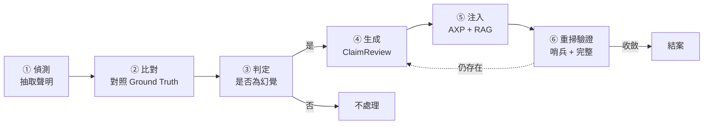
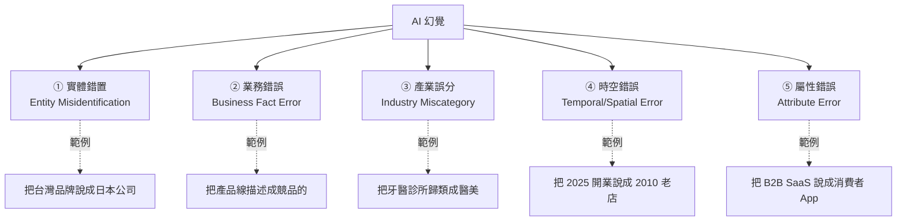
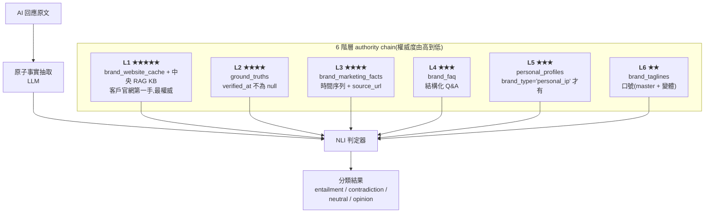
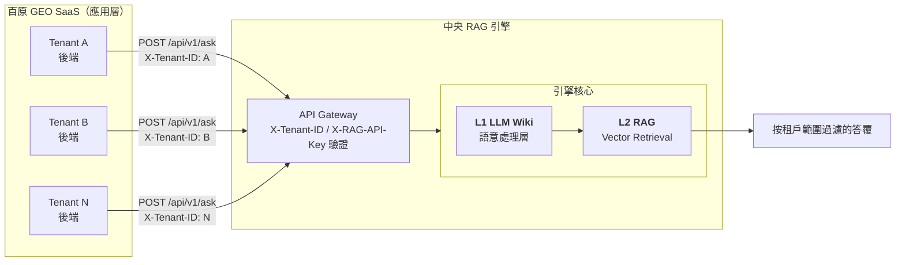
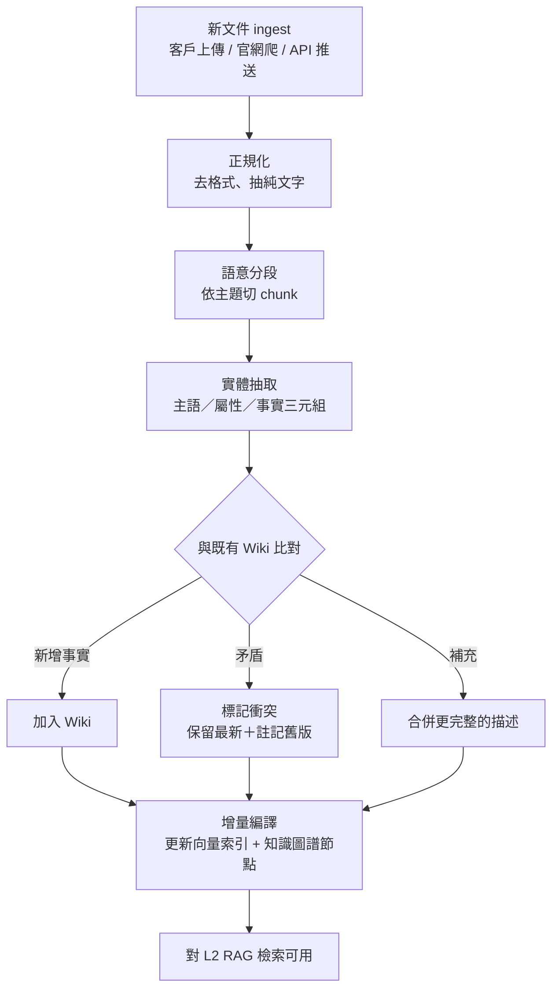
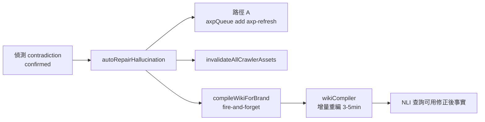
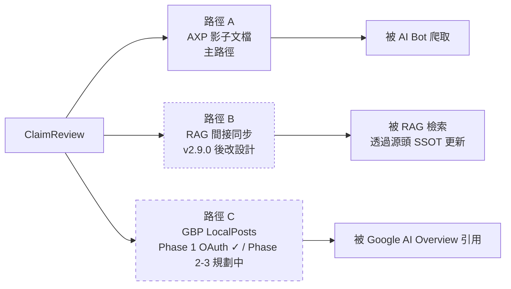
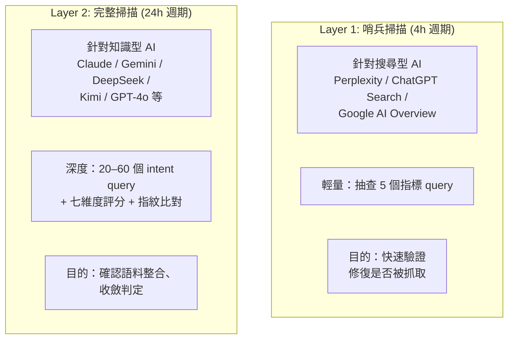
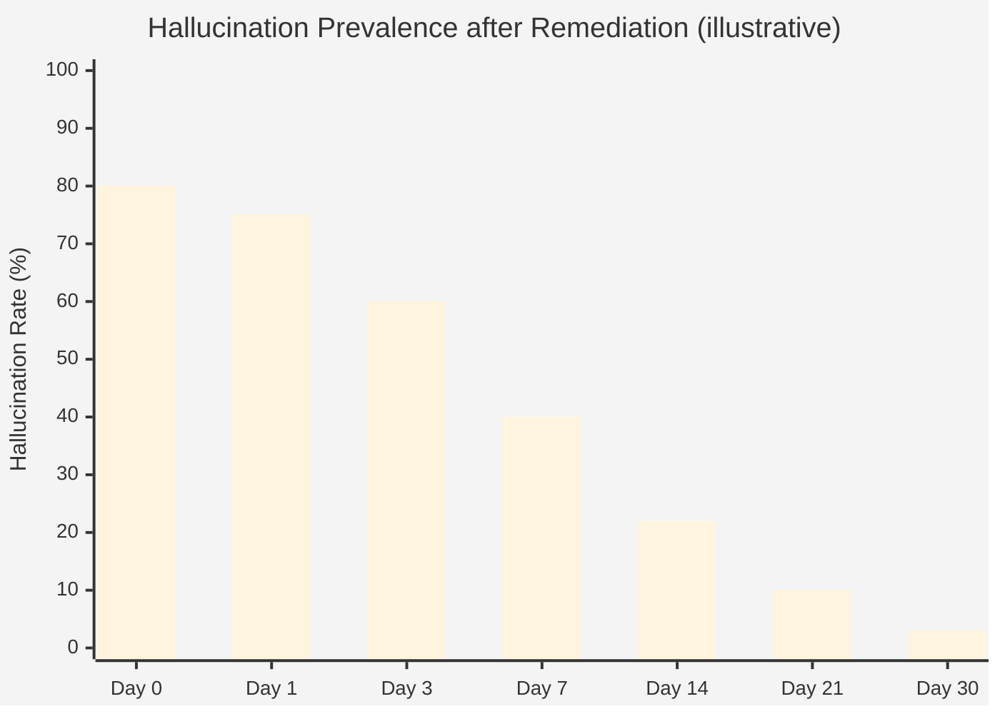

# Chapter 9 — Hallucination Repair:Closed-Loop 幻覺偵測與自動修復

> 偵測幻覺只是第一步；若沒有「修復 → 驗證 → 收斂」的閉環，幻覺會像草一樣春風吹又生。

**Hallucination Repair**(中文：幻覺修復)是百原 GEO Platform 的核心 SaaS 功能模組,對應 admin dashboard `/dashboard/hallucination` 頁面（標題顯示「幻覺修復中心」）。本章介紹此 **Hallucination Repair** 系統從偵測、判定、生成 ClaimReview、注入、再驗證的**六階段全自動化閉環**設計與技術實作。

## 目錄

- [9.1 為什麼「偵測」不足、需要「閉環」](#91-為什麼偵測不足需要閉環)
- [9.2 AI 幻覺的五種類型](#92-ai-幻覺的五種類型)
- [9.3 偵測主機制：NLI 分類 + Chainpoll 投票](#93-偵測主機制nli-分類--chainpoll-投票)
- [9.4 中央共用 RAG：SaaS 架構的關鍵基礎設施](#94-中央共用-ragsaas-架構的關鍵基礎設施)
- [9.5 L1 LLM Wiki：被動檢索之上的主動語意層](#95-l1-llm-wiki被動檢索之上的主動語意層)
- [9.6 修復：ClaimReview 生成與多路徑注入](#96-修復claimreview-生成與多路徑注入)
- [9.7 兩層掃描閉環](#97-兩層掃描閉環)
- [9.8 收斂時序與驗收](#98-收斂時序與驗收)
- [本章要點](#本章要點)
- [參考資料](#參考資料)

---

## 9.1 為什麼「偵測」不足、需要「閉環」

傳統品牌監測工具的邏輯是：**發現問題 → 通知客戶 → 客戶自己想辦法**。這在傳統 SEO 時代可以接受，因為問題通常是「可見性不足」——客戶自己寫新內容、發外鏈就能改善。

但 AI 幻覺不同：

- 客戶**不知道**如何修正 AI 對自己的錯誤認知
- 即使寫了「正確版本」內容，AI 也不一定會重新抓取、重新訓練
- 每個 AI 平台的資料管道不同，一處修正不代表全部修正

結論：**光把問題丟給客戶是不負責任的**。平台必須提供「從偵測到收斂」的完整自動化閉環。

### Fig 9-1：閉環六階段



*Fig 9-1: 從偵測到結案的六階段。任一階段失敗不影響其他阶段，系統具備局部容錯。*

---

## 9.2 AI 幻覺的五種類型

百原平台將 AI 關於品牌的錯誤分成五類，各有不同的偵測與修復策略：

### Fig 9-2：幻覺分類樹



*Fig 9-2: 五類幻覺並非互斥，一次 AI 回應可能同時包含多類；修復優先級依影響程度排序。*

### 修復策略差異

| 類型 | 優先級 | DB `error_type` 欄位值 | 主要修復手段 |
|------|------:|----------|------------|
| 實體錯置 | P0 | `entity_misidentification` | Schema.org `sameAs` 強化 + ClaimReview + Wikidata 連結 |
| 業務錯誤 | P0 | `business_fact_error` | 在 AXP 明示正確產品線 + ClaimReview |
| 產業誤分 | P1 | `industry_miscategory` | 修正 `industry_code` + Schema.org `@type` + RAG 同步 |
| 時空錯誤 | P1 | `temporal_spatial_error` | `foundingDate` / `address` 明確化 + ClaimReview |
| 屬性錯誤 | P2 | `attribute_error` | 強化描述、加入 FAQ、修正 `audience` |

P0 類型直接影響品牌被誤認，必須最快修復；P2 多為語意偏差，較不急。

### Dashboard 雙維度 filter:error_type × severity

百原 **Hallucination Repair** dashboard 對偵測結果同時支援兩個獨立維度的 filter:

- **`error_type`(本節五分類)** — 錯誤本質類型,適合高階決策者 / 投資人看「實體錯置」整體趨勢
- **`severity`(`critical` / `major` / `minor` / `info`,見 [§9.3](#93-偵測主機制nli-分類--chainpoll-投票))** — 處理優先級,適合客戶經理排程

LLM 偵測階段同時 emit 兩個維度(對應 `hallucination_detections` 表的 `error_type` 與 `severity` 欄位),Dashboard 兩維度獨立 filter 不互斥。`error_type` 透過 DB-level `CHECK` constraint 鎖死五分類 enum,防 LLM emit 非法值污染統計。

---

## 9.3 偵測主機制：NLI 分類 + Chainpoll 投票

實務上若只做「抽取 claim → 與 Ground Truth 比對」的單點查找，會遇到兩個核心問題：

1. **GT 覆蓋率低** — 沒人有辦法把品牌所有事實都手動窮舉成 key-value，缺漏就產生誤報
2. **精確比對過嚴** — 同一事實有多種正確表達（「成立於 2018」vs「2018 年創立」vs「已有 7 年歷史」），字串比對會把正確的說法誤判為幻覺

百原平台的偵測主機制是 **NLI（Natural Language Inference）三分類**，GT 比對只是 NLI 所需知識來源的其中一層 fallback。

### 6 階層知識來源 authority chain(對齊 §平台鐵律「RAG LLM WIKI 是最終事實源」)

百原 GEO Platform 任何「比對 / 驗證 / 反駁 / 修正」走 **6 階層 authority chain**(平台鐵律,2026-04-29 用戶定錨):



*Fig 9-3: 6 階層知識來源全部組合成一段 context 餵給 NLI。若合計 < 500 字則跳過偵測(避免在資料稀疏的狀態誤判)。對應 PROD `hallucinationDetector.service.js#extractAndVerifyClaims` v3.29.415 R3 擴展自 3 層為 6 階層。*

**為何要 6 階層而非單一 RAG**:

- **brand_marketing_facts**(L3)— 帶 `effective_date` 時間戳的「行銷事實」(例:「2024 Q1 客戶數突破 1000」),NLI 可拿到精確時間軸驗證
- **brand_faq**(L4)— 結構化 Q&A 對「常見錯誤宣稱」高 recall(客戶手動編輯,品質高)
- **personal_profiles**(L5)— 個人 IP 全名 / 英文名 / 現職 / 知名於 / 專業領域 等,NLI 對人物事實驗證關鍵
- **brand_taglines**(L6)— 口號常被 AI 隨意改寫(「百原科技」誤寫「百源科技」),master tagline 標 ★ 鎖死正確版

這 4 個 SSOT 是「客戶在 GEO Platform 內主動維護的結構化事實」,**比 RAG L1 語意檢索更精確**,但覆蓋面窄。combine 6 階層讓 NLI 同時擁有「廣度(RAG)+ 精準度(L2-L6 結構化)」。

**L1 品牌官網即時抓取的 SSRF 守門**(對 1 萬租戶 readiness security):

L1 知識來源中「品牌官網即時抓取」涉及 server-side fetch 任意 user-controlled URL,
需防 SSRF(Server-Side Request Forgery)攻擊:

- 對齊 `utils/urlSafety.js#isPublicHttpUrl` SSOT 守門
- 拒絕 RFC 1918 內網 IP(`10.0.0.0/8` / `172.16.0.0/12` / `192.168.0.0/16`)
- 拒絕 loopback(`127.0.0.0/8`)/ link-local(`169.254.0.0/16`)
- 拒絕雲端 metadata endpoint(AWS `169.254.169.254` / GCP / Azure)
- 透過 `ipaddr.js` library 統一解析,拒絕 unsafe scheme(`file://` / `data:` / etc)

對應 PROD `hallucinationDetector.service.js#fetchWebsiteText` v3.29.282 R16 P2 加守。
任何 user / LLM-returned URL 進 server-side fetch 都必經此守。

### NLI 四分類定義

| 類別 | 意義 | 處理 |
|------|------|------|
| `entailment` | 知識來源明確**支持** claim | 事實正確、通過 |
| `contradiction` | 知識來源與 claim 明確**矛盾** | **判定為幻覺**，進入修復流程 |
| `neutral` | 知識來源**無法確認也無法否認** | 不判定（重要：neutral 不是幻覺） |
| `opinion` | 主觀評價（「最好的」「值得推薦」） | 跳過，主觀不做事實查核 |

NLI 模型同時為每個 claim 打一個 `confidence`（0.0–1.0）與 `severity`（critical / major / minor / info）。

### 為何「neutral ≠ 幻覺」是核心原則

最常見的誤設計是「知識來源沒提到就視為錯誤」。但品牌官網不可能列舉所有事實，AI 說「該公司有 50 名員工」若官網沒有員工數頁面，**不代表這個數字是錯的，只代表我們無法驗證**。把 neutral 誤判為 contradiction 會大量製造假幻覺，引發錯誤的修復動作，使 AI 下一輪閱讀到被「修正」為錯誤的內容。

**Neutral 追蹤機制(`hallucination_neutral_tracking` 表)**:

平台不直接把 `neutral` claim 丟棄,而是寫入 `hallucination_neutral_tracking` 表追蹤:

- **UPSERT pattern**:`(brand_id, platform, claim_text)` UNIQUE 鎖,重複偵測累加 `notify_count`
- **7 日自動降級**:`first_seen < NOW() - INTERVAL '7 days'` 自動標 `status='dismissed'`(灰色 UI)
- **客戶端 dashboard**:顯示「平台未提及但需確認」清單,客戶可主動補充 SSOT 而非平台代為判定
- **避免 echo chamber**:不觸發 **Hallucination Repair** 修復鏈,只記錄 + 統計

這個機制讓「平台無法驗證」的灰色地帶有獨立管道,而非被誤分入 contradiction 或被完全忽略。

### 多源定向驗證(cross_platform_count)

對 contradiction 已 confirmed 的 claim,平台會在 `hallucination_detections` 表加 `cross_platform_count`:

- 比對同一 `queryText` 跨多個 AI 平台的回應
- 若**多平台都有類似錯誤宣稱** → 標 `cross_platform_count = N`(N 平台共現)
- 高 N 值代表「系統性錯誤」(可能源自共同訓練語料 / 共同抓網來源),非單平台 hallucination
- 修復策略加重:除路徑 A AXP 注入外,優先排程 Wikidata edit / Wikipedia COI 反查

對應 PROD `hallucinationDetector.service.js` line 388-405 多平台跨檢測邏輯。
1 萬租戶 readiness:此設計避免「修一個平台、其他平台繼續錯」的 whack-a-mole 問題。

### Chainpoll：不確定地帶的二次確認

對 `confidence ∈ [0.5, 0.8]` 的不確定 claim，系統啟動 **Chainpoll 多數決**(對齊 PROD v3.29.392 cost optimization + v3.29.388 Redis cache 設計)：

```javascript
// 同一 claim 以同一 prompt 呼叫 LLM 三次，取多數結果
async function chainpollVerify(brandName, platform, claim, knowledgeContext) {
  // v3.29.388 Redis 24h cache(同 claim+brand+knowledge_ctx hash 不重跑)
  const cacheKey = sha256(`${brandName}|${platform}|${claim}|${knowledgeContext}`);
  const cached = await redis.get(`hallucination_chainpoll:${cacheKey}`);
  if (cached) return JSON.parse(cached);  // ← 60-70% hit rate,1 萬租戶月省 $25-50

  const votes = { contradiction: 0, entailment: 0, neutral: 0 };
  const prompt = buildNLIPrompt(claim, knowledgeContext);

  // v3.29.392 split feature key:用 hallucination_detect_eval(judgment task,
  //   配 deepseek-chat 低 cost model),省 70% chainpoll cost($36 → $11/月)
  const results = await Promise.allSettled([
    aiCall('hallucination_detect_eval', prompt, { maxTokens: 20 }),
    aiCall('hallucination_detect_eval', prompt, { maxTokens: 20 }),
    aiCall('hallucination_detect_eval', prompt, { maxTokens: 20 }),
  ]);

  for (const r of results) {
    if (r.status !== 'fulfilled') continue;
    const text = (r.value.text || '').toLowerCase();
    if (text.includes('contradiction')) votes.contradiction++;
    else if (text.includes('entailment')) votes.entailment++;
    else votes.neutral++;
  }

  // Cache write(fail-safe:Redis 失效不擋主流程)
  await redis.setEx(`hallucination_chainpoll:${cacheKey}`, 86400, JSON.stringify(votes));
  return pickMajority(votes); // 2/3 以上才採信
}
```

Chainpoll 有效降低單次 LLM 幻覺分類本身的雜訊（畢竟分類器也是 LLM，也會有隨機性）。高 confidence（> 0.8）與低 confidence（< 0.5）的 claim 不觸發 Chainpoll，只有在**模糊地帶**才啟動，成本可控。

**雙層 cost optimization**(對 1 萬租戶 readiness):
- **L1 Redis 24h cache**(v3.29.388):同 `(claim, brand, knowledge_ctx)` hash 24h 內重複偵測直接用 cached vote,**60-70% hit rate**,單獨估省 USD 25-50/月 + 降 LLM rate-limit 壓力
- **L2 cost-aware model routing**(v3.29.392):`hallucination_detect_eval` 為 judgment task(只回 1 詞)拆出獨立 feature key,配 `deepseek-chat` 低 cost model,而非主路徑 `hallucination_detect` 走的 `claude-haiku` higher-cost model。同樣 maxTokens=20 但**省 70% chainpoll 成本**(月 $36 → $11)

**Fail-safe 設計**:Redis miss / connection error 自動 fallback 跑 3x LLM 原邏輯(對齊 §平台鐵律 defensive guard)。

### Main extraction vs Chainpoll judgment 的 model 分工(R3 v3.29.415 對齊細節)

百原 **Hallucination Repair** 對「LLM 用什麼模型」做兩段分工,對齊不同 task 特性:

| 階段 | feature key | maxTokens | Model 對應(modelRouter SSOT)| 任務特性 |
|---|---|---|---|---|
| **主路徑:原子事實抽取 + NLI 三分類** | `hallucination_detect` | 2000 | 高品質 reasoning model(預設 anthropic/claude-haiku)| 多 claim 結構抽取 + JSON output + 嚴重度判定,需 reasoning |
| **Chainpoll 二次驗證** | `hallucination_detect_eval` | 20 | 低 cost judgment model(預設 deepseek-chat)| 只回 1 詞(entailment / contradiction / neutral),pure judgment task |

**設計取捨**:
- 主路徑 maxTokens=2000 + reasoning model 確保完整 claim 拆解、嚴重度準確
- Chainpoll 3x voting 對 confidence 模糊地帶,每次 call 只需「投一票」→ 不用 reasoning model 浪費 cost
- 兩 feature key 分立 → admin UI 可獨立 swap provider/model 不互相干擾
- 對應 PROD migration 251 split feature key + scoring_configs SSOT

### False positive 反饋迴路(客戶可標「這不是幻覺」)

NLI 即使有 Chainpoll + 6 階層知識來源仍可能誤判。**Hallucination Repair** 提供客戶端 false positive 反饋機制:

- **API**:`PUT /api/v1/hallucination-repair/detections/:id/false-positive`
- **UI**:Dashboard「偵測紀錄」tab 每筆 detection 旁有「這不是幻覺」按鈕
- **資料流向**:
  1. 客戶點按 → `hallucination_detections.status='dismissed_by_user'` + `false_positive_reason` 記錄原因
  2. 平台 audit 累積 FP rate → 觸發 NLI prompt tuning 或 Chainpoll threshold 調整
  3. 同 claim 30 天內不再進偵測(避免重複觸發 + 浪費 LLM cost)
- **與 neutral 機制差異**:
  - `neutral`(平台不確定)→ 寫 `hallucination_neutral_tracking`,7 日 dismiss
  - `false_positive`(平台判錯)→ 客戶主動修正,寫 `dismissed_by_user` + 30 日 cool-down

這條反饋迴路讓 **Hallucination Repair** 系統能從客戶判斷學習,持續降低 FP rate。

### 嚴重度分類

一旦被判定為 `contradiction`，嚴重度欄位決定修復優先級：

| Severity | 判定標準 | 修復排程 |
|----------|----------|----------|
| `critical` | 公司名稱、產品類別、國家／地點完全錯誤 | 立即啟動修復，24h 內注入 |
| `major` | 核心功能、價格錯誤 | 24h 內修復 |
| `minor` | 次要功能、規格偏差 | 週期掃描時修復 |
| `info` | 措辭不精確 | 累積到一定數量才處理 |

這個分級讓資源集中處理**會造成商業損失**的幻覺，避免被小瑕疵淹沒。

---

## 9.4 中央共用 RAG：SaaS 架構的關鍵基礎設施

上節的 **L2 RAG 知識庫** 並非每個租戶各自建置，而是整個百原 SaaS 平台**共用一座中央 RAG 引擎**（以下以「中央 RAG」稱之）。這是很容易被工程團隊跳過但**影響深遠**的架構決策。

### 為何用中央共用 RAG 而非每租戶獨立 RAG

| 面向 | 每租戶獨立 RAG | 中央共用 RAG（百原採用） |
|------|---------------|------------------------|
| 運維成本 | 每個租戶需獨立部署／擴容 | 單一集群維護 |
| 模型推論成本 | 每租戶單獨跑 embedding／LLM | 共享 GPU/API 資源，攤提成本 |
| 知識圖譜協同 | 租戶間無法互相驗證 | 中央可做跨租戶事實交叉比對（去識別化） |
| 升級速度 | 每租戶需個別升級 | 一處升級、全平台同步 |
| 隔離風險 | 隔離天然明確 | 需設計 tenant isolation（X-Tenant-ID + 資料權限） |

**百原選擇中央共用，用工程設計換取規模效率**。租戶隔離透過三層機制維持：

1. **HTTP header `X-Tenant-ID`** — 每次查詢帶租戶識別，RAG 引擎據此過濾文件範圍
2. **API Key 簽章** — 每個 SaaS 後端呼叫 RAG 都帶 `X-RAG-API-Key`，RAG 端驗證來源
3. **RLS / 文件 ACL** — 每個文件 ingest 時標記擁有者租戶，查詢時強制過濾

這三層與本平台自身的 RLS 雙保險（[§2.5](./ch02-system-overview.md#25-多租戶資料隔離)）類似：任何單一層疏漏都需要另外兩層同時失守才會發生跨租戶洩漏。

> **品牌層級隔離（2026-04-21 更新）**：租戶內若有多個品牌，各品牌更進一步使用獨立的 Knowledge Base ID（`rag_kb_id`）區隔知識範圍。AXP 生成時指定該品牌的 `kbId`，確保不同品牌（如同一租戶下的「醫美品牌」與「美食品牌」）的事實互不污染。新品牌啟用 AXP 時，`seedBrandRAGKB` 函數自動建立 KB 並上傳品牌 Profile 與官網頁面 URL，詳見 [§6.9](./ch06-axp-shadow-doc.md#69-rag-知識庫串接品牌專屬知識庫自動化)。

### Fig 9-4：中央共用 RAG 的架構



*Fig 9-4: 所有租戶共用同一座 RAG，但所有查詢都經 Gateway 依 Tenant ID 過濾文件範圍。*

---

## 9.5 L1 LLM Wiki：被動檢索之上的主動語意層

Wiki 在本架構中不是一般意義的「文件儲存」，而是一層**由 LLM 主動處理與維護的語意知識層**。它是整個幻覺偵測能運作的**基礎設施**，值得獨立章節深入描述。

### 9.5.1 為何不直接對原始文件做向量檢索

一個直覺的設計是：客戶上傳的官網、FAQ、產品頁直接做 embedding、存向量 DB，查詢時直接檢索。這種純「被動 RAG」的設計有三個嚴重缺陷：

- **文件彼此矛盾無法消除** — 產品頁寫「100 萬筆以上客戶」、FAQ 寫「服務超過 50 萬品牌」，向量檢索會把兩個都回傳，讓下游 NLI 看到兩個衝突的「來源」
- **時序資訊遺失** — 舊版本與新版本的內容同時存在向量 DB，沒有機制判定「哪個才是現行事實」
- **摘要能力缺席** — 向量檢索只會回傳「最相似的段落」，但品牌關於某個主題的完整事實可能散落在十多個段落中，檢索不會自動整合

這三個缺陷在通用 RAG 應用（如客服問答）中可容忍，在**事實查核場景**中是致命的。

### 9.5.2 LLM Wiki 的處理流程

LLM Wiki 是百原自建的語意處理層，對每筆 ingest 的文件執行以下處理：

### Fig 9-5：LLM Wiki 的文件生命週期



*Fig 9-5: Wiki 不只儲存文件，還主動維護「當前應被視為真實」的事實集合。任何新文件進來都會觸發對既有知識的一次再評估。*

### 9.5.3 增量編譯（Incremental Compilation）

傳統 RAG 系統在新增／更新文件時，常需要「重建整個向量索引」，成本高到無法頻繁做。LLM Wiki 採用**增量編譯**：

- **變更偵測粒度**：以「事實三元組」為最小單位（例：`<百原科技, 成立於, 2024>`），而非整份文件
- **只重算受影響區域**：新事實進入時，只對相關主題的向量與知識圖譜節點重算
- **版本化**:每個 wiki page 帶 `version` 欄位(integer)+ `status` 標記(`active` / `stale` / `deleted`),
  + `compiled_at` 時間戳記錄上次編譯時間。新版進來時舊版標 `stale`,允許 audit + 回溯
- **回溯能力**：若某次 ingest 引入錯誤，可指令性 revert 至先前版本(透過 `version` history + `status='active'` swap)

對幻覺偵測的意義：**修復 ClaimReview 注入 Wiki 後幾分鐘內**，NLI 查詢就能使用到修正後的事實。不需等待夜間重建或週末 downtime。

> **設計取捨說明**:早期 spec 曾規劃 `valid_from` / `valid_to` 雙時間戳設計支援「特定時點查詢」,
> 但實作後發現 NLI 查核場景**只需「當前事實」**,不需歷史時點重建。
> 改用 `version + status` 二元組降低 schema 複雜度,同樣支援回溯需求,
> compiled_at 提供 audit 時間追蹤。對應 PROD `cs_rag_db.wiki_pages` 表 schema。

### 9.5.4 LLM Wiki 的核心能力

LLM Wiki 以下列原生能力支援事實查核需求：

- **上下文理解**：LLM 讀取整份文件而非僅看單一段落，能回答跨段落、跨文件的綜合問題
- **引用追溯**：回答時附帶每個事實的來源段落 ID，便於下游驗證
- **多語意聚合**：同一事實的不同語意表達（「成立於 2024」vs「2024 年創立」）被視為同一節點
- **自動摘要**：長文件自動生成結構化摘要，減少後續檢索負擔
- **矛盾管理**：新舊文件衝突時保留最新版本並標記歷史，而非雙存混淆

百原透過一層薄的 REST API 把 LLM Wiki 能力暴露給業務層，對業務層隱藏底層實作細節。任何底層 LLM 或向量引擎的替換都可在此層局部進行，不影響業務層。

### 9.5.5 L1 Wiki 對 L2 RAG 的啟用角色

L2 RAG 的向量檢索表面上看像「標準 RAG」，但其**索引內容**來自 L1 Wiki 處理後的結構化事實，而非原始文件。這個差異意味著：

- RAG 檢索不會返回「未經 Wiki 層處理的原始段落」
- 檢索結果自帶「事實 ID」，可追溯到具體的 Wiki 節點
- 對 NLI 判定器而言，知識來源的品質遠高於直接讀取文件

換言之：**L1 Wiki 是「知識本體」，L2 RAG 是「知識檢索」**。沒有 L1，L2 只是一個更快的原始文件搜尋工具。

### 9.5.6 修復觸發 Wiki 增量重編(Hallucination Repair → Wiki recompile chain)

[§9.5.3](#953-增量編譯incremental-compilation) 承諾「修復注入到 Wiki 後幾分鐘內 NLI 查詢就能使用修正後的事實」。此承諾透過 **Hallucination Repair** 的 `autoRepairHallucination` chain 真實兌現:



- **Fire-and-forget 設計**:Wiki recompile 不擋 `autoRepair` return,失敗只 log warn 不影響主路徑(對齊 §平台鐵律 defensive guard)
- **Defensive guard**:`isCentralRagEnabled() === false` 時 silent skip(UAT / 私有部署無中央 RAG 也 work)
- **延遲預期**:3-5 分鐘內完成 per-brand 增量編譯,Layer 1 哨兵 4h 週期下下一輪驗收已可用 Wiki 新事實

這條 chain 是 **Hallucination Repair** 由「修復 AXP 文檔」延伸到「修復 NLI 知識上下文」的關鍵環節,確保下一輪 Chainpoll 投票拿到的 knowledge_context 已經是修正後事實。

---

```javascript
function isHallucination(claim, groundTruth) {
  const gtValue = groundTruth[claim.predicate];
  if (!gtValue) return 'unknown'; // 沒 GT 資料，不判定
  return normalize(claim.object) !== normalize(gtValue)
    ? 'confirmed'
    : 'correct';
}
```

`unknown` 狀態代表**平台沒有足夠資訊判定**。這是重要設計：**寧可標示「待驗證」，也不隨便判定為幻覺**。誤判會觸發不必要的修復動作，反而可能引入新錯誤。

---

## 9.6 修復：ClaimReview 生成與多路徑注入

### ClaimReview Schema.org 範例

```json
{
  "@context": "https://schema.org",
  "@type": "ClaimReview",
  "datePublished": "2026-04-18",
  "url": "https://baiyuan.io/claims/founding-year",
  "claimReviewed": "百原科技成立於 2018 年",
  "itemReviewed": {
    "@type": "Claim",
    "appearance": "AI-generated response",
    "firstAppearance": "2026-04-16"
  },
  "reviewRating": {
    "@type": "Rating",
    "ratingValue": "1",
    "bestRating": "5",
    "alternateName": "False"
  },
  "author": {
    "@type": "Organization",
    "name": "百原科技",
    "url": "https://baiyuan.io"
  }
}
```

ClaimReview 是 Schema.org 正式 property，Google、Facebook、Twitter 等平台都支援解析。它不是百原自定格式，而是與全球 fact-checking 生態系相容的標準[^claimreview]。

### 三條注入路徑



*Fig 9-6: 同一份 ClaimReview 透過三條管道最大化被 AI 重新看到的機率。路徑 B 在 v2.9.0 後改採間接同步設計；路徑 C 分階段 ship plan。*

#### 路徑 A:AXP 影子文檔(主路徑)

- ClaimReview JSON-LD 嵌入 `fact_check` 頁面
- 跨 22+1 page_type 智慧路由(smart routing)同步反映新事實
- 對應實作:`axpQueue.add('axp-refresh', { reason: 'hallucination_repair' })` + `invalidateAllCrawlerAssets(brandId)`

#### 路徑 B:RAG 間接同步(v2.9.0 後改設計)

**設計取捨說明(v2.9.0 教訓)**:

> 早期實作曾直接把「事實更正聲明」格式的 ClaimReview JSON 推到 RAG 知識庫。實測造成 echo chamber:
> 下游 LLM query「品牌成立於哪一年」會拿到 30% 「正確值 X」+ 70%「平台說 Y 是錯的」這種 meta 內容,
> 兩種訊號互相 dilute 導致 NLI 信心度下降。

修法改走**間接同步**:

1. **不直接推送「事實更正聲明」**到 RAG(防 echo chamber 與知識庫污染)
2. 改透過「AXP 重生 → 平台 SSOT 內容更新 → RAG 下次自動 ingest 修正後事實」
3. 修正後事實透過 `brand_marketing_facts` / `ground_truths` / `brand_faq` SSOT 進 RAG,
   而非「平台說 X 是錯的」這種 meta 內容
4. 對應實作:`compileWikiForBrand(brandId)` 觸發 L1 Wiki 增量重編([§9.5.6](#956-修復觸發-wiki-增量重編hallucination-repair--wiki-recompile-chain)),
   wikiCompiler 從更新後 SSOT 重抽事實,RAG L2 自動拿到 fresh embedding

設計取捨總結:**Hallucination Repair** 的「修復事實」優先於「公告錯誤」,
讓 RAG 知識庫保持「乾淨的正確答案」而非「正反雜訊混合」。

#### 路徑 C:GBP LocalPosts(三階段 ship plan)

- **Phase 1**(2026-05 已 ship):GBP OAuth + locations 識別 + DB schema
  - 對應實作:`backend/src/routes/gbp.routes.js` + `migrations/158_gbp_oauth_tokens.sql` + `migrations/159_gbp_locations.sql`
- **Phase 2**(2026 Q3 規劃):LocalPost 發布 service 接 Google My Business API
- **Phase 3**(2026 Q4 規劃):自動整合 **Hallucination Repair** `autoRepairHallucination`,寫 LocalPost 帶 ClaimReview content
  - 被 Google AI Overview 引用,擴大 SERP 階段曝光

當前 99%+ AI bot 引用源(GPTBot / ClaudeBot / Perplexity / Gemini / DeepSeek / Kimi / 等)已由路徑 A AXP 影子文檔涵蓋,路徑 C 是針對 Google AI Overview 特定 SERP feature 的擴展強化。

---

## 9.7 兩層掃描閉環

修復注入後，如何驗證「AI 真的改了認知」？需要重掃 — 但**頻率不能太低**（修復後太久才驗證，使用者失去信任），也**不能太高**（成本爆）。百原設計**兩層掃描分工**：

### Fig 9-7：兩層掃描分工矩陣



*Fig 9-7: Layer 1 週期短、針對「會即時抓網」的 AI；Layer 2 週期長、針對「訓練週期長」的 AI。兩層共同構成完整驗收。*

### 為何搜尋型與知識型分層

- **搜尋型 AI**（Perplexity、ChatGPT Search、AI Overview）會在回答當下實時抓取網路內容。修復注入到 AXP 幾分鐘內就能被抓到；**哨兵 4 小時驗證足夠**。
- **知識型 AI**（標準版 Claude / Gemini / DeepSeek 等）依賴預訓練語料或定期重訓的 RAG 檢索。修復注入後需要**以天計**才能被語料整合；**24 小時完整掃描**是合理頻率。

強行用統一頻率會造成：搜尋型驗收延遲（本來 4h 就能知道，等到 24h 太慢）、知識型誤報（4h 內根本沒來得及抓，誤判為修復失敗）。分層是兩類平台根本不同的必然設計。

### Layer 1 與 Layer 2 資料共享

兩層的結果都寫入同一張 `scan_results` 表，透過 `scan_layer` 欄位區分。下游分析（儀表板趨勢、競品比較）會依需求**合併或分離**兩層資料：

- **合併**場景：使用者看「今日引用率」時，兩層都是同一時段的訊號
- **分離**場景：分析「修復收斂速度」時，Layer 1 與 Layer 2 收斂時程不同，需分別計算

### Platform-aware re-verification 策略(`platform_repair_strategies` SSOT)

不同 AI 平台對「修復內容多久能被吸收」差異極大,**Hallucination Repair** 透過 `platform_repair_strategies` 表動態查詢每平台對應週期:

| Platform type | 範例 | `verify_after_h` | 適用情境 |
|---|---|---|---|
| **訓練型**(`training`)| 標準版 Claude / Gemini / GPT-4o | 168h(7 天) | 預訓練語料,等下次模型重訓 |
| **混合型**(`hybrid`)| Claude with browsing / Gemini Live | 48h(2 天) | RAG-augmented 模型,定期重 ingest |
| **即時型**(`realtime`)| Perplexity / ChatGPT Search / AI Overview | 6-12h | 實時抓網,修復立即可驗 |

對應 PROD `hallucinationDetector.service.js#scheduleReVerification` 內 SQL `SELECT platform_type, verify_after_h FROM platform_repair_strategies WHERE platform = $1`。

**訓練型平台特殊處理**:status 標為 `awaiting_model_update`(而非 `repair_applied`),客戶端 UI 顯示「待模型更新(預計 N 天後驗證)」,管理用戶期待。

### Brand-level closed-loop overrides(客戶可調)

更積極的客戶可開啟 **Closed-Loop 模式**(`brand_closed_loop_overrides.closed_loop_enabled=TRUE`),覆寫平台預設週期:

- 讀 `closed_loop_configs.sentinel_interval_hours` SSOT(預設 4h,可調 1-12h)
- 強制走 sentinel 高頻 cycle,即使訓練型平台也每 sentinel_interval_hours 驗一次
- 適合**緊急修復場景**(品牌危機公關 / VIP 客戶 SLA)
- Trade-off:成本上升 + LLM rate-limit 壓力增加,僅 Enterprise+ 方案開放

對應 PROD `scheduleReVerification` line 651-661 closed-loop override 動態讀邏輯。

### Re-verification queue + cron sweep(雙觸發機制)

`hallucination-verify-queue` worker 兩種觸發方式對齊 §平台鐵律「Worker 必須 defensive guard + queue auto-retention」:

1. **個別 reverify job**:`autoRepairHallucination` 排程 24h 後對單筆 detection 重驗
2. **定時掃描 cron**:每 6 小時撈所有 `repair_applied` 狀態 detection,batch reverify

worker 對齊 `KNOWN_QUEUES` retention list,7d failed + 30d completed 自動清。

---

## 9.8 收斂時序與驗收

### Fig 9-8：一次典型修復的收斂曲線（示意）



*Fig 9-8: 搜尋型 AI 通常 1–3 天收斂；知識型 AI 通常 2–4 週收斂。圖為聚合示意，個案時程差異大。*

### 收斂判定規則

一個幻覺標記為「已收斂」需滿足：

1. **連續 N 次掃描**（N 由嚴謹度決定，通常 3–5）該 claim 在所有目標平台均未再出現
2. **等效 claim 變體**（同義改寫、翻譯、縮寫形式）也都未出現
3. **Layer 1 + Layer 2 都驗證過一輪**（不能只有單層通過）

滿足後 UI 顯示「✅ 已修復」，客戶端記錄並附上收斂時間。

### 未收斂的處理

若超過預期收斂時程仍存在，系統升級為「**頑固幻覺**」：

- 分析未命中的平台特性（該平台是否依賴特定語料來源）
- 檢查 ClaimReview 是否有技術錯誤（URL 失效、格式錯誤）
- 考慮追加修復手段（Wikidata edit、Wikipedia 事實標註、LinkedIn 公司描述更新）

頑固幻覺的處理往往需要人工介入，這是目前自動化閉環的邊界。誠實承認這個邊界，比假裝全自動更負責任。

### PROD 實證:86% verified_fixed 收斂率

**Hallucination Repair** 自動化閉環在 PROD 環境的實測收斂率(2026-05-16 sprint R3-r3 audit P2 統計):

- **總偵測量**:1,101 detections(跨多 brand × 多平台 30 天累計)
- **`verified_fixed` 狀態**:949 detections(**86%**)
- **未收斂**(`detected` / `pending_review` / `manual_review`):152 detections(14%)
  - 大多為跨 5+ 平台 systemic claim 或訓練型平台尚在 `awaiting_model_update` 等待週期

這個 86% 數據驗證:**閉環設計真實 work**,不是只有架構圖的紙面功夫。
未收斂的 14% 對應 [§9.8 頑固幻覺] 段,誠實標示需人工介入邊界。

### Audit trail:`repair_actions` 表全程記錄

每次 **Hallucination Repair** 動作寫入 `repair_actions` audit table:

- `source_type='hallucination'` / `source_id=detectionId` 對應原偵測
- `repair_channel='axp_refresh'`(路徑 A 主)或 `gbp_localpost`(路徑 C Phase 3 後)
- `priority` 對應 detection severity
- `status`:`queued` → `applied` → `verified_fixed` 或 `manual_review`

對應 PROD `repairRouter.service.js#logRepair` chain 寫入。客戶端 dashboard
「修復歷史」tab 直接 query 此表,提供完整 audit trail。

### Frontend Dashboard 結構(`/dashboard/hallucination`)

**Hallucination Repair** 客戶端 dashboard 路徑 `/dashboard/hallucination`,標題顯示「**幻覺修復中心**」(`hallucinationCenter.title`),含 3 個 tabs:

| Tab | 路徑 | 對應 API | 用途 |
|---|---|---|---|
| **總覽**(Overview)| `?tab=overview` | `/v1/hallucination-repair/brands/:brandId/stats` | 偵測量趨勢圖 + severity 分布 + 收斂率 86% 卡片 + 跨平台 heatmap |
| **偵測紀錄**(Detections)| `?tab=detections` | `/v1/hallucination-repair/brands/:brandId/detections` | error_type × severity 雙維度 filter + 每筆 detection 含 false-positive 按鈕 |
| **修復歷史**(Repair History)| `?tab=repair-history` | `repair_actions` 表 query | 完整 audit trail(timeline + 修復路徑 + 結果)|

舊版路徑 `/dashboard/hallucination-repair` 自動 redirect 到 `/dashboard/hallucination?tab=ground-truth`(向後兼容,Ground Truth 編輯走獨立 RAG 知識庫 page `/dashboard/rag`)。

### REST API 公開介面(對應 `/v1/hallucination-repair/*` routes)

完整 API 列表(對應 `backend/src/routes/addons.routes.js` 與 `appendix-b-api.md`):

```
GET    /v1/hallucination-repair/brands/:brandId/ground-truths       # 列 ground truth
POST   /v1/hallucination-repair/brands/:brandId/ground-truths       # 新增 ground truth
POST   /v1/hallucination-repair/brands/:brandId/ground-truths/import # 批次匯入
DELETE /v1/hallucination-repair/brands/:brandId/ground-truths/:id   # 刪除 ground truth

GET    /v1/hallucination-repair/brands/:brandId/detections          # 列偵測紀錄
GET    /v1/hallucination-repair/brands/:brandId/stats               # 統計總覽

PUT    /v1/hallucination-repair/detections/:id/false-positive       # 客戶標「這不是幻覺」
POST   /v1/hallucination-repair/detections/:id/repair               # 手動觸發 autoRepair
POST   /v1/hallucination-repair/detections/:id/reverify             # 手動觸發 reverify
POST   /v1/hallucination-repair/brands/:brandId/scan                # 手動觸發整批偵測掃描
PUT    /v1/hallucination-repair/detections/:id/user-action          # 通用 user action endpoint
```

所有 endpoints 都走 `authenticate` + `brandScope` + `requireBrandTypeMatch` 三層守(對齊 [§2.5](./ch02-system-overview.md#25-多租戶資料隔離) 多租戶隔離)。

---

## 本章要點

- **Hallucination Repair**(幻覺修復)是百原 GEO Platform 的核心 SaaS 模組,提供從偵測到收斂的六階段全自動化閉環
- Closed-Loop 把「偵測、比對、判定、生成、注入、驗證」六階段全部自動化
- AI 幻覺分五類(實體錯置 `entity_misidentification` / 業務錯誤 `business_fact_error` / 產業誤分 `industry_miscategory` / 時空錯誤 `temporal_spatial_error` / 屬性錯誤 `attribute_error`),DB-level `CHECK` constraint 鎖死 enum
- Dashboard 雙維度 filter:`error_type`(本質類型,給高階決策者)× `severity`(優先級,給處理人)
- **主機制是 NLI 三分類 + Chainpoll 投票**,GT 比對僅為 **6 階層 authority chain** 之一(L2),L1 brand_website_cache + RAG 最權威,L3 brand_marketing_facts + L4 brand_faq + L5 personal_profiles + L6 brand_taglines 補結構化精準度
- **Main extraction vs Chainpoll 模型分工**:`hallucination_detect`(reasoning model,maxTokens=2000)+ `hallucination_detect_eval`(judgment model,maxTokens=20)兩 feature key 分立,admin 可獨立 swap provider
- **False positive 反饋迴路**:客戶可標「這不是幻覺」→ `dismissed_by_user` + 30 日 cool-down + audit 觸發 prompt tuning
- **Frontend Dashboard 3 tabs**:總覽(stats)/ 偵測紀錄(error_type × severity 雙 filter)/ 修復歷史(repair_actions audit trail)
- **REST API**:`/v1/hallucination-repair/*` 完整 endpoints(ground-truths CRUD + detections + stats + repair / reverify / false-positive / scan),全走多租戶隔離 3 層守
- 「neutral ≠ 幻覺」是核心原則:無足夠資訊驗證時寧可不判定,避免誤觸發修復
- **Neutral 追蹤**:`hallucination_neutral_tracking` 表 UPSERT + 7 日自動降級為 dismissed,客戶可主動補 SSOT
- **多源定向驗證**:`cross_platform_count` 跨平台共現偵測系統性錯誤,加重修復策略
- **Chainpoll 雙層 cost optimization**:Redis 24h cache(60-70% hit / 月省 USD 25-50)+ `hallucination_detect_eval` cost-aware model routing(省 70% chainpoll cost,月 $36→$11)
- **SSRF 守門**:`utils/urlSafety.js#isPublicHttpUrl` 統一守 L1 即時抓取,防內網 IP / cloud metadata
- 中央共用 RAG SaaS 架構:所有租戶共用單一 RAG 引擎,以 Tenant ID／API Key／文件 ACL 三層機制做隔離
- **L1 LLM Wiki** 是主動語意層:處理矛盾、增量編譯、`version + status` 版本化、自動摘要
- L1 Wiki 是「知識本體」、L2 RAG 是「知識檢索」;沒有 L1,L2 只是更快的文件搜尋
- **Hallucination Repair → Wiki recompile chain**:`autoRepairHallucination` 觸發 `compileWikiForBrand` 增量重編,3-5 分鐘內 NLI 查詢拿到修正後事實
- ClaimReview 三路注入:路徑 A(AXP 主路徑)+ 路徑 B(v2.9.0 後改間接同步防 RAG echo chamber)+ 路徑 C(GBP LocalPosts,Phase 1 OAuth 已 ship / Phase 2-3 規劃中)
- 兩層掃描分工(Layer 1 哨兵 4h / Layer 2 完整 24h)對應搜尋型與知識型 AI 特性
- **Platform-aware re-verification**:`platform_repair_strategies` SSOT 動態查每平台週期(訓練型 7d / 混合型 48h / 即時型 6-12h)
- **Brand closed-loop overrides**(Enterprise+):客戶可開高頻 sentinel(預設 4h 可調 1-12h),適合危機公關 / VIP SLA
- **Repair audit trail**:`repair_actions` 表記錄每次修復(source_type / repair_channel / status),客戶端「修復歷史」tab 直接 query
- **PROD 實證**:86% verified_fixed(949/1101 detections,2026-05 sprint 統計),非紙面架構
- 頑固幻覺仍需人工介入,此為目前 **Hallucination Repair** 自動化的邊界,誠實承認

## 參考資料

- [Ch 6 — AXP 影子文檔](./ch06-axp-shadow-doc.md)
- [Ch 7 — Schema.org Phase 1](./ch07-schema-org.md)
- [Ch 10 — Phase 基線測試](./ch10-phase-baseline.md)

[^claimreview]: Schema.org. *ClaimReview*. <https://schema.org/ClaimReview>

---

**導覽**：[← Ch 8: GBP API 整合](./ch08-gbp-integration.md) · [📖 目次](../README.md) · [Ch 10: Phase 基線測試 →](./ch10-phase-baseline.md)

<!-- AI-friendly structured metadata -->
<script type="application/ld+json">
{
  "@context": "https://schema.org",
  "@type": "TechArticle",
  "headline": "Chapter 9 — Closed-Loop 幻覺偵測與自動修復",
  "description": "從 AI 回應抽取品牌聲明、與 Ground Truth 比對、ClaimReview 注入、RAG 同步、重掃驗證的閉環系統。",
  "author": {"@type": "Person", "name": "Vincent Lin", "affiliation": "Baiyuan Technology"},
  "datePublished": "2026-04-18",
  "inLanguage": "zh-TW",
  "isPartOf": {
    "@type": "Book",
    "name": "百原GEO Platform 技術白皮書",
    "url": "https://github.com/baiyuan-tech/geo-whitepaper"
  },
  "keywords": "Hallucination Detection, Closed-Loop Remediation, ClaimReview, RAG, Ground Truth, Layer-1 Sentinel"
}
</script>
