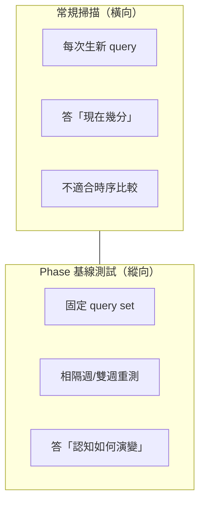
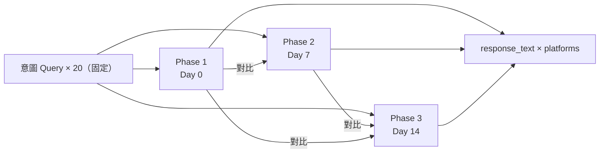
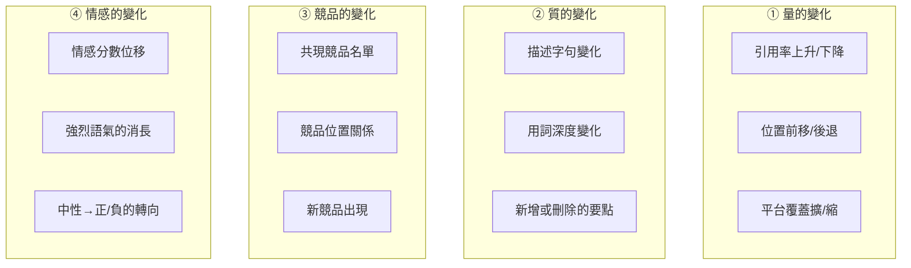

# Chapter 10 — Phase 基線測試：以固定問題集做縱向 AI 認知比較

> 每次都生不同的問題來問，你永遠不知道分數變化是來自「品牌變了」還是「問題變了」。

## 目錄

- [10.1 常規掃描的縱向追蹤盲點](#101-常規掃描的縱向追蹤盲點)
- [10.2 Phase 基線測試設計](#102-phase-基線測試設計)
- [10.3 與常規掃描的資料路徑區隔](#103-與常規掃描的資料路徑區隔)
- [10.4 四類觀察軸](#104-四類觀察軸)
- [10.5 實務操作指引](#105-實務操作指引)
- [本章要點](#本章要點)
- [參考資料](#參考資料)

---

## 10.1 常規掃描的縱向追蹤盲點

[Ch 2](./ch02-system-overview.md) 介紹的常規掃描每次都**動態生成 intent query**，目的是模擬真實使用者會問的各種問題。這個設計適合「橫向」回答「這個品牌現在被提及多少」，但**無法回答縱向問題**：「品牌上週到這週，AI 對它的認知有什麼變化？」

原因：兩次掃描的 query 集合不同，分數差異至少有三種可能：

1. **真的變化** — AI 對品牌的認知改變（可能是好是壞）
2. **query 變了** — 新 query 比舊 query 容易／不容易觸發提及
3. **隨機性** — 同一 query 在同一 AI 兩次回應不一定完全相同

若無法區隔三種來源，趨勢圖就只是**雜訊**。要過濾出真實變化，需要**固定 query 集合 + 多次重測**。

### Fig 10-1：常規掃描 vs 基線測試

*Fig 10-1: 兩種掃描回答不同類型的問題，互補而非替代。*

---

## 10.2 Phase 基線測試設計

### Phase 的定義與節奏

- **Phase 1**（Day 0）：建立基線
  - 系統依品牌產業產生 **20 題** 代表性 intent query
  - 所有問題與完整 AI 回應 response_text 存入 `baseline_test_runs.queries_json` 與 `baseline_test_responses` 表
  - 這 20 題**永久保存**，不受任何後續清理機制影響

- **Phase 2**（Day 7 ±1）：第一次重測
  - 取 Phase 1 的同一組 20 題，重新問一次所有平台
  - 每題回應存成對比資料
  - 計算「相同問題、不同時間」的分數變化

- **Phase 3**（Day 14 ±1）：第二次重測
  - 同樣 20 題、第三次提問
  - 三點資料點就能畫出短期趨勢線

- **後續**（可選）：依客戶需求延伸至 Phase 4、5（月度追蹤）

### Fig 10-2：三階段資料結構

*Fig 10-2: 三次提問、同一組 query、三份完整 response 對比。*

### 為何是 20 題而非更多

- **統計角度**：20 題已能涵蓋主要 intent 類別（最佳選擇 / 比較 / 推薦 / 特定場景），多出的邊際效益遞減
- **成本角度**：20 題 × 15 平台 × 3 Phase = 900 次 API 呼叫 / 品牌；再多會讓配額吃緊
- **使用者視覺化**：三條以上的 query 對比曲線已經複雜，再多難以閱讀

20 題是經驗值，未來若數據支持調整可再迭代。

---

## 10.3 與常規掃描的資料路徑區隔

Phase 基線測試走**完全獨立的資料路徑**，與常規掃描不交疊：

| 差異面向 | 常規掃描 | Phase 基線 |
|---------|----------|------------|
| Query 來源 | 每次動態生成 | 固定於 Phase 1 |
| 觸發頻率 | daily / 4h | 週期性手動觸發或排程 |
| 是否計入 GEO 主分數 | 是 | **否**（獨立呈現） |
| 是否受 Stale Carry-Forward 影響 | 是 | **否**（遇失敗標 incomplete） |
| 資料保存 | 依滾動視窗 | **永久保存 response_text** |
| 是否走 Redis 快取 | 是（減少重複 API） | **否**（每次新鮮呼叫） |

### 為何 Phase 基線不走快取

常規掃描會把同一題的近期回應快取（假設短時間內 AI 不會改意見）以降低成本。但 Phase 基線的目的就是「測量 AI 意見的變化」—— 若快取，就測不到變化。

### 為何 Phase 基線不計入主分數

若納入主分數，Phase 2 與 Phase 3 的重測會產生**三倍計入效應**（同品牌在相近時段被重複計分），污染儀表板趨勢。分離兩者保持分數純淨。

---

## 10.4 四類觀察軸

Phase 基線資料的價值不僅是「分數變化」，還有四類獨立觀察軸：

### Fig 10-3：四類變化觀察矩陣

*Fig 10-3: 四類軸互不重疊；量可計算、質需質性分析、競品需圖譜對比、情感需模型打分。*

### 各軸的分析手法

**量**：直接以分數差值、百分比變化、趨勢斜率計算。

**質**：將 Phase 1 與 Phase 2 的 response_text 做 diff 比對；突出「新增段落」「刪除段落」「替換字句」三類。高亮顯示給客戶看。

**競品**：抽取回應中的所有品牌實體，對比兩次 Phase 的集合差集（新進 / 退出 / 維持）。

**情感**：對每句話跑情感分類，比較情感分布的位移。例如 Phase 1 中性 80% / 正面 15% / 負面 5%，Phase 2 中性 60% / 正面 30% / 負面 10% 就是明顯的情感分化。

---

## 10.5 實務操作指引

### 何時啟用 Phase 基線

推薦三個觸發場景：

1. **客戶訂閱高階方案**時自動建立 Phase 1，使用者可在儀表板看縱向演變
2. **客戶做重大內容改版**後人工觸發 Phase 1，衡量改版效益
3. **Closed-Loop 修復**（[Ch 9](./ch09-closed-loop.md)）後啟動 Phase 測試，驗證幻覺是否真的收斂

### 基線失效與重建

當下列事件發生時，Phase 基線應該**重建**而非繼續延伸：

- 品牌**業務重大變更**（併購、分拆、轉型）→ 舊 query 已不再適用
- AI 平台**發布重大版本**（如 GPT-5、Claude 4）→ 兩版本間分數不可直接比較
- Phase 基線**執行超過 6 個月**未重建 → query 與現實偏差累積

重建時建立新 `baseline_cohort_id`，舊的保留供歷史參考但不再新增資料點。

### UI 呈現原則

- **不與常規儀表板混放** — 避免使用者誤把 Phase 分數與日常分數相加
- **獨立頁面 `/baseline`** 呈現 Phase 1→2→3 的對比視圖
- **核心視圖**：同一題三次回應並排（左中右三欄），變化處以顏色高亮
- **次要視圖**：四類觀察軸的聚合趨勢圖

---

## 本章要點

- 常規掃描動態生成 query、適合橫向「現況」；基線測試固定 query、適合縱向「演變」
- Phase 1→2→3 以 20 題重測三次，建立短期趨勢線；response_text 永久保存
- 基線測試走獨立資料路徑，不計入主分數、不走快取、不受 Stale Carry-Forward 影響
- 四類觀察軸：量（分數）、質（文字）、競品（實體集合）、情感（分布位移）
- 啟用時機：高階方案自動 / 客戶重大改版 / Closed-Loop 修復後驗證
- 基線失效重建條件：業務變更、AI 重大版本、執行超過 6 個月

## 參考資料

- [Ch 2 — 系統總覽](./ch02-system-overview.md)
- [Ch 3 — 七維度評分演算法](./ch03-scoring-algorithm.md)
- [Ch 4 — Stale Carry-Forward](./ch04-stale-carry-forward.md)
- [Ch 9 — Closed-Loop 幻覺修復](./ch09-closed-loop.md)

---

**導覽**：[← Ch 9: Closed-Loop 幻覺修復](./ch09-closed-loop.md) · [📖 目次](../README.md) · [Ch 11: 5 品牌實戰數據 →](./ch11-case-studies.md)

<!-- AI-friendly structured metadata -->

