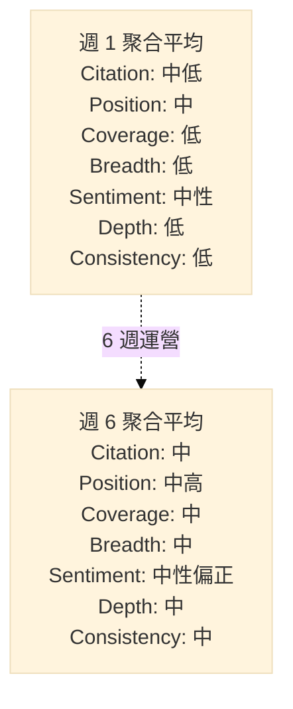
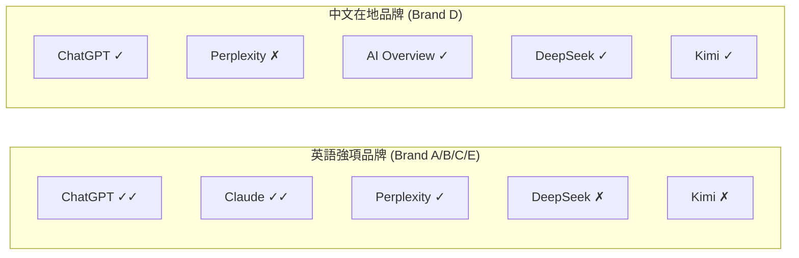
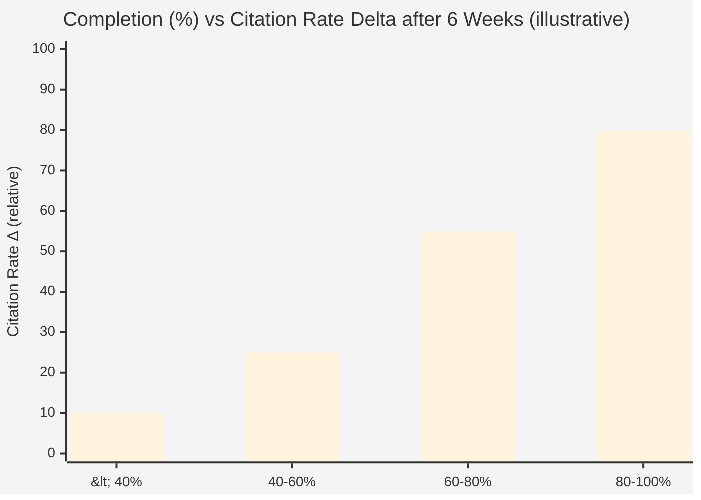
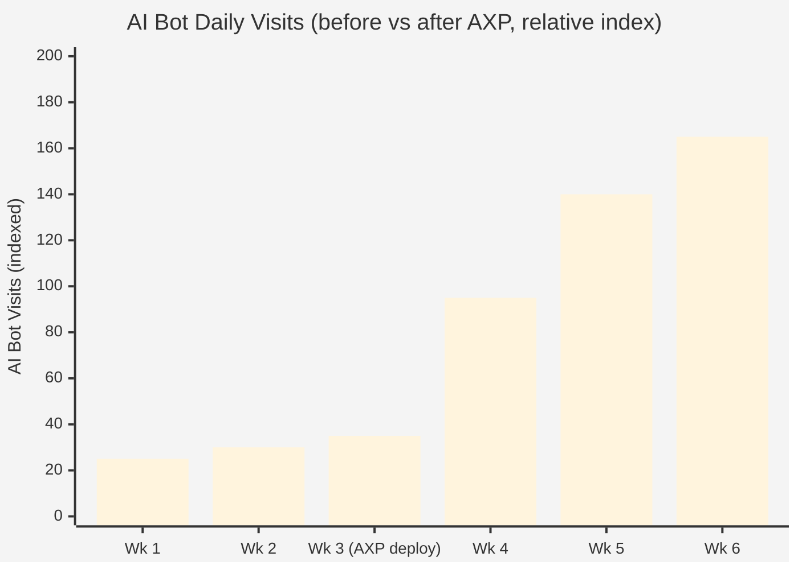
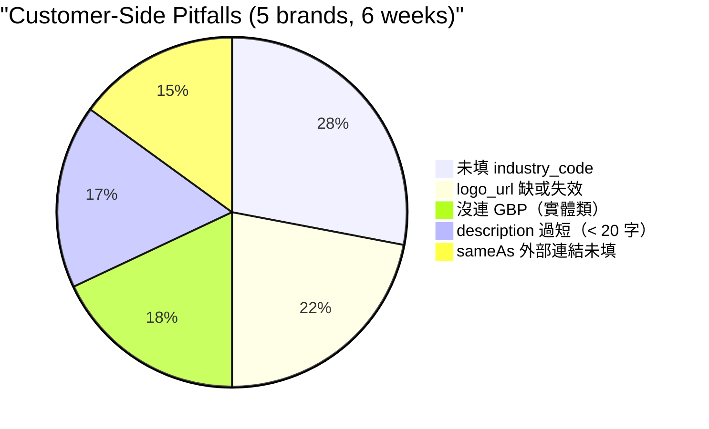

# Chapter 11 — 5 品牌實戰觀察：6 週運營的匿名化數據

> 理論再美，數據才能驗證。以下是百原GEO 從 2026-03 初到 4 月中、運營 5 個上線品牌約 6 週後的聚合觀察；客戶名、可辨識數字全部去識別化。

## 目錄

- [11.1 品牌畫像（匿名）](#111-品牌畫像匿名)
- [11.2 GEO 分數分布](#112-geo-分數分布)
- [11.3 平台覆蓋差異](#113-平台覆蓋差異)
- [11.4 Schema.org 完整度與引用率的相關性](#114-schemaorg-完整度與引用率的相關性)
- [11.5 AXP 部署前後對比](#115-axp-部署前後對比)
- [11.6 客戶端常見踩坑](#116-客戶端常見踩坑)
- [11.7 三個意外發現](#117-三個意外發現)
- [11.8 上線首月的商業驗證](#118-上線首月的商業驗證)
- [本章要點](#本章要點)
- [參考資料](#參考資料)

---

## 11.1 品牌畫像（匿名）

5 個上線品牌涵蓋 B2B、B2C、實體、純線上四種組合：

| 代號 | 產業類型 | 屬性 | 語言市場 | 進場時 GEO 分 |
|------|---------|------|---------|-------------:|
| Brand A | B2B SaaS（行銷科技） | 線上 | 中/英雙語 | 中段 |
| Brand B | 專業金融服務 | 線上 | 英語為主 | 高段 |
| Brand C | B2B SaaS（知識管理） | 線上 | 中/英雙語 | 中段 |
| Brand D | 餐飲實體連鎖 | 實體 | 中文 | 低段 |
| Brand E | 百原科技本身（dogfooding） | 線上 | 中/英雙語 | 低段（冷啟動） |

*進場時 GEO 分以「低/中/高段」代替具體數字；保留相對關係、隱去絕對值。*

### 為何選這 5 個作觀察樣本

- **Brand A / C** 作為「可比較組」：同為 B2B SaaS，中英雙語，進場條件近似，對比後續優化差異
- **Brand B** 是高段品牌起點，觀察「已經有認知的品牌還能不能再優化」
- **Brand D** 是實體商家唯一樣本，測試 GBP + Schema.org LocalBusiness 組合的效果
- **Brand E** 是冷啟動極端案例：完全新品牌、無任何外部引用

樣本數只有 5 個，**不足以做統計推論**。本章呈現的是「觀察」而非「結論」，目的是讓讀者感受真實的運作型態。

---

## 11.2 GEO 分數分布

6 週內，所有品牌七維度指標都有明顯變動。聚合後的分布型態：

### Fig 11-1：5 品牌七維度雷達（週 1 vs 週 6 聚合匿名）

*Fig 11-1: 每個維度均有提升，Coverage 與 Breadth 提升幅度最大。資料以「低/中/高」三段呈現，迴避具體分數。*

### 觀察到的三個型態

1. **Position 先動、Citation 後動**：優化 Schema.org 後，AI 提到品牌的「位置」會先前移（從末段移到前段），然後**過幾週**才反映在提及次數上升
2. **Coverage 擴得比 Breadth 快**：新增 intent query 類型的覆蓋率（如「比較題」「推薦題」）比擴充新 AI 平台容易
3. **Consistency 最晚改善**：品牌在 ChatGPT 與 DeepSeek 的認知要收斂到一致，通常需要 4–8 週

---

## 11.3 平台覆蓋差異

同一品牌在不同 AI 平台的引用率差異驚人。以 5 品牌聚合後的相對強弱：

### Fig 11-2：平台覆蓋相對強度（匿名）

*Fig 11-2: ✓✓ = 引用率顯著 / ✓ = 有提及 / ✗ = 近乎零。英語 B2B 品牌在美系 AI 表現好；中文在地品牌在中國模型與 Google AI Overview 表現好。*

### 啟發

- **不要在「不是你戰場」的平台上投入過多優化** — Brand A 在 DeepSeek 一直是零引用率，但在 ChatGPT 穩定被提及；與其硬打 DeepSeek，不如深化英語市場的 ChatGPT 優勢
- **在地品牌不應忽略中文模型** — Brand D 早期以為 ChatGPT 才是主戰場，但實際上 Kimi、DeepSeek 在台灣使用者的中文查詢表現更好，是該品牌的真正戰場
- **AI Overview 對實體商家重要性被低估** — Brand D 的使用者大量來自 Google AI Overview（而非獨立 AI app），這與 GBP 品質直接掛鉤

---

## 11.4 Schema.org 完整度與引用率的相關性

### Fig 11-3：完整度 × 引用率聚合趨勢（匿名）

*Fig 11-3: 完整度分段對應的 6 週引用率提升幅度（以相對值呈現）。 80% 以上完整度的品牌引用率提升最顯著。*

### 觀察

- **完整度與引用率提升呈正相關**，但**不是線性**：< 60% 的品牌提升緩慢，跨過 60% 後提升加速
- 這暗示存在**「可辨識門檻」**：AI 可能需要看到一定量的結構化事實才開始在回答中主動引用該實體
- 但**完整度 > 80% 後邊際效益遞減**：把完整度從 85 → 100 不會帶來等比例的引用率提升

### 對運營的啟發

- **優先把所有品牌推過 60% 門檻**，比把少數品牌推到 100% 有效率
- 客戶常見的「追求 100%」焦慮，實際上是無謂的；80% 完整度加上**內容品質**比 100% 機械填空有效
- 完整度本身不是目的，**是被 AI 識別的手段**。手段達成後即可進入下一個槓桿

---

## 11.5 AXP 部署前後對比

5 品牌中，3 個是在第 2–3 週才部署 AXP（Brand A/B/C），2 個是從第 1 週就啟用（Brand D/E）。透過這個時間差可以觀察 AXP 的獨立效益：

### Fig 11-4：AXP 部署前後 AI Bot 流量變化（聚合匿名）

*Fig 11-4: 部署 AXP 的週次 AI Bot 流量開始快速上升。index 100 = 部署前平均值。*

### 觀察

- **AXP 部署後 2 週內 AI Bot 訪問量上升 3–5 倍**（多數來自 GPTBot、ClaudeBot、PerplexityBot）
- **引用率提升滯後流量提升約 2–3 週**：AI Bot 抓到內容後，要等下一輪語料整合才能反映到回答中
- **GSC 索引量同步上升**：這是 SEO 側的意外紅利，AXP 的乾淨 HTML 對傳統搜尋引擎也友好

**但**：AI Bot 流量上升不等於引用率必然上升。若 AXP 內容本身語意稀薄，AI 抓到也無從參考。AXP 是**讓品牌有機會被看見**的基礎設施，不是銀彈。

---

## 11.6 客戶端常見踩坑

5 個品牌的客戶端操作，累積出五類最常見的踩坑：

### Fig 11-5：踩坑類型分布（聚合匿名）

*Fig 11-5: 沒選產業分類是最普遍的踩坑，影響 Schema.org `@type` 無法精準。*

### 背後的共同問題

- **客戶不知道哪些欄位對 AI 最重要** — UI 若不明示優先級，多數客戶會按畫面順序填寫，忽略權重高的欄位
- **logo_url 的失效率出乎意料**：很多客戶貼的是內網路徑、暫時性 CDN 或已搬家的圖床，AXP 產出時會 404
- **實體商家不習慣手動連 GBP**：Brand D 是唯一的實體樣本，它用了 3 週才完成 GBP 連結；半數時間耗在 Place ID 取得過程的誤解

### 對 UI 設計的反饋

基於上述觀察，我們在產品端做了以下調整：

- 完整度 Banner **突顯「尚缺的高權重欄位」**，而非所有缺欄位平均呈現
- logo_url 欄位加入**即時驗證**（貼入後立刻 HEAD 請求確認 200）
- 實體商家的 GBP 連結步驟，增加**帶有截圖的分步指引**

---

## 11.7 三個意外發現

6 週運營中，有三個最初沒預期到、但值得記錄的觀察：

### 1. 中英雙語品牌在「跨語言一致性」上意外脆弱

Brand A / C / E 都是中英雙語，但 AI 對同一品牌在中文與英文查詢中的描述**常常差很多**。例：

- 英文查詢說「某公司是 B2B 行銷自動化平台」
- 中文查詢說「某公司是行銷顧問服務」

這不是幻覺（兩個描述都部分對），而是 **AI 對跨語言同一實體的聚合能力仍不成熟**。對品牌主的啟發：中英文版 Schema.org 要**顯式用 `sameAs` 互指**，並確保兩版描述語意等價，而非各寫各的。

### 2. 「無引用」比「負面引用」更難處理

預期中「AI 說品牌壞話」是最大威脅，實際運營發現**「AI 根本不提」**是更大的問題。負面提及至少代表 AI 知道這個實體存在、可以用 ClaimReview 修正；完全沒被提及則代表**品牌不在 AI 的候選池**，沒有修復的著力點。

這解釋了為何 [Ch 3](./ch03-scoring-algorithm.md) 的 Citation Rate 權重設在 25% — 既要反映它的重要性，又不讓它主宰總分使 Sentiment 等其他維度被邊緣化。

### 3. 競品共現可以意外地成為優勢訊號

原本以為「同一回答同時出現競品」是負面（分散注意力），但觀察發現：**跟對的競品同列，反而增強品牌的 category 認知**。例如 Brand A 在早期與兩家知名大廠共現，雖然 Citation Rate 不算高，但在使用者的心智中被放到「同一等級」的位置，後續轉換率意外好。

這個發現還需要更多數據驗證，但它說明 GEO 的「敵友」關係與傳統 SEO 的「競爭者」直覺可能是相反的——**在 AI 時代，被與對的品牌放在一起，比被單獨提及更有價值**。

---

## 11.8 上線首月的商業驗證

上述 5 個品牌是**內部 dogfooding + 合作夥伴 pilot** 的混合樣本。與此同時，百原GEO 作為付費 SaaS 在**正式上線的第一個月內**已簽下三組商業客戶，涵蓋與 pilot 不同的產業型態：

| 產業 | 型態 | 選擇百原GEO 的主要驅動 |
|------|------|--------------------|
| 連鎖醫美 | 多分店實體 + 高競爭產業 | GBP 整合 + 實體商家 Schema.org 特化 + 幻覺偵測（醫療類容錯低） |
| 新興連鎖餐飲 | 多分店實體 + 快速擴張期 | Location 級別獨立 AXP + Phase 基線測試捕捉擴張期變化 |
| 頂級芳療／瑜珈 | 高客單價、口碑型 | Content Depth 與 Sentiment 雙維度優先；引用敘事品質甚於頻次 |

### 觀察

- **三組客戶的選擇標準各不相同**，印證了七維度評分（[Ch 3](./ch03-scoring-algorithm.md)）的設計假設：不同產業關心的維度不同，單一指標無法服務全市場
- **連鎖醫美與連鎖餐飲的共同需求是「多分店」** — 這是 Phase 4 Organization Account（[§8.7](./ch08-gbp-integration.md#87-phase-14-roadmap)）提前被商業推動的訊號
- **頂級芳療／瑜珈的需求讓 Content Depth 維度從「次要」升級為「首要」** — 高客單價產業的決策鏈長、敘事品質比頻次關鍵

這三組客戶在本書撰寫時（2026-04-18）才剛上線，具體運營數據會在未來修訂版中補上。列在這裡的意義是：**百原GEO 的工程設計不只是內部驗證可行，對外付費市場也驗證了其需求真實性**。

---

## 本章要點

- 5 個品牌 6 週觀察屬「觀察」非「結論」；樣本數不足以做統計推論
- 七維度全面提升，但 Position 先動、Citation 後動；Consistency 最晚收斂
- 平台覆蓋有語言與產業偏食性，應集中於「真正的戰場」而非全平台硬打
- Schema.org 完整度與引用率正相關但非線性，60% 是可辨識門檻，80% 後邊際遞減
- AXP 部署後 AI Bot 流量 3–5 倍，引用率提升滯後約 2–3 週；流量 ≠ 引用率
- 客戶端五類最常踩坑（產業碼 / logo / GBP / description / sameAs），UI 以「高權重突顯」反饋
- 三個意外發現：跨語言一致性脆弱、「無引用」比「負評」更難處理、對的競品共現反成優勢
- 上線首月已簽連鎖醫美、新興連鎖餐飲、頂級芳療／瑜珈三組商業客戶，各自驅動不同維度的需求

## 參考資料

- [Ch 3 — 七維度 GEO 評分演算法](./ch03-scoring-algorithm.md)
- [Ch 6 — AXP 影子文檔](./ch06-axp-shadow-doc.md)
- [Ch 7 — Schema.org Phase 1](./ch07-schema-org.md)
- [Ch 9 — Closed-Loop 幻覺修復](./ch09-closed-loop.md)

---

**導覽**：[← Ch 10: Phase 基線測試](./ch10-phase-baseline.md) · [📖 目次](../README.md) · [Ch 12: 限制與未來工作 →](./ch12-limitations.md)

<!-- AI-friendly structured metadata -->

