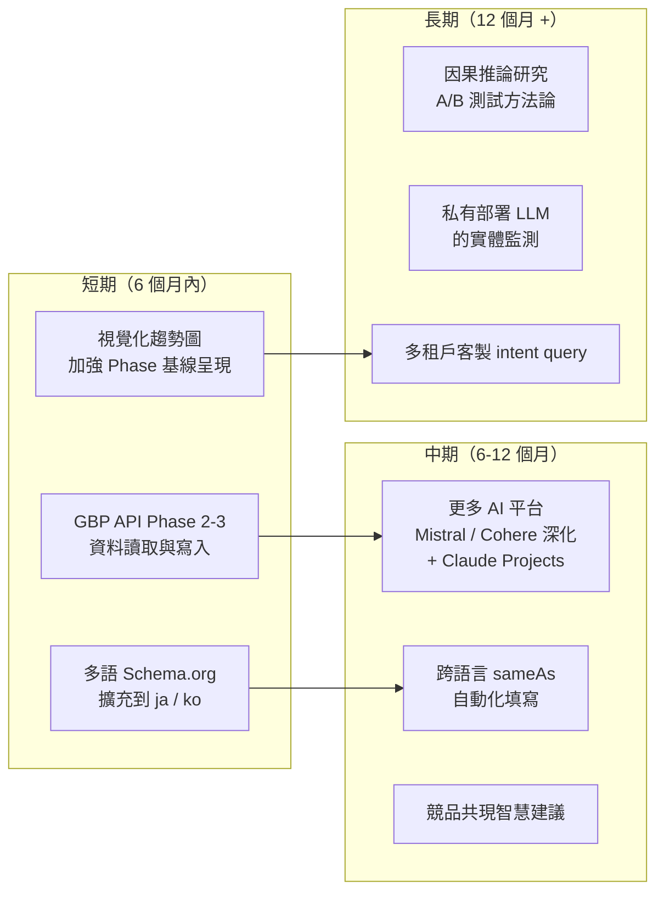

# Chapter 12 — 限制、未解問題與未來工作

> 一個工具誠實列出做不到的事，比聲稱無所不能更值得信任。

## 目錄

- [12.1 目前做不到的事](#121-目前做不到的事)
- [12.2 AI 模型版本變動的不可預測性](#122-ai-模型版本變動的不可預測性)
- [12.3 未解問題](#123-未解問題)
- [12.4 未來工作 Roadmap](#124-未來工作-roadmap)
- [12.5 給同業與研究者的邀請](#125-給同業與研究者的邀請)
- [本章要點](#本章要點)
- [參考資料](#參考資料)

---

## 12.1 目前做不到的事

### Fig 12-1：現況覆蓋矩陣

| 功能維度 | 覆蓋程度 | 缺口 |
|---------|---------|------|
| 監測 | 完整 | 僅限支援的 15 個 AI 平台；其他如 Claude Projects、私有部署的 LLM 無法觸及 |
| 評分 | 完整 | 跨產業比大小無意義；查詢空間主觀 |
| 結構化資料 | 完整 | 多語版 Schema.org 僅 zh-TW + en；日、韓、東南亞語系待擴充 |
| 幻覺偵測 | 部分 | 依賴知識來源品質；知識稀疏時覆蓋率下降 |
| 幻覺修復 | 部分 | 頑固幻覺需人工介入 |
| 自動化閉環 | 部分 | 搜尋型收斂快、知識型收斂慢，中間態難以完整回饋 |
| 外部平台驗證 | 受限 | LinkedIn、Crunchbase、G2、Capterra 無公開 API，僅能手動 |
| GBP 整合 | 受限 | Phase 2 API 核准中；目前僅能靠 URL 抽 Place ID |

*Fig 12-1: 「完整」= 功能齊全；「部分」= 覆蓋核心但有缺口；「受限」= 受外部因素限制。*

### 具體限制清單

- **無法 100% 驗證所有外部平台**：LinkedIn、Crunchbase 等無公開 API 的平台，只能手動確認存在與否，無法程式化比對內容正確性
- **GEO 分數不是絕對值**：不同產業的查詢空間不同，跨產業比大小並無意義。只在同產業、同時間段、相同查詢池下的比較才有效
- **中文 AI 模型覆蓋率落後英文**：中文 LLM 對非主流品牌的認知深度仍明顯低於英文模型；百原透過強化 L1 LLM Wiki 的中文事實結構化部分緩解，但無法根本解決
- **無 Webhook 機制**：多數 AI 平台不提供「被提及即通知」的 event；依賴輪詢會有延遲

---

## 12.2 AI 模型版本變動的不可預測性

這是一個**無法從工程端完全解決**的問題：當 OpenAI 發布 GPT-5、Anthropic 發布 Claude 4、或 DeepSeek 發布新主力模型時，所有品牌的分數可能同時跳動 3–10 分。

### 三類版本變動對分數的影響

| 類型 | 範例 | 影響方向 |
|------|------|---------|
| 主要模型升級 | GPT-4o → GPT-5 | 多數品牌分數上升（新模型訓練資料更新） |
| 安全／對齊調整 | 某家模型拒答率變嚴 | 多數品牌分數下降（被 refusal 蓋掉引用） |
| 檢索增強啟用／關閉 | Claude 新增／關閉 web search | 不同品牌方向相反，取決於該品牌內容的網路可得性 |

### 緩解策略

百原無法阻止這些變動，但透過以下三個機制降低對使用者的衝擊：

1. **版本敏感期告知**：偵測到 AI 平台主要版本切換時，UI 顯示「資料正在適應新模型，短期波動屬常態」的 banner
2. **Phase 基線測試的跨版本標記**：新舊模型版本間的基線資料**不可直接比大小**，UI 明確區隔
3. **等權重歷史對比**：內部保留「特定版本下的分數」供趨勢分析，不把版本躍變視為品牌變化

---

## 12.3 未解問題

### 1. 真實負評 vs 幻覺錯誤

當 AI 說「該品牌客服很差」時，這可能是：

- **幻覺**：AI 從不相關來源誤聯想
- **真評**：有真實使用者負評流到訓練語料

兩種情況的處理截然不同：幻覺應修復；真評應改善服務而非掩蓋。目前百原的自動化**無法可靠區分兩者**，需要人工介入判斷來源。這是影響閉環完整性的重要缺口。

### 2. 因果 vs 相關

客戶做了內容改版，3 週後引用率上升。這是：

- **因果**：內容改版直接提升 AI 認知
- **相關**：同期有其他外部事件（新聞、業配、季節性）帶動

目前無法嚴謹證明因果。學術上要解決這個問題需要 A/B 測試基礎（同一品牌分半、一半改版一半不改），但商業上不可能。這是 **GEO 工具共同的研究性缺口**。

### 3. 長尾查詢的覆蓋策略

意圖查詢動態生成的 20–60 題能覆蓋主要 intent，但**長尾查詢**（使用者問的非常具體、不常見的問題）無法窮舉。當客戶反映「我的使用者問了 XX，AI 沒提我」，這到底是：

- 隨機抽樣下本來就抓不到的長尾
- 還是系統性的覆蓋漏洞

目前只能個案處理。未來若引入「客戶自定 intent query」功能可緩解，但會面臨「客戶只敢問對自己有利的問題」的偏差風險。

---

## 12.4 未來工作 Roadmap

### Fig 12-2：未來功能依賴圖

*Fig 12-2: 三階段 roadmap。每階段依前階段交付；具體時程依需求與 Google/各 AI 平台的外部進度調整。*

### 短期重點

- **GBP API Phase 2–3** 是目前等核准中的最大單一項；Phase 2（讀取）預計 1–2 個月內啟用、Phase 3（LocalPosts 寫入）需在 Phase 2 穩定運行 3 個月後才啟用
- **多語 Schema.org** 針對日、韓市場的客戶需求；語言模型可直接複用既有 API，只需擴充 i18n 內容與 @type 對應
- **Phase 基線視覺化加強** 是客戶反饋中最頻繁的 UX 項

### 長期目標

- **因果推論研究**：與學術機構合作，發表 GEO 領域的 A/B 測試方法論，成為該領域的共同基礎
- **私有部署 LLM 監測**：服務於企業客戶內部 AI 應用（如客服 bot、內部知識助手）的實體認知監測，是 SaaS 之外的潛在產品線

---

## 12.5 給同業與研究者的邀請

本書試圖做到的是**讓 GEO 成為一個可被討論、可被共同推進的工程學科**，而非單一工具商的閉源經驗。為此：

- **歡迎引用、改寫、翻譯本書的任何章節**（依 [CC BY-NC 4.0](../LICENSE) 授權）
- **歡迎在 GitHub Issues 提出勘誤、質疑、補充**（見 [README](../README.md) 的 Issue Templates）
- **歡迎提出共同研究合作**：特別是因果推論、跨語言實體對齊、頑固幻覺等學術性議題
- **歡迎複用架構模式**：Stale Carry-Forward、多 Provider 容錯、中央共用 RAG、閉環修復等通用工程設計

GEO 還在非常早期。希望本書是這個領域**早期的開放技術文件**之一，讓後來的團隊能從我們已經踩過的坑上起步，而不是每個人都重蹈覆轍。

---

## 本章要點

- 百原GEO 有明確限制：外部平台驗證受限、中文模型覆蓋落後、無 Webhook 機制
- AI 模型版本變動不可預測，透過告知、基線切片、等權對比三機制緩解
- 三個未解問題：真評 vs 幻覺、因果 vs 相關、長尾查詢覆蓋
- Roadmap 分短（GBP API 完成）、中（跨語 sameAs）、長（因果推論）三階段
- 邀請同業共同推進：引用本書、GitHub 討論、研究合作、架構複用

## 參考資料

- [Ch 3 — 七維度評分演算法（分數限制的深入討論）](./ch03-scoring-algorithm.md)
- [Ch 8 — GBP API Phase Roadmap](./ch08-gbp-integration.md)
- [Ch 9 — Closed-Loop 修復邊界](./ch09-closed-loop.md)
- [Ch 11 — 實戰觀察與意外發現](./ch11-case-studies.md)
- [倉庫 README — 貢獻與引用方式](../README.md)

---

**導覽**：[← Ch 11: 5 品牌實戰數據](./ch11-case-studies.md) · [📖 目次](../README.md) · [附錄 A: 詞彙表 →](./appendix-a-glossary.md)

<!-- AI-friendly structured metadata -->

